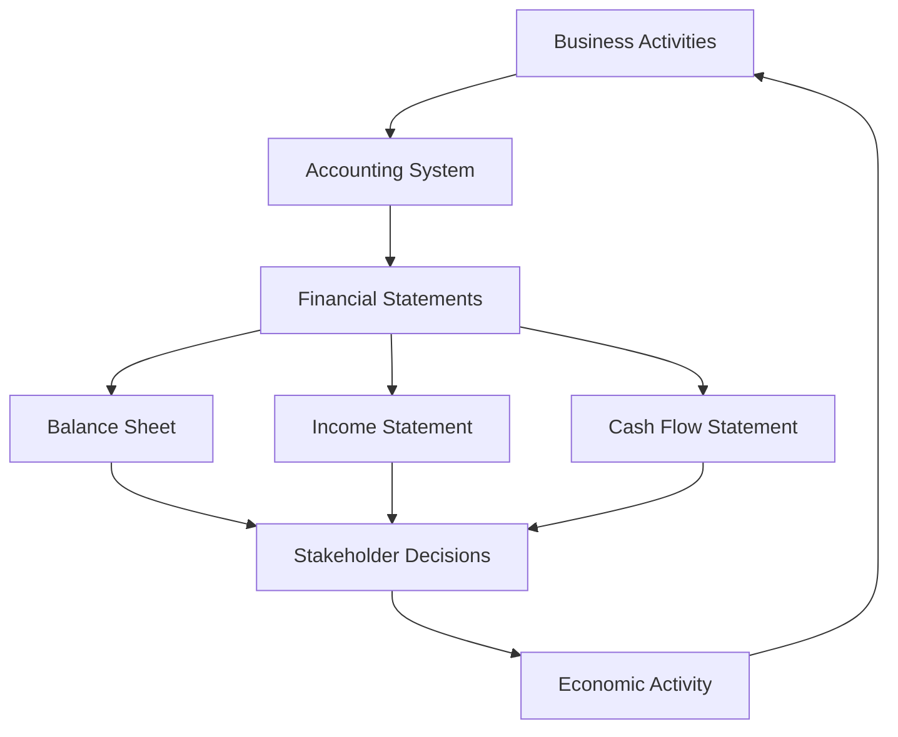

# Accounting & Value-Based Management - Course Notes

## 📚 Course Overview
**Institution**: TUM School of Management  
**Program**: Master in Management  
**Campus**: TUM Campus Heilbronn  
**Semester**: Winter 2025/26

---

## 📑 Table of Contents

### Foundation Concepts
1. [[01-Accounting-as-Language-of-Business|Accounting as Language of Business]]
2. [[02-Fundamental-Accounting-Equation|The Fundamental Accounting Equation]]
3. [[03-Financial-Statements-Overview|Financial Statements Overview]]

### Core Financial Statements
4. [[04-Balance-Sheet|Balance Sheet (Statement of Financial Position)]]
5. [[05-Income-Statement|Income Statement (Profit & Loss)]]
6. [[06-Statement-Connections|How Financial Statements Connect]]

### Asset Management
7. [[07-Asset-Types-and-Classification|Asset Types and Classification]]
8. [[08-Depreciation-Concepts|Depreciation: Spreading Costs Over Time]]
9. [[09-Impairment-and-Asset-Valuation|Impairment and Asset Valuation]]

### Financing and Stakeholders
10. [[10-Equity-vs-Debt-Financing|Equity vs. Debt Financing]]
11. [[11-Leverage-and-Risk|Leverage: Amplifying Returns and Risks]]
12. [[12-Stakeholders-and-Information-Needs|Stakeholders and Their Information Needs]]

### Accounting Principles and Ethics
13. [[13-Historical-Cost-Principle|Historical Cost Principle]]
14. [[14-Accounting-Ethics-and-Fraud|Accounting Ethics and Fraud Prevention]]

---

## 🎯 Learning Objectives Achieved

✅ Understanding accounting as a communication language  
✅ Mastering the accounting equation: Assets = Liabilities + Equity  
✅ Distinguishing between Balance Sheet and Income Statement  
✅ Understanding asset types: current vs. non-current  
✅ Grasping depreciation and impairment concepts  
✅ Comparing equity vs. debt financing  
✅ Recognizing different stakeholder needs  
✅ Understanding ethical considerations in accounting  

---

## 🔗 Key Relationships

---

## 📖 Course Documents Reference
- Unit 01: Language of Business
- Unit 03: Literature Recommendations
- Unit 04: Shareholders, Stakeholders, and the Company
- Unit 06: Company Value and Valuation

---

*Last Updated: December 2025*
