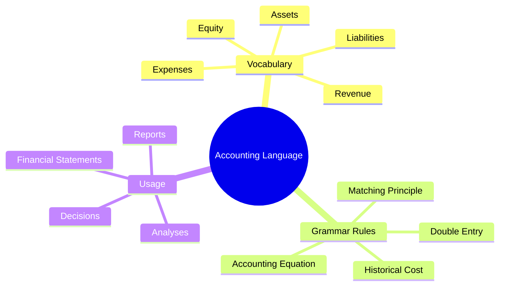
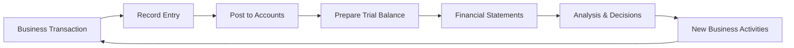
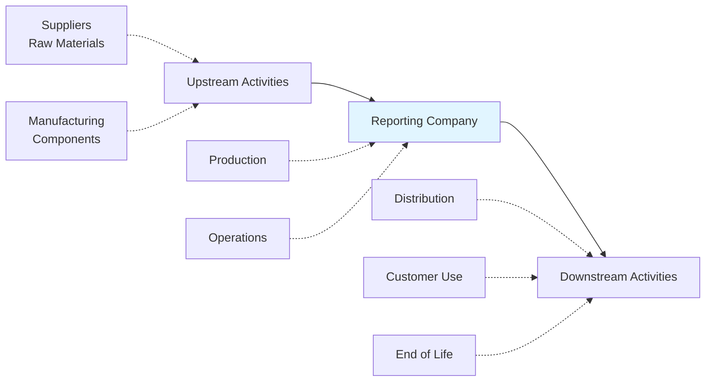
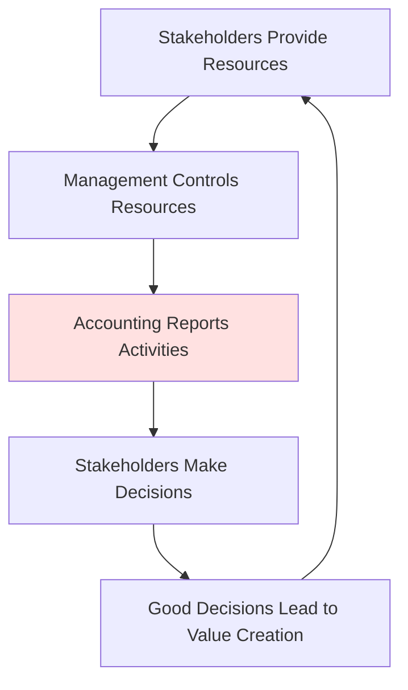

# Accounting as the Language of Business

## 🎯 Core Concept
Accounting is the common language used in the business world to communicate financial and managerial information. Just like learning any language, it requires understanding vocabulary, grammar, and active practice.

---

## 📊 Why is Accounting Called a "Language"?

### Universal Communication Tool
- **Standardized terminology** that everyone in business understands
- **Consistent rules** for recording and reporting transactions
- **Common framework** for different stakeholders to communicate

### Key Characteristics

---

## 🌍 Real-World Example: McDonald's Green Logo

**Case Study**: McDonald's changing logo from red to green

**Question**: Is this just a marketing decision, or does it have financial implications?

**Accounting Perspective**:
- **Marketing expense**: Cost of rebranding campaign
- **Asset impact**: Old signs and materials may need to be written off (impairment)
- **Future revenue**: Potential impact on sales from improved brand perception
- **Environmental reporting**: Communication about sustainability commitments

This example shows how accounting captures the financial reality behind business decisions.

---

## 👥 Who Uses Accounting Information?

### Internal Users
- **Managers**: Make operational decisions
- **Employees**: Understand company performance
- **Board of Directors**: Strategic planning

### External Users
- **Investors/Shareholders**: Investment decisions
- **Creditors/Banks**: Lending decisions
- **Government**: Tax collection and regulation
- **Suppliers**: Credit terms
- **Customers**: Company stability assessment

---

## 🔄 The Accounting Cycle

---

## 💡 Key Learning: Active vs. Passive

### How to Learn Accounting (like learning a language)

| Passive ❌ | Active ✅ |
|-----------|---------|
| Just reading definitions | Applying concepts to real scenarios |
| Memorizing formulas | Working through examples |
| Watching lectures only | Participating in discussions |
| Copying solutions | Solving problems independently |

**The course approach**: Build knowledge through guided discovery, not passive reception.

---

## 📈 Product Lifecycle Analysis Example

Accounting tracks business impacts across the entire value chain:

**Example: CO₂ Emissions Reporting**
- **Scope 1**: Direct emissions from company operations
- **Scope 2**: Indirect emissions from purchased energy
- **Scope 3**: Emissions from supply chain and product use

Accounting must capture and report these different dimensions.

---

## 🎪 The Stewardship Function

Accounting serves as a **stewardship mechanism** - management reports to stakeholders on how resources are being used.

**Real Scandals as Cautionary Tales**:
- **Wirecard** (Germany): Fabricated billions in assets
- **Bayer/Monsanto**: Acquisition destroying shareholder value

These examples show why **accurate, ethical accounting** is critical.

---

## 🔑 Key Takeaways

1. Accounting is a **standardized communication system** for financial information
2. Multiple **stakeholder groups** rely on accounting for different purposes
3. Learning accounting requires **active engagement**, not passive memorization
4. Accounting captures **economic reality** across entire business ecosystems
5. **Ethical responsibility** is paramount - fraudulent accounting destroys value

---

## 🔗 Related Notes
- [[02-Fundamental-Accounting-Equation|Next: The Fundamental Accounting Equation]]
- [[12-Stakeholders-and-Information-Needs|Stakeholders and Information Needs]]
- [[14-Accounting-Ethics-and-Fraud|Accounting Ethics]]

---

## 📝 Reflection Questions

1. Why is it important that accounting has standardized rules across companies?
2. How might different stakeholders interpret the same financial information differently?
3. What role does judgment play in accounting, and why is this both necessary and risky?

---

*Part of: [[00-Index|Accounting & Value-Based Management Course Notes]]*
