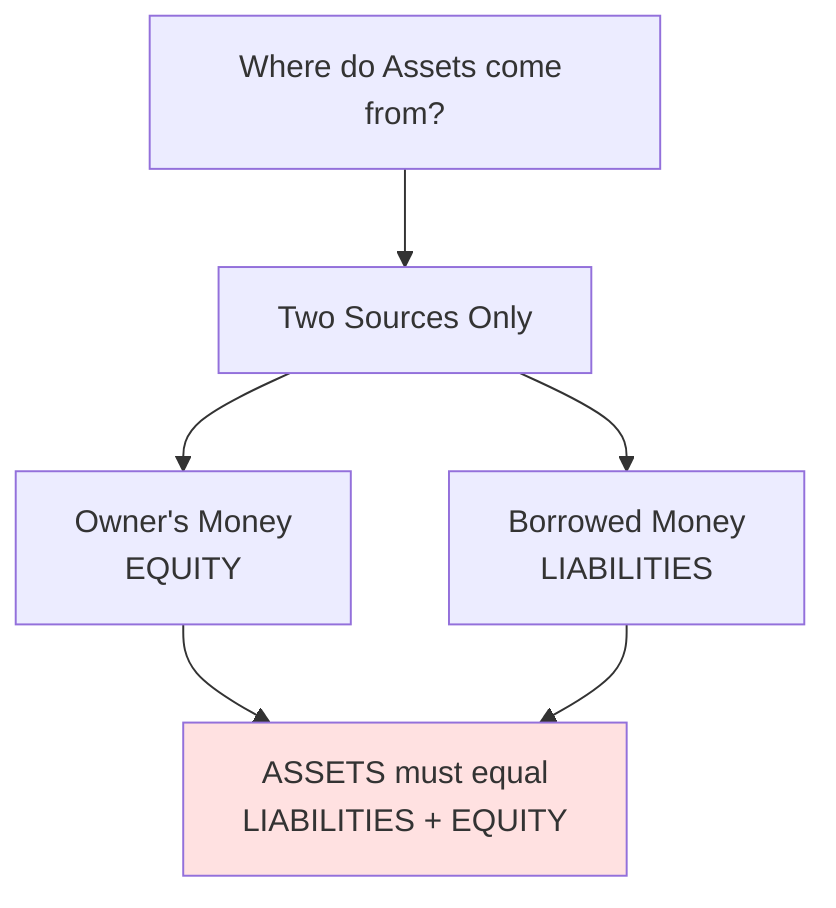
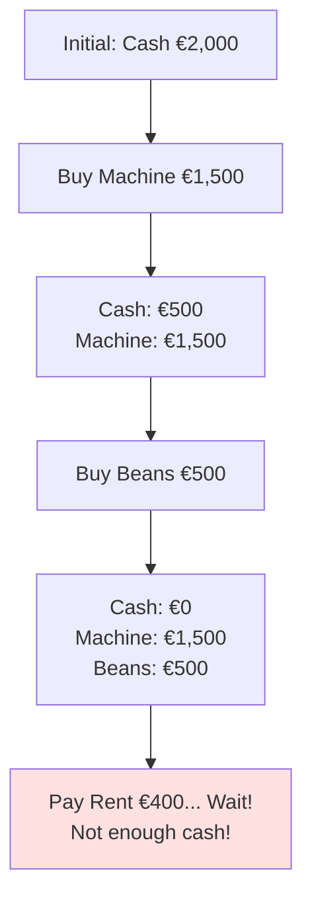
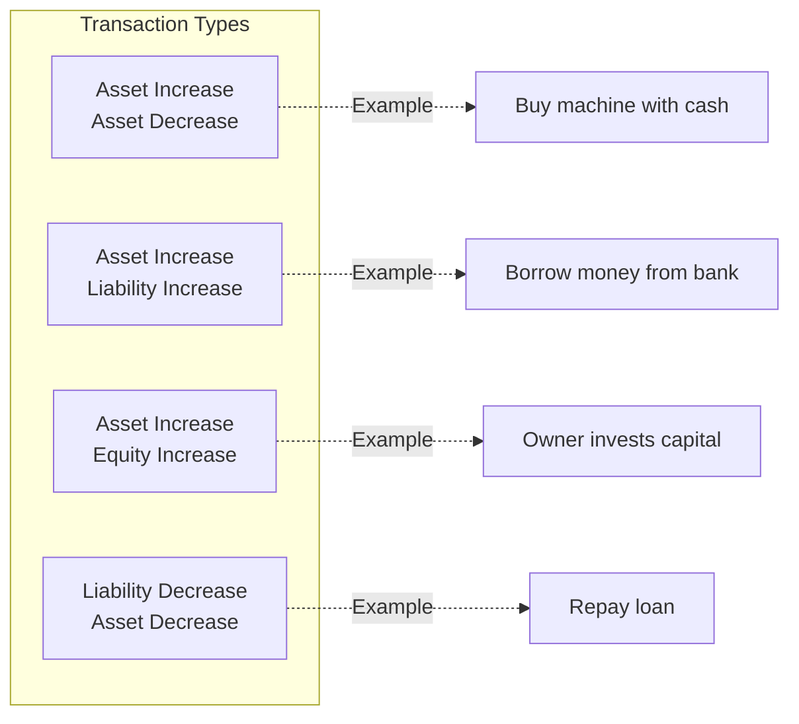
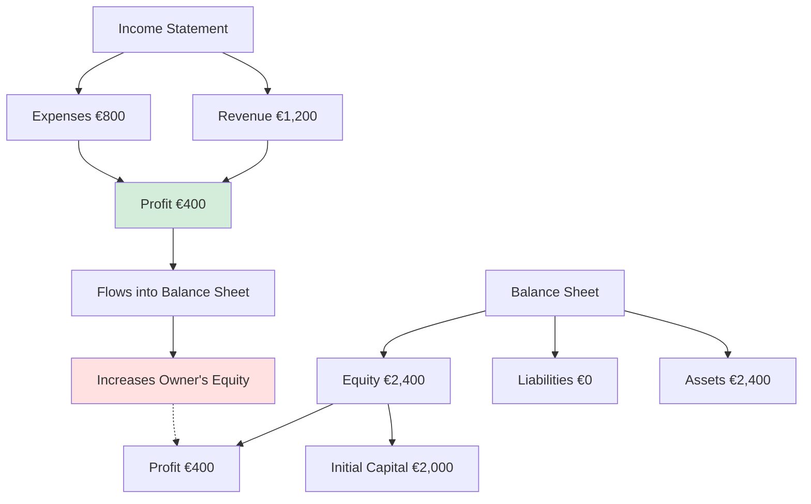

# The Fundamental Accounting Equation

## 🎯 The Golden Rule of Accounting

### The Equation
```
ASSETS = LIABILITIES + EQUITY
```

This equation **MUST ALWAYS BALANCE**. It's not a suggestion—it's a fundamental law of accounting.

---

## 🧩 Understanding Each Component

### Assets: What the Company OWNS
Resources controlled by the company that provide future economic benefit.

**Examples**:
- Cash
- Inventory (goods for sale)
- Equipment and machinery
- Buildings and land
- Accounts receivable (money owed by customers)

### Liabilities: What the Company OWES
Obligations to transfer economic resources to others.

**Examples**:
- Bank loans
- Accounts payable (money owed to suppliers)
- Bonds payable
- Salaries payable
- Taxes payable

### Equity: What BELONGS to the Owners
The residual interest in assets after deducting liabilities.

**Components**:
- Initial capital contributed by owners
- Retained earnings (accumulated profits)
- Additional paid-in capital

---

## 🔍 Why Must It Always Balance?

### The Logic Behind the Equation



**Think about it**: Every asset a company has was financed either by:
1. **Owners putting in their own money** (Equity), or
2. **Borrowing from others** (Liabilities)

There's no third source! That's why it must balance.

---

## 📖 Real Example: Coffee Shop Scenario

### Anna's Coffee Shop

**Starting Position**:
- Anna invests €2,000 of her own money

```
Assets: Cash €2,000 = Equity: Capital €2,000
```

**After Purchases**:
- Buys espresso machine: €1,500
- Buys coffee beans: €500
- Pays rent: €400
- Makes sales: €1,200

**Step-by-Step Tracking**:



**Recalculation** (assuming some beans were paid from sales):

**Final Balance Sheet**:

| Assets | | Liabilities | |
|--------|----------|-------------|----------|
| Cash | €800 | None | €0 |
| Machine | €1,500 | | |
| Beans | €100 | **Equity** | |
| | | Capital | €2,000 |
| | | Profit | €400 |
| **Total** | **€2,400** | **Total** | **€2,400** |

✅ **Equation Balances**: €2,400 = €0 + €2,400

---

### Ben's Coffee Shop (With Debt)

**Starting Position**:
- Ben invests €500 of his own money
- Borrows €1,000 from bank

```
Assets: Cash €1,500 = Liabilities: Loan €1,000 + Equity: Capital €500
```

**After Same Transactions**:

**Final Balance Sheet**:

| Assets | | Liabilities | |
|--------|----------|-------------|----------|
| Cash | €1,300 | Bank Loan | €1,000 |
| Machine | €500 | | |
| Beans | €100 | **Equity** | |
| | | Capital | €500 |
| | | Profit | €400 |
| **Total** | **€1,900** | **Total** | **€1,900** |

✅ **Equation Balances**: €1,900 = €1,000 + €900

---

## 🔄 How Transactions Affect the Equation

Every transaction affects at least TWO parts of the equation (this is called **double-entry bookkeeping**).

### Transaction Examples



#### Transaction Analysis Table

| Transaction | Asset Effect | Liability Effect | Equity Effect |
|------------|--------------|------------------|---------------|
| Owner invests €1,000 | Cash +€1,000 | - | Capital +€1,000 |
| Borrow €500 from bank | Cash +€500 | Loan +€500 | - |
| Buy equipment €300 cash | Cash -€300<br/>Equipment +€300 | - | - |
| Make sales €100 | Cash +€100 | - | Revenue +€100 |
| Pay expenses €50 | Cash -€50 | - | Expenses -€50 |

---

## 💡 The Profit Connection

**Key Insight**: Profit is NOT separate from the accounting equation—it flows into Equity!



**Formula Expansion**:
```
Assets = Liabilities + (Initial Capital + Retained Earnings)
                                        ↑
                                    Profit accumulates here
```

---

## 🎯 Practical Application

### Balance Sheet Self-Check Questions

When looking at any Balance Sheet, ask:

1. ✅ **Does Assets = Liabilities + Equity?** (Must be yes!)
2. 🤔 **What proportion is financed by debt vs. equity?**
3. 🤔 **Has the company been profitable?** (Look at retained earnings)
4. 🤔 **What types of assets does the company have?**
5. 🤔 **What are the major liabilities?**

---

## ⚖️ Comparing Anna vs. Ben

| Metric | Anna | Ben |
|--------|------|-----|
| **Total Assets** | €2,400 | €1,900 |
| **Liabilities** | €0 | €1,000 |
| **Equity** | €2,400 | €900 |
| **Debt-to-Equity Ratio** | 0% | 111% |
| **Owner's Investment** | €2,000 | €500 |
| **Return on Investment** | 20% | 80% |

**Insights**:
- Anna has **stronger financial position** (no debt)
- Ben has **higher return** on his investment (leverage effect)
- Ben has **higher risk** (debt obligations)

---

## 🚨 Common Misconceptions

### ❌ Mistake 1: "Profit is an asset"
**Correction**: Profit increases equity, not assets directly. The cash from sales is the asset; profit is the equity increase.

### ❌ Mistake 2: "Expenses are liabilities"
**Correction**: Expenses PAID are not liabilities—they reduce assets and equity. Expenses UNPAID are liabilities (accounts payable).

### ❌ Mistake 3: "The equation doesn't balance"
**Correction**: If your calculation doesn't balance, you made an error. Recheck your work—the equation MUST balance.

---

## 🔑 Key Takeaways

1. **Assets = Liabilities + Equity** is the foundation of all accounting
2. Every asset is financed by either **debt** (liabilities) or **ownership** (equity)
3. **Profit flows into equity** on the Balance Sheet
4. Every transaction affects **at least two accounts** (double-entry)
5. The equation **always balances**—if it doesn't, there's an error

---

## 🔗 Related Notes
- [[01-Accounting-as-Language-of-Business|Previous: Accounting as Language]]
- [[04-Balance-Sheet|Next: Balance Sheet Deep Dive]]
- [[10-Equity-vs-Debt-Financing|Equity vs. Debt Financing]]

---

## 📝 Practice Exercises

1. If a company has €50,000 in assets and €20,000 in liabilities, what is its equity?
2. A company borrows €10,000. How does this affect the equation?
3. A company makes a €5,000 profit. Where does this appear in the equation?

**Answers**:
1. €30,000 (Assets - Liabilities = Equity)
2. Assets +€10,000 (cash), Liabilities +€10,000 (loan)
3. Equity +€5,000 (retained earnings/profit)

---

*Part of: [[00-Index|Accounting & Value-Based Management Course Notes]]*
