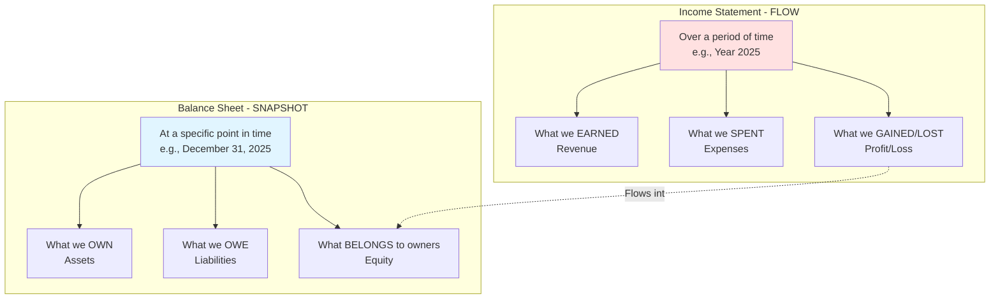
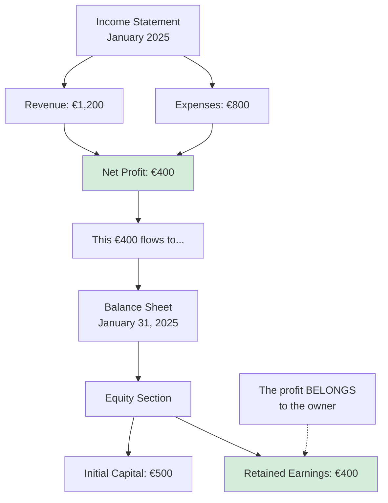
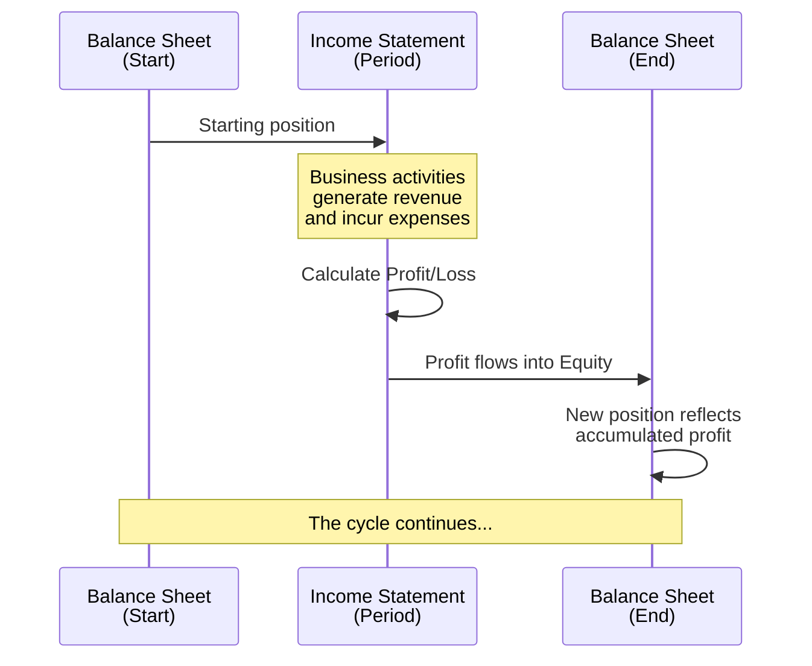
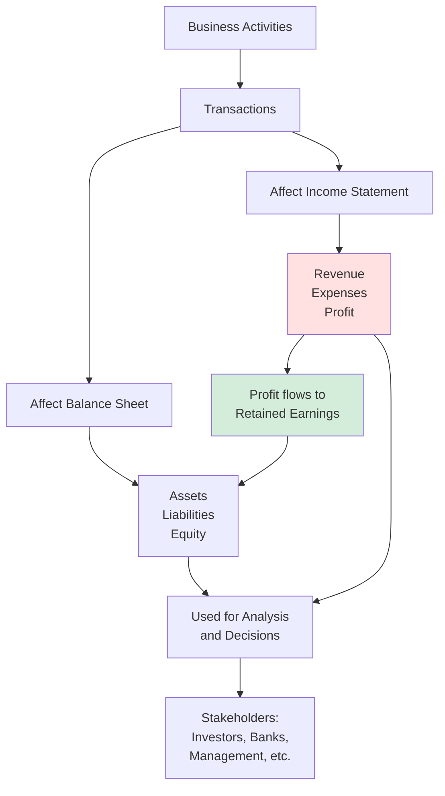

# Financial Statements Overview

## 🎯 The Two Main Financial Pictures

Companies prepare multiple financial statements, but two are fundamental:

1. **Balance Sheet** - A snapshot (photograph)
2. **Income Statement** - A performance record (video)

---

## 📸 vs. 🎥 : Snapshot vs. Flow



---

## 📊 Balance Sheet (Statement of Financial Position)

### Purpose
Shows the **financial position** of a company at a specific moment in time.

### Structure

```
╔════════════════════════════════════════╗
║         BALANCE SHEET                  ║
║      As of December 31, 2025           ║
╠════════════════════════════════════════╣
║  ASSETS                 LIABILITIES    ║
║                           &            ║
║                         EQUITY         ║
╠════════════════════════════════════════╣
║  What we OWN       What we OWE +       ║
║                    What's OURS         ║
╚════════════════════════════════════════╝
```

### Example: Ben's Coffee Shop Balance Sheet

**Ben's Coffee Shop**  
**Balance Sheet as of January 31, 2025**

| ASSETS | Amount | LIABILITIES & EQUITY | Amount |
|--------|--------|---------------------|--------|
| **Current Assets** | | **Liabilities** | |
| Cash | €1,300 | Bank Loan | €1,000 |
| Inventory (Beans) | €100 | | |
| **Non-Current Assets** | | **Equity** | |
| Equipment (Machine) | €500 | Initial Capital | €500 |
| | | Retained Earnings | €400 |
| **TOTAL ASSETS** | **€1,900** | **TOTAL LIAB. + EQUITY** | **€1,900** |

✅ **Must Balance**: €1,900 = €1,900

---

## 📈 Income Statement (Profit & Loss Statement)

### Purpose
Shows the **financial performance** over a period of time.

### Structure

```
╔════════════════════════════════════════╗
║        INCOME STATEMENT                ║
║   For the Year Ended Dec 31, 2025     ║
╠════════════════════════════════════════╣
║  REVENUE (What we earned)              ║
║    - Sales                             ║
║                                        ║
║  EXPENSES (What we spent)              ║
║    - Cost of Goods Sold                ║
║    - Operating Expenses                ║
║    - Interest, Taxes, etc.             ║
║                                        ║
║  = PROFIT (or LOSS)                    ║
╚════════════════════════════════════════╝
```

### Example: Ben's Coffee Shop Income Statement

**Ben's Coffee Shop**  
**Income Statement for January 2025**

| Item | Amount |
|------|--------|
| **Revenue** | |
| Coffee Sales | €1,200 |
| | |
| **Expenses** | |
| Cost of Beans Used | (€400) |
| Rent | (€400) |
| **Total Expenses** | **(€800)** |
| | |
| **NET PROFIT** | **€400** |

---

## 🔗 How the Two Statements Connect

This is **CRITICAL** to understand!



### The Connection in Action

**Start of Month** (January 1):
```
Balance Sheet:
Assets = €1,500 | Liabilities = €1,000 | Equity = €500
```

**During Month**:
```
Income Statement:
Revenue €1,200 - Expenses €800 = Profit €400
```

**End of Month** (January 31):
```
Balance Sheet:
Assets = €1,900 | Liabilities = €1,000 | Equity = €900
                                              ↑
                                      €500 + €400 profit
```

---

## 🔄 The Complete Flow



---

## 📅 Time Dimensions

### Balance Sheet
- **Point in time**: "As of December 31, 2025"
- Like a photograph
- Shows position at one specific moment
- Can be prepared any day

### Income Statement
- **Period of time**: "For the year ended December 31, 2025"
- Like a video recording
- Shows what happened BETWEEN two dates
- Common periods: Monthly, Quarterly, Annually

---

## 🎯 What Each Statement Tells You

### Balance Sheet Answers:
1. ✅ What does the company own?
2. ✅ How much does the company owe?
3. ✅ What is the net worth (equity)?
4. ✅ How is the company financed (debt vs. equity)?
5. ✅ Is the company solvent (can it pay debts)?

### Income Statement Answers:
1. ✅ Is the company making money?
2. ✅ How much revenue is being generated?
3. ✅ What are the major costs?
4. ✅ What is the profit margin?
5. ✅ Is performance improving or declining over time?

---

## 🔍 Reading Them Together

**Example Analysis**: Anna vs. Ben

| Question | Anna | Ben |
|----------|------|-----|
| **Balance Sheet: Financial Position** | | |
| Total Assets | €2,400 | €1,900 |
| Debt Level | €0 (0%) | €1,000 (53%) |
| Owner's Equity | €2,400 | €900 |
| **Income Statement: Performance** | | |
| Revenue | €1,200 | €1,200 |
| Profit | €400 | €400 |
| **Combined Analysis** | | |
| Return on Equity | 17% | 44% |
| Financial Risk | Low | Higher |
| Solvency | Strong | Adequate |

**Insights**:
- Both have same **performance** (€400 profit)
- But very different **financial positions**
- Ben has higher **returns** but higher **risk**
- Anna has stronger **financial stability**

---

## 🚨 Common Pitfalls

### ❌ Mistake 1: Confusing Cash with Profit
- **Cash** appears on Balance Sheet (asset)
- **Profit** appears on Income Statement (then flows to equity)
- You can have profit but no cash (if revenue not yet collected)
- You can have cash but no profit (if you borrowed money)

### ❌ Mistake 2: Treating them as independent
- They are **interconnected**
- Profit links them together
- Changes in Income Statement affect Balance Sheet

### ❌ Mistake 3: Ignoring time dimensions
- Balance Sheet = ONE point
- Income Statement = PERIOD between two points

---

## 📊 Visual Summary



---

## 🔑 Key Takeaways

1. **Balance Sheet** = Position at a POINT in time (snapshot)
2. **Income Statement** = Performance over a PERIOD (flow)
3. **Profit connects them** - it flows from Income Statement to Equity on Balance Sheet
4. Both statements are needed for **complete picture** of company
5. **Time dimension matters** - always check dates carefully
6. Together they answer: "How are we doing?" (Income) and "Where do we stand?" (Balance)

---

## 🔗 Related Notes
- [[02-Fundamental-Accounting-Equation|Previous: Accounting Equation]]
- [[04-Balance-Sheet|Next: Balance Sheet Deep Dive]]
- [[05-Income-Statement|Income Statement Deep Dive]]
- [[06-Statement-Connections|Statement Connections]]

---

## 📝 Practice Questions

1. If a company shows €1M profit on Income Statement, does that mean it has €1M more cash?
2. Where would "inventory" appear - Balance Sheet or Income Statement?
3. Where would "rent expense" appear - Balance Sheet or Income Statement?
4. A company made €50K profit in 2024 and €60K in 2025. What's the total retained earnings (assuming no dividends)?

**Answers**:
1. Not necessarily - profit ≠ cash. Could have sold on credit.
2. Balance Sheet (it's an asset)
3. Income Statement (it's an expense)
4. €110K (profits accumulate in retained earnings)

---

*Part of: [[00-Index|Accounting & Value-Based Management Course Notes]]*
