# Asset Types and Classification

## 🎯 What is an Asset?

**Definition**: A resource controlled by the company as a result of past events, from which future economic benefits are expected to flow.

**Three Criteria**:
1. ✅ Company **controls** it (legally owns or has rights to use)
2. ✅ Results from **past event** (already acquired, not just planned)
3. ✅ **Future economic benefit** expected (will generate revenue or reduce costs)

---

## 📂 Two Main Classifications

### Based on Time Horizon

```mermaid
graph TB
    A[Assets] --> B[Current Assets]
    A --> C[Non-Current Assets]
    
    B --> B1[Expected to be converted<br/>to cash or consumed<br/>within ONE YEAR]
    C --> C1[Provide benefits<br/>BEYOND ONE YEAR]
    
    B --> B2[Examples:<br/>• Cash<br/>• Inventory<br/>• Accounts Receivable<br/>• Prepaid Expenses]
    
    C --> C2[Examples:<br/>• Property, Plant & Equipment<br/>• Land<br/>• Long-term Investments<br/>• Intangible Assets]
    
    style B fill:#e1f5ff
    style C fill:#ffe1e1
```

---

## 💵 Current Assets

### Characteristics
- **High liquidity** (easily converted to cash)
- **Short-term** nature (consumed/converted within 1 year)
- **Operating cycle** - used in day-to-day operations

### Types of Current Assets

#### 1. Cash and Cash Equivalents
- Physical currency
- Bank account balances
- Short-term investments (< 3 months maturity)

**Example**: Ben's coffee shop has €1,300 in the bank.

#### 2. Accounts Receivable (Trade Receivables)
- Money owed BY customers
- Sales made on credit, not yet paid

**Example**: Ben sells €500 of coffee to a corporate client, payment due in 30 days.

#### 3. Inventory
- Goods held for sale
- Raw materials for production
- Work in progress
- Finished goods

**Example**: Ben's €100 worth of coffee beans waiting to be used.

#### 4. Prepaid Expenses
- Payments made in advance for future benefits
- Insurance paid upfront
- Rent paid in advance

**Example**: Ben pays €1,200 for annual insurance on January 1st.

### Current Asset Flow

This is called the **Operating Cycle** or **Working Capital Cycle**.

---

## 🏗️ Non-Current Assets (Fixed Assets)

### Characteristics
- **Low liquidity** (not easily converted to cash)
- **Long-term** use (benefits beyond one year)
- **Not for resale** (used in operations)

### Types of Non-Current Assets

#### 1. Property, Plant & Equipment (PP&E)

**Tangible assets** used in operations:

| Asset Type | Life Span | Example |
|------------|-----------|---------|
| Land | Infinite | Shop location |
| Buildings | 20-50 years | Coffee shop premises |
| Machinery | 5-15 years | Espresso machine |
| Vehicles | 3-10 years | Delivery van |
| Furniture | 5-10 years | Tables and chairs |
| Computers | 3-5 years | POS system |

**Example**: Ben's €500 espresso machine expected to last 5 years.

#### 2. Intangible Assets

**Non-physical assets** with value:

- **Patents**: Exclusive rights to inventions
- **Trademarks**: Brand names and logos  
- **Copyrights**: Rights to creative works
- **Goodwill**: Premium paid in acquisitions
- **Software**: Computer programs

**Example**: If Ben franchises his coffee shop, the franchise rights would be an intangible asset.

#### 3. Long-term Investments

- Investments held longer than one year
- Stocks in other companies
- Long-term bonds

---

## 🔄 How Assets Get "Used Up"

Different asset types are consumed differently:

```mermaid
graph TD
    A[Asset Types] --> B[Current Assets]
    A --> C[Non-Current Assets]
    
    B --> D[Consumed Quickly]
    D --> D1[Inventory → Cost of Goods Sold]
    D --> D2[Prepaid Exp → Operating Expense]
    
    C --> E[Consumed Over Time]
    E --> E1[PP&E → Depreciation]
    E --> E2[Intangibles → Amortization]
    E --> E3[Natural Resources → Depletion]
    
    style D1 fill:#ffe1e1
    style E1 fill:#ffe1e1
```

### Consumption Patterns

**Current Assets - Direct Consumption**:
- Buy coffee beans for €500 (Asset: Inventory)
- Use €400 worth (Expense: Cost of Goods Sold)
- Remaining €100 (Still Asset: Inventory)

**Non-Current Assets - Gradual Consumption**:
- Buy machine for €600 (Asset: Equipment)
- Useful life: 60 months
- Monthly depreciation: €10 (Expense: Depreciation)
- After 6 months: Asset shows €540 (€600 - €60)

---

## 💡 Real-World Example: Coffee Shop Assets

### Ben's Complete Asset Picture

**Balance Sheet - Asset Section**

| **CURRENT ASSETS** | Amount | Details |
|-------------------|--------|---------|
| Cash | €1,300 | In bank account |
| Inventory - Coffee Beans | €100 | Ready to use |
| Accounts Receivable | €200 | Corporate order payment due |
| Prepaid Insurance | €100 | 10 months remaining |
| **Total Current Assets** | **€1,700** | |
| | | |
| **NON-CURRENT ASSETS** | | |
| Equipment | | |
| - Cost | €600 | Original price |
| - Accumulated Depreciation | (€60) | 6 months @ €10/month |
| - Net Book Value | €540 | What shows on Balance Sheet |
| Leasehold Improvements | €300 | Shop renovations |
| **Total Non-Current Assets** | **€840** | |
| | | |
| **TOTAL ASSETS** | **€2,540** | |

---

## 🔍 Asset Quality Analysis

Not all assets are equally valuable! Consider:

### High-Quality Assets ✅
- **Liquid**: Easily converted to cash (cash, marketable securities)
- **Productive**: Generate revenue (machinery in use)
- **Current**: Up-to-date technology (modern equipment)

### Lower-Quality Assets ⚠️
- **Illiquid**: Hard to sell (specialized equipment)
- **Idle**: Not being used (spare machines)
- **Obsolete**: Outdated technology (old computers)

### Red Flags 🚩
- **Overvalued inventory**: Goods that won't sell
- **Impaired equipment**: Damaged or broken assets
- **Uncollectible receivables**: Customers who won't pay

---

## 📊 Asset Composition Analysis

**Insight**: Anna has more invested in long-term assets (bigger machine), while Ben has more liquidity (current assets).

---

## 🎯 Why Classification Matters

### For Different Stakeholders:

**Banks/Creditors** 🏦:
- Focus on **current assets** (can you pay short-term debts?)
- Look at **liquidity ratios**
- Want to see: Current Assets > Current Liabilities

**Investors** 📈:
- Look at **asset efficiency** (generating revenue from assets?)
- Assess **asset quality** (valuable or obsolete?)
- Consider **growth potential** (investing in new PP&E?)

**Management** 👔:
- Monitor **working capital** (current assets - current liabilities)
- Plan **capital expenditures** (new non-current assets)
- Optimize **asset utilization**

---

## 🔄 The Asset Lifecycle

---

## 🔑 Key Takeaways

1. **Current assets** = converted to cash within 1 year (liquid)
2. **Non-current assets** = used beyond 1 year (fixed)
3. Different assets are **consumed differently**:
   - Inventory → Direct expense when sold
   - PP&E → Depreciation over time
4. **Asset quality matters** as much as quantity
5. **Classification affects** how stakeholders evaluate the company
6. The **operating cycle** shows how current assets flow

---

## 🔗 Related Notes
- [[02-Fundamental-Accounting-Equation|The Accounting Equation]]
- [[04-Balance-Sheet|Balance Sheet Structure]]
- [[08-Depreciation-Concepts|Next: Depreciation]]
- [[09-Impairment-and-Asset-Valuation|Asset Valuation]]

---

## 📝 Practice Questions

1. Is prepaid insurance a current or non-current asset? Why?
2. A company buys a truck for €30,000. Is this current or non-current?
3. Why might a company with €1M in assets still go bankrupt?
4. What's more valuable: €100K in cash or €100K in specialized equipment?

**Answers**:
1. Current (will be consumed within 1 year as insurance coverage is used)
2. Non-current (provides benefits beyond 1 year)
3. If all assets are non-current and they have immediate debt obligations (liquidity crisis)
4. Depends on context, but cash is more liquid and universally valuable

---

*Part of: [[00-Index|Accounting & Value-Based Management Course Notes]]*
