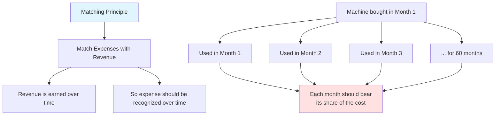
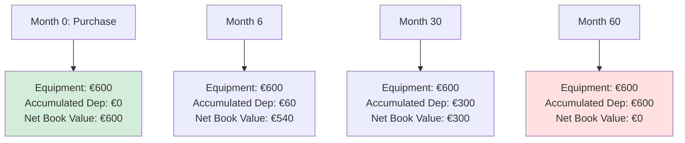
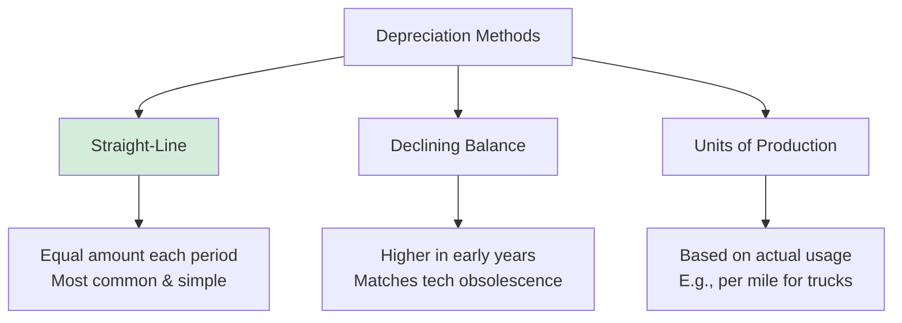
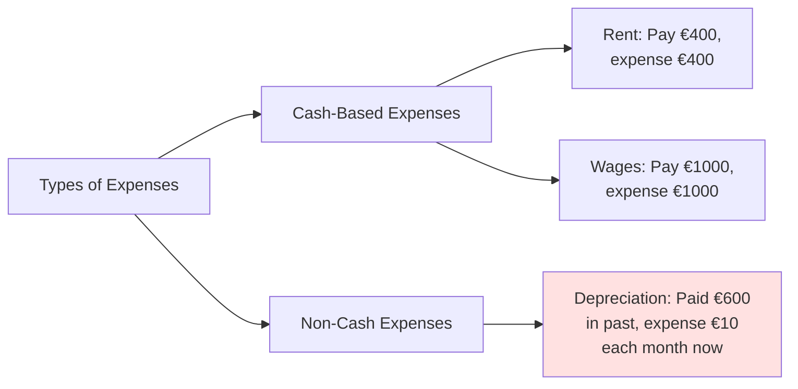

# Depreciation: Spreading Costs Over Time

## 🎯 The Core Concept

**Problem**: You buy an espresso machine for €600 that will last 5 years. Should you expense all €600 in the first month?

**Answer**: No! That wouldn't be fair or accurate.

**Solution**: **Depreciation** - systematically allocating the cost over the asset's useful life.

---

## 🤔 Why Depreciate?

### The Matching Principle



**Logic**: 
- The machine helps generate revenue every month for 5 years
- Each month should "share" the cost of the machine
- This gives a more accurate picture of monthly profitability

---

## 📐 Depreciation Formula

### Straight-Line Depreciation (Most Common)

```
Annual Depreciation = (Cost - Salvage Value) / Useful Life

Monthly Depreciation = Annual Depreciation / 12
```

**Where**:
- **Cost** = Original purchase price
- **Salvage Value** = Expected value at end of useful life (often €0)
- **Useful Life** = How long you expect to use it

---

## 💼 Real Example: Ben's Espresso Machine

### Given Information:
- **Purchase Price**: €600
- **Useful Life**: 5 years (60 months)
- **Salvage Value**: €0 (worthless after 5 years)

### Calculation:

```
Annual Depreciation = (€600 - €0) / 5 years = €120/year

Monthly Depreciation = €120 / 12 = €10/month
```

### Month-by-Month Impact:

| Month | Machine Cost | Accumulated Depreciation | Net Book Value | Monthly Expense |
|-------|-------------|-------------------------|----------------|-----------------|
| 0 (Purchase) | €600 | €0 | €600 | - |
| 1 | €600 | €10 | €590 | €10 |
| 2 | €600 | €20 | €580 | €10 |
| 3 | €600 | €30 | €570 | €10 |
| ... | ... | ... | ... | ... |
| 60 | €600 | €600 | €0 | €10 |

---

## 📊 How It Appears in Financial Statements

### Balance Sheet Evolution



### Income Statement Impact

**Ben's Coffee Shop - Income Statement (Month 1)**

| Item | Amount |
|------|--------|
| **Revenue** | |
| Coffee Sales | €1,200 |
| | |
| **Expenses** | |
| Cost of Beans Used | (€400) |
| Rent | (€400) |
| **Depreciation Expense** | **(€10)** ⬅️ This is new! |
| **Total Expenses** | **(€810)** |
| | |
| **NET PROFIT** | **€390** |

**Without depreciation**: Profit would show €400  
**With depreciation**: Profit shows €390 (more accurate!)

---

## 🔄 The Dual Nature of Depreciation

### On Balance Sheet: Contra-Asset Account

```
Equipment (at cost)              €600
Less: Accumulated Depreciation   (€60)
      ─────────────────────────  ────
Equipment (net book value)       €540
```

**Accumulated Depreciation** is a **contra-asset** - it reduces the asset value.

### On Income Statement: Operating Expense

```
Depreciation Expense             €10
```

This appears alongside other operating expenses.

---

## 📈 Different Depreciation Methods

While **straight-line** is most common, there are others:



### Comparison Example (€1,000 asset, 5 years, no salvage)

| Year | Straight-Line | Declining Balance (40%) | Units of Production* |
|------|---------------|------------------------|---------------------|
| 1 | €200 | €400 | €300 |
| 2 | €200 | €240 | €250 |
| 3 | €200 | €144 | €200 |
| 4 | €200 | €86 | €150 |
| 5 | €200 | €130 | €100 |
| **Total** | **€1,000** | **€1,000** | **€1,000** |

*Assumes 30%, 25%, 20%, 15%, 10% usage each year

**Key Insight**: Total depreciation is ALWAYS the same (€1,000), only the **timing** differs!

---

## 🧮 Practical Scenarios

### Scenario 1: Mid-Year Purchase

**Question**: Ben buys a machine on July 1 for €600 (5-year life). What's Year 1 depreciation?

**Answer**: 
- Annual depreciation = €120
- But only owned for 6 months in Year 1
- Year 1 depreciation = €120 × (6/12) = €60

### Scenario 2: With Salvage Value

**Question**: Machine costs €1,000, lasts 10 years, can be sold for €100 at end.

**Answer**:
```
Depreciable Amount = €1,000 - €100 = €900
Annual Depreciation = €900 / 10 = €90/year
```

The €100 salvage value is NOT depreciated!

### Scenario 3: Component Depreciation

**Question**: Ben buys a coffee shop building for €200,000:
- Land: €50,000 (never depreciates!)
- Building: €150,000 (30-year life)

**Answer**:
```
Land depreciation = €0 (land doesn't wear out!)
Building depreciation = €150,000 / 30 = €5,000/year
```

---

## 💡 Critical Distinction: Depreciation vs. Other Expenses

### Depreciation is UNIQUE



**Key Differences**:

| Aspect | Regular Expense (e.g., Rent) | Depreciation |
|--------|---------------------------|--------------|
| **Cash outflow** | Every period | Only at purchase |
| **Timing** | Pay and expense simultaneously | Pay once, expense over time |
| **Balance Sheet** | Not recorded as asset | Starts as asset, gradually expensed |
| **Income Statement** | Direct expense | Systematic allocation |

---

## 🎯 Why Depreciation Matters

### For Management
- **Better decision-making**: True cost of using assets
- **Pricing decisions**: Include asset costs in product pricing
- **Replacement planning**: Know when assets need replacing

### For Investors
- **Real profitability**: Not inflated by ignoring asset usage
- **Asset age**: High accumulated depreciation = old assets
- **Investment needs**: Fully depreciated assets may need replacement soon

### For Tax Authorities
- **Taxable income**: Depreciation reduces taxable profit
- **Tax savings**: Legal way to defer taxes

---

## 🔍 Reading the Signs

### What High Accumulated Depreciation Tells You

**Balance Sheet Shows**:
```
Equipment (cost)                 €1,000,000
Accumulated Depreciation        (€900,000)
                                 ──────────
Net Book Value                    €100,000
```

**This suggests**:
- ⚠️ Assets are OLD (90% depreciated)
- ⚠️ May need major reinvestment soon
- ⚠️ Competitive disadvantage if using outdated equipment

**vs.**

```
Equipment (cost)                 €1,000,000
Accumulated Depreciation        (€100,000)
                                 ──────────
Net Book Value                    €900,000
```

**This suggests**:
- ✅ Assets are RELATIVELY NEW (only 10% depreciated)
- ✅ Recent investment in equipment
- ✅ Likely more efficient operations

---

## 🚨 Common Misconceptions

### ❌ Myth 1: "Depreciation is cash being set aside"
**Reality**: Depreciation is NOT a cash transaction. It's an accounting allocation. No money leaves the company when depreciation is recorded.

### ❌ Myth 2: "Net book value = market value"
**Reality**: Net book value is historical cost minus accumulated depreciation. It has NOTHING to do with what you could sell the asset for today.

### ❌ Myth 3: "Fully depreciated assets are worthless"
**Reality**: An asset with €0 net book value might still be fully functional and valuable to operations!

### ❌ Myth 4: "Depreciation is optional"
**Reality**: For non-current assets (except land), depreciation is REQUIRED by accounting standards.

---

## 🔑 Key Takeaways

1. **Depreciation** systematically allocates asset cost over its useful life
2. **Matches expenses with revenues** generated by the asset (matching principle)
3. **NOT a cash flow** - it's an accounting allocation
4. **Appears in two places**: Balance Sheet (accumulated) and Income Statement (expense)
5. **Different methods exist** but straight-line is most common
6. **Land never depreciates** - it doesn't wear out!
7. **Net book value ≠ market value** - they measure different things

---

## 🔗 Related Notes
- [[07-Asset-Types-and-Classification|Previous: Asset Types]]
- [[09-Impairment-and-Asset-Valuation|Next: Impairment]]
- [[13-Historical-Cost-Principle|Historical Cost Principle]]

---

## 📝 Practice Problems

**Problem 1**: 
A delivery van costs €30,000, expected life 6 years, salvage value €6,000.
Calculate annual straight-line depreciation.

**Problem 2**:
After 3 years, what's the net book value of the van from Problem 1?

**Problem 3**:
A company shows equipment at cost €500,000 with accumulated depreciation €450,000. What does this tell you?

**Answers**:
1. (€30,000 - €6,000) / 6 = €4,000/year
2. €30,000 - (€4,000 × 3) = €18,000
3. Assets are 90% depreciated (very old), likely need replacement soon

---

*Part of: [[00-Index|Accounting & Value-Based Management Course Notes]]*
