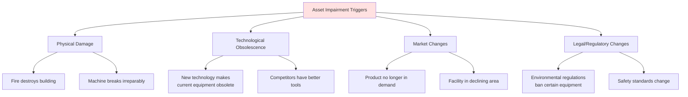
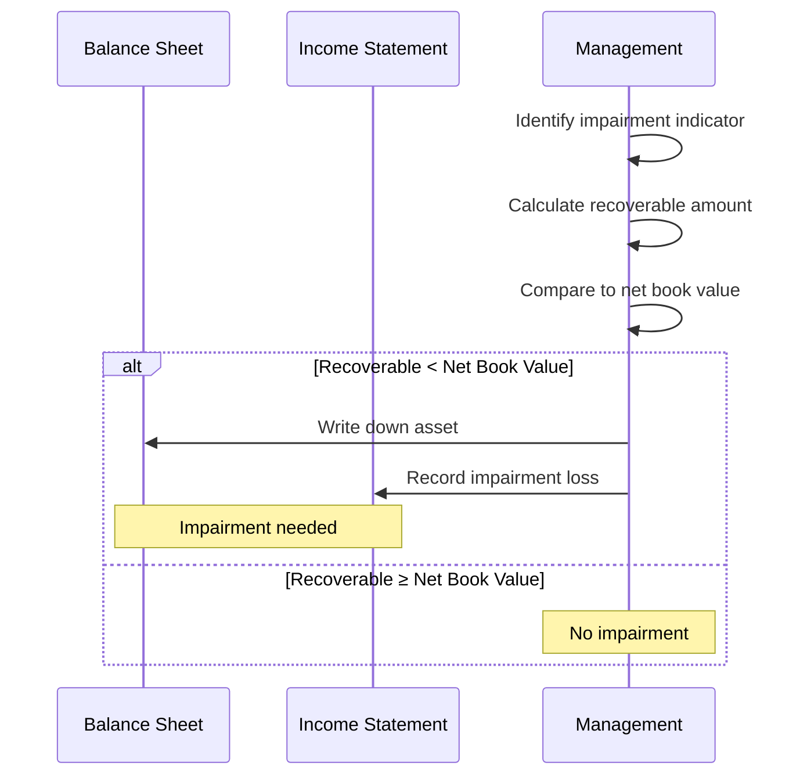
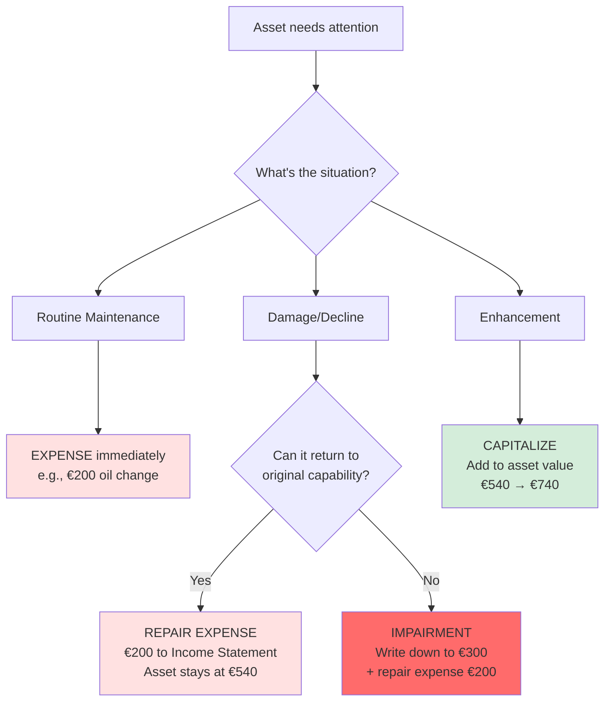
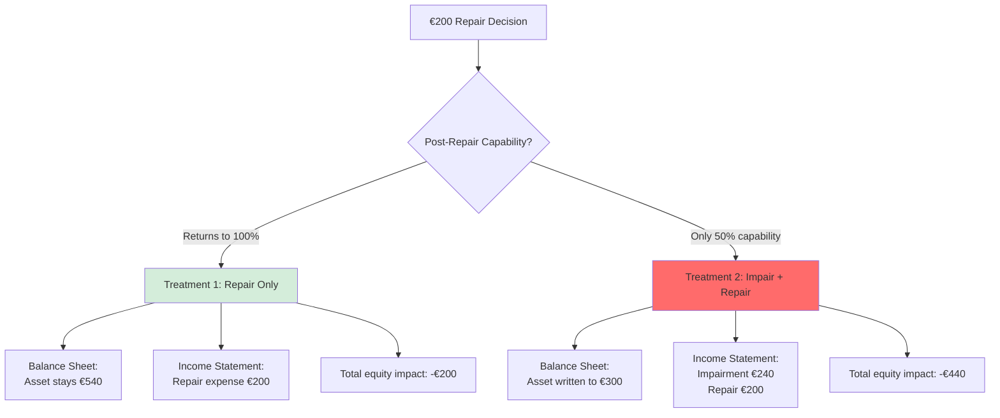
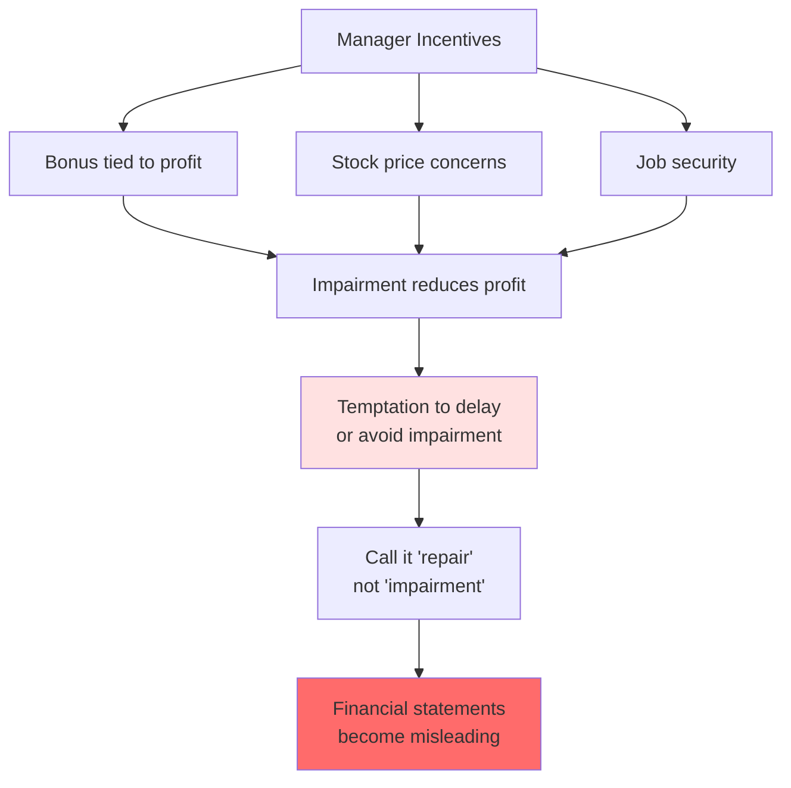
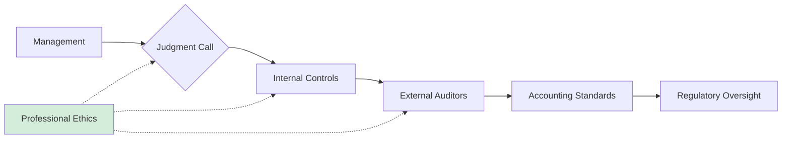

# Impairment and Asset Valuation

## 🎯 Beyond Regular Depreciation

**Depreciation** = Systematic allocation over time (predictable)  
**Impairment** = Sudden, permanent loss in value (unexpected)

---

## 🚨 What is Impairment?

**Definition**: A permanent reduction in an asset's value below its carrying amount (net book value) on the Balance Sheet.

### When Does Impairment Occur?



---

## 🔍 Impairment vs. Normal Depreciation

### Visual Comparison


| Aspect | Regular Depreciation | Impairment |
|--------|---------------------|------------|
| **Nature** | Systematic, predictable | Sudden, unexpected |
| **Frequency** | Every period | When trigger event occurs |
| **Reversibility** | Cannot reverse | Sometimes reversible (IFRS) |
| **Cause** | Normal wear and tear | Specific event/change |

---

## 💼 Real-World Example

### Ben's Espresso Machine Scenarios

**Scenario A: Normal Operations**
```
Month 0: Purchase machine for €600
Month 6: Net book value = €600 - (€10 × 6) = €540
         Machine working fine ✅
```

**Scenario B: Damage Occurs**
```
Month 0: Purchase machine for €600
Month 6: Net book value = €540
         
DISASTER: Part breaks! Repair costs €200.
After repair, machine only makes HALF as much coffee.

Market value now: Maybe €300
Net book value: €540
Difference: €240 impairment loss needed!
```

---

## 📊 Accounting for Impairment

### The Impairment Process



### The Calculation

**Step 1: Determine Recoverable Amount**

```
Recoverable Amount = HIGHER of:
1. Fair Value less costs to sell
2. Value in use (present value of future cash flows)
```

**Step 2: Compare to Carrying Amount**

```
If: Recoverable Amount < Net Book Value
Then: Impairment Loss = Net Book Value - Recoverable Amount
```

### Example with Numbers

**Ben's Machine**:
- Net Book Value: €540
- Fair Value less costs to sell: €280 (what he could sell it for)
- Value in use: €300 (present value of future coffee sales)
- Recoverable Amount: €300 (higher of the two)

**Impairment Loss**: €540 - €300 = **€240**

---

## 📈 Impact on Financial Statements

### Before Impairment

**Balance Sheet**:
```
Equipment (cost)              €600
Accumulated Depreciation     (€60)
                             ─────
Net Book Value               €540
```

**Income Statement** (Month 6):
```
Revenue                    €1,200
Expenses                    (€810)
                           ──────
Profit                      €390
```

### After Impairment

**Balance Sheet**:
```
Equipment (cost)              €600
Accumulated Depreciation     (€60)
Impairment Loss             (€240)  ⬅️ New!
                             ─────
Net Book Value               €300
```

**Income Statement** (Month 6):
```
Revenue                    €1,200
Expenses                    (€810)
Impairment Loss             (€240)  ⬅️ One-time hit!
                           ──────
Profit (Loss)               €150
```

### Impact on Equity


**This is YOUR insight from our discussion!** The impairment reduces profit, which reduces equity!

---

## 🔄 Repair vs. Improvement vs. Impairment

### Decision Tree



### Summary Table

| Situation | Treatment | Balance Sheet | Income Statement |
|-----------|-----------|---------------|------------------|
| **Routine maintenance** | Expense | No change to asset | Repair expense |
| **Restoration repair** | Expense | No change to asset | Repair expense |
| **Betterment/Upgrade** | Capitalize | Increase asset value | Future depreciation ↑ |
| **Permanent damage** | Impair + Repair | Decrease asset value | Impairment loss + Repair expense |

---

## 💰 Repair or Impair: The €200 Repair Dilemma

### Your Critical Insight from Discussion

**The Question**: Machine breaks, repair costs €200. Does capability return to normal?



**Why Management Might Prefer Option 1**:
- ❌ Shows smaller loss (€200 vs €440)
- ❌ Keeps asset value higher on books
- ❌ Looks like "normal operations" not a major problem

**Why Investors Need Option 2** (if true):
- ✅ Accurate reflection of economic reality
- ✅ Honest about asset capabilities
- ✅ Proper basis for future decisions

**This is where accounting ethics comes in!**

---

## 🎭 The Management Incentive Problem

### Why Managers Might Avoid Impairment



### Real-World Consequence: Wirecard

From your course materials - Wirecard scandal showed what happens when assets (and revenues) are inflated:
- Claimed assets that didn't exist
- Investors misled
- Company collapsed
- CEO prosecuted

---

## 🛡️ Safeguards Against Abuse

### The Control System



**Key Protections**:
1. **Accounting Standards** (IFRS/GAAP): Define when impairment required
2. **Auditors**: Independent verification
3. **Professional Judgment**: Must be exercised honestly
4. **Disclosure Requirements**: Must explain impairments
5. **Legal Consequences**: Fraud is criminal

---

## 📉 Impairment Indicators Checklist

### External Indicators:
- ☑️ Market value decline significantly below book value
- ☑️ Significant technological changes
- ☑️ Adverse market changes
- ☑️ Interest rate increases affecting discount rates
- ☑️ Company stock price declining

### Internal Indicators:
- ☑️ Physical damage or obsolescence
- ☑️ Asset idle or to be discontinued
- ☑️ Restructuring plans
- ☑️ Worse economic performance than expected
- ☑️ Evidence from internal reports

**If ANY indicator present**: Must test for impairment!

---

## 🔑 Key Takeaways

1. **Impairment** = permanent loss in value beyond normal depreciation
2. **Triggered by events**, not just passage of time
3. **Reduces both asset value** (Balance Sheet) **and profit** (Income Statement)
4. **Different from repairs**: Repairs restore; impairment recognizes permanent loss
5. **Management judgment** required - creates both necessity and risk
6. **Ethical obligation** to impair when indicators present
7. **Failing to impair** = misleading financial statements = fraud

---

## 🔗 Related Notes
- [[08-Depreciation-Concepts|Previous: Depreciation]]
- [[13-Historical-Cost-Principle|Historical Cost Principle]]
- [[14-Accounting-Ethics-and-Fraud|Next: Ethics and Fraud]]

---

## 📝 Case Study Questions

**Case**: A factory's machinery cost €1M, net book value now €600K. A new regulation requires expensive modifications. After modifications, the machinery can only produce 60% of previous output. Market value for similar used equipment: €300K.

**Questions**:
1. Is there an impairment indicator?
2. What's the likely impairment loss?
3. How would this appear in financial statements?
4. What if management argues "it still works, so no impairment needed"?

**Think through these using concepts from this note!**

---

*Part of: [[00-Index|Accounting & Value-Based Management Course Notes]]*
