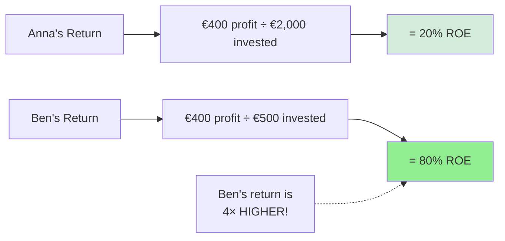
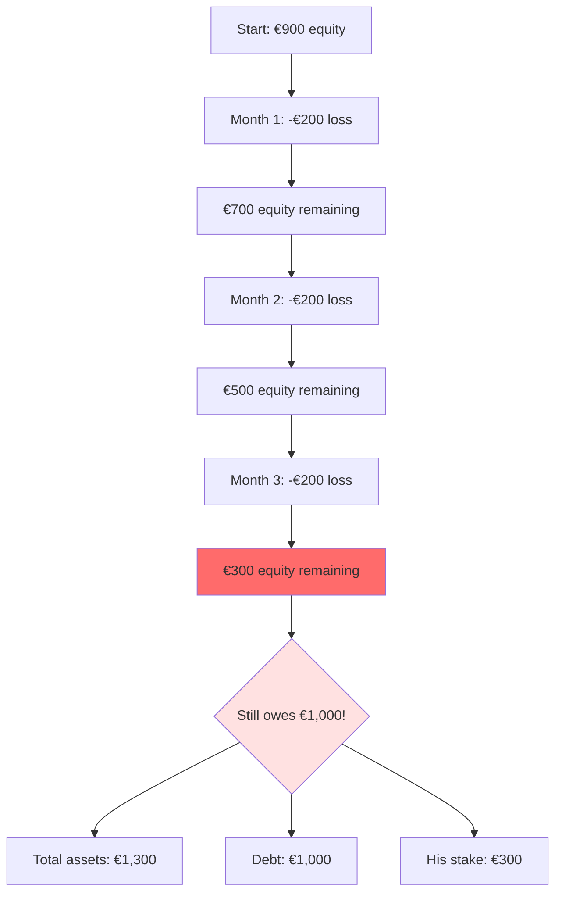
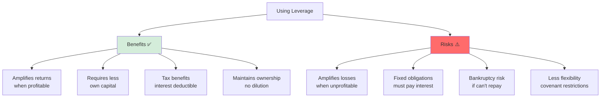
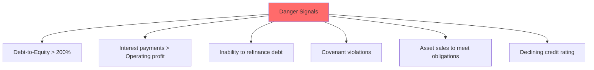
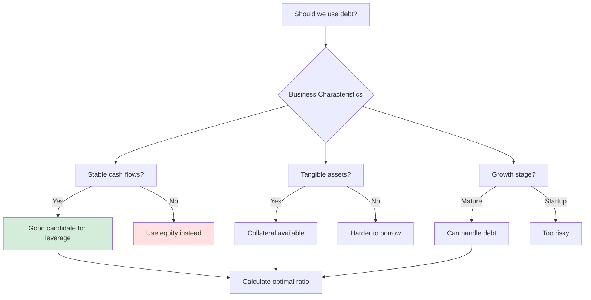

# Leverage: Amplifying Returns and Risks

## 🎯 The Power of Using Other People's Money

**Leverage** = Using borrowed money (debt) to finance business activities, which amplifies both returns and risks.

---

## 💡 The Core Concept

### Simple Analogy

Imagine you want to buy a house:

**Option A**: Pay €200,000 cash  
**Option B**: Pay €40,000 down, borrow €160,000

If house value increases to €240,000 (+€40,000):
- **Option A return**: €40,000 on €200,000 = **20%**
- **Option B return**: €40,000 on €40,000 = **100%** 🚀

But if house value drops to €160,000 (-€40,000):
- **Option A loss**: €40,000 on €200,000 = **-20%**
- **Option B loss**: €40,000 on €40,000 = **-100%** 💥 (wiped out!)

**This is leverage in action!**

---

## 📊 Anna vs. Ben: The Leverage Effect

### Recap: Their Starting Positions

**Anna (No Leverage)**:
- Own money: €2,000
- Borrowed: €0
- Total capital: €2,000

**Ben (With Leverage)**:
- Own money: €500
- Borrowed: €1,000
- Total capital: €1,500

Both made **€400 profit** in Month 1.

---

## 🎲 Scenario 1: Things Go WELL (€400 Profit)

### Returns Calculation



**Why?**
- Ben used €1,000 of the bank's money to generate €400 profit
- His own investment was only €500
- The bank doesn't share in profit, just gets interest
- All profit goes to Ben!

### The Math

**Anna's ROE**: €400 ÷ €2,000 = **20%**

**Ben's ROE**: €400 ÷ €500 = **80%**

**Leverage multiplier**: 80% ÷ 20% = **4×**

---

## 💥 Scenario 2: Things Go BADLY (-€200 Loss)

### Impact Analysis

**Anna**:
```
Starting equity:     €2,400
Loss:                 (€200)
Ending equity:       €2,200
Return:              -10%
```
Still has plenty of cushion! ✅

**Ben**:
```
Starting equity:       €900
Loss:                 (€200)
Ending equity:         €700
Return:               -40%
Still owes bank:     €1,000
```
Lost 40% of his investment! 😰

---

## 📉 Scenario 3: DISASTER (Three Bad Months)

### The Downward Spiral

**Ben's Equity Over Time**:



**The Problem**:
- Assets: €1,300
- Debt: €1,000
- Equity: €300

**Danger zone**: Equity is becoming very thin relative to debt!

### When Does Bankruptcy Happen?

```
Bankruptcy occurs when: Liabilities > Assets
or when: Equity becomes negative
```

**If losses continue**:
- One more bad month (€300 equity - €200 loss = €100 equity)
- Two more bad months = **€0 equity** → Insolvent!
- Bank may demand repayment or seize assets

**Anna with same losses**:
- Equity: €2,400 → €2,200 → €2,000 → €1,800 → €1,600
- Still solvent, still operating ✅

---

## 📐 Measuring Leverage

### Key Ratios

#### 1. Debt-to-Equity Ratio

```
Debt-to-Equity Ratio = Total Debt / Total Equity
```

**Anna**: €0 / €2,400 = **0%** (no leverage)  
**Ben**: €1,000 / €900 = **111%** (highly leveraged)

**Interpretation**:
- **0-50%**: Conservative
- **50-100%**: Moderate
- **>100%**: Aggressive (more debt than equity!)

#### 2. Equity Multiplier

```
Equity Multiplier = Total Assets / Total Equity
```

**Anna**: €2,400 / €2,400 = **1.0×**  
**Ben**: €1,900 / €900 = **2.1×**

**Interpretation**: For every €1 of equity, Ben has €2.10 of assets (the rest is borrowed).

#### 3. Debt Ratio

```
Debt Ratio = Total Debt / Total Assets
```

**Anna**: €0 / €2,400 = **0%**  
**Ben**: €1,000 / €1,900 = **53%**

**Interpretation**: 53% of Ben's assets are financed by debt.

---

## ⚖️ The Leverage Trade-off



---

## 🎯 When Does Leverage Make Sense?

### The Golden Rule

**Leverage is beneficial when:**
```
Return on Assets (ROA) > Cost of Debt (Interest Rate)
```

**Example**:
- Ben borrows at 5% interest
- Generates 20% return on assets
- **Spread**: 20% - 5% = **15% advantage**
- This 15% goes to equity holders!

### The Danger Zone

**Leverage becomes harmful when:**
```
Return on Assets (ROA) < Cost of Debt (Interest Rate)
```

**Example**:
- Ben borrows at 5% interest
- Only generates 2% return on assets
- **Spread**: 2% - 5% = **-3% loss**
- Losing money on borrowed funds!

---

## 💼 Real-World Applications

### Corporate Examples

#### Tech Startups (Low Leverage)
```
Why: Uncertain cash flows, high growth potential
Strategy: Equity financing (venture capital)
Example: Early-stage software companies
```

#### Real Estate (High Leverage)
```
Why: Stable cash flows, tangible collateral
Strategy: 70-80% debt financing typical
Example: REITs, property development
```

#### Manufacturing (Moderate Leverage)
```
Why: Predictable cash flows, expensive equipment
Strategy: 40-60% debt financing
Example: Automotive, machinery
```

---

## 📊 The Complete Picture: ROE Decomposition

### DuPont Analysis

```
ROE = Net Profit Margin × Asset Turnover × Equity Multiplier

Where:
- Net Profit Margin = Net Income / Sales
- Asset Turnover = Sales / Total Assets  
- Equity Multiplier = Total Assets / Equity
```

**Anna's ROE**:
```
20% = (€400/€1,200) × (€1,200/€2,400) × (€2,400/€2,400)
    = 33.3% × 0.5 × 1.0
```

**Ben's ROE**:
```
44% = (€400/€1,200) × (€1,200/€1,900) × (€1,900/€900)
    = 33.3% × 0.63 × 2.1
```

**Insight**: Ben's higher ROE comes from:
1. ✅ Better asset turnover (63% vs 50%)
2. ✅ Leverage (2.1× vs 1.0×)

---

## 🚨 Warning Signs of Excessive Leverage

### Red Flags



### Historical Examples

**2008 Financial Crisis**:
- Banks with 30-40× leverage
- Small losses wiped out equity
- System-wide collapse

**Wirecard** (from course):
- Fraudulent accounting to hide leverage problems
- Collapsed when truth emerged

---

## 🎓 Strategic Leverage Decisions

### Decision Framework



---

## 🔑 Key Takeaways

1. **Leverage amplifies** both gains and losses
2. **Higher ROE** possible with leverage when business is profitable
3. **Greater risk** of bankruptcy when business struggles
4. **Optimal leverage** depends on business characteristics
5. **Trade-off**: Higher returns vs. higher risk
6. **Context matters**: What's appropriate varies by industry
7. **Monitoring critical**: Track leverage ratios continuously

---

## 🔗 Related Notes
- [[10-Equity-vs-Debt-Financing|Previous: Equity vs Debt Financing]]
- [[02-Fundamental-Accounting-Equation|The Accounting Equation]]
- [[12-Stakeholders-and-Information-Needs|Stakeholder Perspectives]]

---

## 📝 Practice Problems

**Problem 1**: 
Company A has €100K equity, no debt.
Company B has €50K equity, €50K debt.
Both earn €15K profit.
Calculate ROE for each.

**Problem 2**:
If both companies from Problem 1 lose €10K instead, what happens to their equity? Who is in more danger?

**Problem 3**:
A company can borrow at 6% interest. It generates 12% return on assets. Should it use leverage? Why?

**Answers**:
1. Company A: 15%, Company B: 30% (leverage doubles return)
2. A: €90K equity (safe), B: €40K equity (lost 20%, but still owes €50K - danger!)
3. Yes! 12% - 6% = 6% spread benefits equity holders

---

*Part of: [[00-Index|Accounting & Value-Based Management Course Notes]]*
