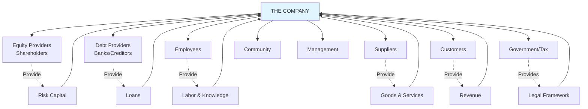
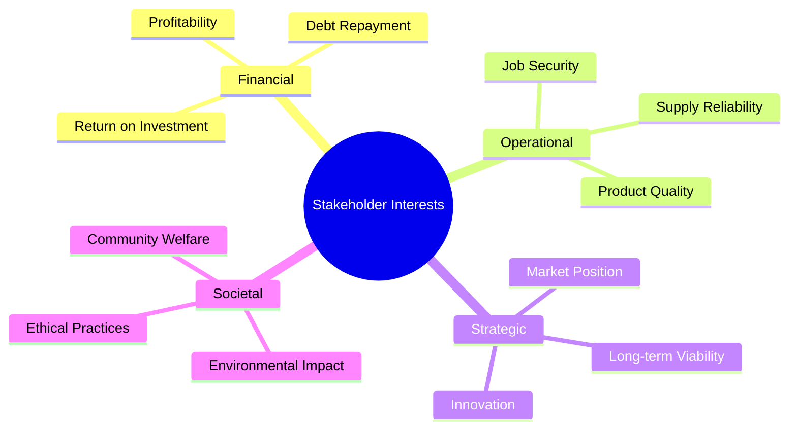
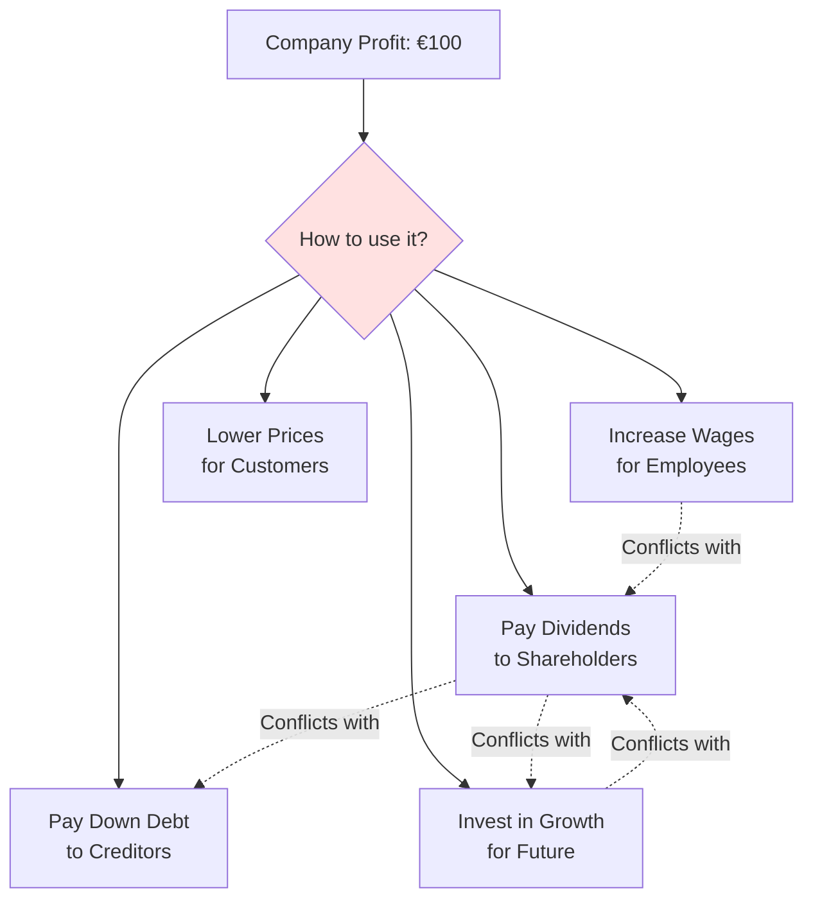
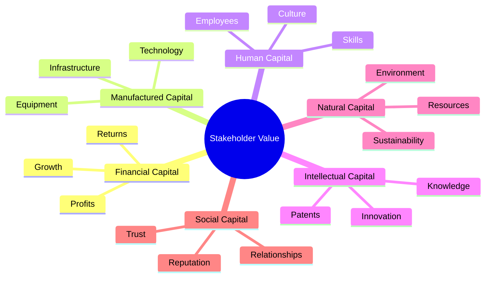
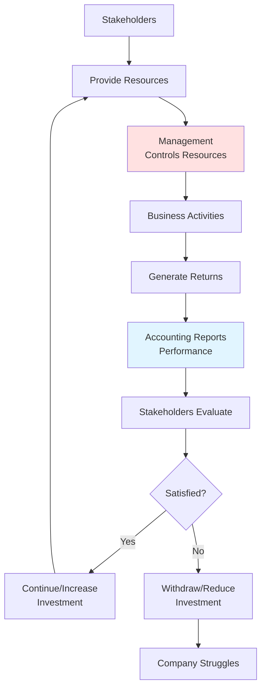

# Stakeholders and Their Information Needs

## 🎯 Who Cares About Accounting Information?

A company is a **nexus of contracts** - a complex network of relationships with different groups who all have a stake in its performance.

---

## 👥 The Stakeholder Map



---

## 📊 Stakeholder Classification

### By Relationship Type

**Internal Stakeholders** (inside the organization):
- Management
- Employees
- Board of Directors

**External Stakeholders** (outside the organization):
- Shareholders
- Creditors
- Suppliers
- Customers
- Government
- Community

### By Interest Type



---

## 💼 Individual Stakeholder Analysis

### 1. Shareholders (Equity Providers) 📈

**What they provide**:
- Permanent capital (equity)
- Bear residual risk
- No guaranteed return

**What they want to know**:
✅ Is the company **profitable**?  
✅ Is the company **growing**?  
✅ What's my **return on investment** (ROI)?  
✅ Is my investment **safe** long-term?  
✅ Should I **hold, buy more, or sell**?

**Key Information Sources**:

| Financial Statement | What They Look For |
|--------------------|--------------------|
| **Income Statement** | Revenue growth, profit margins, earnings per share |
| **Balance Sheet** | Total equity, debt levels, asset base |
| **Cash Flow Statement** | Ability to generate cash, dividend capacity |

**Key Metrics**:
- **Return on Equity (ROE)** = Net Income / Shareholders' Equity
- **Earnings Per Share (EPS)** = Net Income / Number of Shares
- **Price-to-Earnings (P/E) Ratio** = Stock Price / EPS

**Example from our case**:
- Anna's ROE = €400 / €2,400 = **16.7%**
- Ben's ROE = €400 / €900 = **44.4%**

Ben's investors see higher returns, but also higher risk!

---

### 2. Creditors/Banks (Debt Providers) 🏦

**What they provide**:
- Loans and credit
- Temporary capital
- Fixed return (interest)

**What they want to know**:
✅ Can the company **repay the debt**?  
✅ What **assets** can be seized if things go wrong?  
✅ Is cash flow **sufficient** to cover interest?  
✅ What's the **debt-to-equity ratio**?  
✅ Is the company becoming **more or less risky**?

**Key Information Sources**:

| Financial Statement | What They Look For |
|--------------------|--------------------|
| **Balance Sheet** | Current assets vs liabilities, collateral value |
| **Cash Flow Statement** | Operating cash flow, ability to service debt |
| **Income Statement** | Stability of earnings, interest coverage |

**Key Metrics**:
- **Current Ratio** = Current Assets / Current Liabilities
- **Debt-to-Equity Ratio** = Total Debt / Total Equity
- **Interest Coverage** = EBIT / Interest Expense

**Example from our case**:
- Anna's Debt-to-Equity = €0 / €2,400 = **0%** (very safe!)
- Ben's Debt-to-Equity = €1,000 / €900 = **111%** (higher risk)

Banks would charge Ben higher interest rates due to higher risk.

---

### 3. Government/Tax Authorities 🏛️

**What they want**:
- Tax revenue
- Compliance with regulations
- Accurate reporting

**What they want to know**:
✅ What is **taxable income**?  
✅ Are **sales taxes** calculated correctly?  
✅ Are **payroll taxes** properly withheld?  
✅ Is the company **complying with laws**?

**Key Focus**:
- **Income Statement** → Calculate tax on profits
- **Balance Sheet** → Verify asset valuations for tax purposes
- **Payroll Records** → Employee tax withholdings

**Tax Calculation**:
```
Accounting Profit                €400
+/- Tax Adjustments             (varies)
= Taxable Income                 €XXX
× Tax Rate (e.g., 25%)          ×0.25
= Tax Payable                    €XXX
```

---

### 4. Employees 👷

**What they provide**:
- Labor and expertise
- Knowledge and skills
- Time and effort

**What they want to know**:
✅ Is my **job secure**?  
✅ Will I get **paid** regularly?  
✅ Is the company **growing** (promotion opportunities)?  
✅ Can the company afford **raises**?  
✅ What about **pension/benefits**?

**Key Concerns**:
- Profitability (can afford salaries)
- Cash flow (can pay wages on time)
- Stability (won't go bankrupt)
- Growth (career opportunities)

---

### 5. Suppliers 📦

**What they provide**:
- Goods and services
- Often on credit terms

**What they want to know**:
✅ Can the company **pay invoices** on time?  
✅ Should we offer **credit** or require cash?  
✅ Is this a **reliable** long-term customer?  
✅ Are they at risk of **bankruptcy**?

**Key Metrics**:
- **Current Ratio** (liquidity)
- **Days Payable Outstanding** = (Accounts Payable / Cost of Goods Sold) × 365
- **Payment history**

---

### 6. Customers 🛒

**What they want to know**:
✅ Will the company **stay in business**?  
✅ Will they **honor warranties**?  
✅ Will they provide **ongoing support**?  
✅ Are they **financially stable**?

**Especially Important For**:
- Long-term contracts
- Products requiring service/support
- Custom-made goods
- Subscription services

---

## 🎭 Conflicting Interests

### The Tension Between Stakeholders



### Real-World Examples of Conflicts:

**1. Dividends vs. Debt Repayment**
- Shareholders want: High dividends
- Creditors want: Debt paid down first
- Cannot maximize both!

**2. Short-term Profit vs. Long-term Investment**
- Current shareholders: Maximize today's profit
- Future stakeholders: Invest in R&D, equipment
- Management must balance!

**3. Wages vs. Profit**
- Employees want: Higher salaries
- Shareholders want: Higher profits
- Direct trade-off!

---

## 📋 Information Needs Summary Matrix

| Stakeholder | Primary Question | Key Statement | Top 3 Metrics |
|-------------|-----------------|---------------|---------------|
| **Shareholders** | "What's my return?" | Income Statement | ROE, EPS, Profit Margin |
| **Creditors** | "Will I get repaid?" | Balance Sheet | Current Ratio, Debt/Equity, Interest Coverage |
| **Government** | "How much tax owed?" | Income Statement | Taxable Income, Sales, Payroll |
| **Employees** | "Is my job safe?" | All statements | Profitability, Cash Flow, Growth |
| **Suppliers** | "Will they pay me?" | Balance Sheet | Current Ratio, A/P, Cash |
| **Customers** | "Will they survive?" | All statements | Profitability, Solvency |

---

## 🌍 Beyond Financial Stakeholders

### The Broader View: ESG (Environmental, Social, Governance)

Modern stakeholder theory recognizes **non-financial** impacts:



**Modern Reporting Includes**:
- Carbon footprint
- Employee diversity
- Community investment
- Ethical practices
- Sustainability goals

**Example from course**: McDonald's green logo - signals environmental commitment to broader stakeholder base.

---

## ⚖️ The Stewardship Function

### Management as Steward



**Stewardship = Accountability**

Management must report:
- How resources were used
- What results were achieved
- Whether stakeholder interests were served

**When stewardship fails**: Wirecard, Bayer/Monsanto (from course materials)

---

## 🔑 Key Takeaways

1. **Multiple stakeholders** have different, often conflicting interests
2. **Different stakeholders** focus on different financial information
3. **Accounting serves** as the common language for all stakeholders
4. **Trade-offs exist** - can't maximize all stakeholder interests simultaneously
5. **Management's role** is to balance competing stakeholder needs
6. **Transparency is critical** - stakeholders need accurate information
7. **Modern view** extends beyond financial stakeholders to include ESG

---

## 🔗 Related Notes
- [[01-Accounting-as-Language-of-Business|Accounting as Language]]
- [[02-Fundamental-Accounting-Equation|The Accounting Equation]]
- [[10-Equity-vs-Debt-Financing|Equity vs Debt]]
- [[14-Accounting-Ethics-and-Fraud|Accounting Ethics]]

---

## 📝 Reflection Questions

1. Why might a company's optimal decision differ depending on which stakeholder you ask?
2. How does accounting help align the interests of different stakeholder groups?
3. What happens when one stakeholder group dominates decision-making at the expense of others?
4. How has stakeholder theory evolved beyond just financial considerations?

---

*Part of: [[00-Index|Accounting & Value-Based Management Course Notes]]*
