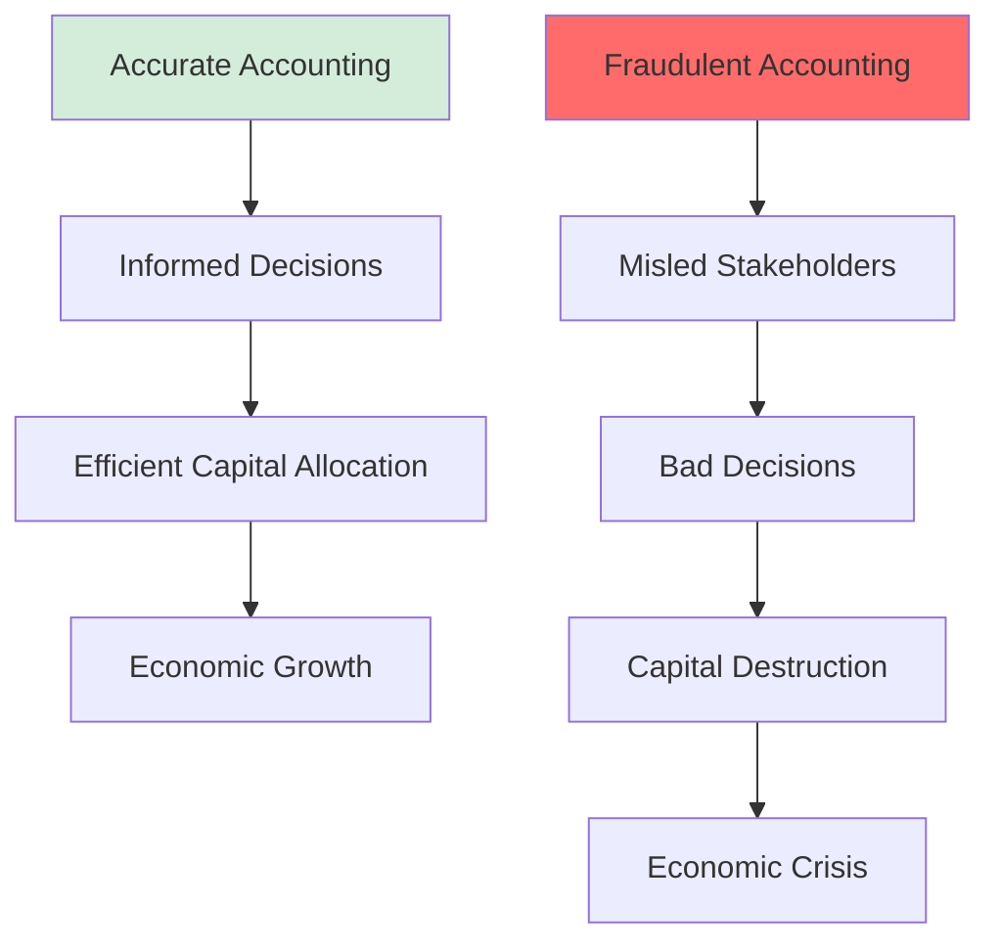
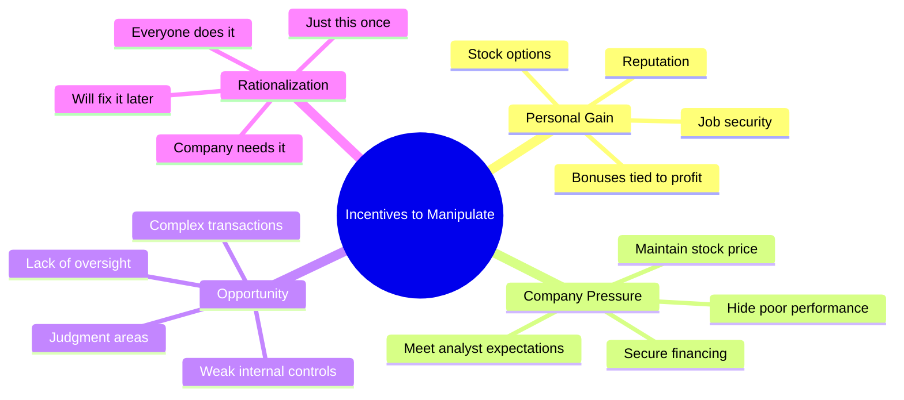
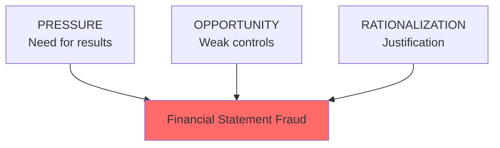
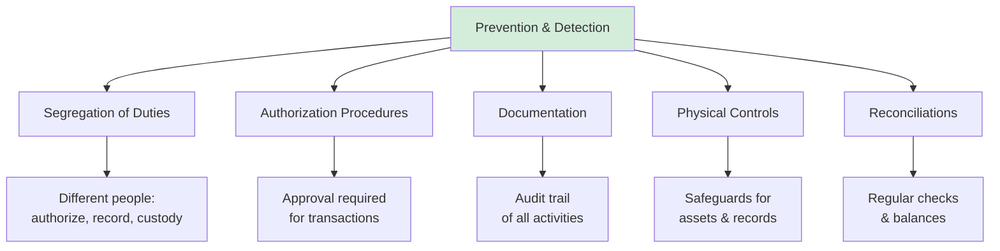
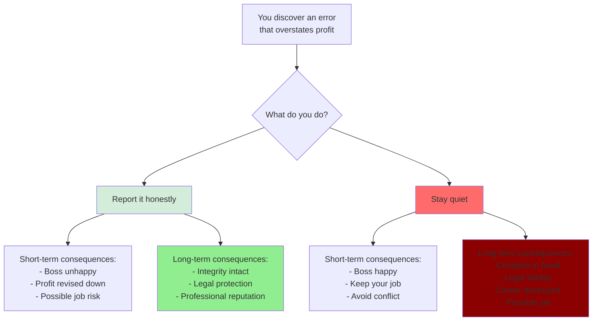
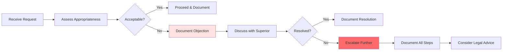
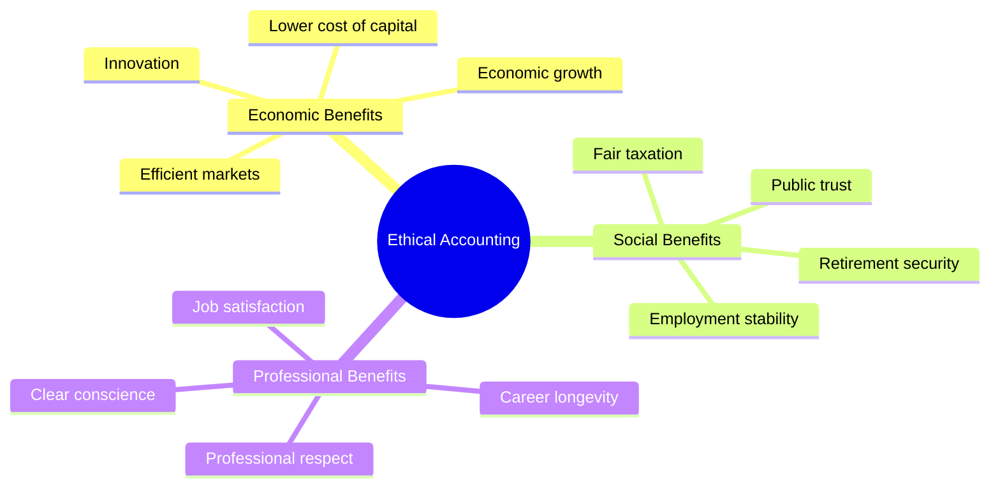

# Accounting Ethics and Fraud Prevention

## 🎯 Why Ethics Matter in Accounting

**Accounting is built on trust**. When that trust breaks down, the entire economic system suffers.



---

## 🚨 Real Scandals from Course Materials

### Wirecard (Germany, 2020)

**What Happened**:
- German payment processor
- Claimed €1.9 billion in cash that didn't exist
- Inflated revenues and assets
- Former CEO Markus Braun arrested

**The Fraud**:
```
Balance Sheet (CLAIMED):
Cash: €1,900,000,000
Reality: Cash didn't exist!

Impact:
- Stock price collapsed from €200 to €0.21
- Company bankrupt
- Investors lost billions
```

**Lessons**:
- Auditors failed to verify cash balances
- Management had incentives to inflate results
- Regulatory oversight insufficient

### Bayer/Monsanto Acquisition

**What Happened**:
- Bayer acquired Monsanto (supposedly value-creating)
- Deal destroyed shareholder value instead
- Shareholders voted against CEO Werner Baumann (2019)

**The Issue**:
- Overpaid for acquisition
- Failed to properly account for litigation risks
- Management accountability failure

---

## 😈 The Temptation to Manipulate

### Why Managers Might Commit Fraud



### The Fraud Triangle



**All three must be present** for fraud to occur!

---

## 🎭 Common Manipulation Techniques

### 1. Revenue Recognition Fraud

**Technique**: Record revenue before earned

**Examples**:
- ❌ Recording sales before goods shipped
- ❌ "Channel stuffing" - forcing distributors to buy
- ❌ Recording fake sales
- ❌ Early recognition of long-term contracts

**Red Flags**:
- Revenue growing faster than industry
- Accounts receivable growing faster than sales
- Large sales at quarter-end

### 2. Expense Manipulation

**Technique**: Delay or hide expenses

**Examples**:
- ❌ Capitalizing expenses as assets (should be expensed immediately)
- ❌ Failing to record impairments (your discovery!)
- ❌ Underestimating warranty costs
- ❌ Hiding repairs as "improvements"

**Your Insight**: The €200 repair scenario!
```
Honest: Impair €240 + Expense €200 = Total €440 hit
Fraud: Only expense €200 = Hidden €240 loss
```

### 3. Asset Overvaluation

**Technique**: Keep assets at inflated values

**Examples**:
- ❌ No depreciation (should be systematic)
- ❌ Avoiding impairment losses
- ❌ Inflating inventory values
- ❌ Fictitious assets (Wirecard!)

### 4. Liability Understatement

**Technique**: Hide or minimize obligations

**Examples**:
- ❌ Off-balance-sheet financing
- ❌ Underestimating pension obligations
- ❌ Not recording contingent liabilities
- ❌ Hiding debt in subsidiaries

---

## 🔍 How Fraud is Detected

### Internal Controls



### External Safeguards

**1. External Auditors**
- Independent verification
- Test controls and balances
- Issue audit opinion
- **Limitation**: Can't catch everything!

**2. Accounting Standards**
- IFRS (International Financial Reporting Standards)
- GAAP (Generally Accepted Accounting Principles)
- Reduce judgment areas
- Require disclosures

**3. Regulatory Bodies**
- SEC (US), BaFin (Germany), FCA (UK)
- Investigation powers
- Penalties for violations
- Public enforcement

**4. Professional Ethics**
- CPA codes of conduct
- Professional skepticism
- Independence requirements
- Continuing education

---

## ⚖️ The Ethical Accountant's Dilemma

### Scenario: Pressure from Management



### Professional Responsibilities

**Accountants must**:
1. ✅ Act with **integrity**
2. ✅ Maintain **objectivity**
3. ✅ Exercise **professional competence**
4. ✅ Respect **confidentiality** (with limits)
5. ✅ Demonstrate **professional behavior**

**When conflicts arise**:
- Document concerns
- Escalate to higher authority
- Consult professional body
- Whistleblower protections exist
- **Never participate in fraud**

---

## 📊 Case Study: The Impairment Decision

### Recall Your Discovery

**Situation**: Machine breaks, costs €200 to repair, but only restores 50% capability.

**Management's Preference**:
```
Balance Sheet: Keep asset at €540
Income Statement: Expense only €200 repair
Total equity impact: -€200
Looks like: Normal operations
```

**Honest Accounting**:
```
Balance Sheet: Impair asset to €300
Income Statement: Impairment loss €240 + Repair €200
Total equity impact: -€440
Looks like: Major problem (which it is!)
```

### The Ethical Analysis

**Arguments Management Might Make** (Rationalizations):
- 🚫 "It still works, so no impairment needed"
- 🚫 "We'll make up the loss next quarter"
- 🚫 "The auditors might not catch it"
- 🚫 "Our jobs depend on good results"
- 🚫 "Everyone bends the rules a little"

**Ethical Response**:
- ✅ Accounting standards REQUIRE impairment when recoverable amount < carrying value
- ✅ Stakeholders deserve accurate information
- ✅ Two wrongs don't make a right
- ✅ Short-term pain beats long-term disaster
- ✅ Professional duty over personal interest

---

## 🛡️ Protecting Yourself as an Accountant

### Documentation is Key



**Always Document**:
- Conversations about questionable items
- Your professional judgment and reasoning
- Management's responses
- Escalation steps taken
- Final resolution

**This protects you if fraud later discovered!**

---

## 📈 The Cost of Fraud

### Financial Impact

**Direct Costs**:
- Investor losses
- Loan defaults
- Bankruptcy costs
- Legal fees

**Indirect Costs**:
- Lost trust in capital markets
- Higher cost of capital for all
- Increased regulation
- Economic inefficiency

### Personal Consequences

**For Fraudsters**:
- 🔒 Criminal prosecution (jail time)
- 💰 Financial penalties & restitution
- 🚫 Professional license revoked
- 📉 Personal bankruptcy
- 😞 Reputation destroyed forever

**Examples**:
- Wirecard CEO Markus Braun: Arrested, facing fraud charges
- Enron executives: Multiple convictions, long prison sentences
- Bernie Madoff: 150 years in prison

---

## ✅ The Positive Role of Ethics

### Beyond Avoiding Fraud

**Ethical accounting enables**:



**The Bigger Picture**:
- Accounting isn't just about rules - it's about **serving society**
- Accurate information → Good decisions → Prosperity
- You're not just a number-cruncher, you're a **guardian of trust**

---

## 🎯 Red Flags Checklist

### Warning Signs of Potential Fraud

**Revenue & Income**:
- ☑️ Revenue growing much faster than industry
- ☑️ Profit margins consistently above competitors
- ☑️ Large transactions near period-end
- ☑️ Unusual related-party transactions

**Assets**:
- ☑️ Receivables growing faster than sales
- ☑️ Inventory growing faster than sales
- ☑️ No impairments despite industry problems
- ☑️ Unexplained asset writeups

**Liabilities & Equity**:
- ☑️ Off-balance-sheet arrangements
- ☑️ Complex financial structures
- ☑️ Frequent restructuring charges
- ☑️ Unusual equity transactions

**Cash Flows**:
- ☑️ Profit but no cash generation
- ☑️ Operating cash flow < Net income persistently
- ☑️ Heavy reliance on financing activities

**Management & Governance**:
- ☑️ Dominant CEO with weak board
- ☑️ Frequent CFO changes
- ☑️ Aggressive management tone
- ☑️ Unusual auditor relationships

---

## 🔑 Key Takeaways

1. **Accounting ethics** are fundamental to economic functioning
2. **Fraud triangle**: Pressure + Opportunity + Rationalization
3. **Common manipulations**: Revenue inflation, expense hiding, asset overvaluation
4. **Multiple safeguards**: Controls, auditors, standards, regulations
5. **Professional duty**: Integrity over personal interest
6. **Documentation**: Protect yourself with thorough records
7. **Long-term view**: Ethical behavior is career insurance
8. **Societal impact**: You're a guardian of economic trust

---

## 📜 Professional Codes

### Core Ethical Principles

**Integrity**:
- Be honest and straightforward
- Fair dealings and truthfulness

**Objectivity**:
- Don't let bias, conflict of interest, or undue influence override judgment

**Professional Competence**:
- Maintain knowledge and skill
- Act diligently

**Confidentiality**:
- Respect confidentiality of information
- Don't use for personal advantage
- **Exception**: Legal/professional duty to disclose

**Professional behavior**:
- Comply with laws and regulations
- Avoid actions that discredit the profession

---

## 🔗 Related Notes
- [[01-Accounting-as-Language-of-Business|Language of Business]]
- [[09-Impairment-and-Asset-Valuation|Impairment (The €200 Repair Dilemma)]]
- [[12-Stakeholders-and-Information-Needs|Stakeholders Trust Accounting]]

---

## 📝 Ethical Scenarios for Reflection

**Scenario 1**: Your boss asks you to delay recording an expense until next quarter to meet targets. What do you do?

**Scenario 2**: You discover a mistake that overstates inventory by €100,000. Correcting it will cause your company to miss analyst expectations. What's your obligation?

**Scenario 3**: A client offers you expensive gifts and wants favorable accounting treatment. How do you respond?

**Think through these using the frameworks in this note!**

---

## 💭 Final Thought

> "In the long run, integrity is the most valuable asset a professional can have. Fraud may seem to work in the short term, but it always ends badly. Always."

**Your professional reputation is built over years but can be destroyed in moments. Protect it!**

---

*Part of: [[00-Index|Accounting & Value-Based Management Course Notes]]*
