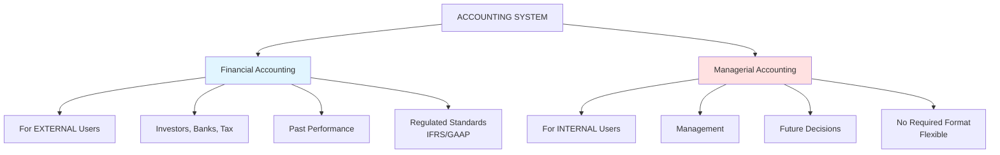
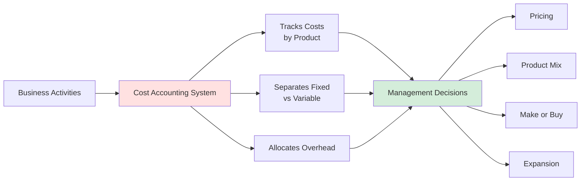
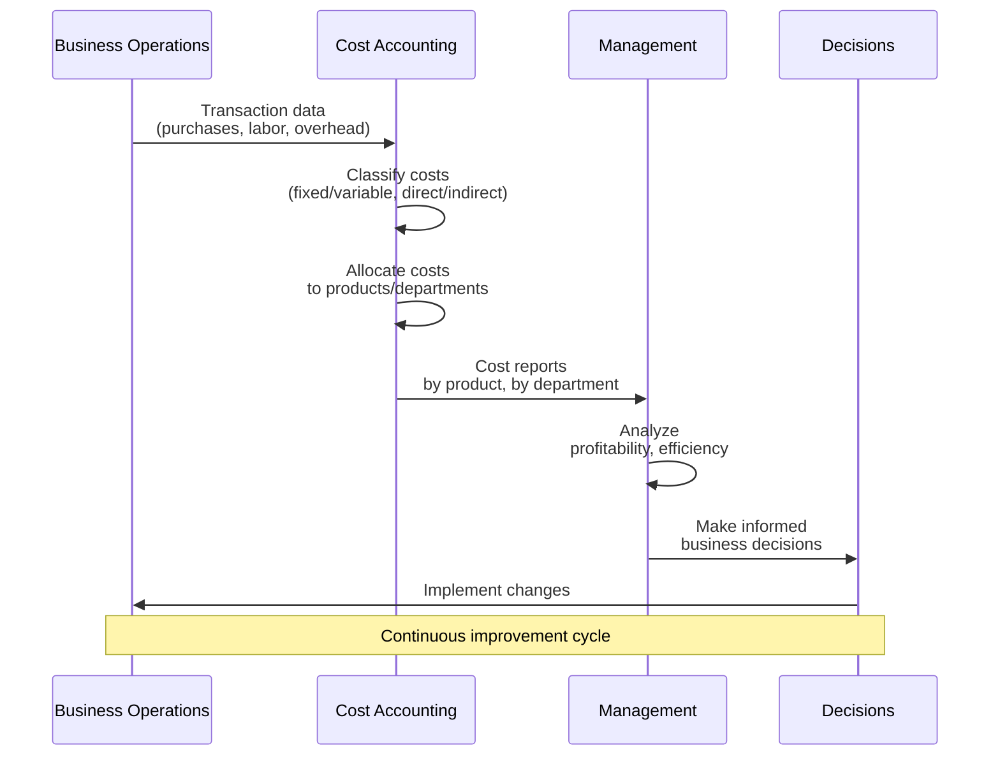
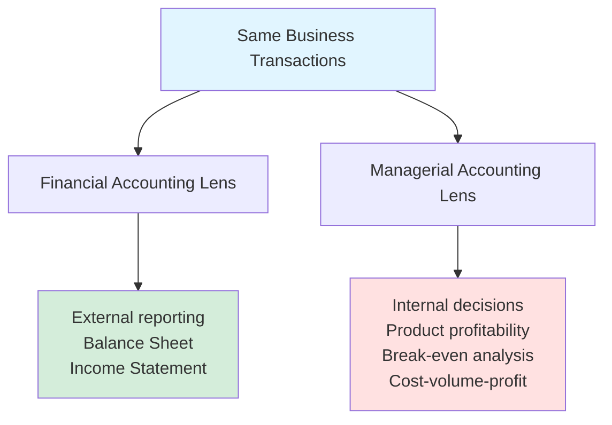

# Cost Accounting & Managerial Accounting - Introduction

## 🎯 The Big Picture: Two Types of Accounting

### Financial Accounting vs. Managerial Accounting



---

## 🔍 Key Differences

| Aspect | Financial Accounting | Managerial Accounting |
|--------|---------------------|----------------------|
| **Primary Users** | External (investors, creditors, tax) | Internal (management) |
| **Purpose** | Report past performance | Guide future decisions |
| **Time Focus** | Historical | Forward-looking |
| **Regulations** | Must follow IFRS/GAAP | No required standards |
| **Frequency** | Quarterly, Annual | As needed (daily, weekly) |
| **Scope** | Company as a whole | Segments, products, departments |
| **Detail Level** | Aggregated | Very detailed |
| **Precision** | Must be accurate | Can use estimates |

---

## 💡 Why Managerial Accounting Exists

### The Management Questions Financial Accounting Can't Answer

**Scenario: Sarah's TechStart has grown!**

She now offers THREE subscription tiers:
- **Basic**: €30/month
- **Pro**: €50/month  
- **Enterprise**: €100/month

**Her Income Statement shows:**
```
Total Revenue:     €35,000
Total Expenses:    €20,000
Net Profit:        €15,000
```

**But Sarah needs to know:**
1. Which product tier is MOST profitable?
2. Should she discontinue Basic tier?
3. What's the minimum revenue needed to not lose money?
4. Should she lower prices to gain market share?
5. Hire another developer (€5K/month) or outsource (€80/hour)?

**Can the Income Statement answer these?** ❌ NO!

**This is where Cost Accounting comes in!** ✅

---

## 📊 The Core Purpose of Cost Accounting



---

## 🎯 Key Concepts We'll Master

### 1. Cost Behavior

**How do costs change with activity level?**

- **Fixed Costs**: Stay the same regardless of volume
- **Variable Costs**: Change proportionally with volume
- **Mixed Costs**: Have both fixed and variable components

### 2. Cost Classification

**Where do costs belong?**

- **Direct Costs**: Directly traceable to a product
- **Indirect Costs**: Shared across products (overhead)

### 3. Cost-Volume-Profit (CVP) Analysis

**The relationship between:**
- Costs (fixed & variable)
- Volume (units sold)
- Profit

**Key tool:** Break-even analysis

### 4. Cost Allocation

**How to assign shared costs?**

- Allocation bases (drivers)
- Cost centers vs Profit centers
- Activity-Based Costing (ABC)

### 5. Decision-Making Tools

**Using cost information for:**
- Make-or-buy decisions
- Product pricing
- Dropping a product line
- Special orders
- Resource constraints

---

## 🔄 The Managerial Accounting Process



---

## 📈 Real-World Application: Sarah's TechStart

### Current Situation (Month 12):

**Total Company Level** (Financial Accounting view):
```
Revenue:        €35,000
Expenses:       €20,000
Profit:         €15,000
ROE:            Strong!
```

Looks great! But...

### **Product-Level View** (Managerial Accounting view):

| Tier | Customers | Revenue | Variable Cost | Contribution | Fixed Cost Allocated | Profit |
|------|-----------|---------|---------------|--------------|---------------------|--------|
| **Basic** | 300 | €9,000 | €12,000 | **(€3,000)** | €5,000 | **(€8,000)** ❌ |
| **Pro** | 200 | €10,000 | €4,000 | €6,000 | €5,000 | €1,000 |
| **Enterprise** | 220 | €16,000 | €6,000 | €10,000 | €5,000 | €5,000 ✅ |

**Discovery:** Basic tier is LOSING money!

**Questions this raises:**
1. Why is Basic tier losing money?
2. Should Sarah discontinue it?
3. What if Basic customers upgrade to Pro?
4. What if Basic tier is a "gateway" to Enterprise?

**Cost accounting helps answer these!**

---

## 🎓 Learning Approach

### We'll Use Discovery-Based Learning:

**Step 1**: Start with a business problem
**Step 2**: You try to solve it with what you know
**Step 3**: Discover gaps in your knowledge
**Step 4**: Learn the tool/concept that fills the gap
**Step 5**: Apply it to solve the problem
**Step 6**: Reflect and generalize

**Example Flow:**
```
Problem → Attempt → "I need to know X" → Learn X → Solve → Understand
```

---

## 🗺️ Our Journey Through Cost Accounting

### Module 1: Cost Behavior & Classification
- Fixed vs Variable costs
- Direct vs Indirect costs
- Cost drivers
- **Application**: Analyzing Sarah's cost structure

### Module 2: Break-Even Analysis (CVP)
- Contribution margin
- Break-even point
- Target profit analysis
- **Application**: How many customers does Sarah need?

### Module 3: Cost Allocation
- Allocation bases
- Traditional allocation
- Activity-Based Costing (ABC)
- **Application**: Properly allocating Sarah's overhead

### Module 4: Decision-Making
- Relevant costs vs sunk costs
- Make-or-buy decisions
- Product mix decisions
- Pricing strategies
- **Application**: Should Sarah hire or outsource?

### Module 5: Performance Evaluation
- Profit centers vs Cost centers
- Variance analysis
- ROI and Residual Income
- **Application**: Evaluating Sarah's business units

---

## 🔗 Connection to What You Already Know

### Building on Financial Accounting:

**You know:**
- Assets, Liabilities, Equity
- Revenue, Expenses, Profit
- Balance Sheet, Income Statement

**Now you'll learn:**
- How to CLASSIFY those expenses (fixed/variable, direct/indirect)
- How to ALLOCATE costs to products
- How to USE cost information for DECISIONS

**Same data, different lens!**



---

## 🚀 Ready to Start?

We'll begin with **Module 1: Cost Behavior & Classification**

But first, a warm-up question to get you thinking:

**Think about Sarah's TechStart business. List 5 costs she incurs and try to answer:**

1. Does this cost change if she gets more customers? (Variable or Fixed?)
2. Can she trace this cost to a specific customer? (Direct or Indirect?)

**Example to get you started:**
- **Server hosting**: Probably increases with customers (Variable?)
- **Sarah's salary**: Same whether 100 or 1000 customers (Fixed?)

**Try to list 5 more costs and classify them!**

We'll use your thinking to discover the nuances and exceptions...

---

*Part of: [[00-Index|Accounting & Value-Based Management Course Notes]]*
*Next: Module 1 - Cost Behavior & Classification*
