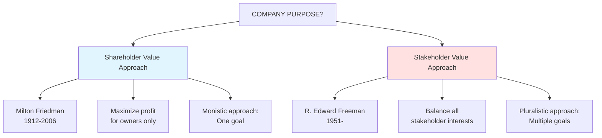
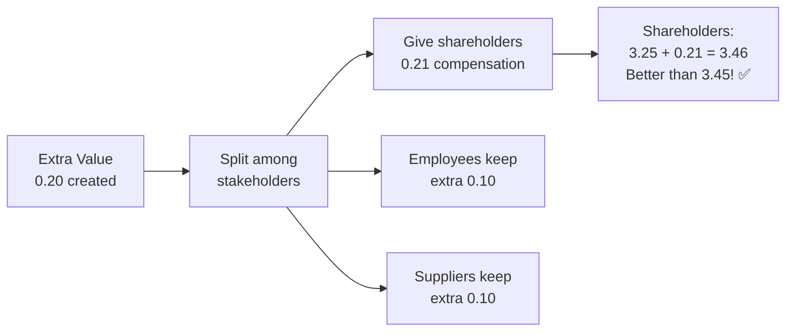
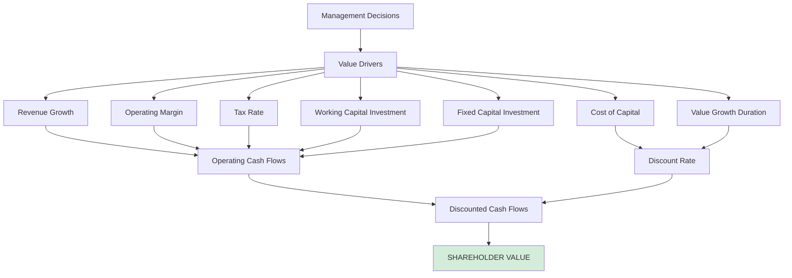

# Value-Based Management: Shareholder vs Stakeholder Approaches

## 🎯 The Fundamental Debate in Corporate Governance

**The Central Question**: What is the purpose of a company?



---

## 📚 The Two Schools of Thought

### **1. Shareholder Value Approach** (Friedman)

**Core Philosophy:**

> "The business of business is business" - Milton Friedman (1962)

> "The manager's responsibility is to conduct the business in accordance with the owners' desires, which will generally be to make as much money as possible while conforming to the basic rules of society." - Friedman (1970)

**Key Principles:**
- ✅ Company exists to **maximize profit** for shareholders
- ✅ Management works as **agents** for the owners (shareholders)
- ✅ **One clear goal** = easier to implement and measure
- ✅ Market competition forces companies to serve society
- ✅ Profit maximization → jobs, taxes, economic growth (indirect social benefit)

**Arguments FOR:**
1. **Clear objective**: Easy to measure and optimize
2. **Alignment**: Shareholders own the company, deserve priority
3. **Efficiency**: Market forces ensure societal benefit
4. **Accountability**: Simple performance metric (profit/returns)

**Arguments AGAINST:**
1. **Short-termism**: May sacrifice long-term value for immediate profit
2. **Externalities**: Ignores costs imposed on others (pollution, etc.)
3. **Narrow focus**: Other stakeholders also contribute to success
4. **Social responsibility**: Companies impact society beyond profits

---

### **2. Stakeholder Value Approach** (Freeman)

**Core Philosophy:**

> "Stakeholder theory addresses morals and values in managing an organization. It identifies the stakeholders of a company and models their interrelations. The key idea is 'who or what really counts' for the firm's future development." - Freeman (1984)

**Key Principles:**
- ✅ Company must balance **ALL stakeholder** interests
- ✅ Stakeholders: shareholders, employees, customers, suppliers, community, etc.
- ✅ **Long-term sustainability** requires satisfying multiple groups
- ✅ Ethical responsibility beyond profit

**Arguments FOR:**
1. **Sustainability**: Balancing interests ensures long-term survival
2. **Legitimacy**: Recognizes all contributors to company success
3. **Risk management**: Diversifies dependencies
4. **Social license**: Maintains public trust and support

**Arguments AGAINST:**
1. **Complexity**: Difficult to balance conflicting interests
2. **Accountability**: No single clear performance metric
3. **Inefficiency**: May sacrifice profitability
4. **Implementation**: Hard to operationalize in practice

---

## 🧮 Mathematical Framework for Value Optimization

### The Decision Variable: Management Policy (α)

**α** represents management's strategic choices/policies
- α can range from 0% to 100%
- Different policies benefit different stakeholders differently

**Example contexts:**
- α = % of profits retained (vs. distributed as dividends)
- α = % investment in employee training
- α = % focus on environmental initiatives
- α = pricing strategy (high margin vs. market share)

---

### Utility Functions

Each stakeholder group has a **utility function** that depends on α:

**General Form:**
```
U_stakeholder(α) = function that gives utility (satisfaction) for policy α
```

**Example from Exercise 05.01:**

**Shareholders:**
```
U_shareholders(α) = -5α² + 3α + 3
```

**Suppliers:**
```
U_suppliers(α) = α + 1
```

**Employees:**
```
U_employees(α) = α + 2
```

**Interpretation:**
- Higher α makes suppliers and employees happier (linear increase)
- Shareholders have a **non-linear** relationship (quadratic)
- At some point, increasing α hurts shareholders (negative coefficient on α²)

---

## 📊 Shareholder Value Maximization

### Objective
**Maximize only shareholders' utility**

```
Maximize: U_shareholders(α)

Subject to: 0 ≤ α ≤ 100%
```

### Solution Method

**Step 1**: Take derivative of shareholder utility function
**Step 2**: Set derivative = 0 to find maximum
**Step 3**: Check it's actually a maximum (not minimum)
**Step 4**: Calculate resulting utilities for all stakeholders

**Example Calculation:**

Given: `U_shareholders(α) = -5α² + 3α + 3`

```
dU/dα = -10α + 3 = 0

α* = 3/10 = 0.3 = 30%
```

**Verify it's a maximum:**
```
d²U/dα² = -10 < 0  ✅ (negative = maximum)
```

**Calculate utilities at α* = 0.3:**

| Stakeholder | Utility Function | Utility at α=0.3 |
|-------------|------------------|------------------|
| Shareholders | -5(0.3)² + 3(0.3) + 3 | = -0.45 + 0.9 + 3 = **3.45** |
| Suppliers | 0.3 + 1 | = **1.30** |
| Employees | 0.3 + 2 | = **2.30** |

**Total Utility**: 3.45 + 1.30 + 2.30 = **7.05**

---

## 📊 Stakeholder Value Maximization

### Objective
**Maximize TOTAL utility of ALL stakeholders**

```
Maximize: U_total(α) = U_shareholders(α) + U_suppliers(α) + U_employees(α)

Subject to: 0 ≤ α ≤ 100%
```

### Solution Method

**Step 1**: Sum all utility functions
**Step 2**: Take derivative of total
**Step 3**: Set derivative = 0
**Step 4**: Calculate individual and total utilities

**Example Calculation:**

```
U_total(α) = (-5α² + 3α + 3) + (α + 1) + (α + 2)
           = -5α² + 3α + α + α + 3 + 1 + 2
           = -5α² + 5α + 6

dU_total/dα = -10α + 5 = 0

α* = 5/10 = 0.5 = 50%
```

**Calculate utilities at α* = 0.5:**

| Stakeholder | Utility at α=0.5 |
|-------------|------------------|
| Shareholders | -5(0.5)² + 3(0.5) + 3 = -1.25 + 1.5 + 3 = **3.25** |
| Suppliers | 0.5 + 1 = **1.50** |
| Employees | 0.5 + 2 = **2.50** |

**Total Utility**: 3.25 + 1.50 + 2.50 = **7.25**

---

## 📈 Comparing the Two Approaches

### Results Summary

|  | **Shareholder Max** | **Stakeholder Max** |
|---|---------------------|---------------------|
| **Optimal α** | 30% | 50% |
| **Shareholders** | 3.45 ✅ higher | 3.25 |
| **Suppliers** | 1.30 | 1.50 ✅ higher |
| **Employees** | 2.30 | 2.50 ✅ higher |
| **TOTAL** | 7.05 | 7.25 ✅ higher |

### Key Insights

**1. Stakeholder approach creates MORE total value** (7.25 vs 7.05)

**2. Trade-off for shareholders:**
- Lose: 3.45 - 3.25 = **0.20 utility**

**3. But other stakeholders gain MORE:**
- Suppliers gain: 1.50 - 1.30 = **0.20**
- Employees gain: 2.50 - 2.30 = **0.20**
- Total gain: **0.40 > 0.20 loss**

**4. Win-win is possible through side payments!**

---

## 💰 The Side Payment Mechanism

### How Everyone Can Benefit

**Question from Exercise 05.01:**
> "Total utility under shareholder approach is 6.84 while stakeholder approach is 7.00. How can all stakeholders benefit from stakeholder value maximization?"

**Answer: SIDE PAYMENTS (transfers)**

**Stakeholder approach creates:** 7.25 - 7.05 = **0.20 extra value**

**Distribution strategy:**



**Example Distribution:**

| Stakeholder | Stakeholder Approach | Side Payment | Final Utility | vs Shareholder Approach |
|-------------|---------------------|--------------|---------------|------------------------|
| Shareholders | 3.25 | +0.21 | **3.46** | ✅ Better (was 3.45) |
| Suppliers | 1.50 | -0.10 | **1.40** | ✅ Better (was 1.30) |
| Employees | 2.50 | -0.10 | **2.40** | ✅ Better (was 2.30) |
| **TOTAL** | 7.25 | 0 | **7.26** | ✅ **Pareto improvement!** |

**This is called a PARETO IMPROVEMENT**: Everyone is better off!

---

## 🎯 Practical Implementation Challenge

### Why Stakeholder Approach is Harder

**Friedman's critique of stakeholder approach:**

**Problems:**
1. **Who decides weights?** How much priority for each stakeholder?
2. **Conflicting preferences**: What if stakeholders want opposite things?
3. **Measurement**: How to quantify utility for non-financial stakeholders?
4. **Accountability**: Who is management accountable to?

**Example conflict:**
- Shareholders want: Higher prices, lower wages → more profit
- Customers want: Lower prices
- Employees want: Higher wages

**How does management balance these?**

---

### Rappaport's Shareholder Value Framework

**Alfred Rappaport (1999)** formalized shareholder value measurement:



**Formula:**

```
Shareholder Value = Σ (Operating Cash Flow_t / (1 + WACC)^t)

Where:
- OCF = EBIT(1-Tax) - Δ Working Capital - Capital Expenditures
- WACC = Weighted Average Cost of Capital (discount rate)
- t = time period
```

This makes shareholder value **measurable** and **actionable**!

---

## 🔑 Key Takeaways

### Theoretical Comparison

| Aspect | Shareholder Value | Stakeholder Value |
|--------|-------------------|-------------------|
| **Philosophy** | Friedman (1970) | Freeman (1984) |
| **Goal** | Maximize shareholder returns | Balance all stakeholder interests |
| **Complexity** | Simple (one objective) | Complex (multiple objectives) |
| **Measurement** | Easy (profit, stock price) | Difficult (multiple utilities) |
| **Accountability** | Clear (to owners) | Ambiguous (to whom?) |
| **Time horizon** | Can be short-term | Usually long-term |
| **Total value** | May be suboptimal | Can create more total value |
| **Practical use** | Dominant in practice | Growing adoption (ESG) |

### Mathematical Results

**From our example:**
- Shareholder max: α* = 30%, Total value = 7.05
- Stakeholder max: α* = 50%, Total value = 7.25
- **Stakeholder approach can create more value**
- **Side payments make everyone better off**

### Modern Trend

**Movement toward stakeholder capitalism:**
- ESG (Environmental, Social, Governance) investing
- B-Corporations (benefit corporations)
- Stakeholder statements from major companies
- But implementation challenges remain

**The debate continues!** Both approaches have merit, and real-world companies often blend elements of both.

---

## 🔗 Related Notes
- [[12-Stakeholders-and-Information-Needs|Stakeholders and Information Needs]]
- [[10-Equity-vs-Debt-Financing|Equity vs Debt Financing]]
- [[14-Accounting-Ethics-and-Fraud|Accounting Ethics]]

---

## 📝 Practice Problems

**Problem 1**: Given utility functions:
- Shareholders: U = -3α² + 4α + 5
- Employees: U = 2α + 1

Find optimal α under:
a) Shareholder value maximization
b) Stakeholder value maximization

**Problem 2**: If shareholder max gives total utility 8.5 and stakeholder max gives 9.0, design a side payment scheme where everyone benefits.

---

*Part of: [[00-Index|Accounting & Value-Based Management Course Notes]]*
*Next: Principal-Agent Theory*
