# Value-Based Management: Exercise Knowledge Guide

## 🎯 Purpose of This Note

This note contains ONLY the essential knowledge needed to answer Exercises 05.01-05.08. Every concept here maps directly to exam questions.

**Coverage:**
- ✅ Shareholder vs Stakeholder value optimization (Ex 05.01)
- ✅ Company definition (Ex 05.02)
- ✅ Stakeholder definition (Ex 05.03)
- ✅ Friedman's shareholder approach (Ex 05.04)
- ✅ Principal-Agent conflicts (Ex 05.05)
- ✅ Stakeholder interrelations (Ex 05.06)
- ✅ Stakeholder value implementation (Ex 05.07)
- ✅ German company forms (Ex 05.08)

---

## 📊 1. Utility Optimization Framework (Exercise 05.01)

### The Mathematical Setup

**Management Policy Variable: α**
- Represents strategic choices (range: 0% to 100%, or 0 to 1)
- Examples: % profits retained, % investment in employees, pricing strategy

**Each stakeholder has a utility function:**

```
U_stakeholder(α) = mathematical function showing satisfaction at policy α
```

### Shareholder Value Maximization

**Objective:** Maximize ONLY shareholder utility

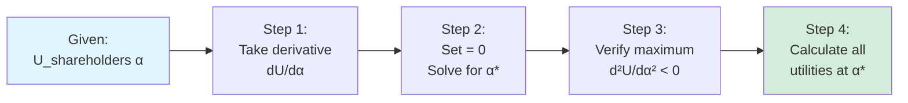

**Example Calculation:**

Given:
- Shareholders: U = -5α² + 3α + 3
- Suppliers: U = α + 1
- Employees: U = α + 2

**Solution:**

```
Maximize: U_shareholders = -5α² + 3α + 3

Step 1: dU/dα = -10α + 3

Step 2: -10α + 3 = 0
        α* = 0.3 (30%)

Step 3: d²U/dα² = -10 < 0 ✅ Maximum confirmed

Step 4: Calculate at α* = 0.3
```

| Stakeholder | Calculation | Result |
|-------------|-------------|--------|
| Shareholders | -5(0.3)² + 3(0.3) + 3 = -0.45 + 0.9 + 3 | **3.45** |
| Suppliers | 0.3 + 1 | **1.30** |
| Employees | 0.3 + 2 | **2.30** |
| **Total** | Sum | **7.05** |

---

### Stakeholder Value Maximization

**Objective:** Maximize TOTAL utility (sum of all stakeholders)

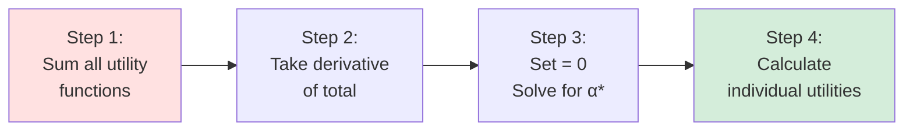

**Example Calculation:**

```
U_total = U_shareholders + U_suppliers + U_employees
        = (-5α² + 3α + 3) + (α + 1) + (α + 2)
        = -5α² + 5α + 6

dU_total/dα = -10α + 5 = 0
α* = 0.5 (50%)
```

| Stakeholder | Calculation | Result |
|-------------|-------------|--------|
| Shareholders | -5(0.5)² + 3(0.5) + 3 = -1.25 + 1.5 + 3 | **3.25** |
| Suppliers | 0.5 + 1 | **1.50** |
| Employees | 0.5 + 2 | **2.50** |
| **Total** | Sum | **7.25** |

---

### Key Comparison

```mermaid
graph TB
    A[Two Approaches Compared]
    
    A --> B[Shareholder Max]
    A --> C[Stakeholder Max]
    
    B --> B1[α* = 30%]
    B --> B2[Shareholders: 3.45]
    B --> B3[Total: 7.05]
    
    C --> C1[α* = 50%]
    C --> C2[Shareholders: 3.25]
    C --> C3[Total: 7.25]
    
    B3 -.Lower total.-> C3
    C3 -.Creates 0.20<br/>extra value!.-> D[Enables Pareto<br/>Improvement]
    
    style B fill:#e1f5ff
    style C fill:#ffe1e1
    style D fill:#d4edda
```

**Critical Insights:**

| Metric | Shareholder Approach | Stakeholder Approach | Difference |
|--------|---------------------|----------------------|------------|
| **Optimal α** | 30% | 50% | +20 pp |
| **Shareholders** | 3.45 ✅ Higher | 3.25 | -0.20 |
| **Suppliers** | 1.30 | 1.50 ✅ Higher | +0.20 |
| **Employees** | 2.30 | 2.50 ✅ Higher | +0.20 |
| **TOTAL** | 7.05 | 7.25 ✅ Higher | +0.20 |

---

### Pareto Improvement Through Side Payments

**Question:** How can ALL stakeholders be better off under stakeholder approach?

**Answer:** Use the extra value created (0.20) to compensate shareholders!

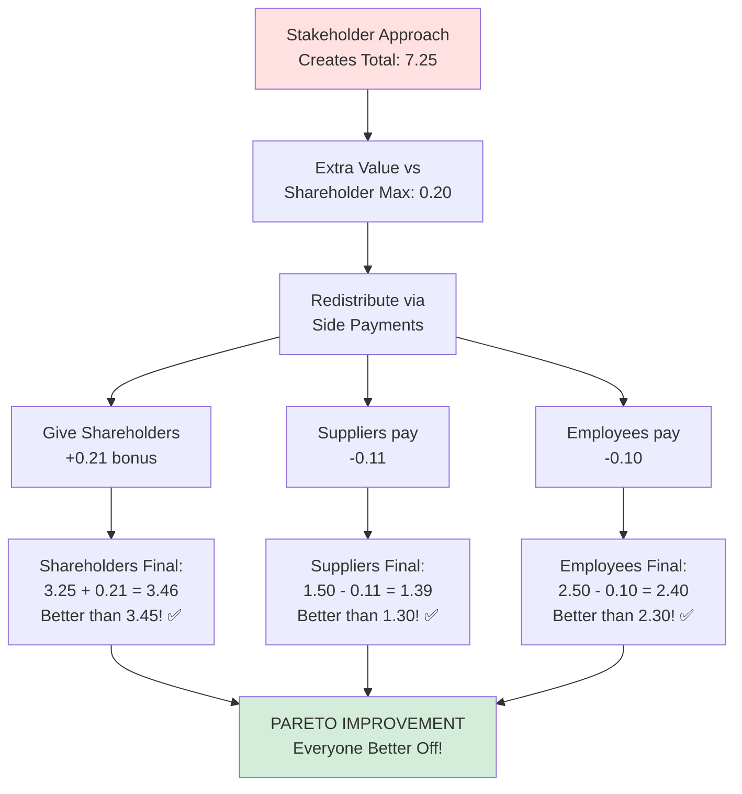

**Verification:**

| Stakeholder | Stakeholder + Payment | Shareholder Approach | Better? |
|-------------|----------------------|---------------------|---------|
| Shareholders | 3.25 + 0.21 = **3.46** | 3.45 | ✅ Yes (+0.01) |
| Suppliers | 1.50 - 0.11 = **1.39** | 1.30 | ✅ Yes (+0.09) |
| Employees | 2.50 - 0.10 = **2.40** | 2.30 | ✅ Yes (+0.10) |

**Payments sum to zero:** 0.21 - 0.11 - 0.10 = 0 ✅

---

## 🏢 2. Company Definition (Exercise 05.02)

### What IS a Company?

**Correct Definition:**
> A company is an organization which is **economically acting** and has a **separate legal identity**.

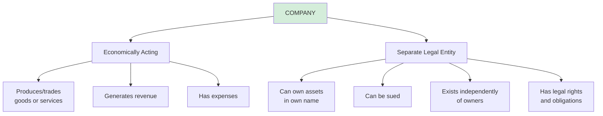

### Examples

| Entity | Economically Acting? | Separate Legal Entity? | Is Company? |
|--------|---------------------|----------------------|-------------|
| **GmbH** | ✅ Yes | ✅ Yes | ✅ **YES** |
| **AG** | ✅ Yes | ✅ Yes | ✅ **YES** |
| **Sole Proprietorship** | ✅ Yes | ❌ No (owner = business) | ❌ NO |
| **OHG** | ✅ Yes | ⚠️ Partial (can own, but partners liable) | ⚠️ Hybrid |
| **Child's Lemonade Stand** | ✅ Yes | ❌ No | ❌ NO |
| **Non-profit Foundation** | ✅ Yes (provides services) | ✅ Yes | ✅ **YES** |

### Common Wrong Answers

❌ **"Company = profit maximization"**
- Wrong! Non-profits are companies too
- Profit is common goal, not defining feature

❌ **"Government-owned companies exempt from accounting"**
- Wrong! Deutsche Bahn (government-owned) still must report
- All companies must follow accounting standards

❌ **"Company = conducts business"**
- Incomplete! Also needs legal entity status
- Otherwise every street vendor would be a company

---

## 👥 3. Stakeholder Definition (Exercise 05.03)

### Freeman's Definition (CORRECT)

> **"Stakeholders are individuals or groups that affect or are affected by the company"**
> 
> — R. Edward Freeman (1984)

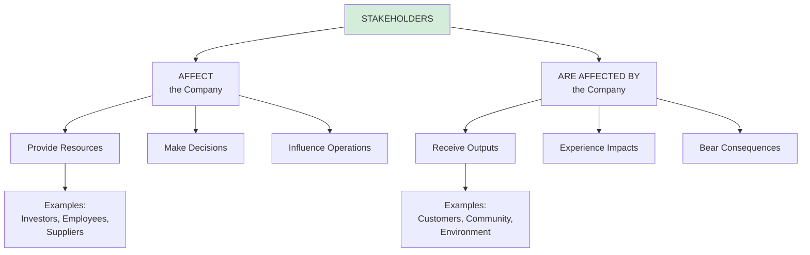

### Key Characteristics

**Stakeholders include:**

✅ **INTERNAL** stakeholders (employees, management)
✅ **EXTERNAL** stakeholders (customers, suppliers, community)
✅ Those **WITH** formal contracts (employees, suppliers)
✅ Those **WITHOUT** contracts (community, environment)
✅ Those **WITHOUT** institutional representation (future generations)

### Stakeholder Categories

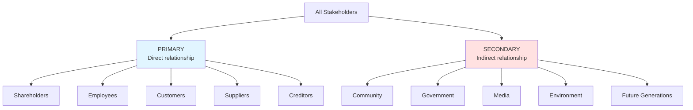

### Common WRONG Definitions

❌ **"Stakeholders are only EXTERNAL parties"**
- Wrong! Employees and management are internal stakeholders

❌ **"Stakeholders need institutional representation"**
- Wrong! Community has no board seat but still stakeholder

❌ **"Stakeholders need formal contracts"**
- Wrong! Environment has no contract but affected by pollution

❌ **"Stakeholder set is clearly defined by government"**
- Wrong! No official list exists; it's contested and context-dependent

---

## 💼 4. Friedman's Shareholder Approach (Exercise 05.04)

### The Core Philosophy

**Famous Quote:**
> **"The business of business is business"**
> 
> — Milton Friedman (1962)

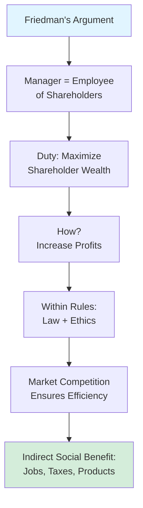

### Key Arguments

**FOR Shareholder Value:**

1. **Clear Objective**
   - Easy to measure (profit, stock price)
   - Unambiguous goal for management

2. **Property Rights**
   - Shareholders own the company
   - Management works for owners

3. **Efficiency**
   - Market forces ensure societal benefit
   - Competition drives value creation

4. **Accountability**
   - Single metric = clear performance evaluation

**AGAINST Shareholder Value:**

1. **Short-termism**
   - May sacrifice long-term for immediate profit

2. **Externalities**
   - Ignores costs imposed on others (pollution)

3. **Narrow Focus**
   - Other stakeholders also contribute

---

### Critical Insight: Total Value Comparison

**Question from Exercise 05.04:**
> "Utility of firm is ALWAYS lower under stakeholder maximization"

**This is FALSE! ❌**

**Proof from our calculation:**

```
Shareholder Maximization:
- Optimal for: Shareholders only
- Total utility: 7.05

Stakeholder Maximization:
- Optimal for: All stakeholders
- Total utility: 7.25 > 7.05 ✅

Stakeholder approach creates MORE total value!
```

**Why?**
- Optimizing the SUM must give ≥ optimizing one component
- Mathematical impossibility for sum to be lower

---

## 🤝 5. Principal-Agent Theory (Exercise 05.05)

### The Basic Problem

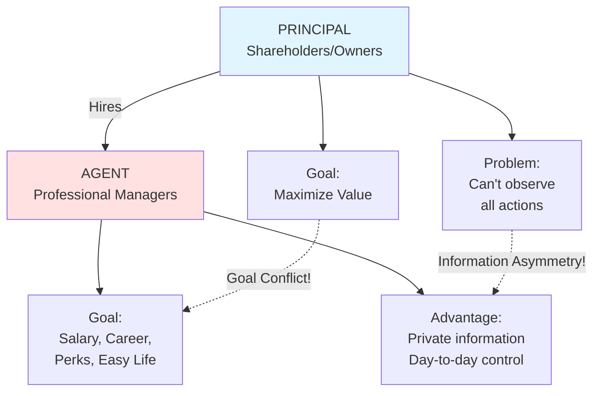

### Key Concepts

**1. Information Asymmetry**
- Agent knows more than principal
- Principal can't monitor all actions
- Creates opportunity for shirking

**2. Goal Misalignment**
- Principal wants: Profit maximization
- Agent wants: Personal benefits
- Divergent interests

**3. Moral Hazard**
- Agent may act in self-interest
- Principal bears consequences

### When Principal-Agent Conflicts MOST Severe

**✅ CORPORATIONS (AG, GmbH) - HIGH conflict**

**Why?**
```
Separation of Ownership and Control:

Shareholders (Principals) → Do NOT manage
    ↓
Hire professional managers (Agents)
    ↓
Managers make day-to-day decisions
    ↓
Shareholders can't observe everything
    ↓
CONFLICT opportunity is HIGH!
```

**❌ PARTNERSHIPS (OHG) - LOW conflict**

**Why?**
```
Owner-Managers:

Partners (Principals) = Partners (Agents)
    ↓
Same people own AND manage
    ↓
Perfect alignment!
    ↓
CONFLICT is MINIMAL!
```

### Examples of Agency Problems

| Manager Behavior | Good for Agent? | Good for Principal? |
|------------------|-----------------|---------------------|
| **Empire Building** (expand for prestige) | ✅ Yes (bigger role) | ❌ No (destroys value) |
| **Excessive Risk Aversion** (avoid risky projects) | ✅ Yes (job security) | ❌ No (miss opportunities) |
| **Short-termism** (boost quarterly results) | ✅ Yes (bonus) | ❌ No (hurts long-term) |
| **Perks** (private jet, luxury office) | ✅ Yes (comfort) | ❌ No (wasted money) |
| **Entrenchment** (make self hard to replace) | ✅ Yes (job security) | ❌ No (limits flexibility) |

### Solutions to Agency Problems

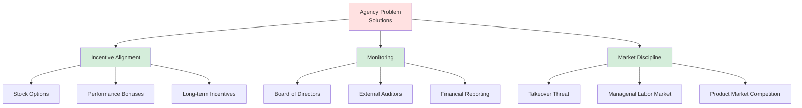

---

## 💰 6. Stakeholder Interrelations (Exercise 05.06)

### The Exchange Framework

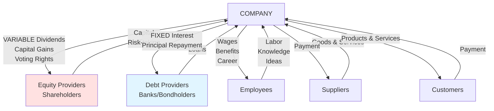

### Critical Distinction: Equity vs Debt

**This is the KEY to Exercise 05.06!**

| Feature | EQUITY Providers | DEBT Providers |
|---------|-----------------|----------------|
| **Returns** | **❌ VARIABLE** (dividends) | **✅ FIXED** (interest) |
| **Guaranteed?** | ❌ NO | ✅ YES (contractual) |
| **Amount** | Depends on profit + board decision | Fixed by contract |
| **Payment Priority** | LAST (residual) | FIRST (senior claim) |
| **Risk** | HIGH (can lose all) | LOWER (secured) |
| **Control** | ✅ Voting rights | ❌ No voting |
| **Upside** | UNLIMITED | LIMITED (just interest) |

### Examples

**Good Year (Company earns €1M profit):**
```
Bondholders: Still get €50K interest (fixed) ✅
Shareholders: Get €950K dividends (after interest) 🚀

Shareholders benefit MORE from good performance!
```

**Bad Year (Company earns €30K profit):**
```
Bondholders: Still get €50K interest ✅ (may use reserves)
Shareholders: Get €0 dividends ❌

Company must pay debt first, even if unprofitable!
```

**Terrible Year (Company bankrupt):**
```
Bondholders: Get paid from asset liquidation (first in line)
              May recover 70% of loan ⚠️

Shareholders: Get NOTHING (last in line)
              Lose 100% of investment 💀

This is why equity is riskier!
```

### Why Equity Returns Are Variable

**Dividends are:**
- ❌ NOT guaranteed
- ❌ NOT contractual
- ✅ Discretionary (board decides)
- ✅ Depend on profitability
- ✅ Can be €0 for years

**Real Examples:**
- **Tesla**: No dividends for 15+ years (reinvested in growth)
- **Apple**: Pays dividends, but amount varies
- **Amazon**: Minimal dividends historically
- But all still have shareholders! (who seek capital gains)

---

## 🔧 7. Practical Stakeholder Value Implementation (Exercise 05.07)

### The Challenge

**Theoretical Problem:**
- We don't know actual utility functions!
- Exercise 05.01 GAVE us U = -5α² + 3α + 3
- Real life: How do we know employee utility function?

**Practical Solution:**
Companies use **adjusted parameters** instead of formal optimization

### Adjustment Approaches

**1. Adjust Cash Flows**

```
Traditional DCF:
Free Cash Flow = Operating CF - CapEx

Stakeholder-Adjusted:
Free Cash Flow = Operating CF 
                - CapEx
                - Employee Development Costs ⬅️ NEW
                - Environmental Investments ⬅️ NEW
                - Community Contributions ⬅️ NEW
```

**Example:**
```
Project A: €10M investment, €2M/year for 10 years
Traditional NPV: Positive (accept!)

But includes:
- €500K/year environmental cleanup cost
- €200K/year community impact mitigation

Adjusted NPV: May be negative (reject!)
```

**2. Adjust Discount Rates**

```
Traditional WACC: 8% for all projects

Risk-Adjusted:
- Sustainable project (good stakeholder relations): 7% ✅ Lower risk
- Environmentally risky project: 10% ⚠️ Higher risk
- Projects with labor disputes: 12% ❌ Much higher risk
```

**Why different rates?**
- Good stakeholder relations → Lower business risk
- Poor stakeholder relations → Higher risk (strikes, boycotts, regulation)

### Modern Implementation: ESG

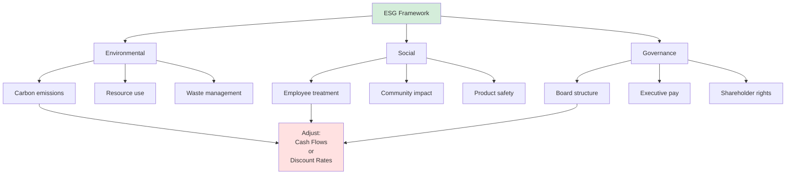

### Why This Approach?

**Advantages:**
✅ Works with existing financial tools (DCF, NPV)
✅ Doesn't require knowing exact utility functions
✅ Quantifiable (can compare projects)
✅ Implementable by CFOs

**Limitations:**
⚠️ Still subjective (which adjustments? how much?)
⚠️ Risk of "greenwashing" (cosmetic changes)
⚠️ Hard to measure some impacts (community well-being?)

### Key Insight for Exercise 05.07

**Statement A is CORRECT:**
> "In practice, full stakeholder value maximization is often complicated (unknown preferences). Therefore, companies adjust parameters (cashflows and discount rates)"

This is how real companies operationalize stakeholder theory!

---

## 🏛️ 8. German Company Forms (Exercise 05.08)

### Overview

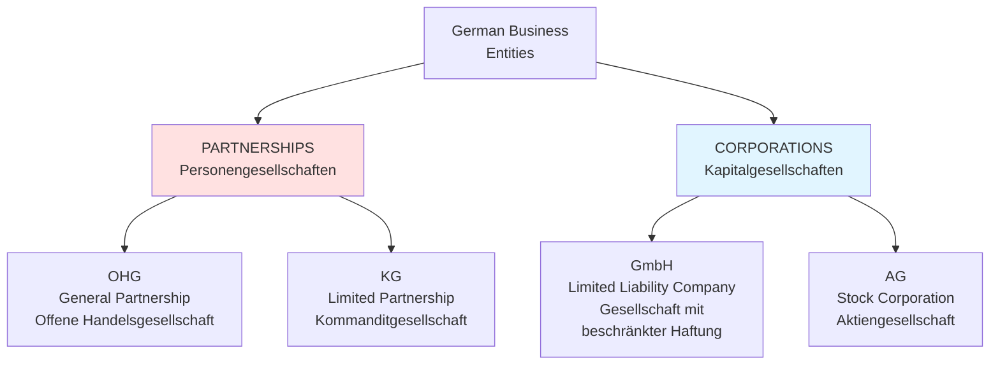

### Complete Comparison Table

| Feature | **OHG** | **KG** | **GmbH** | **AG** |
|---------|---------|--------|----------|--------|
| **Full Name** | Offene Handelsgesellschaft | Kommanditgesellschaft | Gesellschaft mit beschränkter Haftung | Aktiengesellschaft |
| **English** | General Partnership | Limited Partnership | Limited Liability Company | Stock Corporation |
| **Legal Entity?** | ❌ No (not separate) | ❌ No | ✅ YES | ✅ YES |
| **Min. Capital** | €0 | €0 | **€25,000** | **€50,000** |
| **Liability** | ALL partners: UNLIMITED | GP: Unlimited<br/>LP: Limited | ✅ Limited to investment | ✅ Limited to investment |
| **Who Manages?** | All partners (unless agreed otherwise) | ONLY GP<br/>❌ LP CANNOT | Geschäftsführer | Vorstand (Board) |
| **Min. Partners** | 2 | 2 (1 GP + 1 LP) | 1 | 1 |
| **Max. Partners** | ∞ Unlimited | ∞ Unlimited | ∞ Unlimited | ∞ Unlimited |
| **Shares Tradable?** | ❌ No | ❌ No | ⚠️ Restricted | ✅ YES (if listed) |
| **Best For** | Small partnerships | Family businesses | SMEs | Large corps |

### The Liability-Management Rule (CRITICAL!)

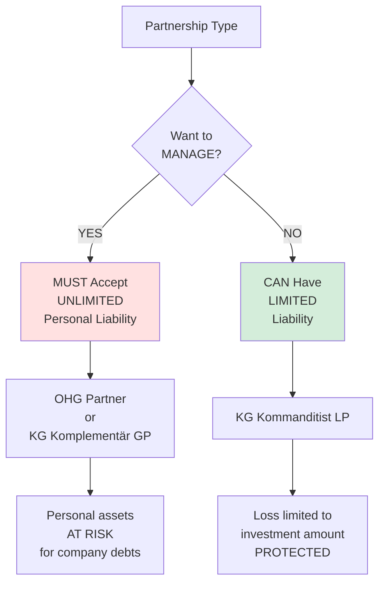

**The Fundamental Rule:**
```
Management Power ⟺ Personal Liability

Manage → Unlimited Liability
Limited Liability → Cannot Manage
```

### Detailed: OHG (General Partnership)

**Characteristics:**
- ALL partners: Unlimited personal liability
- ALL partners: Can manage (default)
- Joint and several liability (creditors can pursue any partner for full debt)

**Example Structure:**
```
Schmidt & Müller OHG (Restaurant)

Partners:
- Schmidt: 50% ownership, manages kitchen, UNLIMITED liability
- Müller: 50% ownership, manages service, UNLIMITED liability

Debt: €100,000

If company can't pay:
→ Creditors can take Schmidt's house
→ OR take Müller's savings
→ OR split between them
→ Both personally liable!
```

**Why choose OHG?**
- ✅ No minimum capital required
- ✅ Simple to establish
- ✅ Partners fully committed (skin in the game)
- ❌ High personal risk

---

### Detailed: KG (Limited Partnership)

**Two Types of Partners:**

**1. Komplementär (General Partner - GP)**
- UNLIMITED personal liability
- MUST manage the business
- Usually 1 GP, sometimes more

**2. Kommanditist (Limited Partner - LP)**
- LIMITED liability (only lose investment)
- ❌ CANNOT manage
- Can be many LPs (investors)

**Example Structure:**
```
Family Business KG

Partners:
- Father: GP, €50K investment, UNLIMITED liability, MANAGES
- Son: LP, €30K investment, LIMITED to €30K, SILENT PARTNER
- Daughter: LP, €20K investment, LIMITED to €20K, SILENT PARTNER

Debt: €200,000 owed

If can't pay:
- Father: Personally liable for ALL €200K (can lose house!)
- Son: Only loses his €30K investment, no more
- Daughter: Only loses her €20K investment, no more
```

**CRITICAL ERROR in Exercise 05.08 Option B:**
> "OHG is a partnership where the partner with limited liability manages"

**This is WRONG because:**
- OHG has NO partners with limited liability!
- ALL OHG partners have UNLIMITED liability
- The statement describes KG, not OHG
- In KG, the GP (with UNLIMITED liability) manages, not LP

**Why LP cannot manage:**
```
If LP starts managing:
→ Automatically becomes GP (legally!)
→ Loses limited liability protection
→ Becomes personally liable

This protects creditors!
```

---

### Detailed: GmbH (Limited Liability Company)

**Key Features:**
- Minimum capital: **€25,000**
- Separate legal entity ✅
- Shareholders: Limited liability
- Managed by: Geschäftsführer (CEO/Managing Director)

**Capital Structure:**
```
Total: €25,000 minimum
Divided into: Geschäftsanteile (business shares)
Example: 
- 25 shares × €1,000 each = €25,000
- OR 100 shares × €250 each = €25,000

NOT freely tradable (need approval from other shareholders)
```

**Example:**
```
TechStart GmbH

Shareholders:
- Sarah: €20,000 (80%), Geschäftsführer
- Investor: €5,000 (20%)

Debt: €100,000

Liability:
- Sarah: Limited to €20,000 investment
- Investor: Limited to €5,000 investment
- Creditors CANNOT take personal assets!

The GmbH itself owes €100K, not the people.
```

**Why choose GmbH?**
- ✅ Limited liability protection
- ✅ Lower capital than AG (€25K vs €50K)
- ✅ Flexible structure
- ✅ Good for SMEs
- ⚠️ Requires minimum capital

---

### Detailed: AG (Stock Corporation)

**Key Features:**
- Minimum capital: **€50,000** (2× GmbH)
- Separate legal entity ✅
- Shares (Aktien) can be publicly traded
- Managed by: Vorstand (Board of Directors)
- Supervised by: Aufsichtsrat (Supervisory Board)

**Capital Structure:**
```
Minimum: €50,000
Divided into: Aktien (shares)
Each share minimum: €1 nominal value

Example:
- 50,000 shares × €1 each = €50,000
- OR 1,000 shares × €50 each = €50,000

If listed: Freely tradable on stock exchange
If not listed: May have restrictions
```

**Examples:**
- **Volkswagen AG**: Billions in capital, publicly traded
- **SAP AG**: Large software company, listed
- **BMW AG**: Automotive, international

**Why choose AG?**
- ✅ Can raise capital from public
- ✅ Shares tradable (liquidity)
- ✅ Prestige
- ❌ Higher minimum capital
- ❌ More regulation
- ❌ More expensive to maintain

---

### Capital Requirements Comparison

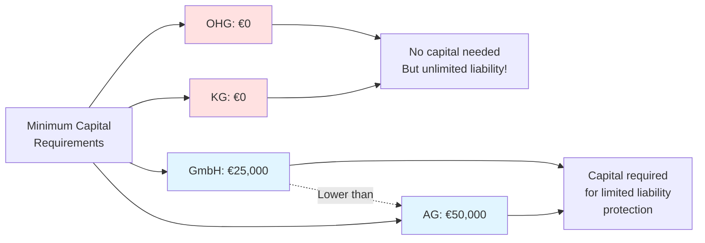

**For Exercise 05.08 Option C:**
> "AG minimum capital > GmbH minimum capital"

**✅ TRUE:**
- AG: €50,000
- GmbH: €25,000
- €50,000 > €25,000 ✅

---

### Number of Partners/Shareholders

**For Exercise 05.08 Option D:**

| Entity | Minimum | Maximum |
|--------|---------|---------|
| **OHG** | 2 partners | ∞ **Unlimited** ✅ |
| **KG** | 2 (1 GP + 1 LP) | ∞ **Unlimited** ✅ |
| **GmbH** | 1 shareholder | ∞ Unlimited |
| **AG** | 1 shareholder | ∞ Unlimited |

**Statement D is CORRECT:**
> "KG has unlimited partners, OHG also has unlimited partners"

Both allow unlimited number of partners! ✅

---

## 📝 Quick Reference: Exercise Answer Key

| Exercise | Answer | Key Concept | One-Line Reason |
|----------|--------|-------------|-----------------|
| **05.01a** | α*=0.3, Total=7.05 | Shareholder max | dU_shareholders/dα = 0 |
| **05.01b** | α*=0.5, Total=7.25 | Stakeholder max | dU_total/dα = 0 |
| **05.01c** | Side payments | Pareto improvement | Use extra 0.20 value to compensate all |
| **05.02** | **D** | Company definition | Economically acting + separate legal entity |
| **05.03** | **B** | Stakeholder definition | Includes internal + external, with/without contracts |
| **05.04** | **D** | Friedman philosophy | "Business of business is business" |
| **05.05** | **D** | Principal-agent | Corporations: separation of ownership/control |
| **05.06** | **A** | Equity vs debt | Equity = VARIABLE dividends (not fixed!) |
| **05.07** | **A** | Practical implementation | Adjust cashflows/discount rates |
| **05.08** | **B** | German companies | OHG has NO limited liability partners |

---

## 🎯 Exam Preparation Checklist

### Can you...?

**Mathematical Optimization:**
- [ ] Take derivative of utility function
- [ ] Solve for optimal α* (set derivative = 0)
- [ ] Calculate utilities for all stakeholders
- [ ] Compare shareholder vs stakeholder approaches
- [ ] Design side payment schemes

**Conceptual Understanding:**
- [ ] Explain Friedman's shareholder value approach
- [ ] Explain Freeman's stakeholder value approach
- [ ] Define what makes something a "company"
- [ ] Identify who is/isn't a stakeholder
- [ ] Describe principal-agent conflicts
- [ ] Distinguish equity vs debt compensation

**German Company Law:**
- [ ] Compare OHG, KG, GmbH, AG
- [ ] Know minimum capital requirements
- [ ] Understand liability structures
- [ ] Explain who can manage in each form
- [ ] Apply the liability-management rule

**Application:**
- [ ] Recognize when stakeholder approach creates more value
- [ ] Explain how side payments enable Pareto improvements
- [ ] Identify principal-agent problems in corporations
- [ ] Choose appropriate company form for scenarios

---

## 🔗 Related Notes

- [[16-Shareholder-vs-Stakeholder-Value|Detailed Value Approaches]]
- [[12-Stakeholders-and-Information-Needs|Stakeholder Information Needs]]
- [[10-Equity-vs-Debt-Financing|Equity vs Debt Comparison]]
- [[14-Accounting-Ethics-and-Fraud|Corporate Governance]]

---

## 📚 Key Formulas Reference

### Optimization

```
Shareholder Maximization:
1. Maximize U_shareholders(α)
2. dU/dα = 0
3. Solve for α*
4. Verify: d²U/dα² < 0

Stakeholder Maximization:
1. U_total = Σ U_stakeholder(α)
2. dU_total/dα = 0
3. Solve for α*
4. Calculate all individual utilities
```

### Comparison Metrics

```
Extra Value Created = Total_stakeholder - Total_shareholder

Pareto Improvement Possible if:
- Extra value > 0
- Can redistribute to make everyone better off
```

---

*Part of: [[00-Index|Accounting & Value-Based Management Course Notes]]*
*Created: January 2026*
*Status: Exam-Ready ✅*
