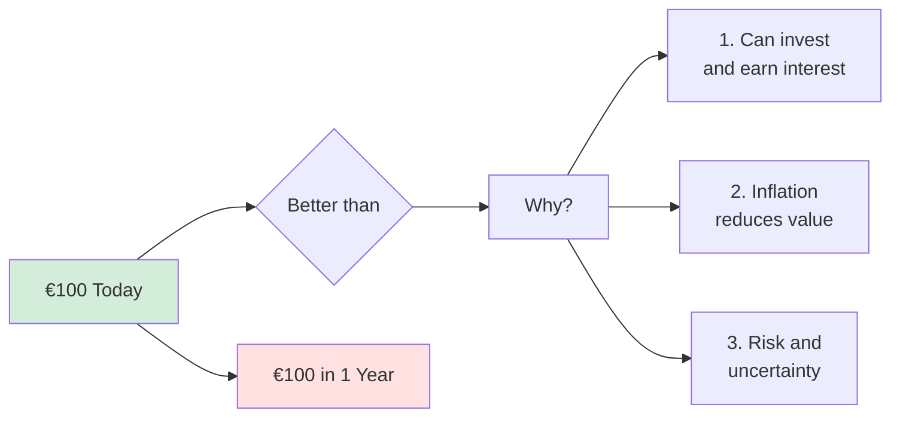
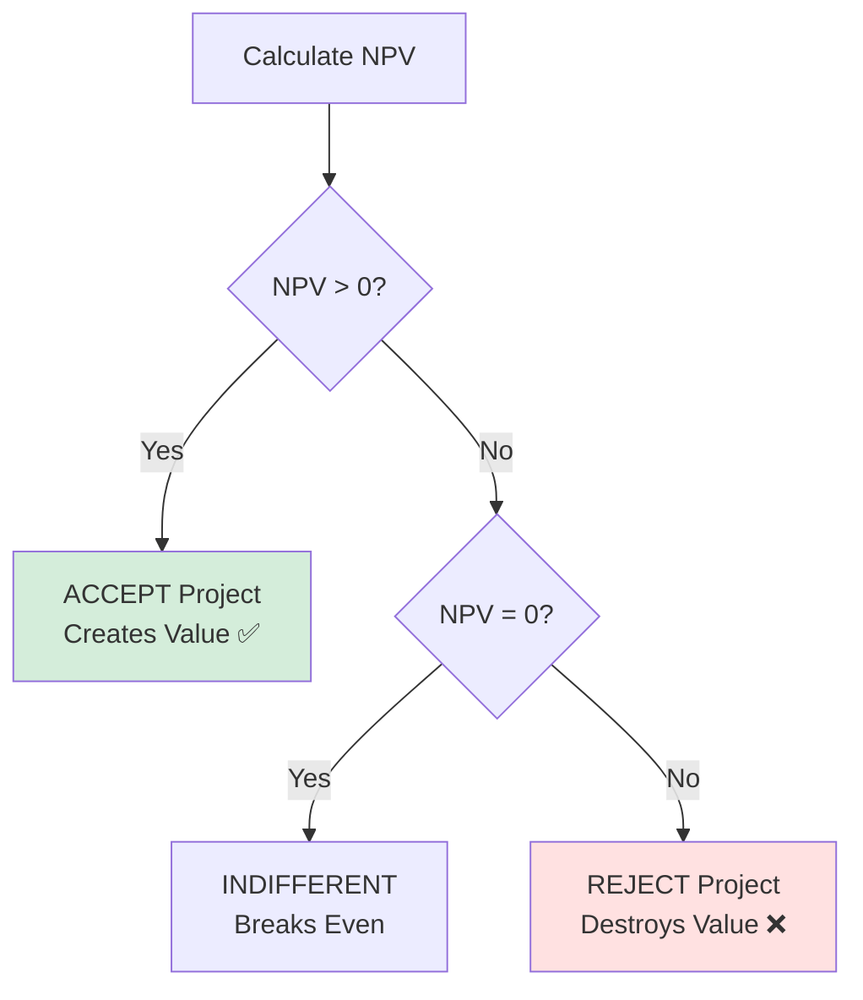
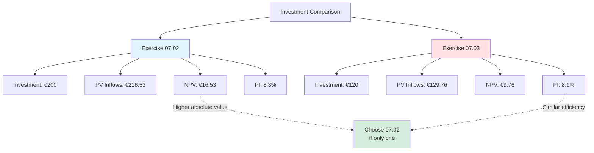
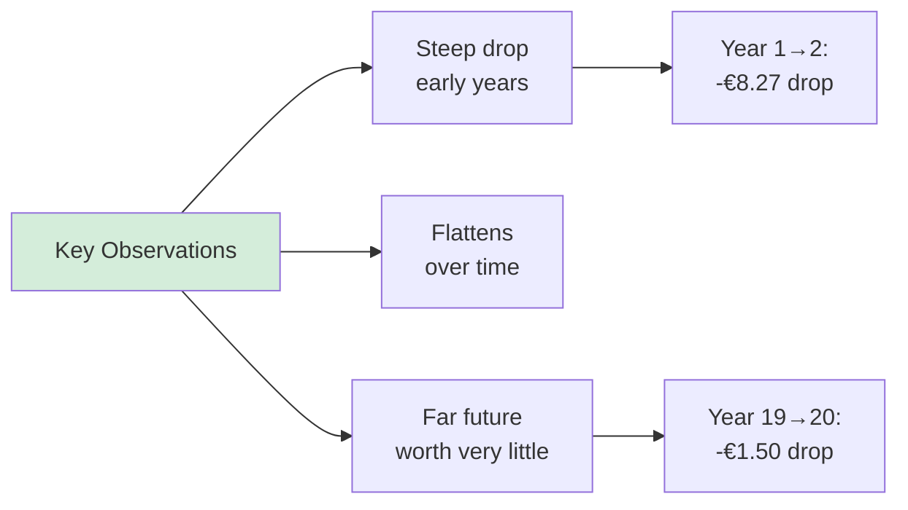
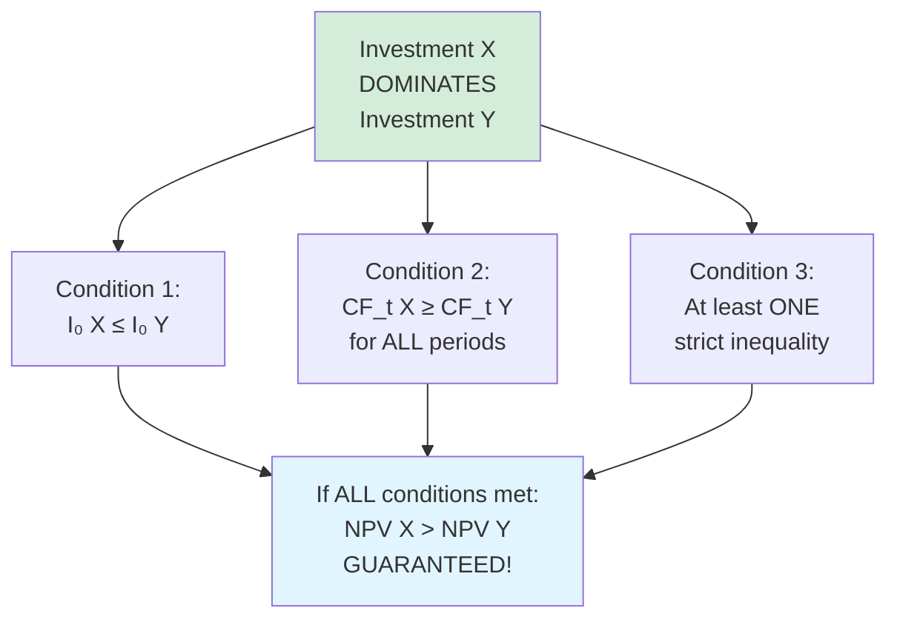
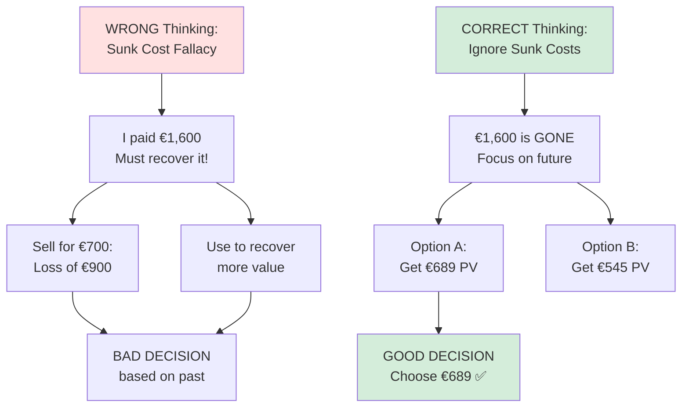

# Company Valuation: Complete Exercise Guide

## 🎯 Purpose of This Note

This note contains complete solutions to all Unit 07 exercises on Company Value and Valuation. Each exercise includes step-by-step calculations, deep explanations, and key insights.

**Coverage:**
- ✅ Present Value (PV) calculations
- ✅ Net Present Value (NPV) analysis
- ✅ Investment decision-making
- ✅ Irregular time periods
- ✅ Perpetuities and annuities
- ✅ Sunk costs and opportunity costs

---

## 📚 Core Formulas Reference

### Essential Formulas

**1. Present Value (PV)**
```
PV = CF / (1 + r)^t

Where:
- CF = Future cash flow
- r = Discount rate (annual)
- t = Time period (years)
```

**2. Net Present Value (NPV)**
```
NPV = -I₀ + Σ [CFₜ / (1+r)^t]

Where:
- I₀ = Initial investment (outflow)
- CFₜ = Cash flow in period t
- r = Discount rate
```

**3. Perpetuity (infinite series)**
```
PV = CF / r

(Value one period BEFORE first payment)

For delayed perpetuity starting at period t:
PV₀ = (CF/r) / (1+r)^(t-1)
```

**4. Annuity (equal payments for n periods)**
```
PV = PMT × AF

Where AF (Annuity Factor) = [1 - (1+r)^-n] / r

To find payment given PV:
PMT = PV / AF
```

**5. Fractional Time Periods**
```
PV = CF / (1 + r)^(days/365)

or

PV = CF / (1 + r)^(months/12)
```

---

## 💡 Key Concepts Overview

### Time Value of Money



### NPV Decision Rule



---

## 📊 Exercise 07.01: Basic Present Value

### **Problem Statement**

Calculate the present value (PV) of future cashflows:
- **CF₁** (Dec 31, 2021): €100
- **CF₂** (Dec 31, 2022): €200
- **Discount rate:** 14% p.a.

---

### **Solution**

**Step 1: Set up timeline**
```
Today (t=0)    Dec 31, 2021 (t=1)    Dec 31, 2022 (t=2)
    │                 ↓                      ↓
    ?               €100                   €200
```

**Step 2: Apply PV formula**
```
PV = CF₁/(1+r)¹ + CF₂/(1+r)²
   = 100/(1.14)¹ + 200/(1.14)²
```

**Step 3: Calculate each component**
```
PV₁ = 100 / 1.14
    = €87.72

PV₂ = 200 / (1.14)²
    = 200 / 1.2996
    = €153.95
```

**Step 4: Sum the present values**
```
Total PV = 87.72 + 153.95 = €241.67
```

### **✅ Answer: PV = €241.67**

---

### **Deep Explanation**

**Why discount?**

Money in the future is worth LESS than money today because:

1. **Investment opportunity:** €87.72 today invested at 14% = €100 in 1 year
2. **Risk:** Future payment is uncertain
3. **Time preference:** People prefer consumption now vs later

**Verification:**
```
Check: If we invest PV today at 14%, do we get the future cashflows?

Year 1: 87.72 × 1.14 = €100.00 ✅
Year 2: 153.95 × (1.14)² = 153.95 × 1.2996 = €200.00 ✅
```

**Key Insight:**
```
The further in the future, the MORE we discount:

€100 in Year 1:  Divide by 1.14     (discount factor: 0.877)
€100 in Year 2:  Divide by 1.2996   (discount factor: 0.769)
€100 in Year 10: Divide by 3.7072   (discount factor: 0.270)

Exponential decay!
```

---

## 📊 Exercise 07.02: Net Present Value (NPV)

### **Problem Statement**

Calculate NPV of an investment:
- **Initial investment:** €200 (Jan 01, 2021)
- **CF₁** (Dec 31, 2021): €120
- **CF₂** (Dec 31, 2022): €130
- **Discount rate:** 10% p.a.

---

### **Solution**

**Step 1: NPV formula**
```
NPV = -I₀ + CF₁/(1+r)¹ + CF₂/(1+r)²
```

**Step 2: Calculate PV of each cashflow**
```
Initial investment: -€200 (today, no discounting)

PV₁ = 120 / 1.10
    = €109.09

PV₂ = 130 / (1.10)²
    = 130 / 1.21
    = €107.44
```

**Step 3: Calculate NPV**
```
NPV = -200 + 109.09 + 107.44
    = -200 + 216.53
    = €16.53
```

### **✅ Answer: NPV = €16.53**

**Decision:** ✅ **ACCEPT the project** (NPV > 0)

---

### **Deep Explanation**

**What does NPV = €16.53 mean?**

```
This investment creates €16.53 of VALUE today

Economic interpretation:
- You pay €200 today
- You receive cashflows worth €216.53 (in present value terms)
- Net gain: €16.53

This is "free money" - take the project!
```

**Timeline with values:**
```
Jan 1, 2021       Dec 31, 2021      Dec 31, 2022
    ↓                  ↓                  ↓
  -€200              +€120              +€130
   (pay)            (receive)          (receive)
    
PV: -€200         PV: €109.09        PV: €107.44
─────────────────────────────────────────────────
Total NPV: -200 + 109.09 + 107.44 = €16.53 ✅
```

**Alternative interpretation:**
```
If NPV = €16.53:

You could:
a) Do the project for €200 → Get value of €216.53
b) Invest €200 in bank at 10% → Get only €200 worth

Difference = €16.53 in favor of the project!
```

**Decision rules:**
```
NPV > 0:  Value created → ACCEPT ✅
NPV = 0:  Break even → INDIFFERENT
NPV < 0:  Value destroyed → REJECT ❌
```

---

## 📊 Exercise 07.03: NPV Comparison

### **Problem Statement**

Calculate NPV of investment:
- **Initial investment:** €120
- **CF₁:** €70
- **CF₂:** €80
- **Discount rate:** 10% p.a.

---

### **Solution**

**Calculate NPV:**
```
NPV = -120 + 70/(1.10)¹ + 80/(1.10)²

PV₁ = 70/1.10 = €63.64
PV₂ = 80/1.21 = €66.12

NPV = -120 + 63.64 + 66.12
    = -120 + 129.76
    = €9.76
```

### **✅ Answer: NPV = €9.76**

**Decision:** ✅ **ACCEPT** (NPV > 0)

---

### **Comparison: Exercise 07.02 vs 07.03**



**Analysis:**

| Metric | Exercise 07.02 | Exercise 07.03 | Winner |
|--------|---------------|---------------|--------|
| **Initial Investment** | €200 | €120 | 07.03 (less capital) |
| **Total PV Inflows** | €216.53 | €129.76 | 07.02 (more cash) |
| **NPV** | €16.53 | €9.76 | 07.02 (more value) ✅ |
| **Profitability Index** | 16.53/200 = 8.3% | 9.76/120 = 8.1% | 07.02 (marginally) |

**Decision guidance:**
```
If unlimited capital: Do BOTH (both have NPV > 0)
If capital constrained: Choose 07.02 (higher NPV)
If mutually exclusive: Choose 07.02 (creates more value)
```

---

## 📊 Exercise 07.04: Present Value Over Time

### **Problem Statement**

- Company expects constant cashflows over 20 years
- **Cashflow:** €100 per year
- **Discount rate:** 10% p.a.
- **Task:** Graph PV of each cashflow

---

### **Solution**

**Calculate PV for each year:**

| Year (t) | Cashflow | Discount Factor | Present Value |
|----------|----------|----------------|---------------|
| 1 | €100 | (1.10)⁻¹ = 0.9091 | €90.91 |
| 2 | €100 | (1.10)⁻² = 0.8264 | €82.64 |
| 3 | €100 | (1.10)⁻³ = 0.7513 | €75.13 |
| 4 | €100 | (1.10)⁻⁴ = 0.6830 | €68.30 |
| 5 | €100 | (1.10)⁻⁵ = 0.6209 | €62.09 |
| 10 | €100 | (1.10)⁻¹⁰ = 0.3855 | €38.55 |
| 15 | €100 | (1.10)⁻¹⁵ = 0.2394 | €23.94 |
| 20 | €100 | (1.10)⁻²⁰ = 0.1486 | €14.86 |

---

### **Visual Pattern**

```
Present Value (€)
│
100│●
90 │ ●
80 │  ●
70 │   ●
60 │    ●
50 │     ●
40 │        ●
30 │           ●
20 │              ●
10 │                  ●
 0 └───────────────────────────→ Year
   1  3  5  7  9 11 13 15 17 19

EXPONENTIAL DECAY CURVE
```



---

### **Deep Insights**

**1. Half-life of value**
```
When does PV drop to 50% of original?

100/(1.10)^t = 50
(1.10)^t = 2
t = log(2)/log(1.10) = 7.27 years

After ~7 years, value is halved!
```

**2. Near-term dominates total value**
```
Sum of Years 1-5:  €90.91 + €82.64 + €75.13 + €68.30 + €62.09 = €379.07
Sum of Years 16-20: €22.59 + €20.54 + €18.67 + €16.97 + €15.43 = €94.20

First 5 years contribute 4× more value than last 5 years!
```

**3. Forecasting accuracy matters more for near-term**
```
Error in Year 2 cashflow (50% mistake):
€100 vs €150 → PV difference: €82.64 vs €123.96 = €41.32 impact

Error in Year 20 cashflow (50% mistake):
€100 vs €150 → PV difference: €14.86 vs €22.29 = €7.43 impact

Near-term errors have 5.5× more impact!
```

**4. Practical implication**
```
When valuing companies:
- Focus forecasting effort on Years 1-5
- Don't obsess over Year 15-20 projections
- Terminal value captures distant future (approximation is fine)
```

---

## 📊 Exercise 07.05: Investment Comparison (Dominance)

### **Problem Statement**

Three investment alternatives:
```
Alternative A: I₀ = -400,  CF₁ = 80,  CF₂ = 90,  CF₃ = 100
Alternative B: I₀ = -500,  CF₁ = 70,  CF₂ = 80,  CF₃ = 90
Alternative C: I₀ = -400,  CF₁ = 80,  CF₂ = 90,  CF₃ = 100
```

**Question:** Do we need to calculate NPV to choose the best?

---

### **Solution**

**Step 1: Compare A and C**
```
Alternative A: -400, +80, +90, +100
Alternative C: -400, +80, +90, +100

IDENTICAL! 

Conclusion: NPV_A = NPV_C
No calculation needed!
```

**Step 2: Compare A/C with B**
```
Alternative A/C: -400, +80, +90, +100
Alternative B:   -500, +70, +80, +90

Dimension-by-dimension comparison:
- Initial investment: -400 > -500 (A/C better, invest less) ✅
- Year 1 cashflow:    80 > 70     (A/C better) ✅
- Year 2 cashflow:    90 > 80     (A/C better) ✅
- Year 3 cashflow:    100 > 90    (A/C better) ✅

A/C DOMINATES B in ALL dimensions!
```

### **✅ Answer: NO calculation needed!**

**Conclusion:**
- **A and C are identical** (tied for best)
- **A and C both dominate B**
- **B is clearly inferior**

---

### **Dominance Principle**



**Why dominance works:**
```
NPV = -I₀ + Σ[CF_t/(1+r)^t]

If X dominates Y:
- X has lower (or equal) I₀ → Less negative first term
- X has higher (or equal) CF_t → Higher positive terms
- Therefore: NPV_X > NPV_Y mathematically guaranteed

No need to calculate!
```

---

### **Verification (if we calculated anyway)**

```
At r = 10%:

NPV_A = -400 + 80/1.10 + 90/1.21 + 100/1.331
      = -400 + 72.73 + 74.38 + 75.13
      = -400 + 222.24
      = -€177.76 ❌

NPV_B = -500 + 70/1.10 + 80/1.21 + 90/1.331
      = -500 + 63.64 + 66.12 + 67.62
      = -500 + 197.38
      = -€302.62 ❌

NPV_C = NPV_A = -€177.76

Ranking: A = C (both -177.76) > B (-302.62) ✅
```

**Note:** All have negative NPV → All should be rejected!
But if forced to choose, A/C is "less bad"

---

### **When You DO Need to Calculate**

```
Scenario: No dominance

Alternative X: -400, +100, +80, +90
Alternative Y: -300, +70, +70, +100

Comparison:
- I₀: Y better (-300 < -400)
- Year 1: X better (100 > 70)
- Year 2: X better (80 > 70)
- Year 3: Y better (100 > 90)

MIXED results! No dominance.
MUST calculate NPV to determine winner.
```

---

## 📊 Exercise 07.06: Irregular Time Periods

### **Problem Statement**

Calculate PV of cashflow:
- **Valuation date:** Nov 01, 2021
- **Cashflow:** €60 on Mar 31, 2022
- **Discount rate:** 8% p.a.

---

### **Solution**

**Step 1: Calculate time elapsed**
```
From Nov 01, 2021 to Mar 31, 2022:

Nov → Dec: 1 month
Dec → Jan: 1 month
Jan → Feb: 1 month
Feb → Mar: 1 month
Mar 1-31:  1 month

Total: 5 months = 5/12 years = 0.4167 years
```

**Step 2: Apply PV formula with fractional time**
```
PV = CF / (1 + r)^t
   = 60 / (1.08)^(5/12)
```

**Step 3: Calculate**
```
(1.08)^(5/12) = (1.08)^0.4167
              = 1.0323

PV = 60 / 1.0323
   = €58.12
```

### **✅ Answer: PV = €58.12**

---

### **Deep Explanation**

**Why fractional exponents matter:**
```
WRONG: "5 months ≈ half a year ≈ round to 0"
       PV ≈ €60 (ignores time value!)

CORRECT: Use exact fraction 5/12
         PV = €58.12
```

**Verification:**
```
If you invest €58.12 today at 8% for 5 months:

Future Value = 58.12 × (1.08)^(5/12)
             = 58.12 × 1.0323
             = €60.00 ✅
```

**Impact of timing precision:**
```
Different receipt dates (all €60, r=8%):

Mar 31 (5 months):  PV = 60/(1.08)^(5/12)  = €58.12
Jun 30 (8 months):  PV = 60/(1.08)^(8/12)  = €56.94
Dec 31 (14 months): PV = 60/(1.08)^(14/12) = €54.60

Earlier receipt = Higher PV
€3.52 difference between Mar and Dec!
```

---

## 📊 Exercise 07.07: Multiple Irregular Cashflows

### **Problem Statement**

Calculate total PV:
- **Valuation date:** Nov 02, 2021
- **CF₁:** €300 on Dec 29, 2021
- **CF₂:** €200 on Jan 23, 2022
- **Discount rate:** 15% p.a.

---

### **Solution**

**Step 1: Calculate time fractions**

**Cashflow 1 (Dec 29, 2021):**
```
Nov 02 → Dec 29:
- Nov 02 to Nov 30: 28 days
- Dec 01 to Dec 29: 29 days
Total: 57 days

t₁ = 57/365 = 0.1562 years
```

**Cashflow 2 (Jan 23, 2022):**
```
Nov 02, 2021 → Jan 23, 2022:
- November: 28 days remaining
- December: 31 days
- Jan 01 to Jan 23: 23 days
Total: 82 days

t₂ = 82/365 = 0.2247 years
```

**Step 2: Calculate PV of each cashflow**
```
PV₁ = 300 / (1.15)^(57/365)
    = 300 / (1.15)^0.1562
    = 300 / 1.0222
    = €293.48

PV₂ = 200 / (1.15)^(82/365)
    = 200 / (1.15)^0.2247
    = 200 / 1.0320
    = €193.80
```

**Step 3: Sum the present values**
```
Total PV = 293.48 + 193.80 = €487.28
```

### **✅ Answer: PV = €487.28**

---

### **Key Points**

**Day-count precision matters:**
```
For large amounts or high rates, small timing differences add up

Example: 57 days vs 60 days (approximating 2 months)

57 days:  PV = 300/(1.15)^(57/365) = €293.48
60 days:  PV = 300/(1.15)^(60/365) = €293.02

Difference: €0.46 per €300

For €1M cashflow: €1,533 difference!
```

**Day-count conventions:**
```
Different markets use different conventions:

1. Actual/365: Count exact days ÷ 365 (we used this)
2. Actual/360: Count exact days ÷ 360 (money markets)
3. 30/360: Assume 30-day months (bonds)

Always check which convention applies!
```

---

## 📊 Exercise 07.08: Perpetuities

### **Problem Statement**

Calculate PV of cashflow series:
- **Pattern:** 0, 0, 0, 30, 30, 30, 30... (forever)
- **First payment:** Year 4
- **Discount rate:** 10% p.a.

---

### **Solution**

**Step 1: Understand structure**
```
Year:      1    2    3  │  4    5    6    7  ...  ∞
Cashflow:  0    0    0  │ 30   30   30   30  ...  30
                        │
                  Perpetuity starts here
```

**Step 2: Value perpetuity at Year 3**
```
Perpetuity formula: PV = CF / r

At end of Year 3 (one period before first payment):
PV_Year3 = 30 / 0.10 = €300
```

**Step 3: Discount back to today**
```
PV_today = PV_Year3 / (1 + r)³
         = 300 / (1.10)³
         = 300 / 1.331
         = €225.39
```

### **✅ Answer: PV = €225.39**

---

### **Verification**

**Long way (infinite sum):**
```
PV = 30/(1.10)⁴ + 30/(1.10)⁵ + 30/(1.10)⁶ + ...

   = 30/1.4641 + 30/1.6105 + 30/1.7716 + ...
   
   = 20.49 + 18.63 + 16.93 + 16.94 + ... (infinite terms)
   
   ≈ €225.39 ✅
```

**Short way (perpetuity formula):**
```
PV = (CF/r) / (1+r)^(t-1)
   = (30/0.10) / (1.10)³
   = €225.39 ✅

Same answer, much simpler!
```

---

### **Perpetuity Formula Explained**

```mermaid
graph TD
    A[Perpetuity Formula:<br/>PV = CF / r] --> B[Applies at time<br/>ONE PERIOD BEFORE<br/>first payment]
    
    B --> C[Example:<br/>First payment Year 4]
    
    C --> D[Value at Year 3:<br/>PV₃ = CF/r]
    
    D --> E[Discount to today:<br/>PV₀ = PV₃/(1+r)³]
    
    style A fill:#d4edda
    style E fill:#e1f5ff
```

**Why one period before?**
```
Perpetuity starting NOW means:
Payment in 1 period, then another in 2 periods, etc.

PV = CF/(1+r) + CF/(1+r)² + CF/(1+r)³ + ...

This geometric series sums to: CF/r

So CF/r gives value when NEXT payment is in 1 period
```

**Common mistake:**
```
❌ WRONG: PV = 30/0.10 = €300
This is value at Year 3, not Year 0!

❌ WRONG: PV = (30/0.10) / (1.10)⁴ = €204.90
This assumes value at Year 4, should be Year 3

✅ CORRECT: PV = (30/0.10) / (1.10)³ = €225.39
Value at Year 3, discount 3 years back
```

---

## 📊 Exercise 07.09: Annuity Conversion

### **Problem Statement**

Given:
- **Present Value:** €1,000
- **Discount rate:** 10% p.a.
- **Number of periods:** 5 years
- **Task:** Convert to equal annual payments (annuity)

---

### **Solution**

**Step 1: Calculate Annuity Factor**
```
AF = [1 - (1+r)^-n] / r
   = [1 - (1.10)^-5] / 0.10
   = [1 - 1/1.6105] / 0.10
   = [1 - 0.6209] / 0.10
   = 0.3791 / 0.10
   = 3.7908
```

**Step 2: Calculate payment**
```
PMT = PV / AF
    = 1,000 / 3.7908
    = €263.80
```

### **✅ Answer: PMT = €263.80 per year for 5 years**

**Interpretation:** €1,000 today is equivalent to receiving €263.80 every year for 5 years.

---

### **Verification**

**Calculate PV of annuity payments:**
```
Year 1: 263.80/(1.10)¹ = €239.82
Year 2: 263.80/(1.10)² = €218.02
Year 3: 263.80/(1.10)³ = €198.20
Year 4: 263.80/(1.10)⁴ = €180.18
Year 5: 263.80/(1.10)⁵ = €163.80

Total: 239.82 + 218.02 + 198.20 + 180.18 + 163.80 = €1,000.02 ✅

(Small difference due to rounding)
```

---

### **Annuity Application: Loan Amortization**

**Example: Borrow €1,000 at 10% for 5 years**

```
Equal annual payment: €263.80

Amortization schedule:

Year | Payment | Interest (10%) | Principal | Remaining Balance
-----|---------|----------------|-----------|------------------
  0  |    -    |      -         |     -     |    1,000.00
  1  | 263.80  |   100.00       |  163.80   |      836.20
  2  | 263.80  |    83.62       |  180.18   |      656.02
  3  | 263.80  |    65.60       |  198.20   |      457.82
  4  | 263.80  |    45.78       |  218.02   |      239.80
  5  | 263.80  |    23.98       |  239.82   |        0.00

Total paid:      €1,319.00
Total interest:  €319.00
Principal repaid: €1,000.00
```

**Key observations:**
```
1. Payment stays constant (€263.80)
2. Interest portion decreases each year
3. Principal portion increases each year
4. Balance reaches exactly €0 at end
```

---

### **Annuity Factor Table**

| n (years) | AF at r=10% | Meaning |
|-----------|-------------|---------|
| 1 | 0.9091 | €0.91 today = €1/year for 1 year |
| 2 | 1.7355 | €1.74 today = €1/year for 2 years |
| 3 | 2.4869 | €2.49 today = €1/year for 3 years |
| 5 | 3.7908 | €3.79 today = €1/year for 5 years |
| 10 | 6.1446 | €6.14 today = €1/year for 10 years |
| 20 | 8.5136 | €8.51 today = €1/year for 20 years |
| ∞ | 10.0000 | €10 today = €1/year forever |

**Note:** As n → ∞, AF → 1/r (perpetuity formula!)

---

## 📊 Exercise 07.10: Sunk Costs & Opportunity Cost

### **Problem Statement**

Machine decision:
- **Purchase date:** Feb 29, 2020
- **Purchase price:** €1,600 (PAST - already paid)
- **Today:** Nov 01, 2021
- **Option A:** Sell on Dec 31, 2021 for €700
- **Option B:** Use until Jul 31, 2023, earn €30/month
- **Discount rate:** 10% p.a.

**Question:** What is the present value of the machine?

---

### **Solution**

**Step 1: Identify relevant vs irrelevant costs**

```
❌ IRRELEVANT (Sunk cost):
Purchase price €1,600 - Already spent, cannot recover

✅ RELEVANT:
- Option A: Selling price €700
- Option B: Monthly profits €30
- Time periods and discount rate
```

**Step 2: Analyze Option A (Sell)**

```
Timeline: Nov 01, 2021 → Dec 31, 2021 = 2 months

PV_A = 700 / (1.10)^(2/12)
     = 700 / (1.10)^0.1667
     = 700 / 1.0159
     = €689.05
```

**Step 3: Analyze Option B (Use)**

```
Timeline: Nov 01, 2021 → Jul 31, 2023 = 21 months

Payments:
- First payment: Dec 31, 2021 (2 months from now)
- Last payment: Jul 31, 2023 (21 months from now)
- Total: 20 monthly payments of €30
```

**Calculate using annuity:**
```
Convert annual rate to monthly:
r_monthly = (1.10)^(1/12) - 1 = 0.00797 = 0.797%

Annuity factor for 20 payments:
AF = [1 - (1.00797)^-20] / 0.00797
   = [1 - 0.8528] / 0.00797
   = 18.47

PV at start of payments (month 2):
PV_month2 = 30 × 18.47 = €554.10

Discount back to today (Nov 1):
PV_B = 554.10 / (1.10)^(2/12)
     = 554.10 / 1.0159
     = €545.41
```

**Step 4: Compare options**
```
Option A (Sell):  PV = €689.05 ✅ HIGHER
Option B (Use):   PV = €545.41
```

### **✅ Answer: PV of machine = €689.05**

**Decision:** ✅ **SELL the machine** (higher present value)

---

### **The Sunk Cost Fallacy**



---

### **Why Purchase Price is Irrelevant**

**Thought experiment:**
```
Scenario 1: You paid €1,600 (actual case)
Scenario 2: You won machine in lottery (paid €0)

Should your decision be different?

NO! In BOTH scenarios, today you face:
- Option A: Get €689 PV (sell)
- Option B: Get €545 PV (use)

The PAST doesn't change FUTURE options!
```

**The key principle:**
```
SUNK COST = Cost already incurred that CANNOT be recovered

Characteristics:
- Already spent (past)
- Cannot be changed by current decision
- Should NOT influence future choices

Examples:
- €1,600 machine purchase ✅ Sunk
- Movie ticket already bought ✅ Sunk  
- College tuition already paid ✅ Sunk

Non-examples:
- €700 selling price ❌ Not sunk (future opportunity)
- €30/month earnings ❌ Not sunk (future cashflows)
```

---

### **Opportunity Cost Included**

**Explicit calculation showing opportunity cost:**
```
Option B includes implicit opportunity cost:

When you USE the machine:
- You earn: €30/month for 20 months
- You forego: €700 selling price

Net cashflows for Option B:
Month 2: -€700 (foregone sale) + €30 (earnings) = -€670
Month 3-21: +€30 each

PV = -670/(1.10)^(2/12) + Σ(t=3 to 21) 30/(1.10)^(t/12)
   = -659.51 + 514.10
   = -€145.41 (NEGATIVE!)

This confirms Option B destroys value relative to selling!
```

---

### **Timeline Visualization**

```
Option A: SELL
══════════════════════════════════════════
Nov 1, 2021          Dec 31, 2021
  (Today)                 ↓
     │                  €700
     │                    
   PV: €689.05 ✅


Option B: USE (Foregoes selling opportunity)
══════════════════════════════════════════════════════
Nov 1, 2021   Dec 31  Jan 31  ...  Jul 31, 2023
  (Today)       ↓       ↓            ↓
     │         €30     €30    ...   €30
     │         (20 payments)
     │
   PV: €545.41

Opportunity cost: Forego €689.05 from selling
Net value of using: €545.41 - €689.05 = -€143.64 ❌
```

---

### **Verification of Payment Count**

```
From Dec 2021 to Jul 2023:

December 2021:    1 payment
Jan-Dec 2022:    12 payments
Jan-Jul 2023:     7 payments
                ───────────
Total:           20 payments ✅

First payment: End of Dec 2021 (month 2 from Nov 1)
Last payment: End of Jul 2023 (month 21 from Nov 1)
```

---

## 🎯 Summary Table: All Exercises

| Exercise | Concept | Key Formula | Answer | Decision/Insight |
|----------|---------|-------------|--------|------------------|
| **07.01** | Basic PV | PV = Σ CF/(1+r)^t | €241.67 | Future discounted to today |
| **07.02** | NPV | NPV = -I₀ + Σ PV | €16.53 | ACCEPT (creates value) |
| **07.03** | NPV | NPV = -I₀ + Σ PV | €9.76 | ACCEPT (creates value) |
| **07.04** | PV decay | Graph PV vs time | Exponential curve | Near-term dominates |
| **07.05** | Dominance | Compare without calc | A=C > B | No calculation needed |
| **07.06** | Fractional time | PV = CF/(1+r)^(t/12) | €58.12 | Use exact time fractions |
| **07.07** | Multiple irregular | Σ PV with days/365 | €487.28 | Sum individual PVs |
| **07.08** | Perpetuity | (CF/r)/(1+r)^t | €225.39 | Infinite series shortcut |
| **07.09** | Annuity | PMT = PV/AF | €263.80/yr | Equal payment equivalent |
| **07.10** | Sunk costs | Compare future options | €689.05 | SELL (ignore past cost) |

---

## 📚 Key Formulas Quick Reference

### Present Value Formulas

```
1. Single cashflow:
   PV = CF / (1+r)^t

2. Multiple cashflows:
   PV = Σ [CFₜ / (1+r)^t]

3. Fractional periods:
   PV = CF / (1+r)^(days/365)
   or
   PV = CF / (1+r)^(months/12)
```

### Investment Evaluation

```
4. Net Present Value:
   NPV = -I₀ + Σ [CFₜ / (1+r)^t]
   
   Decision: Accept if NPV > 0

5. Profitability Index:
   PI = NPV / I₀
   
   Higher PI = more efficient investment
```

### Special Cases

```
6. Perpetuity (starts in period 1):
   PV = CF / r
   
7. Perpetuity (starts in period t):
   PV = (CF/r) / (1+r)^(t-1)

8. Annuity Factor:
   AF = [1 - (1+r)^-n] / r
   
9. Annuity Present Value:
   PV = PMT × AF
   
10. Annuity Payment:
    PMT = PV / AF
```

---

## 💡 Key Principles for Exam

### Decision Rules

**1. NPV Rule**
```
NPV > 0  →  ACCEPT (creates value) ✅
NPV = 0  →  INDIFFERENT
NPV < 0  →  REJECT (destroys value) ❌
```

**2. Dominance Rule**
```
If Investment A dominates B:
- Same or lower I₀
- Same or higher CFs in all periods
- At least one strict advantage

Then: NPV_A > NPV_B guaranteed
No calculation needed!
```

**3. Sunk Cost Rule**
```
Ignore ALL past costs when making decisions

Only consider:
- Future cashflows
- Opportunity costs
- Discount rate

Past is irrelevant!
```

---

### Common Mistakes to Avoid

**❌ Mistake 1: Using wrong time periods**
```
Wrong: "5 months ≈ 0.5 years"
Right: 5 months = 5/12 = 0.4167 years
```

**❌ Mistake 2: Forgetting to discount initial investment**
```
Wrong: NPV = -I₀/(1+r) + Σ PV
Right: NPV = -I₀ + Σ PV
(I₀ is already at time 0!)
```

**❌ Mistake 3: Perpetuity timing**
```
Wrong: PV = CF/r (for payment in Year 4)
Right: PV = (CF/r) / (1+r)³
(Value at Year 3, discount back 3 years)
```

**❌ Mistake 4: Including sunk costs**
```
Wrong: "I paid €1,600, must recover it"
Right: "€1,600 is gone, what's best NOW?"
```

**❌ Mistake 5: Confusing PV and FV**
```
PV = Future Value / (1+r)^t  (discount)
FV = Present Value × (1+r)^t (compound)

Don't mix them up!
```

---

## 🎓 Exam Preparation Checklist

### Can you...?

**Basic Calculations:**
- [ ] Calculate PV of single cashflow
- [ ] Calculate PV of multiple cashflows
- [ ] Calculate NPV and make accept/reject decision
- [ ] Use fractional time periods correctly
- [ ] Handle irregular payment dates

**Special Cases:**
- [ ] Value perpetuities (immediate and delayed)
- [ ] Calculate annuity factors
- [ ] Convert between PV and equal payments
- [ ] Identify when perpetuity/annuity formulas apply

**Decision-Making:**
- [ ] Recognize dominated investments
- [ ] Identify sunk costs and ignore them
- [ ] Calculate opportunity costs
- [ ] Compare investments using NPV
- [ ] Make optimal decisions

**Application:**
- [ ] Draw timelines for cash flows
- [ ] Set up problems correctly
- [ ] Verify answers make economic sense
- [ ] Explain decisions in business terms

---

## 🔗 Related Notes

- [[16-Shareholder-vs-Stakeholder-Value|Value Approaches]]
- [[10-Equity-vs-Debt-Financing|Financing Decisions]]
- [[06-Financial-Statement-Analysis|Financial Analysis]]

---

*Part of: [[00-Index|Accounting & Value-Based Management Course Notes]]*
*Created: January 2026*
*Status: Exam-Ready ✅*
