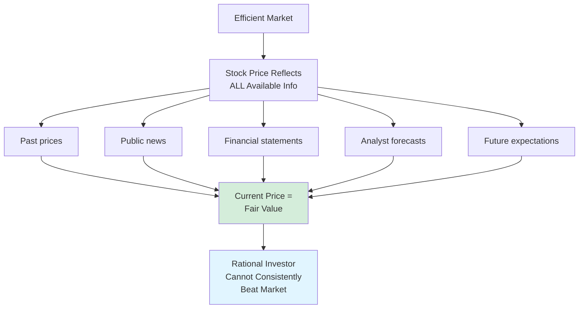
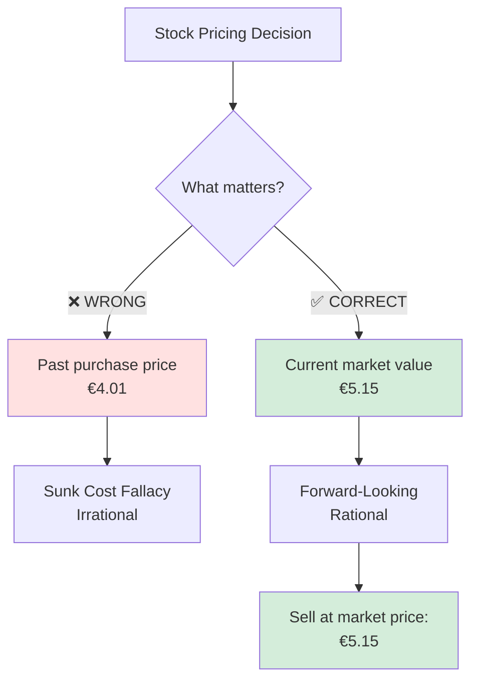
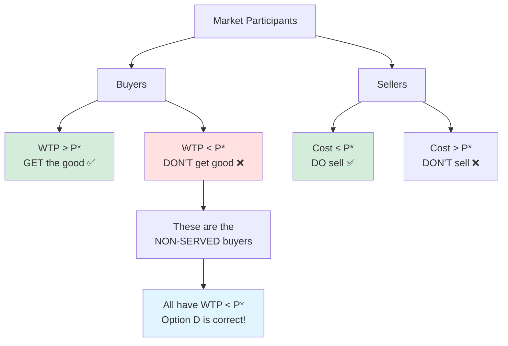
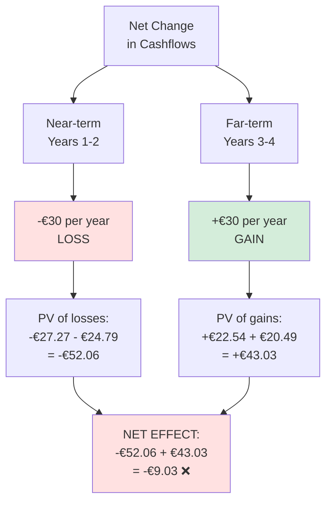
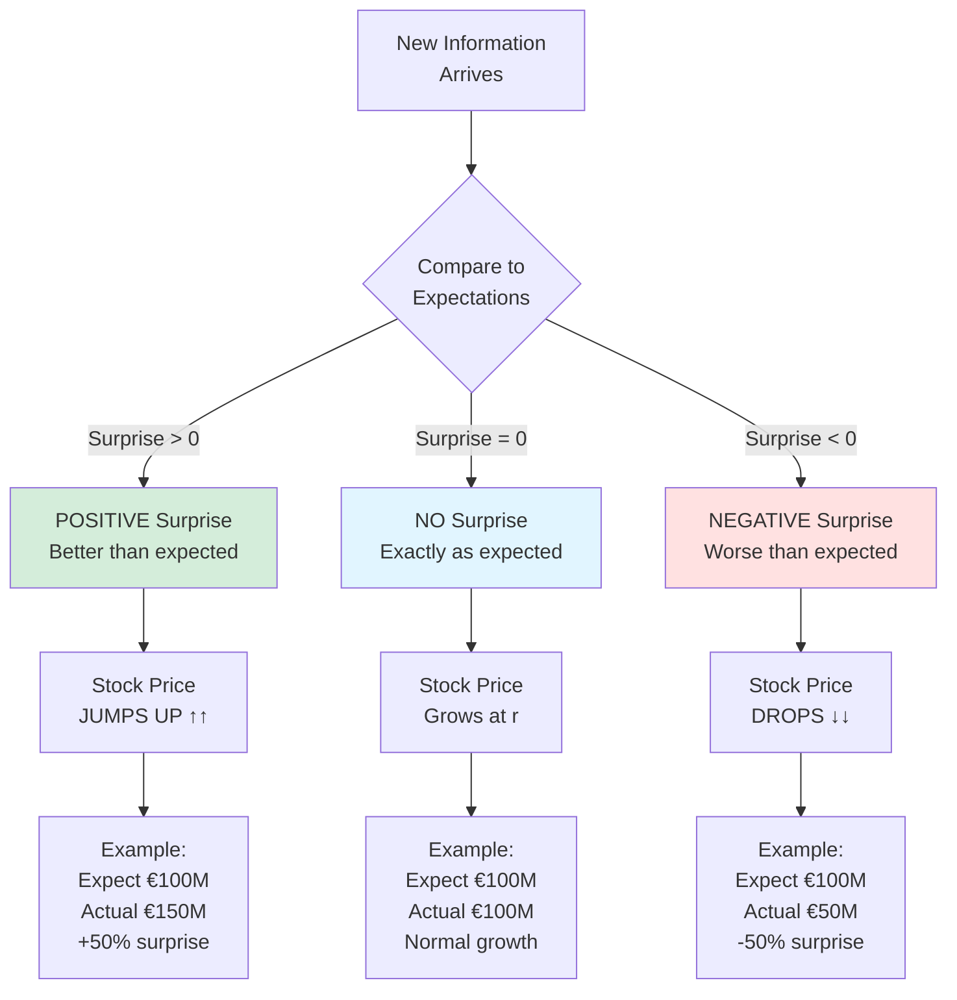

# Information Content & Market Dynamics: Exercise Guide

## 🎯 Purpose of This Note

This note contains complete solutions to Unit 09 exercises on Information Content and Market Dynamics. Focus areas include efficient markets, stock pricing, market equilibrium, and how information affects asset values.

**Coverage:**
- ✅ Rational stock pricing decisions
- ✅ Market equilibrium and supply/demand
- ✅ Stock exchange mechanics
- ✅ Information impact on valuation
- ✅ Stock price reactions to news

---

## 📚 Core Concepts Overview

### Efficient Market Hypothesis (EMH)



### Key Principles

**1. Forward-Looking Valuation**
```
Stock Price = PV of Expected Future Cashflows

NOT based on:
- What you paid (sunk cost)
- Historical prices
- Past performance

Based on:
- Future expected dividends
- Expected growth
- Risk-adjusted discount rate
```

**2. Information and Prices**
```
New Information → Update Expectations → Price Adjusts

Surprise > 0 → Price UP
Surprise = 0 → Price grows at discount rate
Surprise < 0 → Price DOWN
```

**3. Market Equilibrium**
```
Price where Quantity Demanded = Quantity Supplied

At equilibrium:
- Buyers with WTP ≥ P* are served
- Buyers with WTP < P* are NOT served
- Sellers with cost ≤ P* sell
- Sellers with cost > P* don't sell
```

---

## 📊 Exercise 09.01: Rational Stock Pricing

### **Problem Statement**

You purchased a stock:
- **Purchase date:** Feb 05, 2024
- **Purchase price:** €4.01
- **Today:** Oct 24, 2024

**Question:** At which price should a rational decision-maker sell today?

**Options:**
A. €1.90
B. €4.01
C. €5.15
D. €8.61

---

### **Solution**

**Critical Concept: SUNK COST**

```
The purchase price (€4.01) is IRRELEVANT!

Why?
- Already spent (sunk)
- Cannot be recovered
- Should NOT influence today's decision

What matters?
- What is the stock WORTH today?
- Current market price
- Future expected cashflows
```

**Rational Decision Framework:**



### **✅ Answer: C - €5.15**

**A rational investor sells at the CURRENT MARKET PRICE**

---

### **Deep Explanation**

**Why each option is right/wrong:**

**A. €1.90 ❌**
```
This might be:
- A pessimistic personal valuation
- Below market consensus
- A lowball estimate

If market price is €5.15:
Selling at €1.90 gives away €3.25 of value!

Irrational decision
```

**B. €4.01 ❌**
```
This is the SUNK COST!

Irrational thinking:
"I paid €4.01, so I should get €4.01 back to break even"

Problems:
1. Past is irrelevant
2. Ignores current market info
3. May be below fair value (leaving money on table)
4. Classic sunk cost fallacy
```

**C. €5.15 ✅**
```
This is the CURRENT MARKET PRICE

Why correct:
1. Market price = consensus fair value
2. Reflects all available information
3. Forward-looking (future cashflows)
4. Properly ignores sunk cost

Rational decision: Sell at €5.15
```

**D. €8.61 ❌**
```
This might be:
- Your wishful thinking
- An unrealistic hope
- An optimistic personal estimate

If market only pays €5.15:
You CANNOT sell at €8.61
No rational buyer pays above market price

Impossible/irrational
```

---

### **The Efficient Market Hypothesis**

**What determines stock price?**

```
Stock Price = PV of Expected Future Cashflows

P₀ = Σ [E(Dividend_t) / (1+r)^t]

Where:
- E(Dividend_t) = Expected dividend in period t
- r = Risk-adjusted discount rate
- Summation over all future periods
```

**In an efficient market:**

```
Current price instantly reflects:
✅ All publicly available information
✅ Historical price patterns
✅ Financial statement data
✅ News and announcements
✅ Analyst expectations
✅ Market sentiment

Your purchase price? ❌ IRRELEVANT
```

---

### **Example Scenarios**

**Scenario 1: Stock Price Increased**
```
Feb 2024: Bought at €4.01
Oct 2024: Market price €5.15

Your situation:
- Unrealized gain: €1.14 per share
- Smart move: Sell at €5.15 ✅
- Profit: €1.14 per share

Don't hold out hoping for €8.61 (unrealistic)
```

**Scenario 2: Stock Price Decreased (Hypothetical)**
```
Feb 2024: Bought at €4.01
Oct 2024: Market price €1.90

Your situation:
- Unrealized loss: -€2.11 per share
- Rational decision: STILL sell at €1.90 if that's fair value

Irrational thinking:
"I'll hold until it gets back to €4.01"
(Sunk cost fallacy! €4.01 is irrelevant)

Rational thinking:
"Market says it's worth €1.90 now. Future prospects justify only €1.90.
I should sell and redeploy capital elsewhere."
```

**Scenario 3: Personal Valuation vs Market**
```
Your analysis: Stock worth €8.61
Market price: €5.15

Two possibilities:

1. You're right, market is wrong:
   - Unlikely (market aggregates many opinions)
   - If confident, BUY MORE at €5.15
   - But you can't SELL at €8.61 (no buyers)

2. Market is right, you're wrong:
   - More likely
   - Your analysis has errors
   - Sell at €5.15 (best you can get)
```

---

### **Key Takeaway**

```
SUNK COST PRINCIPLE:

Past costs should NOT influence future decisions

What you paid is GONE
Focus on: What it's worth NOW and in the FUTURE

Rational pricing = Current market consensus value
```

---

## 📊 Exercise 09.02: Market Equilibrium

### **Problem Statement**

Which statement is CORRECT about a free market with rational decision-makers?

**Options:**
A. All market participants who want to purchase a good are served at the equilibrium price
B. The demanded quantity of a good increases with the price of the good
C. The price required by potential sellers for a good is always higher than the equilibrium price
D. All ultimately non-served potential buyers have a lower price expectation than the equilibrium price

---

### **Solution**

**Analysis of each option:**

**A. ❌ WRONG**
```
"Everyone who wants to purchase is served"

FALSE!

Distinction:
- "Want" ≠ "Willing to pay equilibrium price"

Example:
I WANT a Ferrari
But only willing to pay €10,000
Market price: €300,000
→ I don't get served!

Only served if: Willingness-to-pay ≥ Equilibrium price
```

**B. ❌ WRONG**
```
"Quantity demanded INCREASES with price"

This VIOLATES the Law of Demand!

Law of Demand: P ↑ → Qd ↓ (Inverse relationship)

Example:
Price €10 → 100 units demanded
Price €20 → 50 units demanded

Demand curve slopes DOWNWARD
```

**C. ❌ WRONG**
```
"Seller price required is ALWAYS HIGHER than equilibrium"

FALSE!

Supply curve shows:
- Some sellers willing at LOW prices (< equilibrium)
- Some sellers willing at equilibrium price
- Some sellers require HIGH prices (> equilibrium, don't sell)

NOT all sellers require above-equilibrium
```

**D. ✅ CORRECT**
```
"Non-served buyers have lower price expectations than equilibrium"

TRUE!

At equilibrium:
✅ Buyers with WTP ≥ P* → GET the good
❌ Buyers with WTP < P* → DON'T get the good

Non-served buyers are exactly those with WTP below equilibrium
```

### **✅ Answer: D**

---

### **Supply and Demand Framework**

```
Price (€)
│
│         Supply
│        /
│       /
│      /
│     /
│    / P* _____ Equilibrium
│   /     \
│  /       \ Demand
│ /         \
│/___________\
0    Q*       Quantity

At Equilibrium (P*, Q*):
- Quantity Demanded = Quantity Supplied
- Market clears
- No shortage, no surplus
```

**Who Gets Served at Equilibrium?**



---

### **Detailed Example**

**Scenario: Used Car Market**

**Equilibrium Price: P* = €7,000**

**Buyers:**

| Buyer | Willingness to Pay (WTP) | Gets Car? | Why? |
|-------|-------------------------|-----------|------|
| Alice | €10,000 | ✅ YES | WTP (€10K) > P* (€7K) |
| Bob | €8,500 | ✅ YES | WTP (€8.5K) > P* (€7K) |
| Carol | €7,000 | ✅ YES | WTP (€7K) = P* (€7K) |
| David | €5,000 | ❌ NO | WTP (€5K) < P* (€7K) |
| Eve | €3,000 | ❌ NO | WTP (€3K) < P* (€7K) |

**Sellers:**

| Seller | Minimum Price (Cost) | Sells? | Why? |
|--------|---------------------|--------|------|
| Seller 1 | €4,000 | ✅ YES | Cost (€4K) < P* (€7K) |
| Seller 2 | €6,000 | ✅ YES | Cost (€6K) < P* (€7K) |
| Seller 3 | €7,000 | ✅ YES | Cost (€7K) = P* (€7K) |
| Seller 4 | €9,000 | ❌ NO | Cost (€9K) > P* (€7K) |
| Seller 5 | €12,000 | ❌ NO | Cost (€12K) > P* (€7K) |

**Key Observations:**

```
Non-served buyers: David and Eve
Their WTP: €5,000 and €3,000
Both are BELOW equilibrium (€7,000)

This confirms Option D! ✅

Also notice:
- NOT all buyers served (A is wrong)
- Demand doesn't increase with price (B is wrong)
- Some sellers willing below P* (C is wrong)
```

---

### **Consumer and Producer Surplus**

```
Price (€)
│
│      
│      A  \ Consumer Surplus
│       \  \ (Area A)
│        \  \
│    ─────●─── P* = €7,000 (Equilibrium)
│          /\ Producer Surplus
│         /  \ (Area B)
│        / B  \
│       /      \
0──────●────────── Quantity
       Q* = 3 cars

Consumer Surplus (Area A):
Alice saves: €10K - €7K = €3,000
Bob saves: €8.5K - €7K = €1,500
Carol saves: €7K - €7K = €0
Total: €4,500

Producer Surplus (Area B):
Seller 1 gains: €7K - €4K = €3,000
Seller 2 gains: €7K - €6K = €1,000
Seller 3 gains: €7K - €7K = €0
Total: €4,000
```

---

### **Why Other Options Are Wrong**

**Option A - Detailed Rebuttal:**
```
"Everyone who wants is served"

Counter-examples:
1. I want a yacht but willing to pay only €1,000
   → Market price €500,000 → Not served
   
2. College student wants luxury apartment
   → Willing to pay €500/month
   → Market rent €2,000/month → Not served

"Want" and "willing/able to pay market price" are DIFFERENT!

Only those with WTP ≥ P* are served
```

**Option B - Law of Demand Violation:**
```
Fundamental economic principle:

As Price ↑ → Quantity Demanded ↓

Reasons:
1. Substitution Effect: Buy cheaper alternatives
2. Income Effect: Can afford less at higher price
3. Diminishing Marginal Utility: Each unit worth less

Example:
Coffee at €2/cup → You buy 3 cups/day
Coffee at €10/cup → You buy 0 cups/day

Demand curve ALWAYS slopes downward!
```

**Option C - Supply Curve Reality:**
```
Supply curve shows:

At P = €3: Only 1 seller willing (lowest cost)
At P = €5: 2 sellers willing
At P = €7 (equilibrium): 3 sellers willing
At P = €10: 5 sellers willing

Interpretation:
- Seller 1 willing to sell at €4 (< equilibrium) ✅
- Seller 2 willing to sell at €6 (< equilibrium) ✅
- Seller 3 willing to sell at €7 (= equilibrium) ✅
- Seller 4 requires €9 (> equilibrium, doesn't sell)

NOT all sellers require above-equilibrium!
```

---

## 📊 Exercise 09.03: Stock Exchanges

### **Problem Statement**

Which statement about stock exchanges is WRONG?

**Options:**
A. Frankfurt (incl. XETRA) is Germany's most important stock trading place, but several other German exchanges exist
B. At the end of a trading day, closing prices are identical at all stock exchanges
C. Stock exchanges use demand and supply with algorithms to match buyers and sellers
D. Stock prices reflect expectations about future performance, not just past data

---

### **Solution**

**A. ✅ CORRECT (not wrong)**
```
German stock exchanges:
- Frankfurt/XETRA (largest, ~90% of volume)
- Stuttgart
- Munich  
- Hamburg
- Berlin
- Düsseldorf
- Tradegate (electronic)

TRUE statement!
```

**B. ❌ WRONG! (This is the answer)**
```
"Closing prices are IDENTICAL at all exchanges"

This is FALSE!

Reality: Closing prices can DIFFER between exchanges

Reasons:
1. Different last trade times
2. Different liquidity/volume
3. Different market microstructure
4. Order flow differences
5. Bid-ask spread variations

Example:
XETRA close: €50.00 (1M shares traded)
Munich close: €50.18 (10K shares traded)
Difference: €0.18 (0.36%)
```

**C. ✅ CORRECT (not wrong)**
```
Modern stock exchanges DO use matching algorithms:

- Electronic order books
- Price-time priority
- Automated execution
- Continuous auction
- High-frequency trading systems

TRUE statement!
```

**D. ✅ CORRECT (not wrong)**
```
Stock prices ARE forward-looking:

Price = PV of FUTURE expected cashflows

Past data is used for ANALYSIS
But price reflects FUTURE expectations

TRUE statement!
```

### **✅ Answer: B**

**Closing prices are NOT identical across all stock exchanges**

---

### **Why Closing Prices Differ**

```mermaid
graph TD
    A[Same Stock<br/>BMW AG] --> B[XETRA]
    A --> C[Munich Exchange]
    
    B --> D[Characteristics]
    C --> E[Characteristics]
    
    D --> F[High liquidity<br/>1M shares/day<br/>Tight spread: €0.02<br/>Close: €50.00]
    
    E --> G[Low liquidity<br/>10K shares/day<br/>Wide spread: €0.20<br/>Close: €50.15]
    
    F -.Price difference: €0.15.-> G
    
    H[WHY Different?] --> I[Different volumes]
    H --> J[Different timing]
    H --> K[Microstructure effects]
    H --> L[Last trade randomness]
    
    style B fill:#e1f5ff
    style C fill:#ffe1e1
    style H fill:#d4edda
```

**Real Example: BMW Stock (Oct 24, 2024)**

| Exchange | Close Time | Last Trade Price | Volume | Bid-Ask Spread |
|----------|-----------|------------------|--------|----------------|
| **XETRA** | 17:30 CET | €50.00 | 500,000 | €49.99 - €50.01 |
| **Munich** | 17:30 CET | €50.15 | 5,000 | €49.95 - €50.20 |
| **Stuttgart** | 17:35 CET | €50.08 | 8,000 | €49.98 - €50.15 |

**Key observations:**
```
1. Prices are CLOSE but not IDENTICAL
2. High-volume exchange (XETRA) = tighter, more "accurate"
3. Low-volume exchanges = wider spreads, more variation
4. Differences typically < 0.5%
```

---

### **Arbitrage Keeps Prices Close**

**How arbitrage works:**

```
If prices diverge too much:

XETRA: €50.00 (buy here)
Munich: €50.50 (sell here)

Arbitrage strategy:
1. Buy on XETRA: -€50.00
2. Simultaneously sell on Munich: +€50.50
3. Instant profit: €0.50 per share!

This arbitrage activity:
→ Increases demand on XETRA (price ↑)
→ Increases supply on Munich (price ↓)
→ Prices converge
```

**Why prices don't become perfectly identical:**

```
Frictions that prevent perfect arbitrage:

1. Transaction costs
   - Trading fees differ by exchange
   - €0.10/share on Exchange A
   - €0.15/share on Exchange B
   
2. Time delays
   - Microseconds matter
   - Can't execute simultaneously
   
3. Liquidity risk
   - Thin markets have wide spreads
   - May not get filled at quoted price
   
4. Capital requirements
   - Need margin/cash for both trades
   
5. Information asymmetry
   - Real-time data expensive
   - Delays reduce profitability

Result: Prices stay CLOSE (within arbitrage bounds)
        But not IDENTICAL
```

---

### **Market Microstructure Effects**

**Why last trades differ:**

```
XETRA (High Volume):
17:29:58 - Trade at €50.01
17:29:59 - Trade at €49.99
17:30:00 - Trade at €50.00 ← Official close
Last second has many trades → stable close

Munich (Low Volume):
17:29:45 - Last trade at €50.15
17:30:00 - No more trades ← Close at €50.15
Last trade was 15 seconds before close → more random
```

**Time zone impacts:**

```
For international stocks:

NYSE (New York): Closes 4:00 PM EST = 22:00 CET
XETRA (Frankfurt): Already closed at 17:30 CET

Can't be identical - different trading hours!
```

---

## 📊 Exercise 09.04: Information Impact on Valuation

### **Problem Statement**

Investment cashflow forecasts changed:

**Old forecast:**
- Years 1-2: €90 each
- Years 3-4: €50 each

**New forecast:**
- Years 1-2: €60 each
- Years 3-4: €80 each

**Discount rate:** 10% p.a.

**Question:** Change in present value?

**Options:**
A. Decrease of €9
B. Decrease of €15
C. Increase of €12
D. Increase of €8

---

### **Solution**

**Step 1: Calculate PV under OLD forecast**

```
PV_old = 90/(1.10)¹ + 90/(1.10)² + 50/(1.10)³ + 50/(1.10)⁴

Year 1: 90/1.10 = €81.82
Year 2: 90/1.21 = €74.38
Year 3: 50/1.331 = €37.57
Year 4: 50/1.4641 = €34.15

PV_old = 81.82 + 74.38 + 37.57 + 34.15
       = €227.92
```

**Step 2: Calculate PV under NEW forecast**

```
PV_new = 60/(1.10)¹ + 60/(1.10)² + 80/(1.10)³ + 80/(1.10)⁴

Year 1: 60/1.10 = €54.55
Year 2: 60/1.21 = €49.59
Year 3: 80/1.331 = €60.11
Year 4: 80/1.4641 = €54.64

PV_new = 54.55 + 49.59 + 60.11 + 54.64
       = €218.89
```

**Step 3: Calculate change**

```
Change = PV_new - PV_old
       = 218.89 - 227.92
       = -€9.03

Decrease of approximately €9
```

### **✅ Answer: A - Decrease of €9**

---

### **Deep Analysis: Why Decrease?**

**Changes in cashflows:**

```
Years 1-2: €90 → €60 (DECREASE of €30 per year)
Years 3-4: €50 → €80 (INCREASE of €30 per year)
```

**Time value impact:**



**Detailed breakdown:**

| Year | Old CF | New CF | Change | PV of Change |
|------|--------|--------|--------|--------------|
| 1 | €90 | €60 | -€30 | -30/1.10 = -€27.27 |
| 2 | €90 | €60 | -€30 | -30/1.21 = -€24.79 |
| 3 | €50 | €80 | +€30 | +30/1.331 = +€22.54 |
| 4 | €50 | €80 | +€30 | +30/1.4641 = +€20.49 |
| **Total** | | | | **-€9.03** |

---

### **Key Insight: Near-Term Matters More**

```
The €30 lost in Years 1-2 is worth MORE
than the €30 gained in Years 3-4

Why?
TIME VALUE OF MONEY!

Present value calculations:
Year 1 loss: €30/1.10 = €27.27
Year 4 gain: €30/1.4641 = €20.49

Difference: €27.27 - €20.49 = €6.78 more lost than gained

This is why near-term cashflows are so important!
```

**Visualization:**

```
         Year 1    Year 2    Year 3    Year 4
Old CF:   €90       €90       €50       €50
New CF:   €60       €60       €80       €80
         ─────     ─────     ─────     ─────
Change:   -€30      -€30      +€30      +€30

PV Impact:
         -€27.27   -€24.79   +€22.54   +€20.49
         ═══════   ═══════   ═══════   ═══════
                    
Net PV change: -€27.27 - €24.79 + €22.54 + €20.49 = -€9.03 ❌
```

**Implications for company valuation:**

```
This teaches us:

1. Near-term forecasts matter MORE than distant forecasts
2. Losing €30 today > gaining €30 in 3 years
3. Information that changes near-term expectations
   has bigger impact on stock price
4. Discounting makes distant cashflows less relevant

Investment insight:
A company that front-loads losses and back-loads gains
will have LOWER value than one that does the opposite
(even if total undiscounted cashflows are equal!)
```

---

## 📊 Exercise 09.05: Stock Price Changes

### **Problem Statement**

Which statement about stock price changes is WRONG?

**Options:**
A. When actual profit significantly differs from forecast, stock price changes
B. A company generates zero profit (one-time), leading to dividend default for current year. Consequently, discount rate increases because investors wait further year
C. Company announces all future dividends will be 5% higher than forecasted. Since this doesn't influence future value creation, stock price won't change
D. When all investor expectations are fully met, stock price increases according to discount rate

---

### **Solution**

**A. ✅ CORRECT (not wrong)**
```
"Actual profit differs from forecast → Price changes"

TRUE!

Stock price = Market expectations
Reality ≠ Expectations → Surprise → Price adjusts

Example:
Expected: €100M profit
Actual: €150M profit (+50% surprise!)
→ Stock price JUMPS ✅

This is how earnings announcements work!
```

**B. ❌ WRONG! (This is the answer)**
```
"Miss one dividend → Discount rate increases"

This is FALSE!

Correct analysis:
- One-time zero profit → Affects ONE dividend
- Discount rate = Required return based on RISK
- One missed payment ≠ Change in risk
- Discount rate should REMAIN CONSTANT

What actually happens:
- Stock price FALLS (lost PV of one dividend)
- But discount rate (r) stays the same
- It's a LEVEL shift in value, not a RATE change
```

**C. ❌ This is also WRONG (contradictory)**
```
"5% higher dividends, no value impact, no price change"

This statement is CONTRADICTORY!

Logic:
If dividends ↑ 5% → Cashflows ↑ 5%
If cashflows ↑ 5% → PV ↑ 5%
If PV ↑ 5% → Stock price ↑ 5%

The statement says "doesn't influence value creation"
But higher dividends DO create more shareholder value!

Unless there's an offsetting negative (cut investment)
Then future value IS affected

Statement is confused/wrong
```

**D. ✅ CORRECT (not wrong)**
```
"Expectations met → Price grows at discount rate"

TRUE!

If everything goes exactly as expected:
- No surprises (surprise = 0)
- Market expectations realized
- Stock appreciates at required return (r)

Example:
- Expected return: 10%
- Expected dividend: €5 (realized)
- Stock price grows: ~10% annually

This is "normal" return with no surprises
```

### **✅ Answer: B (Most clearly wrong)**

*Note: C is also arguably wrong, but B is more definitively incorrect*

---

### **Stock Price Reaction to Information**



---

### **Option B Detailed Explanation**

**The WRONG statement:**
```
"One missed dividend → Discount rate must increase"
```

**Why this is incorrect:**

**1. What is Discount Rate (r)?**
```
Discount rate = Required return based on RISK

Components:
r = Risk-free rate + Risk premium

Risk premium depends on:
- Business risk (operating leverage)
- Financial risk (debt/equity)
- Market risk (beta)
- Liquidity risk
- Size premium
```

**2. What affects discount rate?**
```
Discount rate CHANGES when:
✅ Business becomes riskier (operations)
✅ Leverage increases (more debt)
✅ Market conditions change (recession)
✅ Industry dynamics shift

Discount rate does NOT change when:
❌ One payment is delayed
❌ Temporary earnings miss
❌ One-time events
❌ Timing shifts
```

**3. Correct analysis of missed dividend:**

```
Scenario: Company skips ONE dividend due to temporary issue

WRONG thinking:
"Investors wait longer → r must increase"

CORRECT thinking:

Old valuation:
P = D₁/(1+r) + D₂/(1+r)² + D₃/(1+r)³ + ...
  = 5/1.10 + 5/1.21 + 5/1.331 + ...
  = 4.55 + 4.13 + 3.76 + ...

New valuation (skip first dividend):
P = 0/(1+r) + D₂/(1+r)² + D₃/(1+r)³ + ...
  = 0 + 5/1.21 + 5/1.331 + ...
  = 0 + 4.13 + 3.76 + ...

Change: Lost 4.55 (PV of first dividend)
But r stays at 10%!

Stock price falls by €4.55, not because r changed,
but because we lost one dividend payment!
```

**4. Visual comparison:**

```
Timeline:

OLD (with dividend):
Year 0    Year 1    Year 2    Year 3
  │         ↓         ↓         ↓
  ?        €5        €5        €5  ...
           
r = 10%
P = €50.00

NEW (skip first dividend):
Year 0    Year 1    Year 2    Year 3
  │         ↓         ↓         ↓
  ?        €0        €5        €5  ...
           
r = 10% (UNCHANGED!)
P = €45.45 (-€4.55)

The discount rate doesn't change!
Only the cashflow stream changes!
```

---

### **Option C Analysis**

**The confusing statement:**
```
"5% higher dividends, no value influence, no price change"
```

**Why this is wrong/contradictory:**

**Basic valuation:**
```
Stock Price = PV of Dividends

P = Σ [Div_t / (1+r)^t]

If Div ↑ 5% → P ↑ 5% (assuming r constant)

Simple math:
Old: P = 100/0.10 = €1,000
New (5% higher): P = 105/0.10 = €1,050

Price MUST change if dividends change!
```

**Possible interpretations:**

**Interpretation 1: Pure dividend increase**
```
Scenario: Company finds €5M in a drawer, increases dividends

Cashflows: ↑ 5%
Value: ↑ 5%
Price: ↑ 5% ✅

Statement says "no price change" → WRONG
```

**Interpretation 2: Trade-off scenario**
```
Scenario: Higher dividends BUT cut investment
- Dividends ↑ 5% now
- Growth ↓ future (less investment)
- Net effect: could be zero

But then the statement's claim that
"doesn't influence future value creation" is FALSE
because we DID reduce investment!

Either way, statement is contradictory
```

---

### **Option D: Normal Returns**

**When expectations are met:**

```
Expected scenario OCCURS → Stock grows at r

Example company:
- Current price: €100
- Expected dividend next year: €5
- Growth rate: 5%
- Required return: 10%

Price appreciation:
Year 0: €100
Year 1: €100 × 1.10 = €110 (if expectations met)

Return breakdown:
Dividend yield: €5/€100 = 5%
Capital gain: €10/€100 = 10% price appreciation
Wait, that's wrong calculation...

Correct calculation:
Total return = Dividend yield + Capital appreciation
10% = 5%/100 + (P₁-P₀)/P₀
10% = 5% + Price appreciation
Price appreciation = 5%

New price: €100 × 1.05 = €105
Plus dividend: €5
Total value: €110
Total return: 10% ✅
```

---

## 🎯 Summary Table: All Answers

| Exercise | Answer | Key Concept | One-Line Explanation |
|----------|--------|-------------|---------------------|
| **09.01** | **C (€5.15)** | Sunk cost | Sell at current market price, ignore purchase price |
| **09.02** | **D** | Market equilibrium | Non-served buyers have WTP below equilibrium |
| **09.03** | **B** | Price differences | Closing prices differ across exchanges (liquidity/volume) |
| **09.04** | **A (-€9)** | Time value | Near-term losses worth more than far-term gains |
| **09.05** | **B** | Discount rate | One missed dividend doesn't change risk/discount rate |

---

## 💡 Key Principles for Exam

### 1. Forward-Looking Valuation

```
Stock Price = PV of FUTURE Expected Cashflows

NOT based on:
❌ Historical purchase price (sunk cost)
❌ Past performance
❌ What you "hope" it's worth

Based on:
✅ Expected future dividends
✅ Expected growth rates
✅ Risk-adjusted discount rate
✅ Market consensus
```

### 2. Information and Market Efficiency

```
Efficient Market:
- Prices reflect all available information
- Surprises cause price changes
- Expected events already "priced in"

Price Reaction:
Positive surprise → Price UP
No surprise → Price grows at r
Negative surprise → Price DOWN
```

### 3. Discount Rate vs. Cashflows

```
Distinguish between:

Discount Rate (r):
- Reflects RISK
- Changes when risk changes
- Based on business fundamentals
- Relatively stable

Cashflows:
- Can fluctuate period-to-period
- Affected by operations
- One-time events affect level
- Do NOT affect discount rate
```

### 4. Time Value Dominance

```
Near-term cashflows > Far-term cashflows

€100 in Year 1 > €100 in Year 10

Reason: Discounting compounds

Investment lesson:
Front-load gains, back-load losses
for higher valuation
```

---

## 🎓 Exam Preparation Checklist

### Can you...?

**Valuation Concepts:**
- [ ] Identify sunk costs and ignore them in decisions
- [ ] Calculate PV changes from cashflow revisions
- [ ] Understand forward-looking vs backward-looking
- [ ] Explain why near-term matters more than far-term

**Market Mechanics:**
- [ ] Draw and interpret supply/demand curves
- [ ] Identify market equilibrium
- [ ] Explain who gets served at equilibrium
- [ ] Understand why prices differ across exchanges

**Information and Prices:**
- [ ] Predict price reactions to surprises
- [ ] Distinguish discount rate from cashflow changes
- [ ] Explain efficient market hypothesis
- [ ] Calculate impact of information on value

**Common Mistakes:**
- [ ] Never let purchase price influence selling decision
- [ ] Don't confuse "want" with "willing to pay"
- [ ] Understand r changes only with risk, not timing
- [ ] Remember: identical closing prices is FALSE

---

## 🔗 Related Notes

- [[18-Company-Valuation-Exercise-Guide|Valuation Methods]]
- [[17-Value-Based-Management-Exercise-Guide|Shareholder Value]]
- [[06-Financial-Statement-Analysis|Financial Analysis]]

---

*Part of: [[00-Index|Accounting & Value-Based Management Course Notes]]*
*Created: January 2026*
*Status: Exam-Ready ✅*
