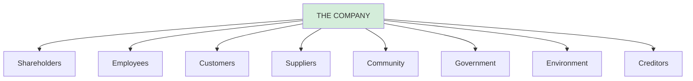

# Pathbreaking Management Researchers: Complete Guide

## 🎯 Purpose of This Note

This note profiles 15 influential management researchers and economists whose work has shaped business, economics, and statistics over generations. These are the "scientific heroes" of management that every business student should know.

**Coverage:**
- ✅ 15 major researchers across economics, finance, and management
- ✅ Key contributions and theories
- ✅ Impact on modern business practice
- ✅ Legacy and practical applications

---

## 📊 Quick Reference Table

| Name | Period | Field | Key Contribution | Impact |
|------|--------|-------|------------------|--------|
| **Bernoulli** | 1700-1782 | Decision Theory | Expected Utility Theory | Foundation of modern risk analysis |
| **Erhard** | 1897-1977 | Economic Policy | Social Market Economy | German economic model |
| **Freeman** | 1951- | Management | Stakeholder Theory | Corporate social responsibility |
| **Hayek** | 1899-1992 | Economics | Price Signals & Spontaneous Order | Free market philosophy |
| **Kahneman** | 1934-2024 | Behavioral Econ | Prospect Theory, Cognitive Biases | Behavioral economics revolution |
| **Friedman** | 1912-2006 | Economics | Monetarism, Shareholder Value | Chicago School economics |
| **Keynes** | 1883-1946 | Macroeconomics | Aggregate Demand Management | Government intervention theory |
| **Markowitz** | 1927-2023 | Finance | Modern Portfolio Theory | Investment diversification |
| **Marx** | 1818-1883 | Political Economy | Critique of Capitalism | Communist theory |
| **Nash** | 1928-2015 | Game Theory | Nash Equilibrium | Strategic decision-making |
| **Pacioli** | 1445-1514 | Accounting | Double-Entry Bookkeeping | Modern accounting foundation |
| **Ricardo** | 1772-1823 | Trade Theory | Comparative Advantage | Free trade theory |
| **Schiller** | 1911-1994 | Economic Policy | Magic Square | German policy framework |
| **Schmalenbach** | 1873-1955 | Accounting | Cost Accounting Systems | Managerial accounting |
| **Smith** | 1723-1790 | Economics | Invisible Hand, Division of Labor | Father of modern economics |

---

## 👨‍🔬 Detailed Researcher Profiles

---

## 1. Daniel Bernoulli (1700-1782)

### **Background**
Swiss mathematician and physicist from famous Bernoulli family of scholars.

### **Major Contribution: Expected Utility Theory**

**The St. Petersburg Paradox (1738):**
```
Coin flip game:
- Heads: You win €2
- If tails, flip again
  - Heads: Win €4
  - If tails, flip again
    - Heads: Win €8
    - And so on...

Expected Value: INFINITE!
(1/2 × €2 + 1/4 × €4 + 1/8 × €8 + ...)

Question: How much would you pay to play?

Most people: Only €5-10!
Why not pay €1,000 if expected value is infinite?
```

**Bernoulli's Solution: UTILITY, not monetary value**

```
People maximize Expected UTILITY, not Expected Value

Utility = Satisfaction/Happiness from money

Key insight:
€100 to poor person: High utility
€100 to billionaire: Minimal utility

Diminishing marginal utility of wealth!
```

**Mathematical Formulation:**
```
U(W) = log(W)  [Bernoulli's utility function]

Where:
U = Utility
W = Wealth

This explains:
- Risk aversion
- Insurance demand
- Portfolio diversification
- Why people don't bet everything
```

### **Legacy**
- Foundation of **decision theory**
- Basis for **modern finance** (risk-return tradeoff)
- **Insurance** industry principles
- **Risk management** theory

---

## 2. Ludwig Erhard (1897-1977)

### **Background**
German economist and politician, Chancellor of West Germany (1963-1966).

### **Major Contribution: Social Market Economy (Soziale Marktwirtschaft)**

**The Post-WWII German Economic Miracle:**

```
1948: Germany in ruins after WWII
      Currency reform (Deutsche Mark introduced)
      Erhard implements "Social Market Economy"

1950s-1960s: "Wirtschaftswunder" (Economic Miracle)
             Average GDP growth: 8% per year
             Full employment
             Rising living standards
```

**Core Philosophy:**
```
Social Market Economy = Free Market + Social Safety Net

Market Component:
✅ Competition
✅ Private property
✅ Price mechanism
✅ Entrepreneurship
✅ Limited government intervention

+

Social Component:
✅ Progressive taxation
✅ Universal healthcare
✅ Pension system
✅ Worker protection
✅ Codetermination (workers on boards)
```

**Famous Quote:**
> "Prosperity for all" (Wohlstand für Alle)

**Balance:**
```
Not pure capitalism (like US)
Not socialism (like East Germany)

Middle path:
- Efficiency of markets
- Social responsibility
- Prevents both extremes
```

### **Key Policies**
1. **Currency reform** (1948) - Stable money
2. **Price liberalization** - Let markets work
3. **Anti-cartel laws** - Ensure competition
4. **Social insurance** - Safety net
5. **Tax reform** - Incentives to work

### **Legacy**
- **German economic model** (still used today)
- Influenced **European social democracy**
- Model for **Austria, Netherlands, Nordics**
- Balance between efficiency and equity

---

## 3. Robert Edward Freeman (1951-)

### **Background**
American philosopher and management professor, University of Virginia.

### **Major Contribution: Stakeholder Theory (1984)**

**Revolutionary Book:**
"Strategic Management: A Stakeholder Approach"

**Core Idea:**
```
Traditional View (Friedman):
Company exists to maximize SHAREHOLDER value
Shareholders are only important group

Freeman's View:
Company must balance ALL STAKEHOLDER interests
Multiple groups have legitimate claims
```

**Stakeholder Definition:**
> "Any group or individual who can affect or is affected by the achievement of the organization's objectives"

**Stakeholder Map:**


**Key Principles:**

**1. Stakeholder Interdependence:**
```
Success requires satisfying multiple groups:

Employees: Fair wages, good conditions
Customers: Quality products, fair prices
Suppliers: Fair contracts, timely payment
Community: Jobs, taxes, environmental care
Shareholders: Returns on investment

Can't maximize one at expense of others!
```

**2. Stakeholder Management:**
```
Identify stakeholders
→ Understand their interests
→ Prioritize claims
→ Balance competing demands
→ Create shared value
```

**3. Long-term Value Creation:**
```
Short-term shareholder focus → Destroys value

Example:
Cut wages → Unhappy employees → Lower productivity
Pollute → Community backlash → Regulation
Cheat customers → Lost reputation → Sales decline

Stakeholder approach → Sustainable value
```

### **Contrasts with Friedman**

| Aspect | Friedman | Freeman |
|--------|----------|---------|
| **Primary Goal** | Shareholder profit | Stakeholder balance |
| **Time Horizon** | Often short-term | Long-term sustainable |
| **Social Responsibility** | No (beyond law) | Yes (moral duty) |
| **Decision Criterion** | Maximize profit | Balance interests |
| **View of Business** | Profit machine | Social institution |

### **Legacy**
- Foundation of **Corporate Social Responsibility (CSR)**
- Basis for **ESG investing** (Environmental, Social, Governance)
- **B Corporations** (Benefit corporations)
- Modern **stakeholder capitalism**
- **UN Sustainable Development Goals** alignment

---

## 4. Friedrich von Hayek (1899-1992)

### **Background**
Austrian-British economist, Nobel Prize 1974, major figure in Austrian School of Economics.

### **Major Contributions**

**1. The Knowledge Problem**

```
Central Planning Problem:

No single person/committee can know:
- Everyone's preferences
- All resources available
- Best uses of resources
- Local conditions everywhere

Knowledge is DISPERSED across millions of people

Example:
Baker in Munich knows:
- Local customer preferences
- Quality of flour suppliers
- When to bake bread

Central planner in Berlin knows NONE of this!

Conclusion: Central planning cannot work efficiently
```

**2. Price Signals as Information**

```
Prices coordinate dispersed knowledge WITHOUT central planner!

Example: Copper shortage

Copper mine floods
→ Copper scarce
→ Price ↑
→ Manufacturers use less copper
→ Consumers buy fewer copper products
→ Inventors seek copper substitutes

NO central planner needed!
Price signal coordinates millions of decisions
```

**Famous Quote:**
> "The curious task of economics is to demonstrate to men how little they really know about what they imagine they can design."

**3. Spontaneous Order**

```
Complex, beneficial systems emerge WITHOUT design:

Examples:
- Language (no one designed English)
- Common law (evolved over centuries)
- Markets (no central coordinator)
- Cities (organic growth)
- Internet (decentralized)

Order doesn't require a designer!
```

**4. The Road to Serfdom (1944)**

```
Argument:
Government economic planning → Loss of freedom

Steps:
1. Government takes economic control
2. Must force compliance with plan
3. Individual choice eliminated
4. Political freedom follows economic freedom
5. End result: Totalitarianism

Even if planners have good intentions!
```

### **The Great Debate: Hayek vs. Keynes**

| Issue | Hayek | Keynes |
|-------|-------|--------|
| **Recessions** | Let markets adjust | Government intervene |
| **Unemployment** | Temporary, self-correcting | Government create jobs |
| **Knowledge** | Dispersed, local | Can be centralized |
| **Role of State** | Minimal (referee) | Active (player) |
| **Planning** | Impossible, dangerous | Necessary, beneficial |

### **Legacy**
- Foundation of **libertarian economics**
- Critique of **socialism/central planning**
- Influenced **Reagan & Thatcher** policies
- **Free market** advocacy
- **Property rights** emphasis

---

## 5. Daniel Kahneman (1934-2024)

### **Background**
Israeli-American psychologist, Nobel Prize Economics 2002 (with Vernon Smith), pioneered behavioral economics with Amos Tversky.

### **Major Contributions**

**1. Two Systems of Thinking**

```
System 1: Fast, Automatic, Intuitive
- Unconscious
- Effortless  
- Emotional
- Quick judgments
- Pattern recognition

Example: 2 + 2 = ?
         Recognize angry face
         Understand simple sentence

System 2: Slow, Deliberate, Logical
- Conscious
- Effortful
- Rational
- Complex calculations
- Careful analysis

Example: 23 × 47 = ?
         Fill tax return
         Evaluate investment
```

**The Problem:**
```
System 1 often answers for System 2!

Result: Systematic errors (biases)

Example:
"Is Bill shy? He likes poetry and wears glasses."
System 1: "Sounds like librarian!"
System 2 should think: "Base rate? Most people aren't librarians..."

We rely on System 1 too much!
```

**2. Cognitive Biases (with Tversky)**

**Anchoring:**
```
First number influences judgment

Experiment:
Group A: "Is Gandhi older/younger than 9 when he died?"
Group B: "Is Gandhi older/younger than 140 when he died?"

Then both guess actual age:

Group A average: 50 years
Group B average: 67 years

Same question, different anchor → Different answers!

Business application:
First salary offer anchors negotiation
Initial price anchors perceived value
```

**Availability Bias:**
```
Recent/vivid events seem more likely

After airplane crash: People overestimate flight risk
After lottery winner: People overestimate winning odds
After shark attack: People fear swimming

Actual probabilities unchanged!
Recent memory makes it "available"
```

**Loss Aversion:**
```
Losses hurt ~2× more than equal gains feel good

Test:
Win €50 vs. Lose €50

Emotional impact:
Gain: +5 happiness units
Loss: -10 happiness units

Result: People very risk-averse for losses
```

**3. Prospect Theory (1979) - Nobel Prize Work**

**Key Finding: People are NOT rational about risk!**

```
GAINS: People are RISK-AVERSE

Would you rather:
A) Guaranteed €500
B) 50% chance €1,000, 50% chance €0

Most choose A (even though both = €500 expected value)

LOSSES: People are RISK-SEEKING

Would you rather:
A) Guaranteed LOSE €500  
B) 50% chance LOSE €1,000, 50% chance LOSE €0

Most choose B (gambling to avoid certain loss!)

This is IRRATIONAL! Same math, opposite behavior!
```

**Value Function:**
```
     Gains
       ↑
       |     ___-- (Concave = Risk Averse)
       |  __/
       | /
_______|_______ Reference Point
      /|
    _/ |
  _/   | (Convex = Risk Seeking)
       ↓
     Losses

Key features:
1. Reference dependent (not absolute wealth)
2. Loss aversion (steeper for losses)
3. Diminishing sensitivity (extreme outcomes matter less)
```

**4. Framing Effects**

```
Same facts, different presentation = Different choices!

Example: Medical treatment decision

Frame A: "90% survival rate"
         → 80% choose treatment

Frame B: "10% mortality rate"  
         → 50% choose treatment

SAME INFORMATION! Different frame!
```

### **Legacy**
- Founded **behavioral economics**
- Disproved **rational actor model**
- Influenced **policy design** ("Nudge" theory)
- Changed **marketing** (framing, anchoring)
- Improved **risk assessment**
- **Better decision-making** frameworks

---

## 6. Milton Friedman (1912-2006)

### **Background**
American economist, Nobel Prize 1976, leader of Chicago School of Economics, advisor to Reagan and Thatcher.

### **Major Contributions**

**1. Shareholder Value Primacy**

**Famous 1970 NYT Article:**
> "The Social Responsibility of Business is to Increase its Profits"

```
Friedman's Argument:

1. Corporations are NOT people
   They can't have social responsibilities
   Only PEOPLE have responsibilities

2. Managers are AGENTS of shareholders
   Their job: Maximize shareholder wealth
   Not: Pursue social causes with shareholders' money

3. "Social responsibility" = Spending someone else's money
   Managers who pursue CSR are:
   - Taxing shareholders (lower returns)
   - Taxing employees (lower wages)
   - Taxing customers (higher prices)

4. Let shareholders decide social causes
   Earn profit → Shareholders donate to causes THEY choose
```

**Key Quote:**
> "There is one and only one social responsibility of business: to increase its profits"

**Caveats Friedman Added:**
```
"...so long as it:
1. Stays within rules of game
2. Engages in open and free competition
3. Without deception or fraud"

NOT "profit at any cost"!
Still must follow law and ethics
```

**2. Monetarism**

**Core Theory:**
```
"Inflation is always and everywhere a monetary phenomenon"

MV = PY

Where:
M = Money supply
V = Velocity (how fast money circulates)
P = Price level
Y = Real output

If M ↑ faster than Y → P ↑ (Inflation!)

Solution: Control money supply growth
```

**Policy Prescription:**
```
Central Bank should:
✅ Grow money supply at steady, predictable rate
✅ Match long-run GDP growth (≈ 3%)
✅ Be transparent and rule-based

Central Bank should NOT:
❌ Try to "fine-tune" economy
❌ Respond to every shock  
❌ Be discretionary and political
```

**3. Critique of Keynesianism**

**"Money matters" (vs. Keynes "fiscal policy matters"):**

```
Keynes said: Government spending controls economy
Friedman said: Money supply controls economy

Great Depression debate:
Keynes: Lack of demand → Government must spend
Friedman: Federal Reserve contracted money supply 30%!
         That caused Depression, not demand
```

**4. Free Market Advocacy**

**Policy Positions:**
- **School vouchers** (parental choice)
- **Negative income tax** (predecessor to UBI)
- **Floating exchange rates** (not fixed)
- **Volunteer military** (not draft)
- **Opposed:** Minimum wage, rent control, tariffs

**Philosophy:**
```
Free markets:
✅ Maximize individual freedom
✅ Allocate resources efficiently
✅ Self-correcting

Government intervention:
❌ Reduces freedom
❌ Creates inefficiency
❌ Has unintended consequences
```

### **Legacy**
- **Shareholder capitalism** dominance (1980-2020)
- **Monetarism** influenced central banking
- **Deregulation** movement (Reagan/Thatcher)
- **Globalization** advocacy
- Now being **questioned** (rise of stakeholder capitalism)

**Modern Debate:**
```
2019: Business Roundtable rejects Friedman
      "Purpose of corporation includes ALL stakeholders"

Critics say:
- Short-termism
- Inequality
- Environmental damage

Defenders say:
- Economic growth
- Poverty reduction
- Innovation
```

---

## 7. John Maynard Keynes (1883-1946)

### **Background**
British economist, Cambridge professor, Treasury official, architect of post-WWII financial system.

### **Major Contribution: Keynesian Economics**

**Revolutionary Book:**
"The General Theory of Employment, Interest and Money" (1936)

**Context:**
```
1930s Great Depression:
- 25% unemployment
- Collapsing output
- Deflation

Classical economists: "Markets will self-correct, just wait"
Keynes: "In the long run we are all dead"
```

**Core Theory: Aggregate Demand**

```
Economy's output determined by DEMAND, not supply

Y = C + I + G + (X - M)

Where:
Y = GDP (output)
C = Consumption
I = Investment
G = Government spending
X = Exports
M = Imports

If (C + I) falls → Recession
Solution: Increase G (government spending)!
```

**The Multiplier Effect:**

```
Government spends €1M on bridge:

Direct effect: €1M to construction workers

Indirect effects:
Workers spend 80% of income (€800K)
→ Businesses receive €800K
→ They spend 80% (€640K)
→ Continues...

Total effect: €1M × (1/0.2) = €5M!

Multiplier = 1 / (1 - MPC)
If MPC = 0.8 → Multiplier = 5

€1M government spending → €5M total GDP increase
```

**Paradox of Thrift:**

```
Individual level:
Saving is good! (prudent)

Aggregate level:
If EVERYONE saves → Disaster!

Why?
Everyone saves more
→ Spend less
→ Businesses sell less
→ Lay off workers
→ Unemployment ↑
→ Income ↓
→ End up POORER!

My spending = Your income
If I cut spending → You lose income

Composition fallacy:
What's good for individual ≠ good for aggregate
```

**Liquidity Trap:**

```
Sometimes: Lower interest rates DON'T stimulate!

Normal times:
Interest rate ↓ → Borrowing ↑ → Spending ↑ → Economy grows

Liquidity trap:
Interest rate already 0%
Can't go lower!
People still won't spend (fear, uncertainty)

Solution: Fiscal policy (government spending)
           Monetary policy (interest rates) doesn't work!
```

### **Policy Prescriptions**

**Recession:**
```
✅ Increase government spending
✅ Cut taxes (stimulus)
✅ Lower interest rates
✅ Run budget deficits (temporary)

Goal: Increase aggregate demand
      Restore full employment
```

**Boom:**
```
✅ Decrease government spending
✅ Raise taxes (cool off)
✅ Raise interest rates
✅ Run budget surpluses

Goal: Prevent inflation
      "Take away the punch bowl"
```

**Counter-Cyclical Policy:**
```
Deficit in recession → Surplus in boom
Balance over CYCLE, not every year
```

### **Legacy**

**Bretton Woods (1944):**
- Keynes negotiated post-WWII financial system
- Created **IMF** (International Monetary Fund)
- Created **World Bank**
- Fixed exchange rates (until 1971)

**Keynesian Economics Dominated:**
- 1940s-1970s: "Keynesian consensus"
- Governments actively managed demand
- Mixed results (growth + inflation)

**Decline:**
- 1970s "stagflation" (high inflation + unemployment)
- Monetarism/supply-side takes over (1980s)

**Revival:**
- 2008 Financial Crisis → Keynesian stimulus
- COVID-19 → Massive government spending
- "We're all Keynesians in a crisis"

### **Famous Quotes**
> "The difficulty lies not so much in developing new ideas as in escaping from old ones."

> "Practical men, who believe themselves to be quite exempt from any intellectual influence, are usually the slaves of some defunct economist."

---

## 8. Harry Markowitz (1927-2023)

### **Background**
American economist, Nobel Prize 1990, father of modern finance.

### **Major Contribution: Modern Portfolio Theory (1952)**

**Revolutionary PhD Dissertation:**
"Portfolio Selection" - Journal of Finance (1952)

**The Problem He Solved:**

```
Before Markowitz:
Investors picked "good stocks"
Diversification was intuitive, not mathematical

Question: HOW MUCH diversification? WHICH stocks?

Markowitz: Gave MATHEMATICAL answer!
```

**Key Insight: It's Not About Individual Stocks**

```
WRONG approach:
Pick stocks with highest expected return

Markowitz approach:
Pick PORTFOLIO with best return-risk tradeoff

The COMBINATION matters!
```

**Diversification Math:**

```
Stock A: Return 10%, Risk (σ) 20%
Stock B: Return 10%, Risk (σ) 20%

Portfolio A+B (50-50):
Expected return: 10% (average)

Portfolio risk: NOT 20%!
Depends on CORRELATION (ρ)

If ρ = +1.0 (perfect correlation):
Portfolio risk = 20% (no benefit!)

If ρ = 0 (uncorrelated):
Portfolio risk = 14.1% (reduced!)

If ρ = -1.0 (perfect negative correlation):
Portfolio risk = 0%! (perfect diversification)

Formula:
σ_portfolio = √(w₁²σ₁² + w₂²σ₂² + 2w₁w₂ρσ₁σ₂)
```

**The Efficient Frontier:**

```
Risk (σ)
│
│           • (High risk, high return)
│        •••
│      •••
│    •••  ← Efficient Frontier
│  •••
│•••______________________________
0                           Return (μ)

Efficient Frontier:
- Best possible portfolios
- Maximum return for given risk
- Minimum risk for given return

Portfolios BELOW frontier: Suboptimal!
Can get better return for same risk
```

**Optimal Portfolio:**

```
Depends on investor's risk tolerance:

Conservative: Low risk, low return (left side)
Moderate: Medium risk, medium return (middle)
Aggressive: High risk, high return (right side)

But ALL on efficient frontier!
```

**Two-Fund Separation Theorem:**

```
1. Risk-free asset (government bonds)
2. Optimal risky portfolio (tangency portfolio)

Every investor should hold:
- Some combination of THESE TWO
- Nothing else needed!

Conservative: 80% bonds, 20% risky portfolio
Aggressive: 20% bonds, 80% risky portfolio
```

### **Practical Impact**

**Before Markowitz:**
```
"Don't put all eggs in one basket" (intuition)
But HOW MANY baskets? WHICH eggs in WHICH basket?
```

**After Markowitz:**
```
✅ Mathematical answer to diversification
✅ Can calculate optimal portfolios
✅ Quantify risk precisely
✅ Risk-return tradeoffs explicit
```

### **Legacy**

**Investment Management:**
- **Mutual funds** (instant diversification)
- **Index funds** (efficient frontier)
- **Asset allocation** (stocks, bonds, real estate)
- **Robo-advisors** (automated Markowitz)

**Risk Management:**
- **Value at Risk (VaR)**
- **Portfolio optimization software**
- **Risk budgeting**

**Modern Finance:**
- Foundation for **CAPM** (Capital Asset Pricing Model)
- Basis for **Black-Scholes** options pricing
- **Sharpe Ratio** (return per unit risk)

**Real World Application:**
```
You invest €10,000:

Bad approach:
€10,000 in one stock → Very risky!

Good approach (Markowitz):
€2,000 in 5 stocks (low correlation)
Risk reduced by ~50%!

Better approach:
Index fund: 500+ stocks
Risk reduced by ~70%!

"Diversification is the only free lunch in finance"
```

---

*[Due to length, I'll continue with remaining researchers in next message]*

**Would you like me to:**
1. Continue with remaining 7 researchers (Marx through Smith)?
2. Create the Accounting Fraud note first?
3. Both?

Let me know! 📚✨
