# 🎓 Visual Learning Summary

## 📊 The Complete Accounting Framework


---

## 🏗️ Building Blocks Progression

### Level 1: The Foundation


### Level 2: The Core Equation

```mermaid
graph TD
    A[ASSETS<br/>What we OWN] 
    B[LIABILITIES<br/>What we OWE]
    C[EQUITY<br/>What's OURS]
    
    A --> D[MUST EQUAL]
    B --> D
    C --> D
    
    D --> E[€ ASSETS = € LIABILITIES + € EQUITY]
    
    style E fill:#ffe1e1
```



### Level 3: The Two Statements


---

## 🎯 Anna vs Ben: The Complete Story

### Starting Positions

| | **Anna** | **Ben** |
|---|---|---|
| **Own Money** | €2,000 | €500 |
| **Borrowed** | €0 | €1,000 |
| **Total Capital** | €2,000 | €1,500 |
| **Strategy** | All equity | Leveraged |

### After Month 1 (€400 Profit Each)

**Anna's Balance Sheet**:
```
ASSETS              LIABILITIES & EQUITY
Cash      €800      Liabilities    €0
Machine   €1,500    
Beans     €100      Equity:
                    Capital     €2,000
                    Profit       €400
────────           ────────────
Total   €2,400     Total      €2,400
```

**Ben's Balance Sheet**:
```
ASSETS              LIABILITIES & EQUITY
Cash      €1,300    Bank Loan  €1,000
Machine    €500    
Beans      €100     Equity:
                    Capital      €500
                    Profit       €400
────────           ────────────
Total    €1,900    Total      €1,900
```

### Performance Comparison


---

## 📈 Asset Journey: From Purchase to Expense

### Current Assets (Fast Consumption)

```mermaid
graph LR
    A[Buy Coffee Beans<br/>€500] --> B[ASSET: Inventory<br/>€500 on Balance Sheet]
    
    B --> C[Use €400 Worth]
    
    C --> D[EXPENSE: Cost of Goods Sold<br/>€400 on Income Statement]
    
    C --> E[ASSET: Inventory<br/>€100 Remaining]
```



### Non-Current Assets (Slow Consumption via Depreciation)

```mermaid
graph TD
    A[Buy Machine €600<br/>Expected life: 5 years] --> B[ASSET: Equipment<br/>€600 on Balance Sheet]
    
    B --> C[Month 1]
    C --> D[Depreciation Expense: €10<br/>on Income Statement]
    C --> E[Asset value: €590<br/>on Balance Sheet]
    
    E --> F[Month 2-60...]
    F --> G[Total Depreciation: €600]
    G --> H[Asset value: €0]
```



### When Things Go Wrong: Impairment

```mermaid
graph TD
    A[Normal Path] --> B[Gradual Depreciation<br/>€10/month]
    B --> C[After 60 months: €0]
    
    D[Impairment Event] --> E[Machine Breaks<br/>Month 6]
    E --> F[Was worth: €540]
    F --> G[Now worth: €300]
    G --> H[Impairment Loss: €240<br/>Immediate hit!]
    
    style D fill:#ff6b6b
    style H fill:#ff6b6b
```



---

## ⚖️ The Leverage Effect Visualized

### When Business is PROFITABLE (+€400)

```mermaid
graph LR
    A[Anna's €2,000<br/>Investment] --> B[€400 Profit]
    B --> C[20% Return]
    
    D[Ben's €500<br/>Investment] --> E[€400 Profit<br/>same profit!]
    E --> F[80% Return<br/>4× HIGHER!]
    
    style F fill:#90EE90
```



### When Business LOSES MONEY (-€200)

```mermaid
graph LR
    A[Anna's €2,400<br/>Equity] --> B[-€200 Loss]
    B --> C[€2,200 Equity<br/>-8% impact<br/>Still strong]
    
    D[Ben's €900<br/>Equity] --> E[-€200 Loss<br/>same loss!]
    E --> F[€700 Equity<br/>-22% impact<br/>Getting dangerous]
    
    style F fill:#ff6b6b
```



---

## 👥 Stakeholder Information Needs Map


---

## 🔄 How Profit Flows Between Statements

```mermaid
sequenceDiagram
    participant BS1 as Balance Sheet<br/>(Start of Month)
    participant IS as Income Statement<br/>(During Month)
    participant BS2 as Balance Sheet<br/>(End of Month)
    
    Note over BS1: Equity = €2,000
    
    BS1->>IS: Business begins with<br/>opening equity
    
    Note over IS: Revenue €1,200<br/>Expenses €800<br/>= Profit €400
    
    IS->>BS2: Profit €400 flows<br/>into Equity
    
    Note over BS2: Equity = €2,400<br/>(€2,000 + €400)
    
    BS2->>BS2: This becomes the<br/>starting point for<br/>next month
```



---

## 🚨 The Fraud Triangle

```mermaid
graph TD
    A[FRAUD] 
    
    B[PRESSURE<br/>• Meet targets<br/>• Bonuses<br/>• Job security] --> A
    
    C[OPPORTUNITY<br/>• Weak controls<br/>• Judgment areas<br/>• No oversight] --> A
    
    D[RATIONALIZATION<br/>• Everyone does it<br/>• Just this once<br/>• For good reason] --> A
    
    E[Remove ANY<br/>one element] --> F[No Fraud]
    
    style A fill:#ff6b6b
    style F fill:#d4edda
```



---

## 📊 Key Ratios at a Glance

### Profitability Ratios

| Ratio | Formula | What It Shows |
|-------|---------|---------------|
| **ROE** | Net Income ÷ Equity | Return to owners |
| **ROA** | Net Income ÷ Assets | Asset efficiency |
| **Profit Margin** | Net Income ÷ Revenue | Profitability per sale |

### Leverage Ratios

| Ratio | Formula | What It Shows |
|-------|---------|---------------|
| **Debt-to-Equity** | Total Debt ÷ Equity | Financial leverage |
| **Debt Ratio** | Total Debt ÷ Assets | Debt burden |
| **Equity Multiplier** | Assets ÷ Equity | Asset base per equity |

### Liquidity Ratios

| Ratio | Formula | What It Shows |
|-------|---------|---------------|
| **Current Ratio** | Current Assets ÷ Current Liabilities | Short-term solvency |

---

## 🎓 Learning Journey Map

### Your Progress Through Topics


---

## 🧩 The Integrated Picture

```mermaid
graph TB
    A[BUSINESS REALITY] --> B[ACCOUNTING CAPTURES IT]
    
    B --> C[Balance Sheet<br/>Position]
    B --> D[Income Statement<br/>Performance]
    
    C --> E[Assets<br/>Current | Non-Current]
    C --> F[Liabilities<br/>Debt obligations]
    C --> G[Equity<br/>Owner's stake]
    
    D --> H[Revenue<br/>What earned]
    D --> I[Expenses<br/>Cost of goods<br/>Operating<br/>Depreciation<br/>Impairment]
    D --> J[Profit<br/>Bottom line]
    
    E --> K[Depreciate over time]
    E --> L[May need impairment]
    
    F --> M[Interest expense]
    M --> I
    
    J --> G
    
    G --> N[Higher with equity financing]
    G --> O[Higher returns with leverage]
    G --> P[But also higher risk]
    
    C --> Q[STAKEHOLDERS]
    D --> Q
    
    Q --> R[Shareholders<br/>Creditors<br/>Employees<br/>Government<br/>Suppliers<br/>Customers]
    
    R --> S[Make informed decisions]
    
    T[ETHICAL ACCOUNTING<br/>Enables this system] -.-> B
    U[FRAUD<br/>Breaks this system] -.-> B
    
    style T fill:#d4edda
    style U fill:#ff6b6b
    style B fill:#e1f5ff
```

---

## 🎯 Key Principles Summary

### The Ten Commandments of Accounting

1. **Assets = Liabilities + Equity** (Always!)
2. **Every transaction affects at least two accounts** (Double-entry)
3. **Revenue when earned, expenses when incurred** (Accrual basis)
4. **Match expenses with revenues** (Matching principle)
5. **Assets recorded at historical cost** (Cost principle)
6. **Depreciate long-lived assets** (Systematic allocation)
7. **Impair when value permanently lost** (Conservatism)
8. **Profit flows to equity** (Connection principle)
9. **Leverage amplifies returns AND risks** (Risk-return trade-off)
10. **Ethical accounting is non-negotiable** (Professional duty)

---

## 🎨 Concept Connections


---

## 📚 Next Steps in Learning

### Topics to Explore Further


### Application Areas

- **Corporate Finance**: Using accounting for financial decisions
- **Investment Analysis**: Reading statements to pick stocks
- **Business Management**: Using accounting to run operations
- **Auditing**: Verifying accuracy of statements
- **Tax Planning**: Minimizing tax burden legally
- **Consulting**: Advising on financial strategy

---

## 🔑 Essential Takeaways

### Remember These Core Insights

1. **Accounting = Language**: Standardized communication for business
2. **Two perspectives needed**: Position (Balance Sheet) + Performance (Income Statement)
3. **Equation always balances**: Assets = Liabilities + Equity
4. **Time matters**: Depreciation spreads costs, matching principle applies
5. **Context matters**: Same profit, different financial position (Anna vs Ben)
6. **Leverage is double-edged**: Higher returns come with higher risks
7. **Multiple audiences**: Different stakeholders need different information
8. **Ethics are fundamental**: Without trust, the system fails
9. **Judgment required**: Many areas need professional assessment
10. **Continuous learning**: Accounting evolves with business complexity

---

## 🎓 Your Achievement

**Congratulations! You've mastered the fundamentals of accounting through:**

✅ Discovery-based learning (not passive reception)  
✅ Real examples (Anna's and Ben's coffee shops)  
✅ Critical thinking (the €200 repair dilemma)  
✅ Ethical awareness (Wirecard, impairment decisions)  
✅ Stakeholder perspective (multiple viewpoints)  
✅ Practical application (calculating ratios, analyzing situations)  
✅ Integrated understanding (how pieces connect)

**You're now equipped to**:
- Read and understand financial statements
- Analyze company financial health
- Understand management decisions
- Recognize potential accounting issues
- Think critically about business information
- Continue learning advanced topics

---

## 📖 Course Document References

Based on TUM Course Materials:
- **Unit 01**: Language of Business
- **Unit 03**: Literature Recommendations  
- **Unit 04**: Shareholders, Stakeholders, and the Company
- **Unit 06**: Company Value and Valuation

---

*This visual summary synthesizes all concepts from: [[00-Index|Accounting & Value-Based Management Course Notes]]*

**Remember**: You built this knowledge yourself through guided discovery. That's the best kind of learning! 🎯
