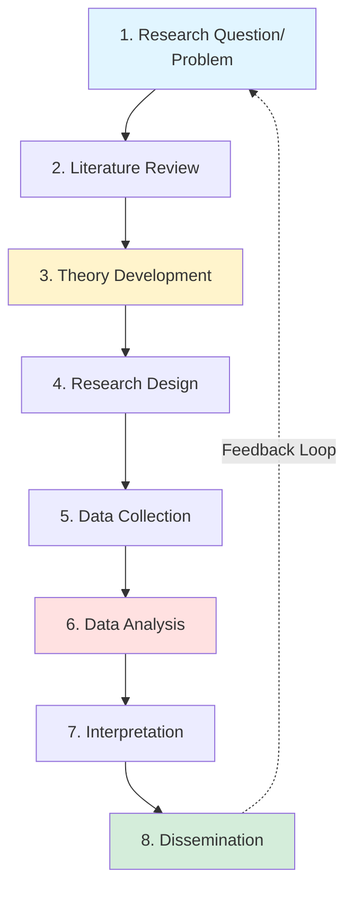
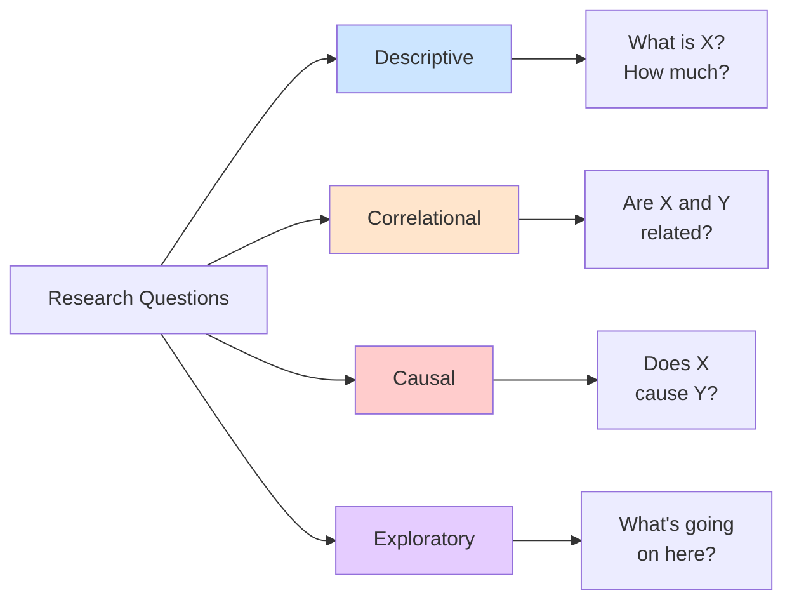

# The Research Process: From Question to Knowledge

## 🎯 The Big Picture

Research is a **systematic journey** from curiosity to knowledge. Understanding this journey helps you see how all research methods connect and why each step matters.

---

## 🗺️ The Complete Research Journey

---

## 📍 Phase 1: Research Question & Problem Identification

### What Makes a Good Research Question?

**FINER Criteria:**
- **F**easible: Can you actually study this?
- **I**nteresting: Does anyone care?
- **N**ovel: Does it add something new?
- **E**thical: Can it be done ethically?
- **R**elevant: Does it matter to theory or practice?

### Types of Research Questions

### Examples by Type

**Descriptive:**
- "What percentage of startups fail in the first year?"
- "How do managers spend their time?"

**Correlational:**
- "Is employee satisfaction related to productivity?"
- "Do companies with more R&D have higher profits?"

**Causal:**
- "Does flexible work increase employee retention?"
- "Does advertising spending increase sales?"

**Exploratory:**
- "How do entrepreneurs experience failure?"
- "What factors influence digital transformation success?"

---

*Part of: [[00-Index|Business Research Methods Course Notes]]*