# Theory Building and Testing

## 🎯 What is Theory?

**Theory explains WHY and HOW**, not just WHAT.

### The Essence of Theory

> "Theory is a systematic explanation of the relationships among phenomena" 

**Theory must:**
1. **Explain** causal mechanisms (not just describe)
2. **Be falsifiable** (can be proven wrong)
3. **Make predictions** (generate testable hypotheses)
4. **Have scope** (define boundary conditions)

---

## 🏗️ Components of Theory

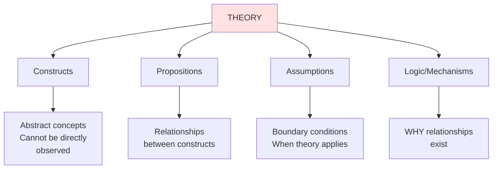

### 1. Constructs (Abstract Concepts)

**Definition**: Conceptual terms used to describe phenomena

**Examples:**
- Employee engagement
- Organizational culture
- Innovation capability
- Brand equity
- Leadership quality

**Key Point**: Constructs are **latent** (unobservable) - we can't directly measure "engagement," only indicators of it.

---

### 2. Propositions (Theoretical Relationships)

**Definition**: Statements about relationships between constructs

**Structure**: "Construct A affects Construct B"

**Examples:**
- P1: Higher employee engagement leads to greater organizational performance
- P2: Organizational culture moderates the relationship between leadership and innovation
- P3: Brand equity mediates the effect of advertising on sales

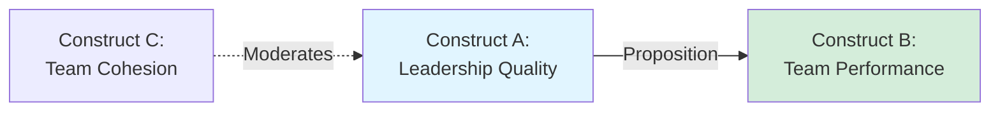

---

### 3. Assumptions (Boundary Conditions)

**Definition**: Conditions under which theory applies

**Examples:**
- "This theory applies to knowledge workers, not manual labor"
- "In stable environments (not turbulent markets)"
- "When information is freely available"

**Why Important**: No theory applies everywhere - assumptions define scope

---

### 4. Logic/Mechanisms (The "Why")

**Definition**: The causal explanation linking constructs

**Example:**

**Proposition**: Employee training increases productivity

**Logic/Mechanism**:
1. Training → New skills acquired
2. New skills → More efficient work methods
3. Efficient methods → Higher output per hour
4. Higher output → Productivity increase

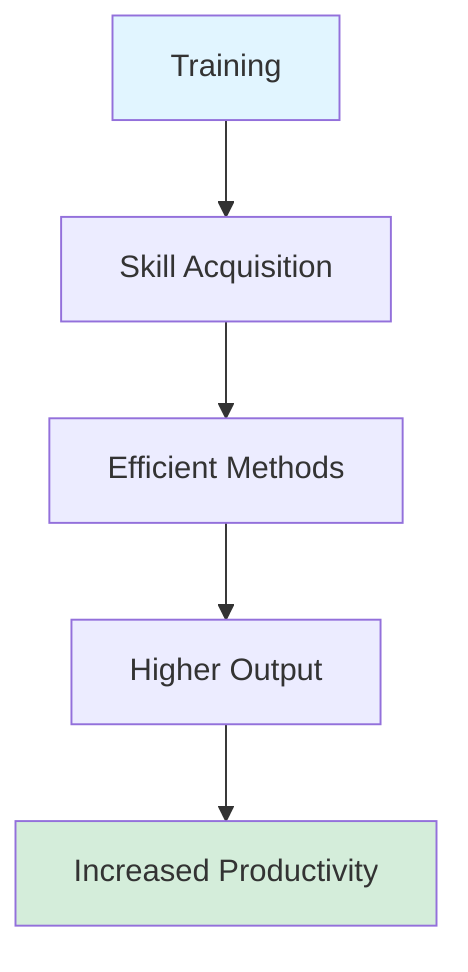

---

## 🔬 Theory vs. Related Concepts

### The Hierarchy of Knowledge

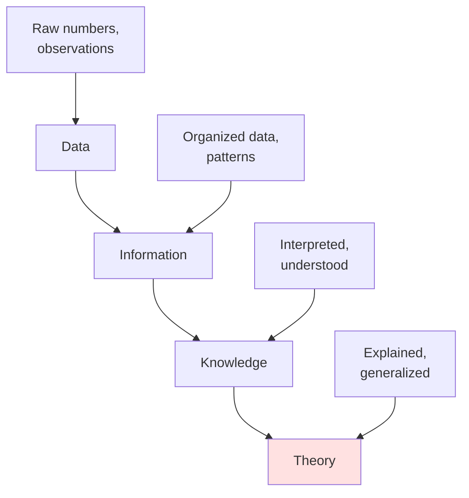

### Theory vs. Other Knowledge Forms

| Form | Purpose | Example | Explanation? |
|------|---------|---------|--------------|
| **Theory** | Explains why/how | "Expectancy theory explains motivation" | ✅ Yes |
| **Hypothesis** | Tests specific prediction | "Bonus increases sales by 20%" | ❌ No (test of theory) |
| **Model** | Represents relationships | "Supply-demand equilibrium" | ⚠️ Sometimes |
| **Framework** | Organizes concepts | "SWOT analysis" | ❌ No |
| **Typology** | Categorizes | "Types of strategies" | ❌ No |
| **Law** | Universal regularity | "Law of gravity" | ✅ Yes |

---

## 🌉 From Theory to Empirics: The Translation Process

### The Two Levels of Research

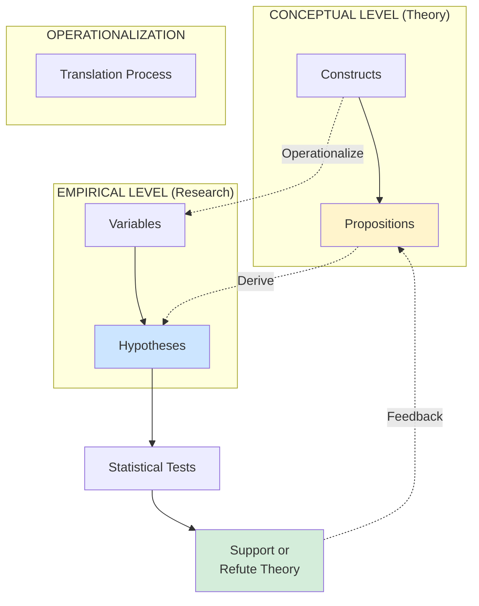

### Example Translation

**Conceptual Level:**
- **Construct**: Employee Engagement (abstract)
- **Proposition**: "Employee engagement positively affects organizational performance"

**Operationalization:**
- **Variable**: Engagement score (1-7 scale from survey)
- **Hypothesis**: "Companies with engagement scores >6 have 15% higher ROE"

**Empirical Test:**
- Collect engagement surveys
- Measure ROE from financial statements
- Run regression: ROE = β₀ + β₁(Engagement) + ε
- Test if β₁ > 0 and significant

---

## ✅ Characteristics of Good Theory

### Karl Popper's Falsifiability Criterion

**Good theory MUST be falsifiable** = capable of being proven wrong

**Why?** If a theory can't be proven wrong, it can't be proven right either!

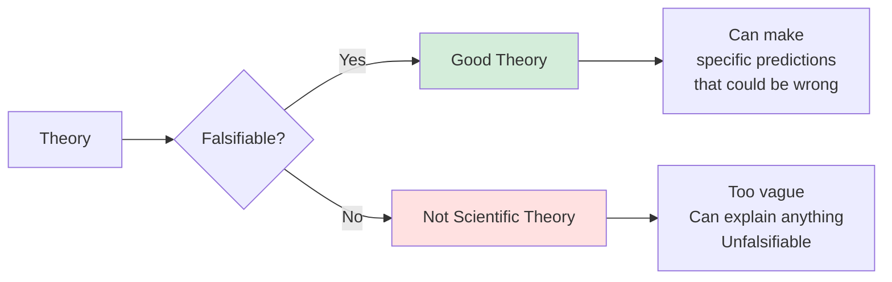

**Examples:**

**Falsifiable** (Good):
- "Incentives increase performance"
  - Can test: measure performance with/without incentives
  - Could be proven false

**Not Falsifiable** (Bad):
- "Success comes from positive energy"
  - Too vague - what's "positive energy"?
  - Any outcome can be explained away
  - Can't be proven wrong

---

### Criteria for Theory Quality

**1. Explanatory Power**
- Does it explain the phenomenon well?
- Does it account for observed patterns?

**2. Parsimony (Occam's Razor)**
- Simpler theories preferred (fewer assumptions)
- Don't overcomplicate

**3. Generalizability**
- Applies to broad range of contexts
- Not too narrow

**4. Precision**
- Makes specific predictions
- Not vague or ambiguous

**5. Empirical Support**
- Has been tested and supported
- Corroborated by evidence

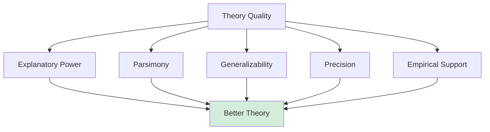

---

## 🏆 Theory Preference: Which Theory is Better?

**When comparing theories, prefer the one that:**

### Preference Criteria

✅ **Requires FEWER assumptions** (simpler)  
✅ **Makes MORE predictions** (broader scope)  
✅ **Has GREATER precision** (specific predictions)  
✅ **Has MORE empirical support** (tested and confirmed)  
✅ **Explains MORE phenomena** (wider applicability)

### Example Comparison

**Theory A: Charismatic Leadership Success**
- Assumption: Innovation succeeds when leader is charismatic, culture is innovative, market conditions favorable, competitors weak, and R&D budget high
- Predictions: Limited (specific conditions)
- **Score**: 5 assumptions, narrow scope ❌

**Theory B: Innovation Value Theory**
- Assumption: Innovation succeeds when perceived benefits exceed implementation costs
- Predictions: Broad (applies to many contexts)
- **Score**: 1 core assumption, broad scope ✅

**Winner**: Theory B (more parsimonious, broader)

---

## 🔄 Theory Development Process

### Inductive Theory Building (Bottom-Up)

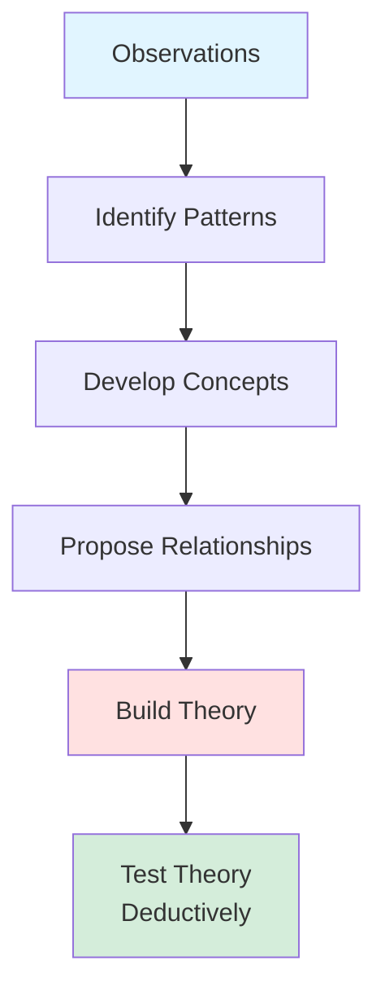

**Example Process:**
1. **Observe**: Interview 50 successful startups
2. **Pattern**: Notice they all pivoted at least twice
3. **Concept**: "Organizational adaptability"
4. **Relationship**: Adaptability → Success
5. **Theory**: "Startup success requires adaptive learning"
6. **Test**: Survey large sample, test hypothesis

**When to use**: Exploratory research, new phenomena

---

### Deductive Theory Testing (Top-Down)

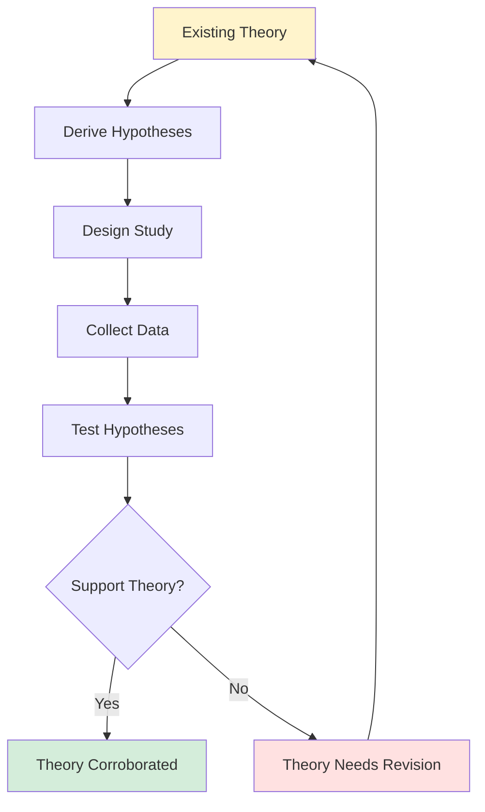

**Example Process:**
1. **Theory**: Expectancy theory (effort → performance → rewards → satisfaction)
2. **Hypothesis**: Clear performance metrics increase employee effort
3. **Design**: Experiment with/without clear metrics
4. **Collect**: Measure effort levels
5. **Test**: Compare groups statistically
6. **Result**: Support or reject hypothesis

**When to use**: Established theory exists, confirmatory research

---

## 🎓 The Role of Propositions

### Proposition Structure

**Basic Form**: X → Y

**Components:**
- **Independent Construct (X)**: The cause
- **Dependent Construct (Y)**: The effect
- **Relationship**: Direction and nature

### Types of Propositions

**1. Direct Relationship**

"Training increases performance"

**2. Moderation (Conditional)**

"Training increases performance, especially for motivated employees"

**3. Mediation (Mechanism)**

"Training increases performance through skill development"

**4. Nonlinear Relationship**
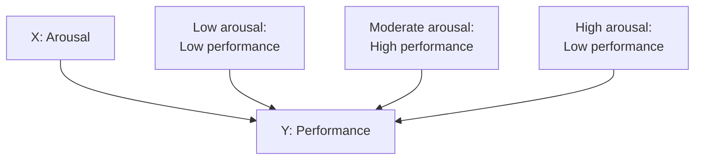
"Performance is highest at moderate arousal (inverted U)"

---

## 🔍 From Proposition to Hypothesis

### The Critical Translation

**Proposition** (Conceptual):
- "Employee engagement affects organizational performance"
- Uses abstract constructs
- Theory-level statement

**Hypothesis** (Empirical):
- "Companies with employee engagement scores above 6.0 will have 15% higher ROE than those below 4.0"
- Uses measurable variables
- Testable, specific prediction

### Good Hypothesis Characteristics (SMART-C)

**S**pecific: Clear, precise statement  
**M**easurable: Variables can be quantified  
**A**chievable: Can actually test it  
**R**elevant: Derived from theory  
**T**estable: Empirically verifiable  
**C**ausal: States direction of effect

### Examples: Bad vs. Good Hypotheses

❌ **Bad**: "Companies should be innovative"
- Not testable, no variables, no prediction

✅ **Good**: "Firms investing >5% revenue in R&D will launch 30% more new products than those investing <2%"
- Specific percentages, measurable, testable, causal

---

❌ **Bad**: "Training might help performance"
- Vague, no specificity, "might" is weak

✅ **Good**: "Employees receiving 40+ hours of training annually will show 20% higher performance ratings than those receiving <10 hours"
- Specific thresholds, measurable outcome, testable

---

## 🧪 Theory Testing: Corroboration vs. Proof

### Popper's Falsification Philosophy

**You can NEVER prove a theory true, only fail to prove it false**

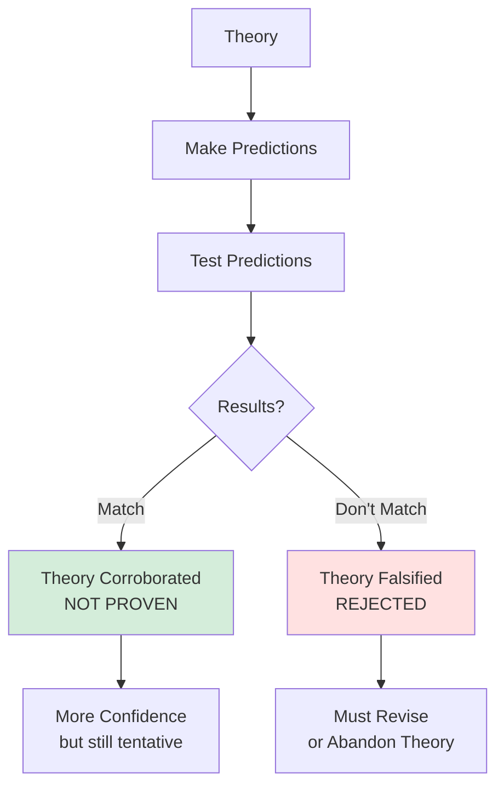

### The Logic

**Why can't we prove theory true?**
- Future observations might contradict it
- Could be an unobserved confound
- Limited scope of testing

**Example:**
- Theory: "All swans are white"
- Observation: 10,000 white swans
- **Status**: Corroborated (not proven)
- One black swan → Theory falsified!

### Scientific Progress Through Falsification

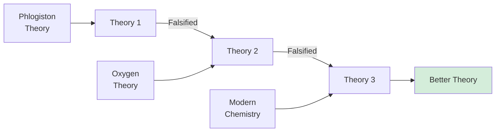

**Science progresses by:**
1. Proposing theories
2. Attempting to falsify them
3. Revising when falsified
4. Developing better theories

---

## 💼 Real Example: Herzberg's Two-Factor Theory

### The Theory

**Constructs:**
- Motivators (intrinsic factors)
- Hygiene factors (extrinsic factors)
- Job satisfaction
- Job dissatisfaction

**Propositions:**
- P1: Motivators (achievement, recognition) increase satisfaction but don't reduce dissatisfaction
- P2: Hygiene factors (salary, conditions) reduce dissatisfaction but don't increase satisfaction
- P3: Satisfaction and dissatisfaction are independent dimensions (not opposite ends)

**Mechanism**: Different psychological processes for satisfaction vs. dissatisfaction

### Translation to Research

**Variables:**
- Survey items measuring motivators
- Survey items measuring hygiene factors
- Overall satisfaction scale
- Turnover intention

**Hypotheses:**
- H1: Improvement in motivators correlates positively with satisfaction but not with dissatisfaction
- H2: Improvement in hygiene factors correlates negatively with dissatisfaction but not with satisfaction
- H3: Factor analysis reveals two independent dimensions

**Testing:**
- Survey employees on all factors
- Factor analysis to test independence
- Regression analysis to test predictions
- If results don't support → Theory falsified or needs revision

---

## 🎯 Theory Contribution Types

### Ways Research Contributes to Theory

**1. Theory Generation** (Inductive)
- Build new theory from observations
- Grounded theory approach
- **Example**: Discovering new motivational factors

**2. Theory Testing** (Deductive)
- Test existing theory predictions
- Confirm or disconfirm
- **Example**: Testing expectancy theory predictions

**3. Theory Extension**
- Apply theory to new contexts
- Test boundary conditions
- **Example**: Does motivation theory work in gig economy?

**4. Theory Refinement**
- Specify conditions more precisely
- Identify moderators
- **Example**: When does training NOT work?

**5. Theory Integration**
- Combine multiple theories
- Resolve contradictions
- **Example**: Integrate goal-setting and expectancy theories

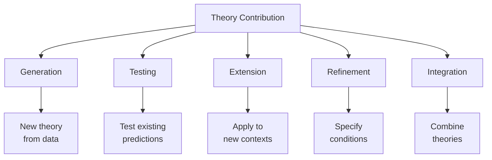

---

## 🚨 Common Theory Mistakes

### ❌ Mistake 1: Describing, Not Explaining

**Bad**: "Successful companies invest in training"
- Just describes correlation
- No mechanism, no why

**Good**: "Training increases performance because it develops skills that enable more efficient work processes"
- Explains mechanism
- Provides causal logic

---

### ❌ Mistake 2: Unfalsifiable Statements

**Bad**: "Success requires the right mindset"
- What's "right mindset"?
- Can explain any outcome
- Not testable

**Good**: "Growth mindset (believing abilities can develop) leads to higher persistence after failure, resulting in better long-term outcomes"
- Specific construct
- Testable
- Falsifiable

---

### ❌ Mistake 3: Confusing Levels

**Bad**: Mix constructs and variables
- "Employee engagement affects ROE"
- Mixes conceptual (engagement) with operational (ROE)

**Good**: Keep levels separate
- **Proposition**: "Employee engagement affects organizational performance"
- **Hypothesis**: "Engagement scores predict ROE"

---

## 🔑 Key Takeaways

1. **Theory explains WHY and HOW**, not just what
2. **Good theory is falsifiable** and makes specific predictions
3. **Propositions link constructs**; hypotheses link variables
4. **Theory can never be proven**, only corroborated or falsified
5. **Simpler theories preferred** (fewer assumptions)
6. **Theory must specify mechanisms**, not just relationships
7. **Research contributes** by generating, testing, extending, or refining theory

---

## 🔗 Related Notes
- [[01-Research-Process-Overview|Previous: Research Process Overview]]
- [[03-Deduction-vs-Induction|Next: Deductive vs. Inductive Reasoning]]
- [[04-Causality-and-Validity|Causality and Validity]]

---

## 📝 Practice Questions

1. What's the difference between a construct and a variable?
2. Why must good theory be falsifiable?
3. Which is better: a theory with 5 assumptions or 2 assumptions (all else equal)?
4. What are the four components of theory?
5. Can a theory ever be "proven" true?

**Answers:**
1. Construct is abstract (e.g., engagement); variable is measurable (e.g., survey score)
2. If it can't be proven wrong, it can't be scientifically tested
3. 2 assumptions (parsimony - simpler is better)
4. Constructs, propositions, assumptions, logic/mechanisms
5. No - only corroborated (not falsified yet)

---

*Part of: [[00-Index|Business Research Methods Course Notes]]*
