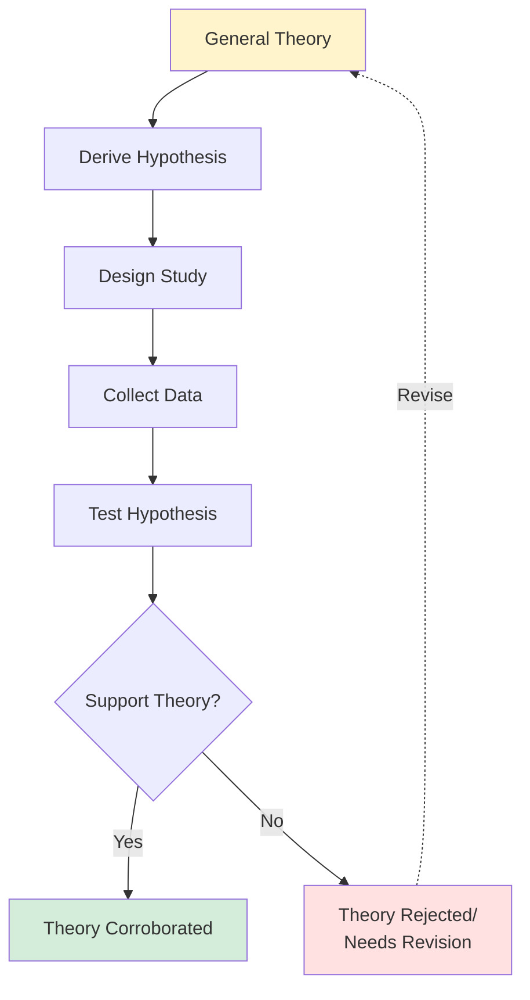
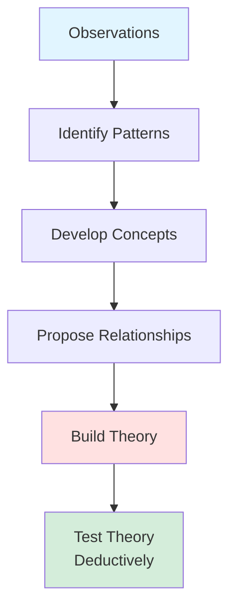
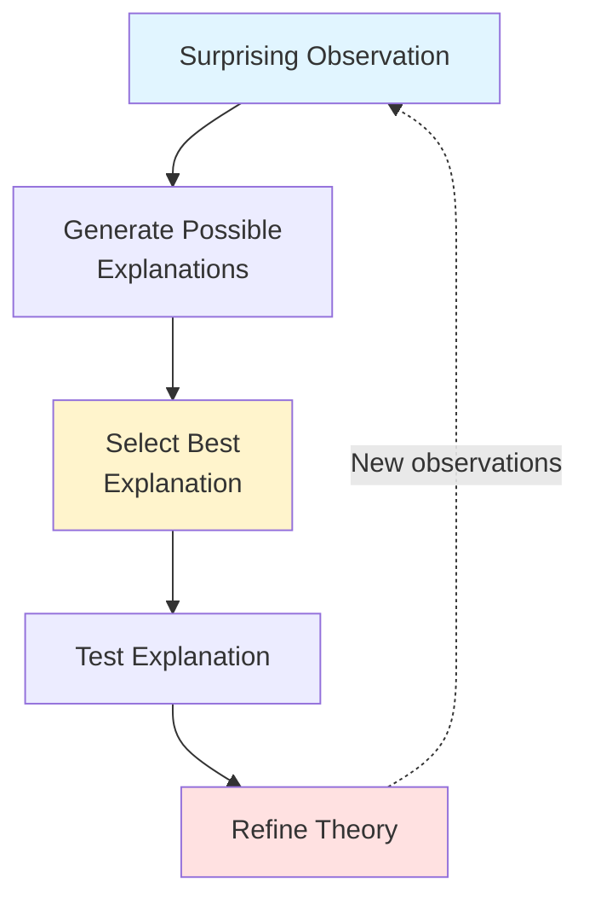
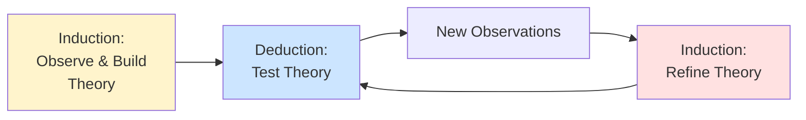

# Deductive vs. Inductive Reasoning

## 🎯 Two Paths to Knowledge

Research uses two fundamental logical approaches: **deduction** (top-down) and **induction** (bottom-up).

---

## 🔽 Deductive Reasoning (Theory → Data)

### Definition
**Reasoning from general theory to specific implications**

### The Deductive Process

### Characteristics

**✅ Starts with**: Existing theory  
**✅ Moves to**: Specific predictions  
**✅ Tests**: Whether predictions hold  
**✅ Common in**: Quantitative research  
**✅ Goal**: Test and refine theory  

---

### Example: Deductive Research

**Step 1 - General Theory**: Expectancy Theory of Motivation
- "People are motivated when they believe effort leads to performance, which leads to valued rewards"

**Step 2 - Derive Hypothesis**:
- H1: Employees with clear performance metrics will exert more effort than those without clear metrics
- H2: The effect will be stronger when rewards are valued

**Step 3 - Design Study**:
- Experiment: Randomly assign employees to clear vs. unclear metric conditions
- Measure: Effort level, performance, satisfaction

**Step 4 - Collect Data**:
- Survey 200 employees
- Track performance over 3 months

**Step 5 - Test Hypothesis**:
- t-test: Compare effort between groups
- Regression: Test moderation by reward value

**Step 6 - Results**:
- ✅ H1 supported (p < 0.01)
- ✅ H2 supported (p < 0.05)
- **Conclusion**: Theory corroborated

---

## 🔼 Inductive Reasoning (Data → Theory)

### Definition
**Reasoning from specific observations to general theory**

### The Inductive Process

### Characteristics

**✅ Starts with**: Observations/data  
**✅ Moves to**: General patterns  
**✅ Develops**: New theory  
**✅ Common in**: Qualitative research  
**✅ Goal**: Generate theory  

---

### Example: Inductive Research

**Step 1 - Observations**:
- Interview 50 successful startup founders
- No prior theory guiding questions
- Open-ended exploration

**Step 2 - Identify Patterns**:
- Notice: All founders mention pivoting at least twice
- Notice: All emphasize learning from failures
- Notice: All describe flexible planning processes

**Step 3 - Develop Concepts**:
- "Adaptive experimentation"
- "Failure tolerance"
- "Strategic flexibility"

**Step 4 - Propose Relationships**:
- Adaptive experimentation → Learning
- Learning → Strategic flexibility
- Strategic flexibility → Success

**Step 5 - Build Theory**:
- "Startup Success through Adaptive Learning Theory"
- Startups succeed by systematically experimenting, learning from failures, and adapting strategies

**Step 6 - Test Theory** (switch to deduction):
- Survey large sample
- Test predictions quantitatively

---

## ⚖️ Comparison

| Aspect | Deductive | Inductive |
|--------|-----------|-----------|
| **Direction** | General → Specific | Specific → General |
| **Starting Point** | Theory | Observations |
| **Process** | Test predictions | Discover patterns |
| **Logic** | If theory true, X should happen | X happened, what explains it? |
| **Method** | Usually quantitative | Usually qualitative |
| **Goal** | Confirm/reject theory | Generate theory |
| **Risk** | Confirming biases | Over-generalizing |
| **Example** | Testing gravity laws | Darwin observing finches |

---

## 🔄 Abductive Reasoning (The Third Way)

### Definition
**Inference to the best explanation**

### Characteristics
- Starts with surprising observation
- Works backward to explanation
- Iterates between data and theory
- Common in real research

**Example**:
- **Observation**: Firms with flat hierarchies innovate more
- **Possible explanations**: 
  1. Faster decisions
  2. More employee autonomy
  3. Better communication
  4. Selection effect (innovative firms choose flat structures)
- **Best explanation**: Test and refine through additional research

---

## 🎓 In Practice: Most Research Uses Both

### The Research Cycle

### Example: Complete Research Program

**Phase 1 - Inductive**:
- Qualitative study: Interview remote workers
- Find: Autonomy and flexibility are key themes
- Develop: Theory of Remote Work Satisfaction

**Phase 2 - Deductive**:
- Quantitative study: Survey 1000 remote workers
- Test: Does autonomy predict satisfaction?
- Result: Confirmed (r = 0.65, p < 0.001)

**Phase 3 - Inductive** (refinement):
- Unexpected finding: Effect weaker for extroverts
- New interviews: Why?
- Discover: Extroverts miss social interaction

**Phase 4 - Deductive** (test refinement):
- Test moderation: Personality moderates autonomy-satisfaction link
- Result: Confirmed

---

## 🎯 When to Use Each Approach

### Use DEDUCTION when:
✅ Strong existing theory  
✅ Need to test specific predictions  
✅ Confirmatory research  
✅ Large-scale quantitative study  
✅ Policy/practice decisions need evidence  

**Example Questions**:
- "Does training increase performance?" (test known theory)
- "Do incentives work as expected?" (test expectancy theory)

---

### Use INDUCTION when:
✅ New/unexplored phenomenon  
✅ Existing theory inadequate  
✅ Exploratory research  
✅ Theory building needed  
✅ Understanding meanings/processes  

**Example Questions**:
- "How do entrepreneurs experience failure?" (explore new area)
- "What enables digital transformation?" (build theory)

---

## 🚨 Common Mistakes

### ❌ Mistake 1: Claiming Induction Proves Theory
**Wrong**: "I observed 100 swans, all white, therefore all swans are white"
- Can't prove universal from specific observations
- One black swan falsifies

**Right**: "I observed patterns suggesting a theory, which needs testing"

---

### ❌ Mistake 2: Pure Deduction Without Theory Revision
**Wrong**: Theory rejected → Give up
**Right**: Theory rejected → Revise theory, test again

---

### ❌ Mistake 3: Confusing Data-Driven with Inductive
**Data-driven** = Let data guide analysis (but may still be deductive)  
**Inductive** = Build theory from observations

---

## 💡 Historical Examples

### Deductive Success: Newton
1. **Theory**: Laws of motion and gravity
2. **Prediction**: Planets should follow elliptical orbits
3. **Test**: Observe planetary motion
4. **Result**: Confirmed! Theory corroborated

### Inductive Success: Darwin
1. **Observations**: Finch beaks vary by island
2. **Pattern**: Beak shape matches food source
3. **Concept**: Adaptation to environment
4. **Theory**: Evolution by natural selection
5. **Later**: Tested deductively

---

## 🔍 Recognizing in Research Papers

### Deductive Paper Structure
1. Introduction: "Theory X predicts..."
2. Hypotheses: "We expect that..."
3. Method: "To test these hypotheses..."
4. Results: "Hypothesis 1 was supported..."
5. Discussion: "Results confirm theory..."

### Inductive Paper Structure
1. Introduction: "Little is known about..."
2. Method: "We conducted interviews..."
3. Findings: "Three themes emerged..."
4. Theory: "We propose that..."
5. Discussion: "This theory explains..."

---

## 🎯 Exam Tips

**Keywords for Deduction**:
- "reasoning from general theory to specific implications"
- "testing hypotheses"
- "deriving predictions"
- "top-down"

**Keywords for Induction**:
- "reasoning from specific implications to general theory"
- "building theory from data"
- "discovering patterns"
- "bottom-up"

**Trick**: Direction matters!
- Deduction: Theory → Hypothesis → Data
- Induction: Data → Pattern → Theory

---

## 🔑 Key Takeaways

1. **Deduction** = Theory → Data (testing)
2. **Induction** = Data → Theory (building)
3. **Most research uses BOTH** iteratively
4. **Neither is "better"** - depends on research goal
5. **Deduction tests**; **induction generates**
6. **Real science cycles** between both approaches

---

## 🔗 Related Notes
- [[02-Theory-Building-and-Testing|Theory Building and Testing]]
- [[01-Research-Process-Overview|Research Process Overview]]
- [[30-Qualitative-Overview|Qualitative Research (often inductive)]]

---

*Part of: [[00-Index|Business Research Methods Course Notes]]*
