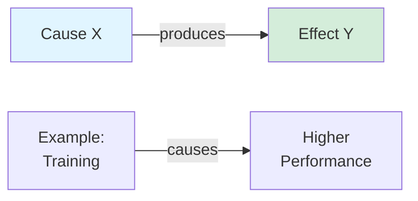
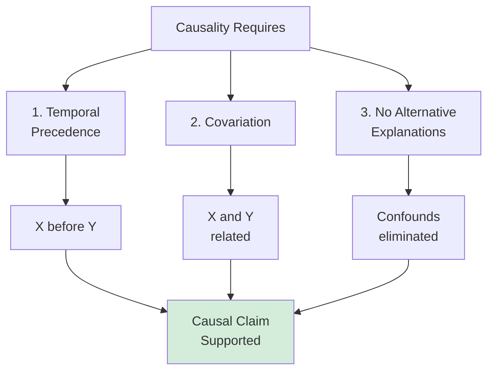
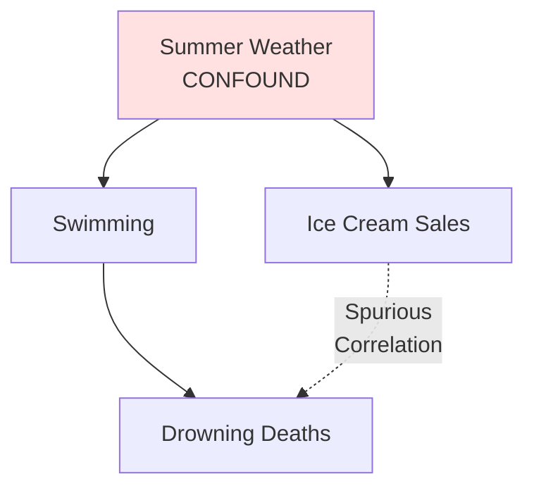
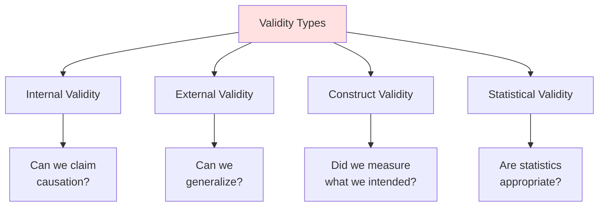
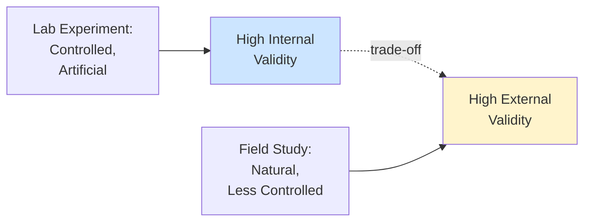

# Understanding Causality and Validity

## 🎯 The Causality Challenge

**Core Question**: How do we know if X causes Y?

This is the most important question in research, and the hardest to answer definitively.

---

## 🔗 What is Causality?

**Causality**: X causes Y if changes in X produce changes in Y

### Three Criteria for Causality (Bradford Hill)

**1. Temporal Precedence**
- Cause must come BEFORE effect
- X must occur before Y

**2. Covariation**
- X and Y must be related
- When X changes, Y changes

**3. No Alternative Explanations**
- No confounding variables
- Ruled out other possible causes

---

## 🎪 The Correlation-Causation Problem

**The Golden Rule**: **Correlation ≠ Causation**

### Example: Ice Cream and Drowning

**Observation**: Ice cream sales correlate with drowning deaths

**Does ice cream cause drowning?** NO!

**Confound**: Summer weather causes both
- Hot weather → More ice cream sales
- Hot weather → More swimming → More drowning

---

## ✅ Types of Validity

---

## 🎯 Internal Validity

**Definition**: Confidence that IV causes DV (not confounds)

**The Question**: "Is the effect real and causal?"

### Threats to Internal Validity

**1. Confounding Variables**
- Third variable causes both X and Y

**2. Reverse Causality**
- Y might cause X (not X causes Y)

**3. Selection Bias**
- Groups differ before treatment

**4. History**
- External events during study

**5. Maturation**
- Natural changes over time

**6. Testing Effects**
- Measurement itself causes changes

---

## 🌍 External Validity

**Definition**: Can results generalize to other contexts?

**The Question**: "Does it work in the real world?"

### Types of External Validity

**1. Population Validity**
- Generalize to other people

**2. Ecological Validity**
- Generalize to other settings

**3. Temporal Validity**
- Generalize to other times

---

## ⚖️ The Validity Trade-off

**The Dilemma**: Can't maximize both simultaneously!

---

## 🔑 Key Takeaways

1. **Causality requires**: Temporal order + Covariation + No alternatives
2. **Correlation ≠ Causation**: Watch for confounds
3. **Internal validity**: Confidence in causation
4. **External validity**: Generalizability
5. **Trade-off exists**: Internal vs. external validity
6. **Experiments**: Best for internal validity
7. **Field studies**: Best for external validity

---

*Part of: [[00-Index|Business Research Methods Course Notes]]*
