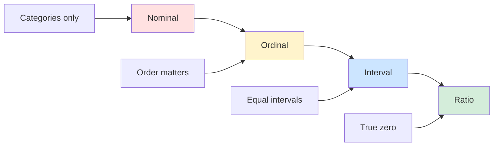
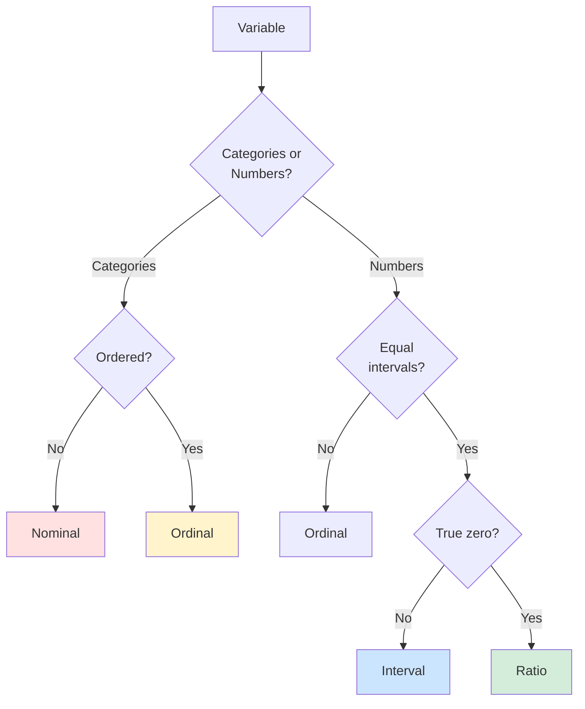

# Measurement Scales: Nominal to Ratio

## 🎯 Stevens' Typology

**The Four Levels of Measurement** determine what statistical operations are valid.

---

## 1️⃣ Nominal Scale (Categories)

### Definition
**Categories with NO inherent order**

### Characteristics
- ✅ Can classify
- ❌ Cannot rank
- ❌ No mathematical operations

### Examples
- Gender (Male, Female, Other)
- Country (Germany, USA, China)
- Brand preference (Apple, Samsung, Google)
- Product type (A, B, C)
- Yes/No questions

### Valid Operations
- **Mode** (most frequent category)
- **Frequency counts**
- **Chi-square test**
- **Percentages**

### Invalid Operations
❌ Mean (what's average of Male/Female?)
❌ Standard deviation
❌ Correlation

---

## 2️⃣ Ordinal Scale (Rankings)

### Definition
**Ordered categories, but intervals NOT equal**

### Characteristics
- ✅ Can classify
- ✅ Can rank
- ❌ Intervals unequal
- ❌ No true zero

### Examples
- Education level (HS < Bachelor < Master < PhD)
- **Likert scales** (Strongly Disagree ... Strongly Agree)
- Rankings (1st, 2nd, 3rd place)
- Performance ratings (Poor, Fair, Good, Excellent)
- Socioeconomic status (Low, Middle, High)

### The Interval Problem
Distance from Poor→Fair ≠ Fair→Good ≠ Good→Excellent

### Valid Operations
- **Median** (middle value)
- **Percentiles** (quartiles)
- **Rank correlation** (Spearman's ρ)
- **Non-parametric tests** (Mann-Whitney, Kruskal-Wallis)

### Questionable (But Common)
⚠️ **Mean and SD** (technically invalid, but often used for Likert)
⚠️ **Parametric tests** (t-test, ANOVA, regression)

---

## 3️⃣ Interval Scale (Equal Intervals)

### Definition
**Equal intervals between values, NO true zero**

### Characteristics
- ✅ Can classify
- ✅ Can rank
- ✅ Equal intervals
- ❌ No true zero (zero is arbitrary)

### Examples
- **Temperature in Celsius/Fahrenheit** (0° doesn't mean "no temperature")
- IQ scores (IQ of 0 doesn't mean "no intelligence")
- Calendar years (year 0 is arbitrary)
- Standardized test scores (SAT, GRE)

### Why No True Zero Matters
- Can't say "20°C is twice as hot as 10°C"
- Can't calculate ratios meaningfully

### Valid Operations
- **Mean, standard deviation**
- **Correlation, regression**
- **t-tests, ANOVA**
- **Addition and subtraction** (10°-5° = 5° difference)

### Invalid Operations
❌ **Multiplication/division** (20°C is NOT "twice as hot" as 10°C)
❌ **Ratios** (100 IQ is NOT "twice as smart" as 50 IQ)

---

## 4️⃣ Ratio Scale (True Zero)

### Definition
**Equal intervals AND true zero (absence of quantity)**

### Characteristics
- ✅ Can classify
- ✅ Can rank
- ✅ Equal intervals
- ✅ True zero

### Examples
- **Height** (0 cm = no height)
- **Weight** (0 kg = no weight)
- **Age** (0 years = birth)
- **Income** (€0 = no income)
- **Number of employees**
- **Reaction time**
- **Sales revenue**

### Valid Operations
- **ALL arithmetic operations**
- **ALL statistics**
- **Meaningful ratios** (€100 IS twice €50)
- **Geometric mean, coefficient of variation**

---

## 📊 Summary Comparison Table

| Feature | Nominal | Ordinal | Interval | Ratio |
|---------|---------|---------|----------|-------|
| **Categories** | ✅ | ✅ | ✅ | ✅ |
| **Order** | ❌ | ✅ | ✅ | ✅ |
| **Equal intervals** | ❌ | ❌ | ✅ | ✅ |
| **True zero** | ❌ | ❌ | ❌ | ✅ |
| **Mode** | ✅ | ✅ | ✅ | ✅ |
| **Median** | ❌ | ✅ | ✅ | ✅ |
| **Mean** | ❌ | ⚠️ | ✅ | ✅ |
| **Add/Subtract** | ❌ | ❌ | ✅ | ✅ |
| **Multiply/Divide** | ❌ | ❌ | ❌ | ✅ |
| **Ratios meaningful** | ❌ | ❌ | ❌ | ✅ |

---

## 🎓 The Likert Scale Debate

### The Controversy

**Technically**: Likert scales are **ordinal**
- Distance 1→2 may not equal 4→5
- Should use median, non-parametric tests

**In Practice**: Treated as **interval**
- Researchers calculate means, use parametric tests
- With 5-7 points, approximates interval
- Robust to violations with large samples

### Best Practice
1. Use **multiple items** (not single Likert item)
2. Report both parametric and non-parametric tests if concerned
3. Check distribution visually
4. With large n, parametric tests robust

---

## 🔍 Identifying Scale Type

### Decision Tree

---

## 💼 Examples by Field

### Business Research

| Variable | Scale Type | Reasoning |
|----------|------------|-----------|
| Revenue | Ratio | €0 = no revenue, ratios meaningful |
| Profit margin | Ratio | 0% = no profit |
| Customer satisfaction (1-5) | Ordinal | Likert scale |
| Industry | Nominal | No order (Tech, Finance, Retail) |
| Company size (Small/Med/Large) | Ordinal | Ordered but intervals unequal |
| Number of employees | Ratio | 0 = no employees |
| Stock price | Ratio | $0 = worthless |

---

## 🚨 Common Mistakes

### ❌ Mistake 1: Treating Nominal as Ordinal
**Wrong**: Calculating mean of gender (1=Male, 2=Female)
- Mean of 1.6 is meaningless!

### ❌ Mistake 2: Ratios on Interval Scales
**Wrong**: "20°C is twice as hot as 10°C"
- Convert to Kelvin: 293K vs 283K (NOT 2:1 ratio!)

### ❌ Mistake 3: Forgetting Scale Determines Tests
**Wrong**: Using t-test on nominal data
**Right**: Use chi-square for nominal data

---

## 🔑 Key Takeaways

1. **Scale type determines valid operations**
2. **Nominal**: Categories only (mode, χ²)
3. **Ordinal**: Order matters (median, rank tests)
4. **Interval**: Equal intervals, no true zero (mean, parametric tests, but no ratios)
5. **Ratio**: True zero, all operations valid
6. **Likert scales**: Technically ordinal, often treated as interval
7. **Check your scale type before analysis**

---

*Part of: [[00-Index|Business Research Methods Course Notes]]*
