# Reliability and Validity in Measurement

## 🎯 The Quality of Measurement

**Two fundamental questions about any measurement:**
1. **Reliability**: Are results consistent?
2. **Validity**: Are we measuring what we think we're measuring?

---

## 🔁 Reliability: Consistency

### Definition
**Reliability** = The degree to which a measurement produces consistent results

**Key Idea**: If we measure the same thing repeatedly, do we get the same answer?

### The Bathroom Scale Analogy

---

## 📊 Types of Reliability

### 1. Test-Retest Reliability

**Definition**: Same results when administered at different times

**Process**:
- Measure at Time 1
- Wait (days/weeks)
- Measure at Time 2
- Calculate correlation between T1 and T2

**Acceptable**: r > 0.70

**Issues**:
- ⚠️ Too short gap: Memory effects
- ⚠️ Too long gap: True change may occur
- ⚠️ Practice effects: Learning from first test

**Example**:
- IQ test today: Score = 115
- IQ test next week: Score = 113
- Correlation: r = 0.85 ✅ (good test-retest reliability)

---

### 2. Inter-Rater Reliability

**Definition**: Different observers reach same conclusions

**Process**:
- Two+ raters independently rate same content
- Calculate agreement

**Measures**:
- **Cohen's Kappa** (κ): For categorical data
  - κ < 0.40: Poor
  - κ 0.40-0.60: Moderate
  - κ 0.60-0.80: Good
  - κ > 0.80: Excellent

- **Intraclass Correlation (ICC)**: For continuous data
  - ICC > 0.75: Good

**Example**:
- Two researchers code interview transcripts for "innovation mentions"
- Researcher A: 45 mentions
- Researcher B: 43 mentions
- Agreement: 90% ✅

---

### 3. Internal Consistency (Most Common)

**Definition**: Items within scale correlate with each other

**Logic**: If items measure same construct, they should relate

**Cronbach's Alpha (α)**:

Formula: α = (k/(k-1)) × (1 - Σσᵢ²/σₜₒₜₐₗ²)

**Interpretation**:
- α < 0.60: ❌ Unacceptable
- α 0.60-0.70: ⚠️ Questionable  
- α 0.70-0.80: ✅ Acceptable
- α 0.80-0.90: ✅ Good
- α > 0.90: ✅ Excellent (but may indicate redundancy)

**Example**:
Job Satisfaction Scale (5 items):
- "I enjoy my work" 
- "I feel fulfilled at work"
- "Work gives me purpose"
- "I'm satisfied with my job"
- "I look forward to work"

If α = 0.85 → Good internal consistency ✅

---

### 4. Split-Half Reliability

**Definition**: Divide scale in half, correlate halves

**Process**:
- Split items into two groups
- Calculate score for each half
- Correlate the two halves

**Issue**: Which split? (odd/even, first/last, random?)

---

## ✓ Validity: Accuracy

### Definition
**Validity** = The degree to which a measure actually captures what it claims to measure

**Key Idea**: Are we measuring the right thing?

### The Target Analogy

```mermaid
graph TD
    A[High Reliability<br/>High Validity] --> A1["●●●<br/>●●●<br/>All shots in bullseye"]
    
    B[High Reliability<br/>Low Validity] --> B1["      ●●●<br/>      ●●●<br/>Consistent but wrong target"]
    
    C[Low Reliability<br/>High Validity] --> C1["● ●  ●<br/> ●  ●<br/>Around bullseye but scattered"]
    
    D[Low Reliability<br/>Low Validity] --> D1["●  ●  ●<br/>  ●  ●<br/>Scattered and wrong"]
    
    style A fill:#d4edda
    style B fill:#fff4cc
    style C fill:#ffe1e1
    style D fill:#ffcccc
```

---

## 📐 Types of Validity

### 1. Face Validity

**Definition**: Does it LOOK like it measures what it should?

**Assessment**: Subjective judgment

**Example**:
- Measure job satisfaction with: "I am satisfied with my job" ✅ Has face validity
- Measure job satisfaction with: "I like pizza" ❌ No face validity

**Limitation**: Superficial - just because it looks right doesn't mean it is!

---

### 2. Content Validity

**Definition**: Does it cover ALL aspects of the construct?

**Assessment**: Expert judgment

**Example**:
Measuring "Teaching Quality" should include:
- ✅ Knowledge of subject
- ✅ Communication skills
- ✅ Student engagement
- ✅ Assessment fairness
- ❌ Just "Students like teacher" → Incomplete! Poor content validity

**Process**:
1. Define construct comprehensively
2. Generate items for all facets
3. Experts review coverage
4. Refine items

---

### 3. Construct Validity (The Big One)

**Definition**: Does it actually measure the theoretical construct?

**Two Sub-Types**:

#### A. Convergent Validity
**Definition**: Correlates with other measures of SAME construct

**Logic**: Different measures of same thing should relate

**Example**:
- New job satisfaction scale should correlate with:
  - Established satisfaction scales (r > 0.70)
  - Related constructs: engagement, commitment

**Test**: r between your measure and similar measures

---

#### B. Discriminant Validity  
**Definition**: Does NOT correlate with measures of DIFFERENT constructs

**Logic**: Should distinguish from unrelated concepts

**Example**:
- Job satisfaction scale should NOT highly correlate with:
  - Intelligence (different construct)
  - Age (demographic, not satisfaction)
  - Height (completely unrelated)

**Test**: r between your measure and dissimilar measures should be low

---

### The Validity Matrix

|  | Should Correlate (Convergent) | Should NOT Correlate (Discriminant) |
|--|-------------------------------|-------------------------------------|
| **Job Satisfaction** | Engagement, Commitment, Organizational satisfaction | Intelligence, Personality (mostly), Demographics |
| **Leadership Quality** | Manager ratings, 360 feedback, Team performance | Employee age, Company size, Industry |

---

### 4. Criterion Validity

**Definition**: Predicts relevant outcomes

**Two Sub-Types**:

#### A. Concurrent Validity
**Definition**: Correlates with current outcome

**Example**:
- SAT scores correlate with current GPA
- Job aptitude test correlates with current performance

#### B. Predictive Validity
**Definition**: Predicts future outcome

**Example**:
- SAT scores predict future college GPA
- Interview scores predict future job performance
- Engagement scores predict future turnover

---

### 5. Nomological Validity

**Definition**: Behaves as theory predicts in larger network

**Example**:
Theory says: Training → Skills → Performance → Promotions

If your "Skills" measure valid, it should:
- Correlate with training received
- Predict performance
- Relate to promotions
- Fit in theoretical network

---

## ⚖️ Reliability vs. Validity Relationship

### The Critical Rule

**Can you be valid without being reliable?** ❌ NO

**Can you be reliable without being valid?** ✅ YES

**Why?**
- If measurements inconsistent → can't accurately measure anything
- If measurements consistent but wrong → reliable but invalid

---

## 🎯 Improving Reliability

### Strategies

**1. More Items**
- Single item: Unreliable
- Multiple items: More reliable
- Cronbach's α increases with # of items

**2. Clear Items**
- Avoid ambiguous wording
- Simple language
- One idea per item

**3. Standardized Procedures**
- Same instructions for all
- Same conditions
- Trained administrators

**4. Pilot Testing**
- Test with small sample first
- Check reliability
- Refine before main study

---

## 🎯 Improving Validity

### Strategies

**1. Literature Review**
- Use established measures when possible
- Build on validated scales
- Learn from past mistakes

**2. Expert Review**
- Subject matter experts check content
- Assess face validity
- Suggest improvements

**3. Pilot Testing**
- Check convergent/discriminant validity
- Test predictive validity where possible
- Refine based on results

**4. Multiple Methods**
- Triangulation
- Different measurement approaches
- Reduces method bias

---

## 🚨 Common Mistakes

### ❌ Mistake 1: Confusing the Two
**Wrong**: "High α = valid measure"
**Right**: "High α = reliable measure, but need to check validity separately"

### ❌ Mistake 2: Ignoring Face Validity
Even if statistically valid, if it looks wrong to participants → problems

### ❌ Mistake 3: Single-Item Measures
"Rate your satisfaction 1-7"
- ❌ Unreliable (no internal consistency check)
- ⚠️ Use multi-item scales

---

## 💼 Real Example: Job Satisfaction Measure

### Development Process

**Step 1**: Define construct
- "Positive emotional state from job experiences"

**Step 2**: Generate items (10 items)
- Multiple facets: work, pay, colleagues, growth

**Step 3**: Pilot test (n=100)
- Calculate Cronbach's α = 0.78 ✅
- **Reliability**: Good

**Step 4**: Check convergent validity
- Correlate with established satisfaction scale
- r = 0.75 ✅ **Convergent validity**: Good

**Step 5**: Check discriminant validity
- Correlate with unrelated constructs
- With intelligence: r = 0.05 ✅ **Discriminant validity**: Good

**Step 6**: Check predictive validity
- Predicts turnover? Yes (r = -0.45) ✅
- **Predictive validity**: Good

**Conclusion**: Reliable and valid measure! ✅

---

## 📊 Statistical Checks Summary

| Type | Test | Threshold |
|------|------|-----------|
| **Reliability** |
| Test-Retest | Correlation | r > 0.70 |
| Internal Consistency | Cronbach's α | α > 0.70 |
| Inter-Rater | Cohen's κ / ICC | κ > 0.60 / ICC > 0.75 |
| **Validity** |
| Convergent | Correlation with similar | r > 0.70 |
| Discriminant | Correlation with different | r < 0.30 |
| Predictive | Correlation with outcome | Depends on theory |

---

## 🔑 Key Takeaways

1. **Reliability** = Consistency; **Validity** = Accuracy
2. **Validity requires reliability**, but not vice versa
3. **Cronbach's α** most common reliability measure (α > 0.70)
4. **Convergent validity**: Correlates with similar measures
5. **Discriminant validity**: Doesn't correlate with different measures
6. **Always check both** - neither alone is sufficient
7. **Multi-item scales** more reliable than single items

---

## 🔗 Related Notes
- [[05-Measurement-Scales|Measurement Scales]]
- [[07-Survey-Design|Survey Design]]
- [[26-Factor-Analysis|Factor Analysis for Validation]]

---

*Part of: [[00-Index|Business Research Methods Course Notes]]*
