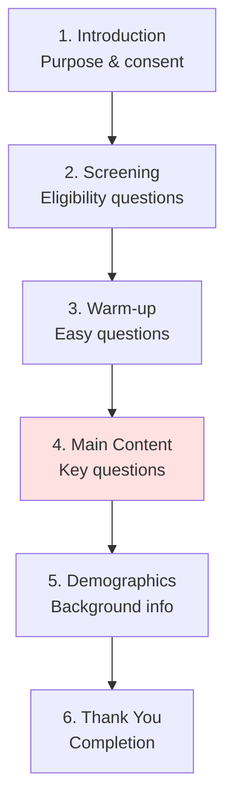

# Survey Design and Question Types

## 🎯 The Art of Asking Questions

Survey design determines the quality of data you collect. Poor questions = poor data = poor conclusions.

---

## 📝 Open-Ended vs. Closed-Ended Questions

### Open-Ended Questions

**Definition**: Respondents answer in their own words

**Examples:**
- "What do you think about remote work?"
- "Describe your experience with our product."
- "Why did you choose this career?"

**Advantages:**
✅ Rich, detailed responses
✅ Unexpected insights
✅ Don't limit answers
✅ Explore unknown territory

**Disadvantages:**
❌ Time-consuming to analyze
❌ Requires coding
❌ Lower response rates
❌ Variable response quality

**When to Use:**
- Exploratory research
- Pilot studies
- Qualitative data needed
- Don't know answer options

---

### Closed-Ended Questions

**Definition**: Respondents choose from predefined options

**Examples:**
- "How satisfied are you? (1-5)"
- "Which product do you prefer? (A/B/C)"
- "Do you work remotely? (Yes/No)"

**Advantages:**
✅ Easy to analyze
✅ Quick to answer
✅ Higher response rates
✅ Comparable across respondents

**Disadvantages:**
❌ May miss unexpected answers
❌ Force into categories
❌ Need to predict options
❌ Less rich information

**When to Use:**
- Confirmatory research
- Large samples
- Need quantitative data
- Know answer options

---

## 🎨 Types of Closed Questions

### 1. Multiple Choice

**Example:**
"Which best describes your role?"
- □ Individual contributor
- □ Team lead
- □ Manager
- □ Executive

---

### 2. Rating Scales

**Example:**
"Rate your satisfaction: 1 (very dissatisfied) to 7 (very satisfied)"

---

### 3. Likert Scales

**Example:**
"I feel engaged at work"
- Strongly Disagree
- Disagree
- Neutral
- Agree
- Strongly Agree

---

### 4. Semantic Differential

**Example:**
"Our service is:"
Slow 1--2--3--4--5--6--7 Fast
Expensive 1--2--3--4--5--6--7 Affordable

---

## ✍️ Writing Good Questions

### The Golden Rules

**1. Be Specific and Precise**

❌ Bad: "Do you like this product?"
✅ Good: "How satisfied are you with the product's durability? (1-7)"

**2. Avoid Double-Barreled Questions**

❌ Bad: "Are you satisfied with price and quality?"
✅ Good: Two separate questions

**3. Use Simple Language**

❌ Bad: "To what extent do you utilize technological solutions?"
✅ Good: "How often do you use technology?"

**4. Avoid Leading Questions**

❌ Bad: "Don't you agree remote work is better?"
✅ Good: "What is your opinion on remote work?"

**5. Provide Mutually Exclusive Options**

❌ Bad: Age ranges overlap (20-30, 30-40)
✅ Good: 20-29, 30-39, 40-49

---

## 🎯 Common Survey Biases

### 1. Social Desirability Bias
People give socially acceptable answers

**Solution**: Anonymity, indirect questions

### 2. Acquiescence Bias
Tendency to agree with statements

**Solution**: Reverse-coded items

### 3. Response Order Effects
First/last options chosen more

**Solution**: Randomize order

### 4. Question Order Effects
Earlier questions influence later

**Solution**: Carefully order questions

---

## 📊 Survey Structure

### Recommended Flow

---

## 🔑 Key Takeaways

1. **Closed questions** for large samples, quantitative
2. **Open questions** for exploration, qualitative
3. **Be specific** and precise in wording
4. **Avoid bias** through careful design
5. **Pilot test** before full deployment
6. **Keep surveys short** (<15 minutes)

---

*Part of: [[00-Index|Business Research Methods Course Notes]]*
