# Sampling: From Population to Sample

## 🎯 The Fundamental Sampling Problem

**The Challenge**: We want to know about a **population**, but we can only study a **sample**.

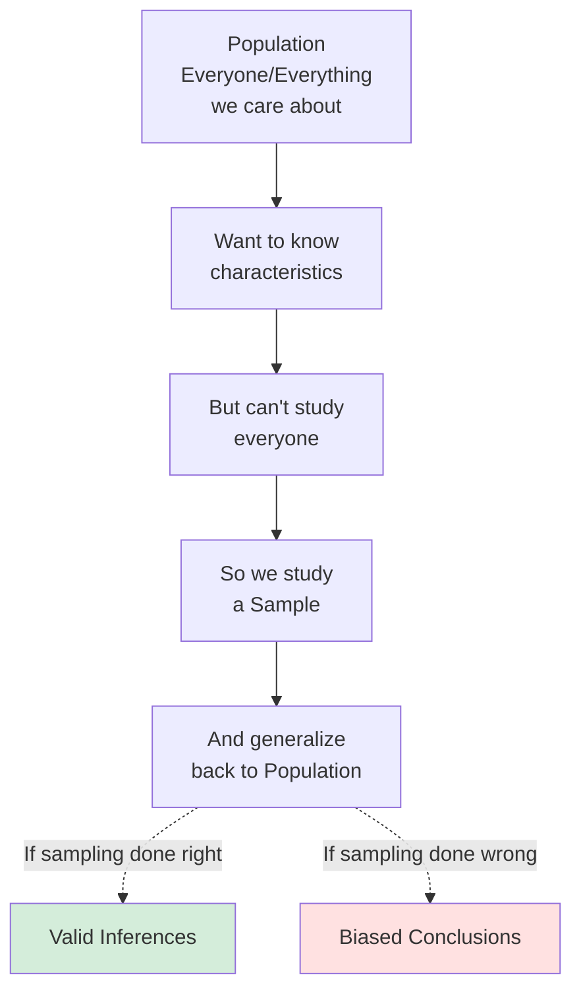

---

## 📊 Key Terms

| Term | Definition | Example |
|------|------------|---------|
| **Population** | Complete set of units of interest | All TUM students |
| **Sample** | Subset actually studied | 200 randomly selected TUM students |
| **Sampling Frame** | List from which sample drawn | TUM student database |
| **Sampling Unit** | Individual element selected | One student |
| **Parameter** | Population characteristic (unknown) | True mean GPA of ALL TUM students (μ) |
| **Statistic** | Sample characteristic (known) | Sample mean GPA of 200 students (x̄) |

### The Inference Goal

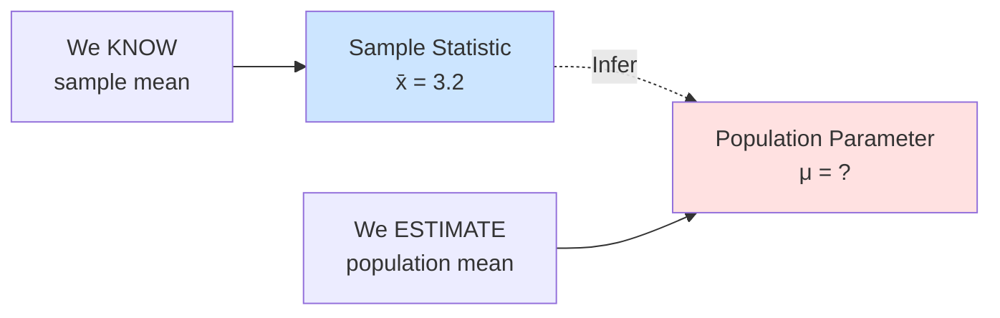

---

## 🎲 The Critical Distinction: Probability vs. Non-Probability

### Probability Sampling

**Definition**: Every unit has a **known, non-zero probability** of selection

**Key Features:**
✅ Random selection  
✅ Can calculate sampling error  
✅ Can generalize statistically  
✅ Unbiased estimates  

**When to Use:**
- Need to generalize to population
- Want statistical inference
- Have access to sampling frame
- Quantitative research

---

### Non-Probability Sampling

**Definition**: Selection based on **researcher judgment**, not random chance

**Key Features:**
❌ No random selection  
❌ Can't calculate sampling error  
❌ Limited statistical generalization  
⚠️ May be biased  

**When to Use:**
- Exploratory research
- Hard-to-reach populations
- Qualitative studies
- Theory building (not testing)

---

## 📐 The Sampling Distribution Concept

**Key Idea**: If we took many samples, what would the distribution of sample means look like?

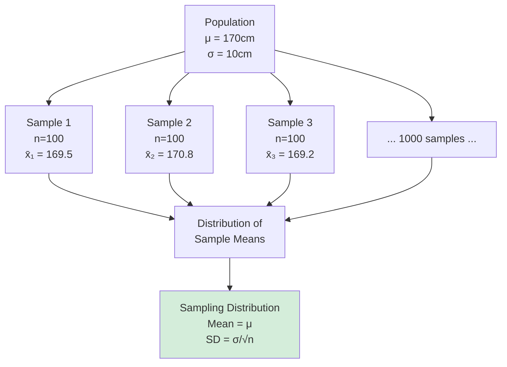

### Central Limit Theorem

**Magic of CLT**: Sample means are normally distributed, even if population isn't!

**Properties:**
1. Mean of sample means = population mean (μ)
2. SD of sample means = σ/√n (**standard error**)
3. As n increases, distribution becomes more normal

**Implications:**
- Larger samples → smaller standard error → more precise estimates
- Can construct confidence intervals
- Can do hypothesis testing

---

## ⚖️ Sample Size and Standard Error

### The Formula

**Standard Error (SE)** = σ / √n

Where:
- σ = population standard deviation
- n = sample size

### The Relationship

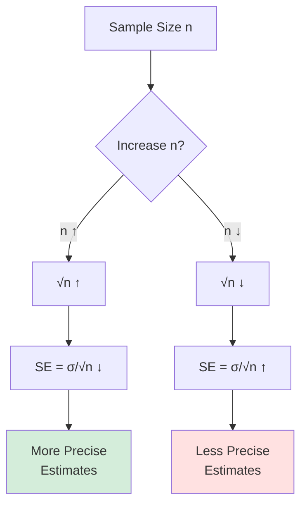

### Example Calculation

**Population**: Height with σ = 10cm

| Sample Size | Standard Error | 95% CI Width |
|-------------|---------------|--------------|
| n = 25 | 10/√25 = 2.0cm | ±3.92cm |
| n = 100 | 10/√100 = 1.0cm | ±1.96cm |
| n = 400 | 10/√400 = 0.5cm | ±0.98cm |
| n = 1600 | 10/√1600 = 0.25cm | ±0.49cm |

**Key Insight**: To halve the SE, quadruple the sample size!

---

## 🎯 Probability Sampling Methods

### 1. Simple Random Sampling (SRS)

**Definition**: Every unit has equal probability of selection

**Process:**
1. Number all units in population (1 to N)
2. Use random number generator
3. Select n units

**Advantages:**
✅ Simple, unbiased  
✅ Easy to understand  
✅ Valid statistical inference  

**Disadvantages:**
❌ Need complete sampling frame  
❌ May miss small subgroups  
❌ Can be inefficient  

**Example:**
- Population: 10,000 TUM students
- Sample: Use computer to randomly select 500 student IDs
- Each student has 500/10,000 = 5% chance

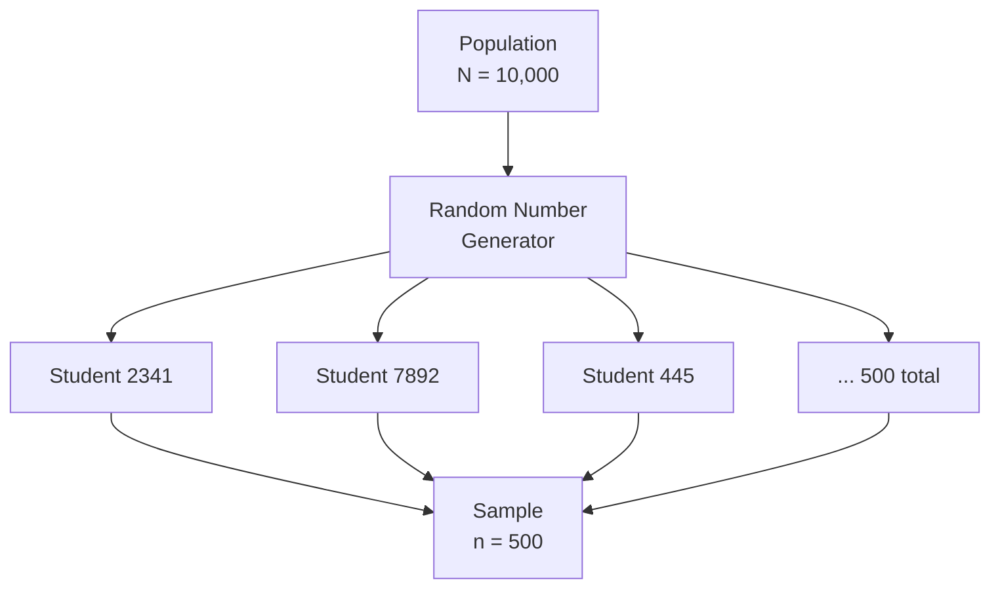

---

### 2. Stratified Random Sampling

**Definition**: Divide population into **mutually exclusive strata**, then random sample from each

**Process:**
1. Divide population into homogeneous groups (strata)
2. Randomly sample from each stratum
3. Sample size per stratum can be proportional or disproportional

**Advantages:**
✅ Ensures representation of all subgroups  
✅ More precise than SRS (lower SE)  
✅ Can compare subgroups  

**Disadvantages:**
❌ Need information to create strata  
❌ More complex  

**Example:**
TUM student satisfaction study

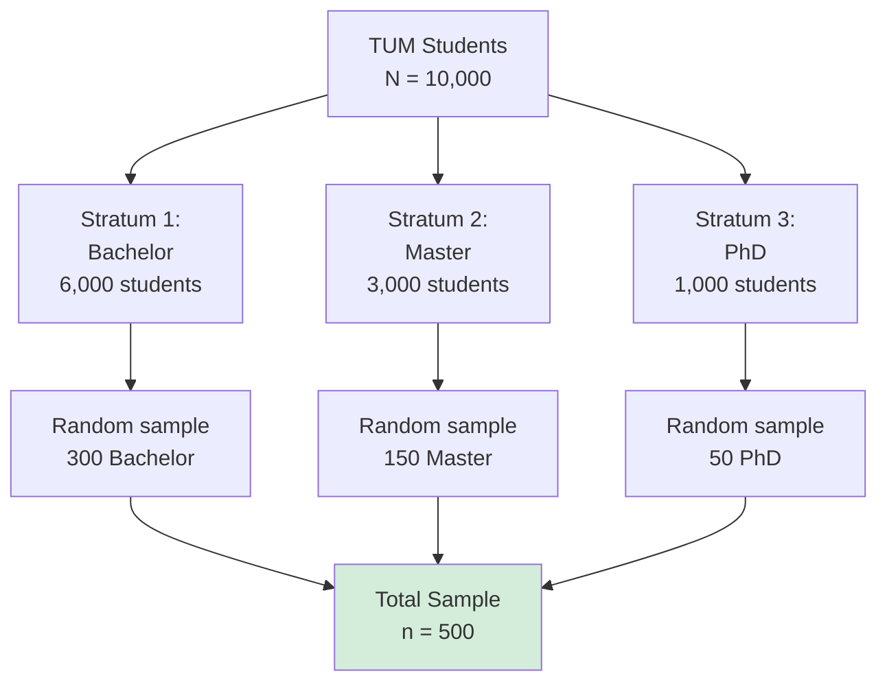

**Proportional vs. Disproportional:**

**Proportional**: Sample fraction same for all strata
- Bachelor: 60% of population → 60% of sample (300)
- Master: 30% → 30% (150)
- PhD: 10% → 10% (50)

**Disproportional**: Oversample small groups
- Bachelor: 60% → 40% (200)
- Master: 30% → 30% (150)
- PhD: 10% → 30% (150) ← Oversample!
- **Why**: Ensure enough PhDs to analyze separately

---

### 3. Cluster Sampling

**Definition**: Randomly select **groups (clusters)**, then sample all or some within selected clusters

**Process:**
1. Divide population into clusters (geographic areas, organizations)
2. Randomly select clusters
3. Sample all units in selected clusters (one-stage) OR randomly sample within clusters (two-stage)

**Advantages:**
✅ More practical/economical  
✅ Don't need complete population list  
✅ Reduces travel costs  

**Disadvantages:**
❌ Less precise than SRS (higher SE)  
❌ Units within clusters similar (less information)  

**Example:**
Study of German high school students

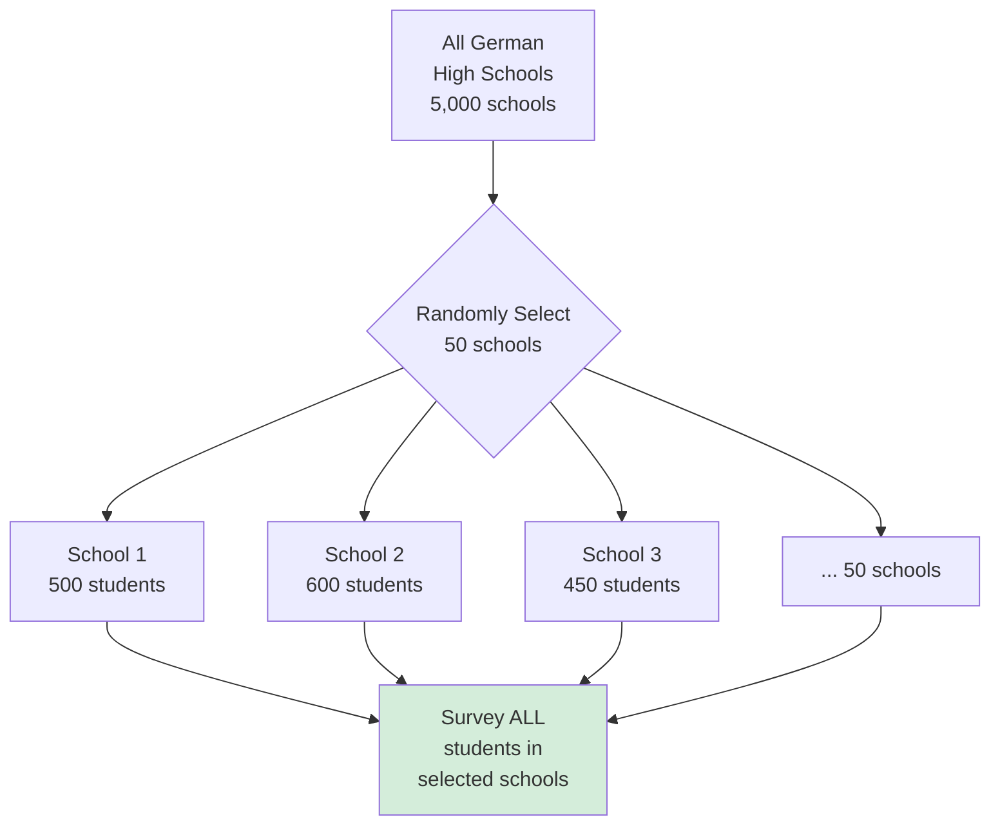

**Stratified vs. Cluster:**

| Aspect | Stratified | Cluster |
|--------|-----------|---------|
| **Divide by** | Characteristics | Geography/groups |
| **Groups** | Homogeneous within | Heterogeneous within |
| **Sample** | From ALL strata | From SOME clusters |
| **Precision** | Higher | Lower |
| **Cost** | Higher | Lower |

---

### 4. Systematic Sampling

**Definition**: Select every **kth** unit from list

**Process:**
1. Calculate k = N/n (sampling interval)
2. Random start between 1 and k
3. Select every kth unit thereafter

**Example:**
- Population: 10,000 students
- Desired sample: 500
- k = 10,000/500 = 20
- Random start: 7
- Select: 7, 27, 47, 67, 87, ... (every 20th)

**Advantages:**
✅ Simple to implement  
✅ Spreads sample across population  

**Disadvantages:**
❌ If list has pattern, can bias results  
❌ Not truly random  

---

## 🎯 Non-Probability Sampling Methods

### 1. Convenience Sampling

**Definition**: Sample whoever is easily accessible

**Examples:**
- Survey people at shopping mall
- Use MTurk workers
- Study your own students

**Advantages:**
✅ Fast and cheap  
✅ Easy to implement  

**Disadvantages:**
❌ Highly biased  
❌ Can't generalize  
❌ Self-selection issues  

**When acceptable:**
- Pilot testing
- Exploratory research
- Some experiments (if random assignment used)

---

### 2. Quota Sampling

**Definition**: Non-random selection to meet predetermined quotas (like stratified but not random)

**Process:**
1. Determine quotas for subgroups
2. Recruit until quotas filled
3. No random selection

**Example:**
- Need 100 men, 100 women
- Recruit at mall until quotas met
- Interviewer chooses who to approach

**Advantages:**
✅ Ensures representation  
✅ More practical than stratified  

**Disadvantages:**
❌ Selection bias within quotas  
❌ Can't calculate sampling error  

---

### 3. Purposive/Judgment Sampling

**Definition**: Researcher deliberately selects "information-rich" or "typical" cases

**Types:**
- **Typical case**: Select average/representative cases
- **Extreme/Deviant case**: Select unusual cases
- **Critical case**: "If it works here, it works anywhere"
- **Homogeneous**: Similar cases for focused analysis
- **Maximum variation**: Diverse cases to capture range

**Examples:**
- Interview "leading experts" in AI
- Study "most innovative" companies
- Select "typical" startup for case study

**Advantages:**
✅ Gets relevant information  
✅ Useful for qualitative research  
✅ Efficient for limited resources  

**Disadvantages:**
❌ Researcher bias  
❌ No statistical generalization  
❌ Analytical generalization only  

---

### 4. Snowball Sampling

**Definition**: Initial participants recruit additional participants from their networks

**Process:**
1. Identify initial participants (seeds)
2. Ask them to refer others
3. Referred people refer more
4. Continue until target reached

**Visual:**
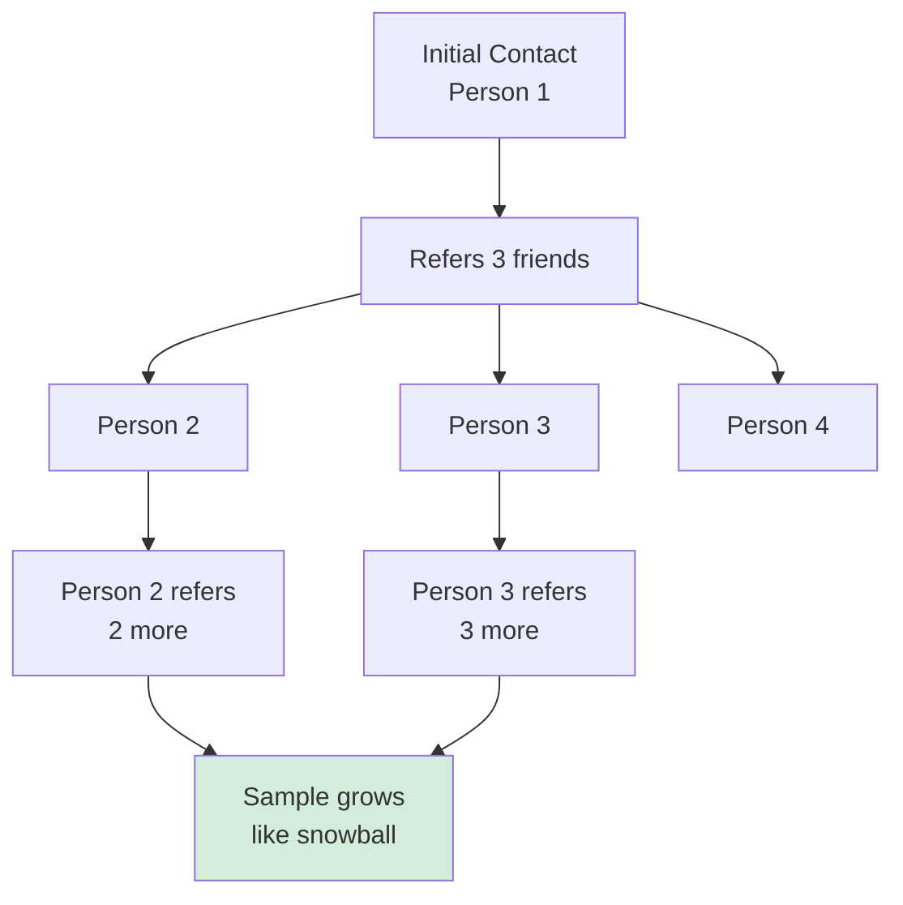

**When to Use:**
- Hidden/hard-to-reach populations
- Drug users, illegal immigrants
- Rare characteristics
- Tight-knit communities

**Advantages:**
✅ Access hidden populations  
✅ Builds trust through referrals  
✅ Low cost  

**Disadvantages:**
❌ Very biased (network effects)  
❌ Hard to track sampling  
❌ No statistical inference  

**Exam Trap**: All other "snow-" words are made up! Only snowball is real!
- ❌ Snowman sampling
- ❌ Snowflake sampling
- ❌ Snowboard sampling

---

### 5. Theoretical Sampling

**Definition**: Sample driven by emerging theory (grounded theory approach)

**Process:**
1. Start with initial sample
2. Collect and analyze data
3. Theory begins to emerge
4. Sample additional cases to test/develop theory
5. Continue until **theoretical saturation**

**Example:**
Studying startup failure:
1. Interview 5 failed founders
2. Notice pattern about funding issues
3. Purposely sample more cases with/without funding problems
4. Theory emerges about funding's role
5. Stop when no new insights

**Advantages:**
✅ Develops rich theory  
✅ Flexible, responsive  
✅ Efficient for theory building  

**Disadvantages:**
❌ No statistical generalization  
❌ Time-intensive  
❌ Requires ongoing analysis  

---

## 📊 Sampling Error and Bias

### Types of Error

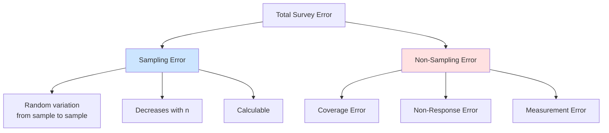

### Sampling Error

**Definition**: Random variation due to sampling

**Characteristics:**
- **Inevitable** (unless census)
- **Quantifiable** (standard error)
- **Decreases** with sample size
- **Not really an "error"** - just uncertainty

**Formula**: SE = σ/√n

---

### Sampling Bias

**Definition**: Systematic error in sample selection

**Types:**

**1. Selection Bias**
- Sampling frame doesn't match population
- Example: Phone survey excludes people without phones

**2. Non-Response Bias**
- People who don't respond differ from those who do
- Example: Satisfied customers less likely to complete survey

**3. Volunteer Bias**
- Self-selected participants differ from population
- Example: Online survey - motivated people respond

**4. Undercoverage**
- Part of population not in sampling frame
- Example: Homeless people not in address lists

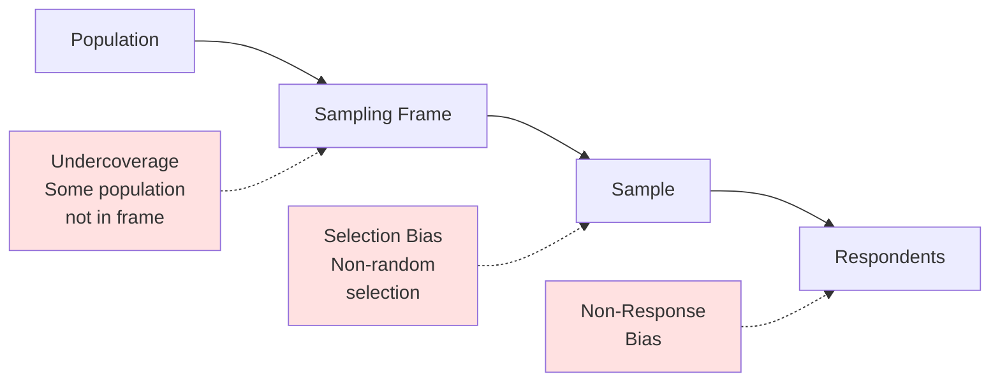

---

## 🎓 Choosing the Right Sampling Method

### Decision Framework

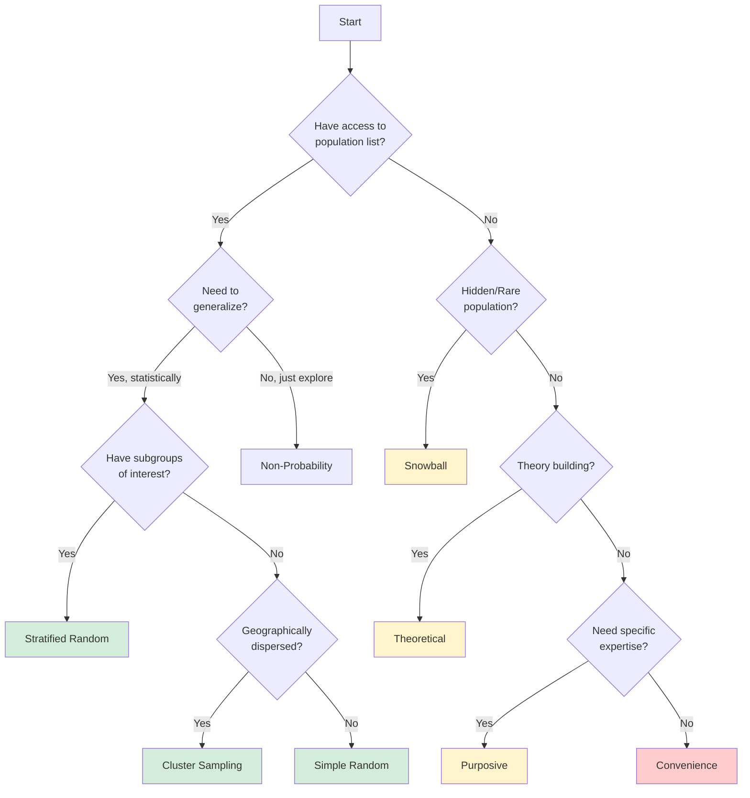

---

## 🔑 Key Takeaways

1. **Probability sampling** allows statistical generalization; **non-probability** doesn't
2. **Standard error** = σ/√n - increases with σ, decreases with n
3. **Stratified sampling** more precise than simple random
4. **Cluster sampling** less precise but more practical
5. **Snowball sampling** for hidden populations
6. **Sample size** affects precision exponentially (need 4x sample for 2x precision)
7. **Sampling bias** is worse than sampling error (can't be reduced by increasing n)

---

## 🔗 Related Notes
- [[10-Probability-Sampling|Next: Probability Sampling Details]]
- [[11-Non-Probability-Sampling|Non-Probability Sampling Details]]
- [[16-Descriptive-Statistics|Descriptive Statistics]]

---

*Part of: [[00-Index|Business Research Methods Course Notes]]*
