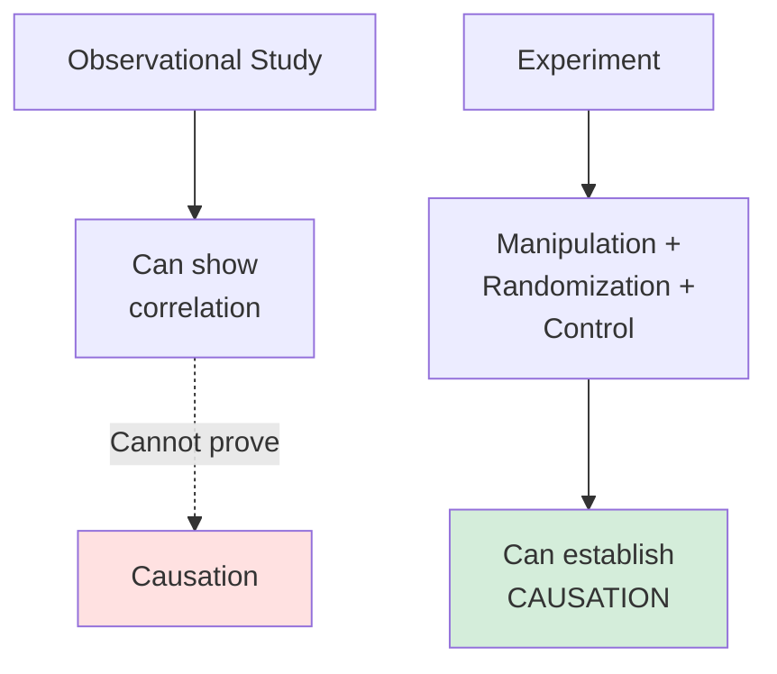
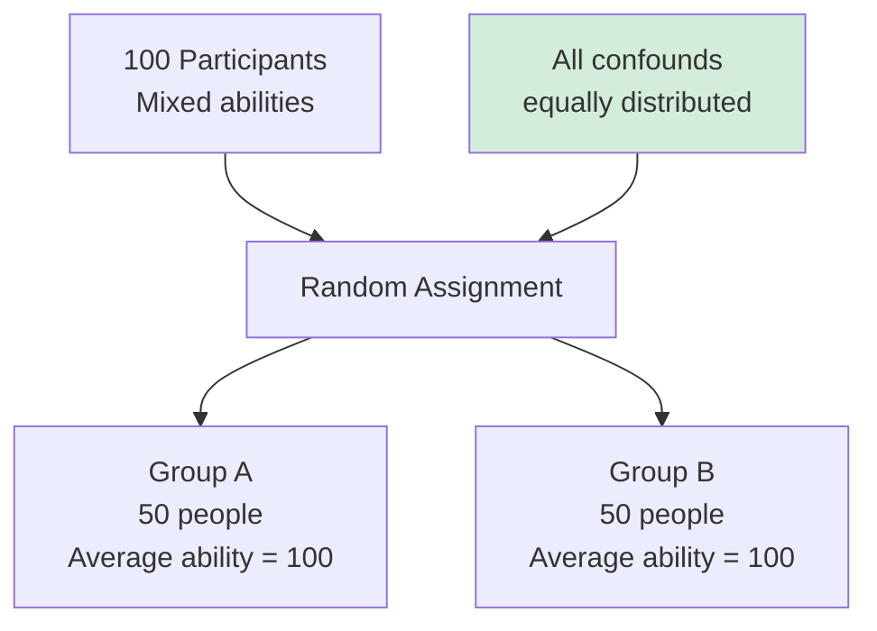

# Experimental Fundamentals

## 🎯 What Makes It an Experiment?

An **experiment** is a research design where the researcher:
1. **Actively manipulates** the independent variable
2. **Controls** extraneous variables  
3. **Measures** the effect on dependent variable
4. **Randomly assigns** participants (ideal experiment)

---

## 🔬 Why Experiments Are Special

### The Causality Advantage

**Only experiments** can establish causality with high confidence!



**Why?**
- **Manipulation**: Establishes temporal precedence (cause before effect)
- **Randomization**: Eliminates confounds
- **Control**: Rules out alternative explanations

---

## 🏗️ Essential Elements

### 1. Manipulation (Treatment)

**Definition**: Researcher actively changes the independent variable

**Example**: Training Effectiveness Study
- **NOT manipulation**: Survey people who did/didn't get training (observational)
- **IS manipulation**: Randomly assign people to receive/not receive training (experimental)

**Key**: YOU control who gets what

---

### 2. Control

**Definition**: Hold constant or eliminate confounding variables

**Methods**:

**a) Control Group**
- Baseline comparison
- Receives no treatment or standard treatment
- Example: No training (control) vs. Training (treatment)

**b) Hold Constant**
- Same conditions for all
- Example: Same room, time of day, instructions

**c) Balance Through Randomization**
- Random assignment distributes confounds equally
- Example: Smart and less-smart people equally in both groups

**d) Measure and Control Statistically**
- Include covariates in analysis
- Example: Control for prior knowledge in analysis

---

### 3. Random Assignment

**Definition**: Each participant has equal chance of being in any condition

**Critical Distinction**:
- **Random ASSIGNMENT** ≠ Random SAMPLING
- Random assignment: Who goes in which group
- Random sampling: Who participates at all

**Why It Works**:


**Eliminates**:
- Selection bias
- Systematic differences between groups
- All confounds (observed and unobserved!)

---

## 📊 Basic Experimental Designs

### 1. Post-Test Only Design

**Structure**:
```
Random → Treatment → Measure
Random → Control   → Measure
```

**Example**:
- Randomly assign to ad A or ad B
- Show ad
- Measure purchase intention

**Advantage**: Simple, no pre-test effects
**Disadvantage**: Can't assess change

---

### 2. Pre-Test Post-Test Design

**Structure**:
```
Measure → Random → Treatment → Measure
Measure → Random → Control   → Measure
```

**Example**:
- Measure satisfaction
- Randomly assign to training
- Measure satisfaction again

**Advantage**: Can see change, more sensitive
**Disadvantage**: Pre-test may influence post-test

---

### 3. Solomon Four-Group Design

**Structure**:
```
Group 1: Pre-test → Treatment → Post-test
Group 2: Pre-test → Control → Post-test
Group 3: Treatment → Post-test (no pre-test)
Group 4: Control → Post-test (no pre-test)
```

**Purpose**: Test for pre-test effects
**Disadvantage**: Requires more participants

---

## 🎭 Between vs. Within Subjects

### Between-Subjects

**Definition**: Each participant in ONE condition only

**Example**:
- Group A sees ad version 1
- Group B sees ad version 2
- Different people in each group

**Advantages**:
✅ No carryover effects
✅ Simpler analysis
✅ Shorter time per person

**Disadvantages**:
❌ Need more participants
❌ Individual differences between groups (noise)
❌ Lower power

---

### Within-Subjects

**Definition**: Each participant in ALL conditions

**Example**:
- Everyone sees ad version 1, then ad version 2
- Same people in all conditions

**Advantages**:
✅ Fewer participants needed
✅ Each person is own control
✅ Higher power

**Disadvantages**:
❌ Carryover effects
❌ Order effects
❌ Practice/fatigue effects
❌ Longer time per person

**Solution**: **Counterbalancing**
- Half do A→B, half do B→A
- Cancels out order effects

---

## 🔍 Variables in Experiments

### Independent Variable (IV)

**What**: The variable manipulated by researcher
**Also called**: Treatment, factor, predictor
**Example**: Type of training (A vs. B vs. Control)

**Levels**: Different values/conditions of IV
- Binary: Training vs. No training
- Multiple: Low dose, Medium dose, High dose

---

### Dependent Variable (DV)

**What**: The outcome measured
**Also called**: Response variable, outcome
**Example**: Job performance, sales, satisfaction

**Must be**:
- Measurable
- Related to research question
- Affected by IV (in theory)

---

### Confounding Variables

**What**: Variables that affect DV and correlate with IV
**Problem**: Can't tell if IV or confound caused DV change

**Example**:
- Study training effect on performance
- Confound: Motivated people more likely to volunteer for training
- Can't tell: Training effect or motivation effect?

**Solution**: Control through randomization!

---

## 🎯 Manipulation Checks

### Purpose
Verify that manipulation actually worked

**Example**:
- Manipulate fear in advertising (high fear vs. low fear)
- **Manipulation check**: "How fearful did this ad make you feel?"
- If high-fear group NOT more fearful → manipulation failed!

**When to Do**:
- Pilot study (before main experiment)
- Or after treatment, before DV (in main study)

---

## 🚨 Pilot Testing

### Why Pilot?

**Test**:
- Does manipulation work?
- Are instructions clear?
- Is timing appropriate?
- Are measures reliable?
- Any unexpected issues?

**Process**:
1. Run small-scale version (n=20-50)
2. Check manipulation
3. Debrief participants
4. Identify problems
5. Refine procedures
6. Run main study

---

## 💡 Control Group Types

### 1. No-Treatment Control
- Receives nothing
- Pure baseline

### 2. Placebo Control
- Receives inert treatment
- Controls for expectations/attention

### 3. Active Control
- Receives standard/alternative treatment
- Tests if new treatment better than existing

**Example**:
Study new training method
- Treatment: New training
- Active control: Traditional training
- Tests: Is new method BETTER than current practice?

---

## 🔑 Ideal Experiment Characteristics

### From Exam (Q23)

**Essential**:
✅ At least one variable **actively manipulated**
✅ **Control** ensures elimination of confounding variables
✅ **Randomized allocation** of participants
✅ **Systematic procedures** in manipulation

**NOT Essential**:
❌ Measuring change in confounding variables
- Should CONTROL them, not just measure!

---

## 🎓 Lab vs. Field Experiments

### Lab Experiment

**Setting**: Artificial, controlled environment
**Example**: University computer lab

**Advantages**:
✅ High control
✅ Can isolate effects
✅ High internal validity
✅ Easier to replicate

**Disadvantages**:
❌ Artificial setting
❌ Demand characteristics
❌ Low external validity
❌ WEIRD samples

---

### Field Experiment

**Setting**: Natural, real-world environment
**Example**: Actual workplace, marketplace

**Advantages**:
✅ Realistic setting
✅ Natural behavior
✅ High external validity
✅ Real stakeholders

**Disadvantages**:
❌ Less control
❌ More confounds
❌ Harder to replicate
❌ More expensive

---

## 📐 Sample Size Determination

### Power Analysis

**Before study**: Calculate needed sample size

**Factors**:
- **Effect size**: How big is the expected difference?
- **Power**: Usually 0.80 (80% chance of detecting effect)
- **Alpha**: Usually 0.05 (Type I error rate)

**Rule of Thumb**:
- Small effect: ~400 per group
- Medium effect: ~64 per group
- Large effect: ~26 per group

**Always do power analysis!** Don't just guess sample size.

---

## 🚨 Common Mistakes

### ❌ Mistake 1: No Random Assignment
**Wrong**: Let people choose their group
**Right**: Randomly assign to groups

### ❌ Mistake 2: Confusing Correlation with Causation
**Wrong**: "People who exercise are healthier" → Exercise causes health
**Right**: Need experiment (randomly assign exercise) to prove causation

### ❌ Mistake 3: Not Controlling Confounds
**Wrong**: Different experimenters for different conditions
**Right**: Same experimenter or randomize experimenter

---

## 🔑 Key Takeaways

1. **Experiments** = Manipulation + Control + Random assignment
2. **Only experiments** can establish causality with high confidence
3. **Random assignment** is critical (eliminates confounds)
4. **Manipulation check** verifies treatment worked
5. **Pilot testing** catches problems before main study
6. **Between-subjects**: Different people per condition
7. **Within-subjects**: Same people all conditions

---

*Part of: [[00-Index|Business Research Methods Course Notes]]*
