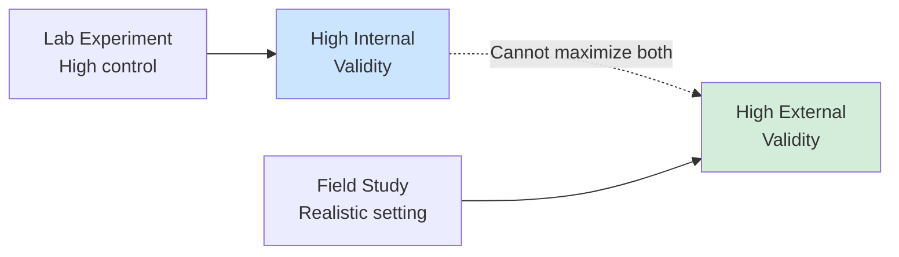
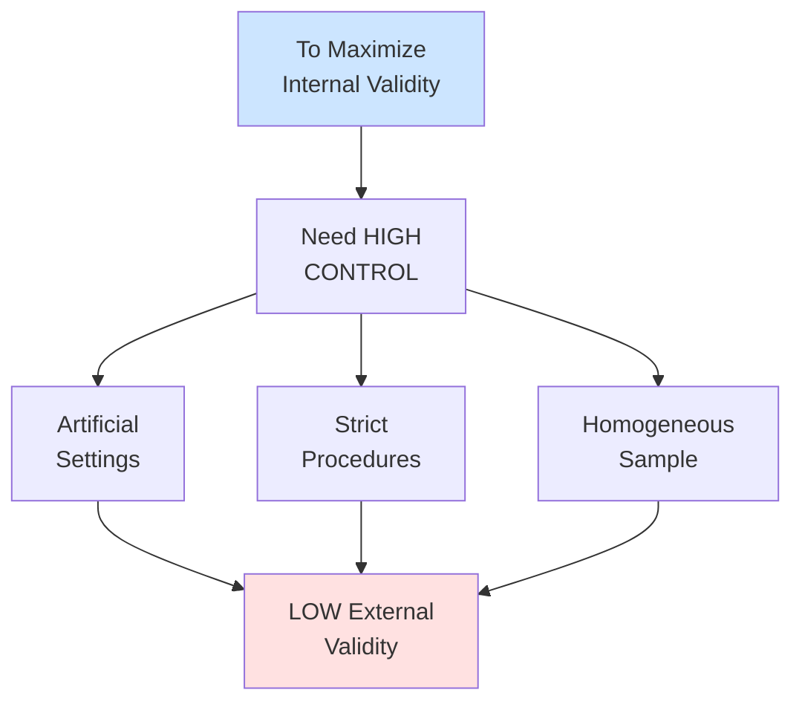
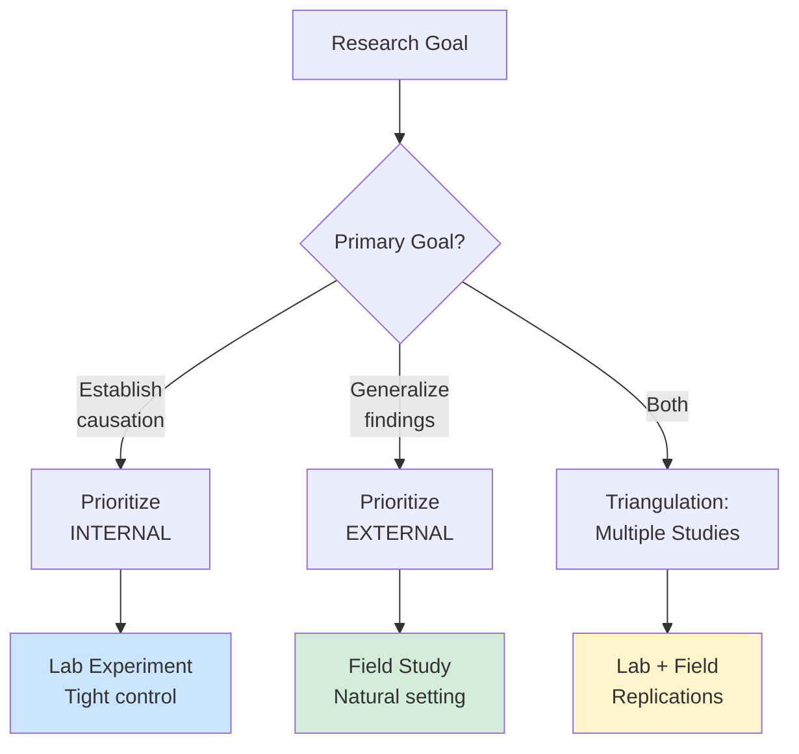

# Internal vs. External Validity

## 🎯 The Fundamental Trade-Off

**The most important trade-off in experimental design**

---

## 🔬 Internal Validity

### Definition
**Confidence that the IV actually caused changes in the DV**

**Question**: Can we trust the causal claim?

**Core Requirements**:
1. ✅ Covariation (X and Y relate)
2. ✅ Temporal precedence (X before Y)
3. ✅ No alternative explanations (ruled out confounds)

---

### Maximizing Internal Validity

**Through**:
- ✅ Random assignment
- ✅ Control groups
- ✅ Standardized procedures
- ✅ Elimination of confounds
- ✅ Blinding
- ✅ Lab settings

**Result**: Strong causal claims

---

## 🌍 External Validity

### Definition
**Generalizability of findings to other**:
- People (populations)
- Settings (contexts)
- Times (temporal)
- Treatments (other versions)

**Question**: Do results apply beyond this study?

---

### Types of External Validity

#### 1. Population Validity
**Generalize to other people?**

**Threat**: WEIRD samples
- Western
- Educated
- Industrialized
- Rich
- Democratic

**Example**: Study on US college students → Does it apply to general workforce?

---

#### 2. Ecological Validity
**Generalize to other settings?**

**Threat**: Artificial lab settings

**Example**: Lab study of teamwork → Does it apply to actual workplaces?

---

#### 3. Temporal Validity
**Generalize to other times?**

**Threat**: Time-bound findings

**Example**: 2020 remote work study → Does it apply post-pandemic?

---

#### 4. Treatment Validity
**Generalize to other implementations?**

**Threat**: Specific operationalization

**Example**: One training program → Do all training programs work?

---

## ⚖️ The Trade-Off Dilemma

### Why the Trade-Off Exists

**Example**:
Lab experiment:
- ✅ High control → Strong internal validity
- ❌ Artificial → Weak external validity

Field study:
- ✅ Realistic → Strong external validity
- ❌ Many confounds → Weak internal validity

---

## 🎓 Exam Question (Q53)

**"A typical trade-off researchers need to balance in an experiment is:"**

**Answer: b. internal vs. external validity**

**Why**:
- Cannot maximize both simultaneously
- Core dilemma in research design
- Must prioritize based on research goals

---

## 🚨 Threats to Internal Validity

### 1. History
**External events during study**

**Example**: Economic crisis happens during training study
**Solution**: Control group (both experience history)

---

### 2. Maturation
**Natural changes in participants over time**

**Example**: Children naturally improve reading skills
**Solution**: Control group, shorter study duration

---

### 3. Testing
**Pre-test affects post-test**

**Example**: Taking IQ test first time → learn strategies → score better on second
**Solution**: No pre-test design, Solomon four-group

---

### 4. Instrumentation
**Measurement changes over time**

**Example**: Raters become stricter/more lenient
**Solution**: Standardization, calibration, automated measurement

---

### 5. Selection Bias
**Groups differ before treatment**

**Example**: Volunteers differ from non-volunteers
**Solution**: **Random assignment** (the big fix!)

---

### 6. Attrition/Mortality
**Differential dropout between groups**

**Example**: Frustrated participants drop from difficult condition
**Solution**: Keep study short, incentives, intention-to-treat analysis

---

### 7. Regression to the Mean
**Extreme scores move toward average**

**Example**: Select poor performers → improve naturally
**Solution**: Control group, random assignment

---

### 8. Demand Characteristics
**Participants guess hypothesis and change behavior**

**Example**: Know they're in "motivation" study → act more motivated
**Solution**: Deception, cover story, blind participants

---

### 9. Experimenter Expectancy
**Researcher bias influences results**

**Example**: Experimenter unconsciously gives hints
**Solution**: Double-blind design, automated procedures

---

### 10. Hawthorne Effect
**Behavior changes because being observed**

**Example**: Work harder when watched
**Solution**: Natural observation, habituate participants

---

## 🎯 Prioritizing Validity Types

### Priority Matrix

---

### When to Prioritize Internal Validity

**Situations**:
- Early stage research
- Testing theory
- Establishing causation crucial
- Mechanism unclear

**Methods**:
- Lab experiments
- Tightly controlled procedures
- Homogeneous samples

**Example**: "Does incentive type affect motivation?"
- Need causal evidence first
- Control everything else
- Worry about generalization later

---

### When to Prioritize External Validity

**Situations**:
- Applied research
- Policy decisions
- Causation already established
- Need to know if it works in practice

**Methods**:
- Field experiments
- Diverse samples
- Natural settings

**Example**: "Will training program work in our company?"
- Already know training can work (internal validity established)
- Need to know if works HERE (external validity)

---

## 🔄 Triangulation Solution

### Best Approach: Multiple Studies

**Phase 1**: Lab Experiment
- High internal validity
- Establish causation
- Test mechanism

**Phase 2**: Field Experiment
- High external validity
- Test generalization
- Real-world effectiveness

**Phase 3**: Replications
- Different populations
- Different settings
- Different times

**Together**: Strong internal AND external validity!

---

## 💼 Complete Example

### Research Question: Does flexible work increase productivity?

**Study 1 - Lab Experiment**:
- Setting: University computer lab
- Participants: Students
- Task: Data entry
- Manipulation: Flexible vs. fixed schedule
- **Result**: Flexible increases productivity by 15%
- **Validity**: ✅ High internal, ❌ Low external

**Study 2 - Field Experiment**:
- Setting: Real company
- Participants: Actual employees
- Task: Regular work
- Manipulation: Implement flexible work policy
- **Result**: Productivity increases by 8%
- **Validity**: ✅ High external, ⚠️ Moderate internal (some confounds)

**Study 3 - Replication**:
- Multiple companies
- Different industries
- Different countries
- **Result**: Average 10% increase
- **Validity**: ✅ High external, ✅ Causal claim strengthened

**Conclusion**: Effect is both real (internal validity) and generalizable (external validity)

---

## 🔑 Key Takeaways

1. **Internal validity** = Causal confidence
2. **External validity** = Generalizability
3. **Cannot maximize both** simultaneously
4. **Lab** = High internal, low external
5. **Field** = High external, lower internal
6. **Random assignment** is key to internal validity
7. **Diverse samples/settings** key to external validity
8. **Best strategy**: Multiple studies with different trade-offs

---

*Part of: [[00-Index|Business Research Methods Course Notes]]*
