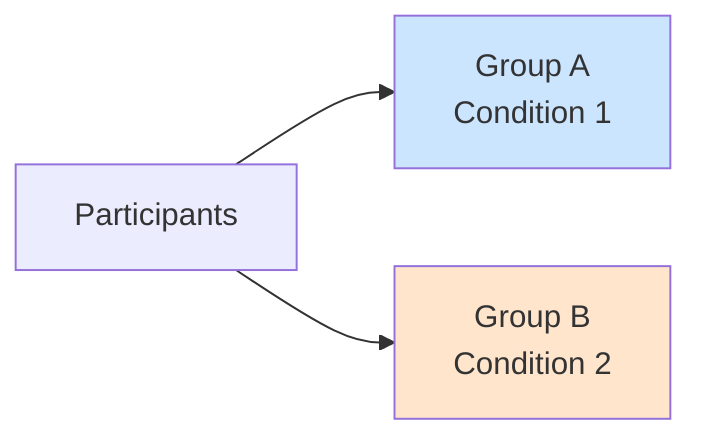
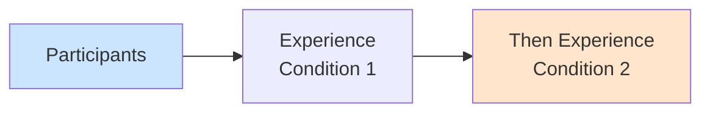

# Between-Subjects vs. Within-Subjects Designs

## 🎯 The Fundamental Experimental Design Choice

How you assign participants to conditions dramatically affects your study's power, efficiency, and validity.

---

## 🔀 Between-Subjects Design

### Definition
Each participant experiences **ONE condition only**

**Also called**: Independent groups design



### Example
Testing ad effectiveness:
- Group A (n=50): Sees emotional ad
- Group B (n=50): Sees rational ad
- Each person sees only ONE ad

### Advantages
✅ No carryover effects
✅ No practice/fatigue effects
✅ Shorter per-person time
✅ Simpler analysis
✅ Can't guess hypothesis easily

### Disadvantages
❌ Need MORE participants
❌ Individual differences between groups add noise
❌ Lower statistical power
❌ More expensive/time-consuming

---

## 🔁 Within-Subjects Design

### Definition
Each participant experiences **ALL conditions**

**Also called**: Repeated measures design



### Example
Testing ad effectiveness:
- All 50 people see emotional ad first
- Then all 50 see rational ad later
- (Order counterbalanced)

### Advantages
✅ Need FEWER participants
✅ Each person is own control (removes individual differences)
✅ Higher statistical power
✅ More efficient
✅ Less expensive

### Disadvantages
❌ Carryover effects (first affects second)
❌ Order effects (learning, fatigue, boredom)
❌ Demand characteristics (easier to guess hypothesis)
❌ Longer per-person time
❌ Not always possible

---

## ⚖️ Direct Comparison

| Aspect | Between-Subjects | Within-Subjects |
|--------|------------------|-----------------|
| **Participants needed** | More (e.g., 100) | Fewer (e.g., 50) |
| **Each person experiences** | One condition | All conditions |
| **Individual differences** | Between-group noise | Controlled |
| **Statistical power** | Lower | Higher |
| **Carryover effects** | None | Possible |
| **Order effects** | None | Possible |
| **Cost** | Higher | Lower |
| **Time per person** | Shorter | Longer |

---

## 🔄 Controlling Order Effects in Within-Subjects

### Counterbalancing

**Complete Counterbalancing**: All possible orders

**Example**: 2 conditions (A, B)
- Half do: A → B
- Half do: B → A

**Example**: 3 conditions (A, B, C)
- 6 possible orders: ABC, ACB, BAC, BCA, CAB, CBA
- Each person gets different random order

### Latin Square Design

For many conditions, use systematic rotation:

```
Order 1: A → B → C → D
Order 2: B → C → D → A
Order 3: C → D → A → B
Order 4: D → A → B → C
```

---

## 🎪 Mixed Designs

### Definition
Combination of between and within factors

**Example**:
- **Between**: Training method (online vs. classroom)
- **Within**: Time (pre-test, post-test, follow-up)

**Analysis**: Mixed ANOVA

---

## 🎯 When to Use Each

### Use Between-Subjects When:
- Cannot "undo" treatment (e.g., can't un-train)
- Carryover effects likely
- Order effects problematic
- Conditions very different
- Short tasks/measures

### Use Within-Subjects When:
- Participants scarce/expensive
- Need high power
- Can control order effects
- Conditions similar enough
- Measuring change over time

---

## 🔑 Key Takeaways

1. **Between**: Different people, one condition each
2. **Within**: Same people, all conditions
3. **Between**: More participants, lower power
4. **Within**: Fewer participants, higher power
5. **Within** risks: Carryover, order effects
6. **Counterbalancing**: Control order effects
7. **Mixed designs**: Combine both approaches

---

*Part of: [[00-Index|Business Research Methods Course Notes]]*
