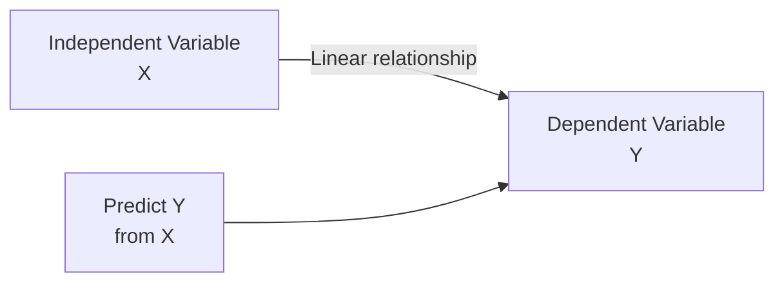
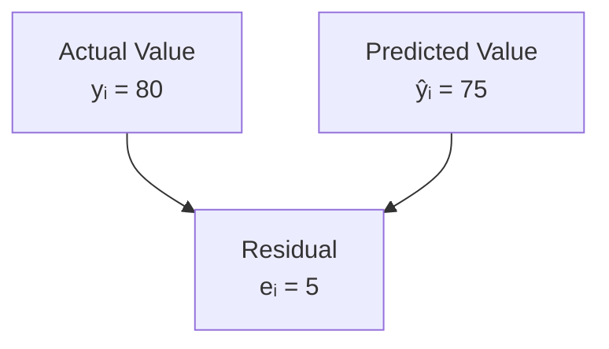

# Simple Linear Regression

## 🎯 The Goal of Regression

**Find the best-fitting line** through a scatterplot to predict Y from X.



---

## 📐 The Model

### Mathematical Form

**Y = β₀ + β₁X + ε**

Where:
- **Y**: Dependent variable (outcome)
- **X**: Independent variable (predictor)
- **β₀**: Intercept (value of Y when X=0)
- **β₁**: Slope (change in Y for 1-unit change in X)
- **ε**: Error term (random deviation)

---

## 📊 OLS Estimation

### Ordinary Least Squares (OLS)

**Principle**: Minimize sum of squared residuals

**Minimize**: Σ(yᵢ - ŷᵢ)² = Σeᵢ²

```mermaid
graph TD
    A[Data Points] --> B[OLS Algorithm]
    B --> C[Find β₀ and β₁]
    C --> D[That minimize<br/>Σ(residuals)²]
    D --> E[Best-Fitting Line]
    
    style E fill:#d4edda
```

---

### The Formulas

**Slope**: β₁ = Cov(X,Y) / Var(X)

**Alternative**: β₁ = r × (sᵧ/sₓ)

**Intercept**: β₀ = ȳ - β₁x̄

**Key Insight**: Line always passes through (x̄, ȳ)

---

## 💼 Example Calculation

**Given**:
- Correlation: r = 0.25
- SD of SCORE (Y): sᵧ = 7
- SD of ATTEND (X): sₓ = 3
- Mean SCORE: ȳ = 75
- Mean ATTEND: x̄ = 20

**Find**: Regression equation

**Solution**:

**Step 1**: Calculate β₁
β₁ = r × (sᵧ/sₓ) = 0.25 × (7/3) = 0.583

**Step 2**: Calculate β₀
β₀ = ȳ - β₁x̄ = 75 - 0.583(20) = 63.34

**Equation**: SCORE = 63.34 + 0.583(ATTEND)

**Interpretation**:
- Each additional class attended → 0.583 points higher score
- Student who attends 0 classes → predicted score of 63.34

---

## 📈 Interpretation Guide

### The Slope (β₁)

**Interpretation**: "For every 1-unit increase in X, Y changes by β₁ units"

**Examples**:
- β₁ = 5: Each year of education → €5,000 more salary
- β₁ = -2: Each hour of TV → 2 points lower GPA
- β₁ = 0.5: Each dollar of advertising → 50 cents more sales

**Sign**:
- β₁ > 0: Positive relationship
- β₁ < 0: Negative relationship  
- β₁ = 0: No relationship

---

### The Intercept (β₀)

**Interpretation**: "Predicted Y when X = 0"

**Often Not Meaningful**:
- If X = 0 is impossible/unrealistic
- Example: Wage = 50,000 + 5,000(Years Education)
  - β₀ = 50,000 (wage with 0 education)
  - Extrapolation beyond data!

**Sometimes Meaningful**:
- If X = 0 is realistic
- Example: Sales = 1000 + 50(Advertising)
  - β₀ = 1000 (sales with $0 advertising)

---

## 📊 R-Squared (R²)

### Definition

**R² = Proportion of variance in Y explained by X**

**Formula**: R² = SSE/SST = 1 - SSR/SST

Where:
- SST = Total Sum of Squares = Σ(yᵢ - ȳ)²
- SSE = Explained Sum of Squares = Σ(ŷᵢ - ȳ)²
- SSR = Residual Sum of Squares = Σ(yᵢ - ŷᵢ)²

**Relationship**: SST = SSE + SSR

---

### Interpretation

**R² = 0.35** means:
- 35% of variance in Y explained by X
- 65% due to other factors

**Range**: 0 ≤ R² ≤ 1
- R² = 0: X explains nothing
- R² = 1: X explains everything (perfect fit)

**What R² Does NOT Tell**:
- ❌ Whether coefficients are significant
- ❌ Whether model is correctly specified
- ❌ Whether relationship is causal

---

## 🎯 Residuals

### Definition

**Residual** (eᵢ) = Observed - Predicted = yᵢ - ŷᵢ

**Interpretation**:
- Positive residual: Overestimated Y
- Negative residual: Underestimated Y
- Residual = prediction error



---

### Error Term vs. Residual

**Error term (ε)**: Population concept, unobserved
**Residual (e)**: Sample estimate of error

---

## 🔍 Hypothesis Testing

### Testing β₁

**Null Hypothesis**: H₀: β₁ = 0 (no relationship)
**Alternative**: H₁: β₁ ≠ 0 (relationship exists)

**t-statistic**: t = β̂₁ / SE(β̂₁)

**Decision**:
- If |t| large and p < 0.05 → Reject H₀ → β₁ significant
- If p ≥ 0.05 → Fail to reject → β₁ not significant

---

### Confidence Interval

**95% CI**: β̂₁ ± 1.96 × SE(β̂₁)

**Interpretation**:
- If CI includes 0 → Not significant
- If CI excludes 0 → Significant

---

## 🎓 Assumptions

### 5 Key OLS Assumptions

1. **Linearity**: Relationship is linear
2. **Independence**: Observations independent
3. **Homoscedasticity**: Constant error variance
4. **Normality**: Errors normally distributed
5. **No perfect collinearity**: (Not issue in simple regression)

---

## 💼 Complete Example

**Research Question**: Does study time affect exam scores?

**Data**: 100 students
- X = Study hours
- Y = Exam score (0-100)

**Results**:
- r = 0.60
- x̄ = 10 hours, sₓ = 3
- ȳ = 70 points, sᵧ = 15

**Calculate Regression**:

β₁ = 0.60 × (15/3) = 3.0
β₀ = 70 - 3.0(10) = 40

**Equation**: Score = 40 + 3.0(Hours)

**Interpretation**:
- Each additional hour of study → 3 points higher
- Student who studies 0 hours → predicted score of 40

**R²** = r² = 0.60² = 0.36
- 36% of score variance explained by study time

**Prediction**:
- Study 15 hours: Score = 40 + 3(15) = 85

---

## 🔑 Key Takeaways

1. **OLS minimizes** sum of squared residuals
2. **β₁** = slope = change in Y per unit change in X
3. **β₀** = intercept = Y when X=0
4. **Line passes through** (x̄, ȳ)
5. **R²** = proportion of variance explained
6. **Residual** = observed - predicted
7. **Test β₁** using t-statistic

---

*Part of: [[00-Index|Business Research Methods Course Notes]]*
