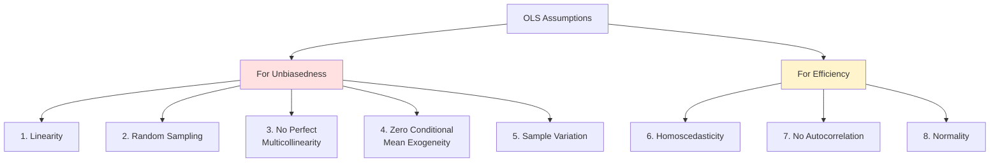
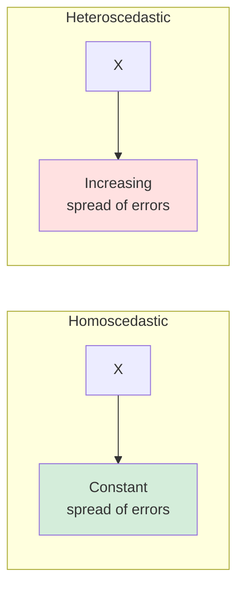

# OLS Assumptions and Violations

## 🎯 Why Assumptions Matter

**If assumptions violated:**
- Estimates may be **biased** (wrong on average)
- Estimates may be **inefficient** (larger variance)
- **Standard errors** may be wrong
- **Hypothesis tests invalid**

---

## 📋 The Six Key Assumptions

---

## 1️⃣ Linearity in Parameters

### Assumption
**Model is linear in parameters (β's)**

**Correct**: Y = β₀ + β₁X + β₂X²
- Linear in β₀, β₁, β₂ ✅

**Incorrect**: Y = X^β₁
- Nonlinear in β₁ ❌

**Not Required**: Linearity in X
- Y = β₀ + β₁X² is fine (linear in β's)

---

### Violation: Model Misspecification

**Problem**: Wrong functional form

**Example**:
- True: Y = β₀ + β₁X + β₂X²
- Estimated: Y = β₀ + β₁X (missing X²)
- **Result**: Biased estimates

**Solution**:
- Theory guides functional form
- Check residual plots
- Try transformations

---

## 2️⃣ Random Sampling

### Assumption
**Observations are i.i.d. (independent and identically distributed)**

**Means**:
- Each observation random draw from population
- Independent of other observations
- Same distribution

---

### Violation: Non-Random Sample

**Problems**:
- Selection bias
- Can't generalize
- Inference invalid

**Example**:
- Survey only volunteers → Biased
- Include only successful firms → Survivorship bias

**Solution**:
- Use probability sampling
- Be careful about generalization
- Report sampling method

---

## 3️⃣ No Perfect Multicollinearity

### Assumption
**Independent variables not perfectly correlated**

**Perfect collinearity**: One IV is exact linear function of others

---

### Violation: Perfect Multicollinearity

**Example**:
Include both:
- Age (in years)
- Birth year
- **Problem**: Age = Current year - Birth year (perfect relationship!)

**Result**:
- Cannot estimate separate effects
- Infinite solutions
- Software will drop a variable

**Solution**:
- Remove one of the perfectly correlated variables
- **Dummy variable trap**: k categories → k-1 dummies

---

### Imperfect Multicollinearity

**Not a violation**, but causes problems:

**Problem**:
- High correlation (not perfect) between IVs
- Can still estimate, but less precise
- Large standard errors
- Coefficients unstable

**Symptoms**:
- High R² but few significant coefficients
- Coefficients change a lot with small data changes
- Large standard errors

**Detection**:
- VIF (Variance Inflation Factor) > 10
- Correlation matrix of IVs

**Solution**:
- Drop one correlated variable
- Combine variables
- Collect more data
- Use ridge regression

---

## 4️⃣ Zero Conditional Mean / Exogeneity

### Assumption
**E(ε|X) = 0**

**Meaning**:
- Error term uncorrelated with X
- X is "exogenous" (determined outside model)
- No omitted variable bias

**Most Critical Assumption** for causality!

---

### Violation Causes

#### A. Omitted Variable Bias

**Setup**: True model has Z, but we omit it
- True: Y = β₀ + β₁X + β₂Z + ε
- Estimated: Y = β₀ + β₁X + ε

**Bias occurs when**:
1. Z affects Y (β₂ ≠ 0)
2. Z correlates with X

**Example**:
- Y = Wage
- X = Education
- Z = Ability (omitted)
- **Problem**: Ability affects wage AND correlates with education
- **Result**: β̂₁ biased (captures both education and ability effects)

**Solution**:
- Include Z in model
- Use fixed effects (panel data)
- Instrumental variables
- Experiments

---

#### B. Reverse Causality (Simultaneity)

**Problem**: Y causes X, not just X causes Y

**Example**:
- Model: Police → Crime
- Reality: Crime → More police (cities with high crime hire more police)
- **Result**: β̂ biased (wrong sign even!)

**Solution**:
- Experiments
- Instrumental variables
- Lagged variables
- Theory to establish direction

---

#### C. Measurement Error

**Problem**: X measured with error

**Example**:
- True: Income
- Measured: Self-reported income (with errors)
- **Result**: Attenuation bias (β̂ biased toward zero)

**Solution**:
- Better measurement
- Instrumental variables
- Multiple measures

---

## 5️⃣ Sample Variation in X

### Assumption
**Var(X) > 0 in sample**

**Meaning**: X must vary in your data

**Minimum**: At least 2 distinct values of X

**Violation**:
- X constant → Cannot estimate effect
- Example: All students study 5 hours → Can't estimate effect of study time

**Solution**: Ensure X varies in your sample

---

## 6️⃣ Homoscedasticity

### Assumption
**Var(ε|X) = σ² (constant)**

**Meaning**: Error variance same for all X values

---

### Violation: Heteroscedasticity

**Problem**:
- Variance of ε changes with X
- Common in cross-sectional data

**Example**:
- Y = Consumption, X = Income
- High-income people: More variation in consumption
- Low-income people: Less variation

**Consequence**:
- Estimates still unbiased ✅
- But standard errors wrong ❌
- t-tests, confidence intervals invalid

**Detection**:
- Residual plot (fan shape)
- Breusch-Pagan test
- White test

**Solution**:
- **Robust standard errors** (White, HC)
- Weighted least squares
- Log transformation

---

## 7️⃣ No Autocorrelation

### Assumption
**Cov(εᵢ, εⱼ) = 0 for i ≠ j**

**Meaning**: Errors uncorrelated across observations

---

### Violation: Autocorrelation

**Common in**:
- Time series data
- Panel data
- Spatial data

**Example**:
- Today's error correlates with yesterday's
- If underpredict today → likely underpredict tomorrow

**Consequence**:
- Estimates still unbiased ✅
- Standard errors wrong ❌
- Inflated t-statistics

**Detection**:
- Durbin-Watson test
- Plot residuals over time

**Solution**:
- **Cluster-robust SEs**
- Newey-West SEs
- Include lags
- First differencing

---

## 8️⃣ Normality

### Assumption
**ε ~ N(0, σ²)**

**Good News**: Not required for unbiasedness!

**Required For**:
- Exact inference in small samples
- t-tests, F-tests to be valid

**But**:
- Central Limit Theorem → With large n, sampling distribution approximately normal anyway
- Robust to violations with n > 30-50

**Detection**:
- Q-Q plot
- Shapiro-Wilk test
- Histogram of residuals

**Solution**:
- Transformations
- Non-parametric tests
- Bootstrap

---

## 📊 Summary Table

| Assumption | Required For | If Violated | Solution |
|------------|--------------|-------------|----------|
| **Linearity** | Unbiasedness | Biased | Correct specification |
| **Random Sampling** | Generalization | Can't generalize | Probability sampling |
| **No Perfect Collinearity** | Estimation | Cannot estimate | Drop variable |
| **Exogeneity** | Unbiasedness | **BIASED** | Control, IV, experiment |
| **Sample Variation** | Estimation | Cannot estimate | Ensure X varies |
| **Homoscedasticity** | Efficiency | Wrong SEs | Robust SEs |
| **No Autocorrelation** | Efficiency | Wrong SEs | Cluster SEs |
| **Normality** | Inference (small n) | Invalid tests | Large n, bootstrap |

---

## 🚨 Most Serious Violations

### Critical (Cause Bias)
1. **Exogeneity violation** (omitted variables, reverse causality)
2. **Model misspecification** (wrong functional form)
3. **Perfect multicollinearity** (can't estimate)

### Problematic (Wrong Inference)
4. **Heteroscedasticity** (wrong SEs)
5. **Autocorrelation** (wrong SEs)

### Less Serious
6. **Non-normality** (OK with large n)

---

## 🔍 Diagnostic Workflow

### Step 1: Estimate Model
Run OLS regression

### Step 2: Check Residual Plots
- Plot residuals vs. fitted values
- Plot residuals vs. X
- Look for patterns

### Step 3: Statistical Tests
- Heteroscedasticity: Breusch-Pagan
- Autocorrelation: Durbin-Watson
- Normality: Shapiro-Wilk

### Step 4: Address Violations
- Use robust SEs for heteroscedasticity
- Add controls for omitted variables
- Consider transformations

---

## 🔑 Key Takeaways

1. **Assumptions 1-5** needed for **unbiasedness**
2. **Assumption 4 (exogeneity)** most critical
3. **Heteroscedasticity** → Use **robust SEs**
4. **Perfect multicollinearity** → **Cannot estimate**
5. **Imperfect multicollinearity** → Large SEs but still unbiased
6. **Always check assumptions** before interpreting results
7. **Robust SEs** are your friend!

---

*Part of: [[00-Index|Business Research Methods Course Notes]]*
