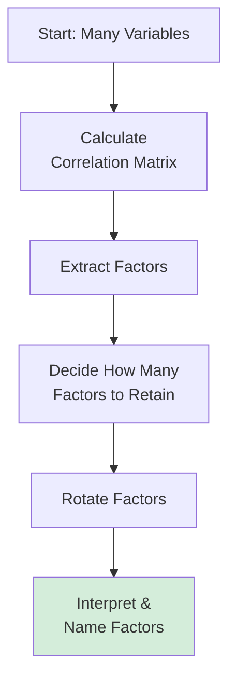
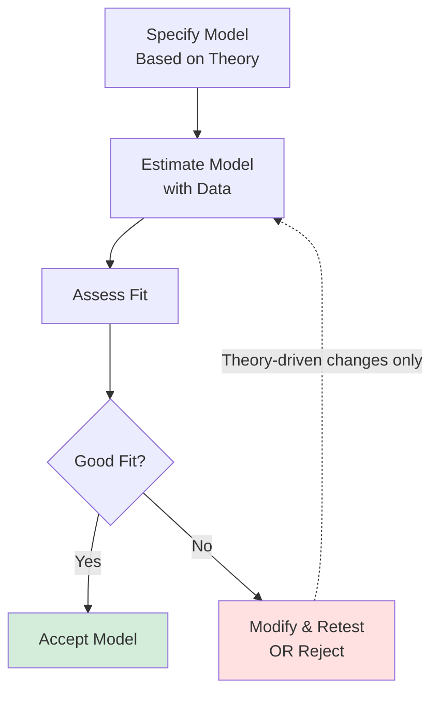

# Factor Analysis: EFA and CFA

## 🎯 What is Factor Analysis?

**Purpose**: Reduce many variables to fewer underlying factors (dimensions)

**Example**: 20 job satisfaction survey items → 3 underlying factors:
- Work content satisfaction
- Compensation satisfaction
- Relationship satisfaction

---

## 🔍 Two Types

### Exploratory Factor Analysis (EFA)
**When**: Don't know factor structure
**Goal**: Discover underlying dimensions
**Use**: Early scale development, exploration

### Confirmatory Factor Analysis (CFA)
**When**: Have hypothesized structure
**Goal**: Test if data fits proposed structure
**Use**: Later scale validation, theory testing

---

## 📊 EFA: Exploratory Factor Analysis

### Process



---

### Step 1: Extraction Methods

**Principal Component Analysis (PCA)**:
- Maximize variance explained
- Uses ALL variance (including unique)
- Data reduction focus

**Common Factor Analysis**:
- Maximize shared variance
- Separates common from unique variance
- Latent construct focus

**Most Common**: PCA (more practical)

---

### Step 2: How Many Factors?

#### Kaiser Criterion
**Rule**: Retain factors with **eigenvalue > 1**

**Logic**: Factor should explain more variance than a single variable

**Example**:
- Factor 1: eigenvalue = 4.2 → **KEEP**
- Factor 2: eigenvalue = 2.1 → **KEEP**
- Factor 3: eigenvalue = 1.3 → **KEEP**
- Factor 4: eigenvalue = 0.8 → **DROP**
- Factor 5: eigenvalue = 0.6 → **DROP**

**Result**: 3-factor solution

---

#### Scree Plot
**Method**: Plot eigenvalues, look for "elbow"

```
Eigenvalue
    |
  5 |●
  4 |  ●
  3 |    ●
  2 |      ●
  1 |        ●___●___●___●___
  0 |________________________
      1  2  3  4  5  6  7  8
           Factor Number
           
Elbow at Factor 4 → Retain 3 factors
```

---

#### Variance Explained
**Rule**: Retain until 60-70% variance explained

---

### Step 3: Rotation

**Purpose**: Make factors more interpretable

#### Orthogonal Rotation (Factors Uncorrelated)
**Varimax** (Most common):
- Maximizes variance of loadings
- Forces simple structure
- Factors remain uncorrelated

#### Oblique Rotation (Factors Can Correlate)
**Promax**:
- Allows factor correlation
- More realistic often
- Use when factors theoretically related

---

### Step 4: Interpret Loadings

**Factor Loading** = Correlation between variable and factor

**Guidelines**:
- |loading| > 0.70: Excellent
- |loading| > 0.60: Good
- |loading| > 0.50: Acceptable
- |loading| > 0.40: Borderline
- |loading| < 0.40: Poor (exclude)

---

### Example: Job Satisfaction Scale

**20 items → EFA**

**Results** (3 factors, Varimax rotation):

**Factor 1**: Work Content (eigenvalue = 5.2)
- "My work is meaningful" (0.85)
- "I find my work fulfilling" (0.82)
- "My work has purpose" (0.78)
- "I enjoy daily tasks" (0.75)

**Factor 2**: Compensation (eigenvalue = 3.1)
- "My salary is fair" (0.90)
- "I am paid well" (0.88)
- "Benefits are good" (0.75)
- "Compensation is competitive" (0.72)

**Factor 3**: Relationships (eigenvalue = 2.3)
- "I like my colleagues" (0.83)
- "My manager supports me" (0.80)
- "Team works well together" (0.77)

**Total variance explained**: 52.8%

---

## ✅ CFA: Confirmatory Factor Analysis

### When to Use
- Have theory about factor structure
- Validating a scale
- Testing competing models
- After EFA, on new sample

---

### Process



---

### Fit Indices

**Chi-Square (χ²)**:
- Tests if model fits data
- **Want**: Non-significant (p > 0.05)
- **Problem**: Significant with large n

**CFI (Comparative Fit Index)**:
- **> 0.90**: Acceptable
- **> 0.95**: Good

**TLI (Tucker-Lewis Index)**:
- **> 0.90**: Acceptable
- **> 0.95**: Good

**RMSEA (Root Mean Square Error of Approximation)**:
- **< 0.08**: Acceptable
- **< 0.05**: Good

**SRMR (Standardized Root Mean Square Residual)**:
- **< 0.08**: Good

---

## 🔄 Factor Analysis vs. Cluster Analysis

### Critical Distinction (Exam Q8)

**Factor Analysis**:
- Reduces **VARIABLES** (columns)
- Groups items into dimensions
- Example: 20 survey items → 3 factors

**Cluster Analysis**:
- Groups **OBSERVATIONS** (rows)
- Groups similar individuals
- Example: 1000 customers → 4 segments

```mermaid
graph LR
    subgraph "Factor Analysis"
        A[Variables<br/>&#40;columns&#41;] -->|Reduce| B[Factors]
    end
    
    subgraph "Cluster Analysis"
        C[Observations<br/>&#40;rows&#41;] -->|Group| D[Clusters]
    end
    
    style B fill:#cce5ff
    style D fill:#fff4cc
```



---

## 🎯 Exam Topics

### Kaiser Criterion (Q10)
**"Only factors having eigenvalues > ___ should be retained"**

**Answer**: d. 1

**Why**: Factor should explain more variance than single variable

---

### EFA Purpose (Q9)
**"Used for uncovering the underlying structure of a set of continuous variables"**

**Answer**: a. True

**Not for**: Determining factor numbers from theory (that's CFA)

---

### PCA vs. Common Factor (Q58)
**"PCA aims at ___, while common factor aims at ___"**

**Answer**: d. maximizing explained variance; maximizing underlying correlations

---

## 💼 Complete Example

### Research: Develop Innovation Capability Scale

**Step 1**: Generate 30 items
- Literature review
- Expert interviews
- Pilot testing

**Step 2**: Collect data (n=300)
- Survey companies
- 30 items, 7-point Likert

**Step 3**: EFA
- Check KMO (> 0.80) ✅
- Bartlett's test significant ✅
- PCA with Varimax

**Step 4**: Decide factors
- Kaiser: 4 factors (eigenvalues 8.2, 3.1, 2.4, 1.3)
- Scree plot: Elbow at 4
- Variance explained: 62%
- **Decision**: 4 factors

**Step 5**: Interpret
- Factor 1: Product Innovation (8 items)
- Factor 2: Process Innovation (7 items)
- Factor 3: Business Model Innovation (6 items)
- Factor 4: Organizational Innovation (5 items)

**Step 6**: Refine
- Drop items with loading < 0.50
- Check Cronbach's α for each factor
- Final: 26 items

**Step 7**: CFA (new sample, n=250)
- Specify 4-factor model
- Fit indices:
  - CFI = 0.94 ✅
  - TLI = 0.93 ✅
  - RMSEA = 0.06 ✅
- **Model confirmed!**

---

## 🔑 Key Takeaways

1. **Factor analysis reduces variables**, cluster analysis groups observations
2. **EFA discovers structure**, CFA tests structure
3. **Kaiser criterion**: Eigenvalue > 1
4. **Good loading**: > 0.50 (ideally > 0.70)
5. **PCA** maximizes variance explained
6. **Rotation** improves interpretability
7. **Always do CFA** on new sample after EFA

---

*Part of: [[00-Index|Business Research Methods Course Notes]]*
