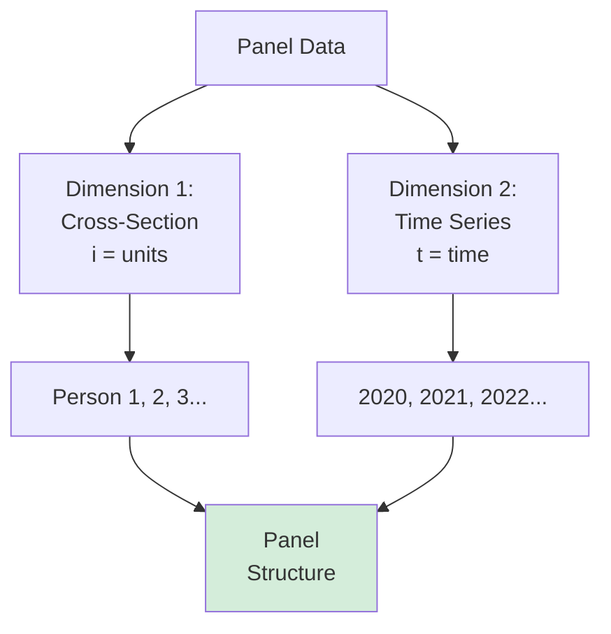

# Panel Data and Fixed Effects

## 🎯 What is Panel Data?

**Panel Data** = Multiple observations of same units over time

Also called: Longitudinal data, Time-series cross-sectional data

---

## 📊 Data Types Comparison

### Cross-Sectional
- Many units
- One time point
- **Example**: Survey 1000 people in 2025

### Time Series
- One unit
- Many time points
- **Example**: Track Germany's GDP 1990-2025

### Panel Data
- Many units
- Many time points
- **Example**: Track 1000 people annually 2020-2025



---

## 🎯 Why Panel Data is Powerful

### Advantages (Exam Q36)

**Answer**: d. unobserved heterogeneity; fixed effects; intertemporal effects

**1. Control Unobserved Heterogeneity**
- Individuals differ in unmeasured ways
- Panel allows controlling for time-invariant characteristics
- **Example**: Ability, personality (hard to measure, but constant)

**2. Fixed Effects Models**
- Control ALL time-invariant confounds
- Each unit serves as own control
- Stronger causal inference

**3. Study Intertemporal Effects**
- Dynamic relationships
- Lagged effects
- Changes over time
- **Example**: Does this year's investment affect next year's growth?

---

## 📐 Panel Data Structure

### Format

```
PersonID  Year  Income  Education
1         2020  50000   Bachelor
1         2021  52000   Bachelor
1         2022  55000   Master
2         2020  45000   Bachelor
2         2021  47000   Bachelor
2         2022  49000   Bachelor
```

**Balanced Panel**: All units observed all time periods
**Unbalanced Panel**: Missing observations for some unit-time combinations

---

## 🔍 Fixed Effects Model

### The Problem: Unobserved Heterogeneity

**Example**: Does marriage increase happiness?

**Cross-sectional problem**:
- Married people happier
- **But**: Maybe naturally happy people more likely to marry
- **Confound**: Baseline happiness (unobserved)

**Solution**: Panel data with fixed effects!

---

### The Model

**Yᵢₜ = β₁Xᵢₜ + αᵢ + εᵢₜ**

Where:
- **i** = individual
- **t** = time
- **Xᵢₜ** = time-varying predictor
- **αᵢ** = individual fixed effect (time-invariant)
- **εᵢₜ** = error

**αᵢ captures**:
- Personality
- Ability
- Preferences
- ANY time-invariant characteristic

---

### How Fixed Effects Work

**"Within" Transformation**:
- Subtract individual means from each observation
- (Yᵢₜ - Ȳᵢ) = β₁(Xᵢₜ - X̄ᵢ) + (εᵢₜ - ε̄ᵢ)
- **Result**: αᵢ drops out (differenced away!)

**Interpretation**:
- β₁ = effect of change in X on change in Y **within individuals**
- Comparing person to themselves at different times

---

### Marriage Example with Fixed Effects

**Without FE** (Cross-sectional):
- Compare married vs. unmarried people
- **Problem**: Baseline happiness differs

**With FE** (Panel):
- Compare same person before vs. after marriage
- **Advantage**: Controls for their baseline happiness
- Each person is own control!

**Result**: More credible causal inference

---

## 🆚 Fixed Effects vs. Random Effects

### Fixed Effects (FE)

**Assumption**: αᵢ correlated with X
**Method**: Within transformation
**Controls for**: ALL time-invariant characteristics
**Cannot estimate**: Time-invariant variables (e.g., gender)

**Use when**: Concerned about omitted variable bias

---

### Random Effects (RE)

**Assumption**: αᵢ uncorrelated with X (exogeneity)
**Method**: GLS estimation
**Controls for**: Some time-invariant heterogeneity
**Can estimate**: Time-invariant variables

**Use when**: FE assumption too strong, want to estimate time-invariant effects

---

### Hausman Test

**Tests**: Whether FE and RE estimates differ

**Result**:
- **Significant difference** → Use FE (RE assumption violated)
- **No difference** → Can use RE (more efficient)

---

## 💼 Complete Example

### Research Question: Does training increase productivity?

**Problem with cross-sectional data**:
- Workers who get training may be more motivated
- Omitted variable: Motivation (unobserved)

**Panel Data Solution**:

**Data**: 500 workers, 5 years (2020-2024)
- Track who receives training each year
- Measure productivity annually

**Model**: 
Productivityᵢₜ = β₁Trainingᵢₜ + αᵢ + εᵢₜ

**Fixed Effects Estimation**:
- Controls for worker-specific motivation (αᵢ)
- Compares same worker before/after training
- β₁ = 0.15 (p < 0.01)

**Interpretation**:
- Training increases productivity by 15%
- Controlling for all time-invariant worker characteristics
- Stronger causal claim than cross-sectional!

---

## 🎯 Exam Topics

### Cross-Sectional vs. Panel (Q35)

**"While cross-sectional data comprise ___, panel data consist of ___"**

**Answer**: c. single observations of units; repeated observations of same unit

**Key**: Panel = repeated observations of SAME units

---

### Panel Advantages (Q36)

**"Panel data allow for controlling:"**

**Answer**: d. unobserved heterogeneity; fixed effects; intertemporal effects

**NOT**: Cost and time (panel data is actually more expensive!)

---

## 🚨 Limitations

### Fixed Effects Limitations

**Cannot Estimate**:
- Time-invariant variables (gender, ethnicity)
- Slow-changing variables (education in adults)

**Data Requirements**:
- Need multiple time periods
- Balanced panel preferred
- Attrition problematic

**Efficiency**:
- Uses only within-unit variation
- Discards between-unit variation
- Lower precision than pooled OLS (but more credible!)

---

## 🔑 Key Takeaways

1. **Panel data** = same units observed multiple times
2. **Fixed effects** control unobserved heterogeneity
3. **Within transformation** removes time-invariant confounds
4. **Each unit is own control** → stronger causality
5. **Cannot estimate time-invariant effects** with FE
6. **Hausman test** chooses between FE and RE
7. **More expensive** but more powerful than cross-sectional

---

*Part of: [[00-Index|Business Research Methods Course Notes]]*
