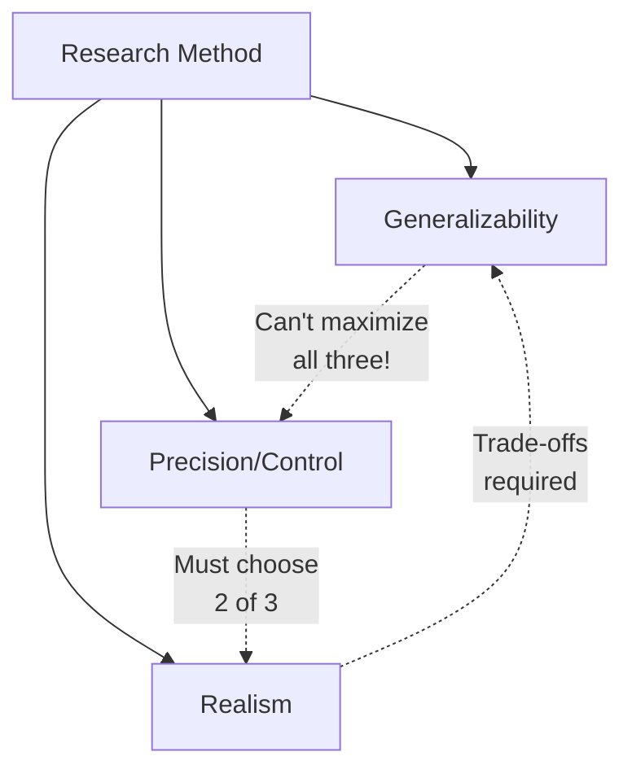

# McGrath's Triangle: Research Trade-offs

## 🎯 The Impossible Dream

**You can optimize at most TWO of three**: Generalizability, Precision, Realism

---

## 📐 The Three Dimensions

### 1. Generalizability
- External validity
- Apply to other people/contexts
- Representative samples

### 2. Precision/Control
- Internal validity
- Accurate measurement
- Control confounds

### 3. Realism
- Natural settings
- Realistic tasks
- Ecological validity

---

## 🎪 Method Examples

### Lab Experiment
✅ Precision (controlled)
✅ Realism (of system, not setting)
❌ Generalizability (artificial)

### Field Study
✅ Generalizability (real population)
✅ Realism (natural setting)
❌ Precision (less control)

### Sample Survey
✅ Generalizability (representative)
✅ Precision (standardized)
❌ Realism (self-report)

### Simulation
✅ Precision (controlled)
✅ Realism (of process)
❌ Generalizability (artificial)

---

## ⚖️ Strategic Choices

**Choose based on research question priorities:**

**Need causal inference?** → Prioritize precision (control)
**Need broad applicability?** → Prioritize generalizability
**Need ecological validity?** → Prioritize realism

---

## 🔄 Triangulation Solution

**Use multiple methods** to cover all three dimensions:
1. Lab experiment (precision)
2. Field study (realism + generalizability)
3. Together: Cover all bases

---

## 🔑 Key Takeaways

1. **Can't maximize all three** simultaneously
2. **Lab**: High control, low generalizability
3. **Field**: High generalizability, low control
4. **Choose**: Based on research priorities
5. **Triangulate**: Use multiple methods

---

*Part of: [[00-Index|Business Research Methods Course Notes]]*
