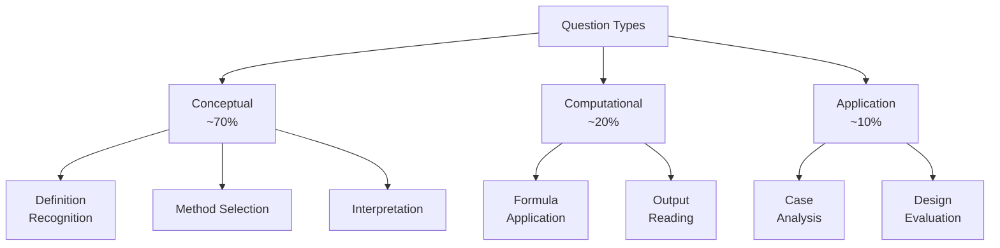
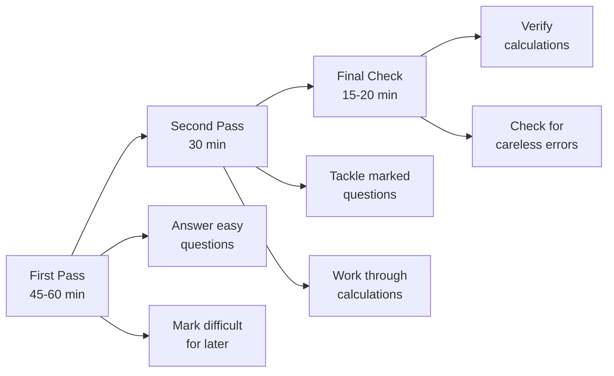
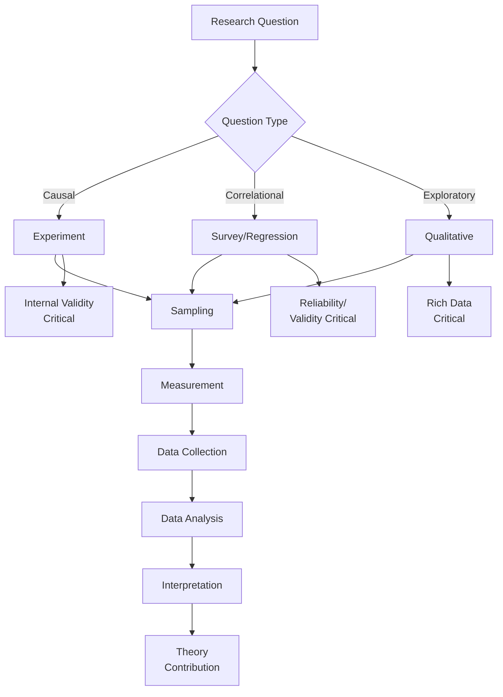
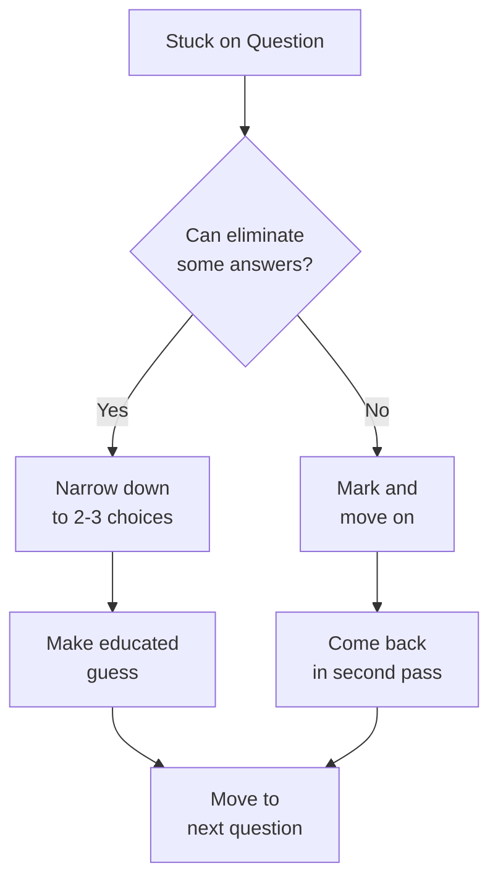

# Exam Strategy Guide

## 🎯 Your Exam Success Plan

This guide helps you tackle the Business Research Methods exam strategically using the reverse-engineering approach.

---

## 📋 Exam Format Overview

### What to Expect
- **60 multiple-choice questions**
- **Mix of conceptual and computational**
- **Time-limited** (check your specific exam time)
- **Cover all major topics**

### Question Types



---

## 🎪 Recognition Patterns

### Pattern 1: "All EXCEPT" Questions

**Example**: "All of the following are non-probability sampling methods except:"

**Strategy**:
1. ✅ Know the category (non-probability sampling)
2. ✅ Eliminate answers that FIT the category
3. ✅ Choose the ONE that DOESN'T fit

**Red Flags**:
- Made-up terms (snowman sampling, head validity)
- Terms from different categories
- Extreme options

---

### Pattern 2: Definition Matching

**Example**: "While X deals with ___, Y revolves around ___"

**Strategy**:
1. ✅ Understand both concepts separately
2. ✅ Know the key distinction
3. ✅ Match to correct pairings

**Common Pairs**:
| Concept A | vs | Concept B | Key Difference |
|-----------|---|-----------|----------------|
| Reliability | vs | Validity | Consistency vs. Accuracy |
| Constructs | vs | Variables | Abstract vs. Measurable |
| EFA | vs | Cluster | Reduce variables vs. Group observations |
| Moderation | vs | Mediation | When vs. How/Why |

---

### Pattern 3: Calculation Questions

**Example**: "Calculate the slope of the linear function (β₁)"

**Strategy**:
1. ✅ List given information
2. ✅ Identify needed formula
3. ✅ Plug and compute
4. ✅ Check answer reasonableness

**Most Common Formulas**:
- β₁ = Cov/Var or r(sᵧ/sₓ)
- β₀ = ȳ - β₁x̄
- SE = σ/√n
- SE(β̂) = β̂/t

---

### Pattern 4: Regression Output Reading

**Example**: Questions 59-60 with R output table

**Strategy**:
1. ✅ Understand table structure
2. ✅ Know where each piece lives
   - Estimate column
   - Std. Error column
   - t value column
   - Pr(>|t|) column
3. ✅ Can calculate missing pieces
   - t = Estimate/SE
   - SE = Estimate/t

**Sample Table Layout**:
```
Coefficients:
             Estimate  Std. Error  t value  Pr(>|t|)
(Intercept)  [value]   [value]     [value]  [value]
variable1    [value]   [value]     [value]  [value]
```

---

## 🧠 Topic-by-Topic Strategy

### SAMPLING (Q1, 31-32)

**What They Test**:
- Probability vs. non-probability distinction
- When to use each method
- Specific methods (stratified, cluster, snowball)

**Quick Check**:
- ❓ Is selection random? → Probability
- ❓ Is selection based on judgment? → Non-probability
- ❓ Do groups come before or after selection?
  - Before → Stratified
  - After → Cluster

**Traps**:
- Made-up sampling methods (snowman, snowflake)
- Confusing stratified and cluster

**Study Focus**: [[09-Sampling-Overview]]

---

### THEORY & HYPOTHESES (Q2, 19, 25-28)

**What They Test**:
- Construct vs. variable distinction
- Theory characteristics (falsifiability)
- Hypothesis quality
- Deduction vs. induction

**Quick Check**:
- ❓ Abstract or measurable?
  - Abstract → Construct
  - Measurable → Variable
- ❓ Can it be proven wrong? → Falsifiable
- ❓ General to specific? → Deductive
- ❓ Specific to general? → Inductive

**Key Phrases**:
- "Theory is causal" ✅
- "Good hypothesis is testable, measurable, causal, novel" ✅
- "Theory prefers fewer assumptions, more predictions" ✅

**Study Focus**: [[02-Theory-Building-and-Testing]]

---

### MEASUREMENT (Q3-6, 37-38)

**What They Test**:
- Reliability vs. validity
- Scale types (nominal to ratio)
- Likert scale properties
- Self-report measures

**Quick Check**:
- ❓ Reliability = Consistency
- ❓ Validity = Accuracy
- ❓ Likert = Ordinal scale (5-7 points, closed)
- ❓ Scale types: N.O.I.R.

**Traps**:
- "Head validity" doesn't exist!
- Likert is ordinal, not interval (technically)
- Semantic differential vs. Guttman scale

**Study Focus**: [[06-Reliability-and-Validity]]

---

### EXPERIMENTS (Q11, 18, 23, 44-45, 47, 53)

**What They Test**:
- Between vs. within subjects
- Internal vs. external validity
- Threats to validity
- Manipulation checks

**Quick Check**:
- ❓ Between = Different groups
- ❓ Within = Same group, multiple conditions
- ❓ Internal validity = Causal confidence
- ❓ External validity = Generalizability
- ❓ Trade-off = Can't maximize both

**Key Phrases**:
- "Each experiencing only one condition" → Between
- "The change in confounding variables is MEASURED" → NOT ideal experiment (should be controlled/eliminated)
- "Balance between groups" → GOOD (not a threat)

**Study Focus**: [[12-Experimental-Fundamentals]], [[13-Internal-vs-External-Validity]]

---

### REGRESSION (Q12-13, 15, 17, 20-22, 51-57, 59-60)

**What They Test**:
- OLS principles and assumptions
- Coefficient interpretation
- R² meaning
- Dummy variable effects
- Reading output tables
- Calculating missing values

**Quick Check**:
- ❓ OLS minimizes SSR (sum of squared residuals)
- ❓ R² = explained variance / total variance
- ❓ Dummy variable transformation → only slope changes sign
- ❓ Error term (εᵢ) ≠ Residual (ûᵢ)

**Calculation Shortcuts**:
```
Given r, sx, sy:     β₁ = r(sy/sx)
Given β₁, x̄, ȳ:      β₀ = ȳ - β₁x̄
Given Cov, Var(X):   β₁ = Cov/Var(X)
Given β̂, t:          SE = β̂/t
```

**OLS Assumptions** (for unbiasedness):
1. Linearity in parameters
2. Random sampling
3. No perfect multicollinearity
4. Exogeneity (E(ε|X) = 0)
5. Sample variation in X

**Study Focus**: [[20-Simple-Linear-Regression]], [[22-OLS-Assumptions]], [[39-Formula-Reference-Sheet]]

---

### FACTOR ANALYSIS (Q8-10, 58)

**What They Test**:
- EFA vs. cluster analysis
- Kaiser criterion
- PCA vs. common factor

**Quick Check**:
- ❓ Factor analysis → Reduce VARIABLES (columns)
- ❓ Cluster analysis → Group OBSERVATIONS (rows)
- ❓ Kaiser criterion → Eigenvalue > 1
- ❓ PCA → Maximize variance
- ❓ Common factor → Maximize correlations

**Traps**:
- Confusing factor and cluster analysis
- Thinking eigenvalue > 0 (it's > 1!)

**Study Focus**: [[26-Factor-Analysis]]

---

### PANEL DATA (Q35-36)

**What They Test**:
- Cross-sectional vs. panel data
- Fixed effects
- Why panel data is useful

**Quick Check**:
- ❓ Cross-sectional = One time point
- ❓ Panel = Multiple time points, same units
- ❓ Fixed effects control unobserved heterogeneity
- ❓ Panel allows studying intertemporal effects

**Study Focus**: [[28-Panel-Data-Methods]]

---

## ⏱️ Time Management

### Recommended Pacing
**Total Time**: ~90-120 minutes  
**Per Question**: ~1.5-2 minutes

### Time Allocation Strategy



### During the Exam

**✅ DO**:
- Read questions carefully (especially "EXCEPT")
- Circle key words ("NOT", "ALL", "EXCEPT")
- Eliminate obviously wrong answers
- Show calculation work (if partial credit given)
- Mark questions you're unsure about
- Use process of elimination
- Check unit consistency

**❌ DON'T**:
- Rush through questions
- Change answers without good reason (first instinct usually right)
- Spend too long on one question
- Leave questions blank (no penalty for guessing)
- Forget to check for calculation errors

---

## 🎯 The "3-2-1" Method

### For Each Question:

**3 Seconds**: Read and understand what's being asked

**2 Approaches**:
1. **Know it**: Answer directly
2. **Eliminate**: Rule out wrong answers

**1 Check**: Does my answer make sense?

---

## 🔍 Answer Elimination Strategy

### Red Flags (Probably Wrong):

❌ **Extreme language**:
- "Always", "never", "all", "none"
- Exception: In statistics, some things ARE always true

❌ **Made-up terms**:
- "Head validity"
- "Snowman sampling"
- "Computer theory" as a research design

❌ **Contradicts definitions**:
- "Theory is not falsifiable"
- "Likert has unordered response options"

❌ **Violates known principles**:
- "R² increases when SER increases"
- "Type I error decreases with significance level"

---

### Green Lights (Probably Right):

✅ **Matches definitions** you studied

✅ **Aligns with core principles**

✅ **Uses precise technical language**

✅ **Consistent with examples** you've seen

---

## 💡 Topic Integration Map

Understanding how topics connect helps answer application questions:



---

## 📝 Common Mistakes to Avoid

### Conceptual Mistakes

**❌ Mistake 1**: Confusing correlation with causation
- Remember: Correlation doesn't imply causation
- Need experiments for causal claims

**❌ Mistake 2**: Mixing construct and variable levels
- Constructs = abstract (engagement)
- Variables = measurable (survey score)

**❌ Mistake 3**: Thinking reliability = validity
- Reliable but invalid: Consistent but wrong
- Valid requires reliable, but not vice versa

---

### Calculation Mistakes

**❌ Mistake 4**: Using wrong formula
- Check formula reference sheet
- Match given information to formula inputs

**❌ Mistake 5**: Unit errors
- β₁ has units (ΔY/ΔX)
- Correlation is unitless
- Check if answer makes sense

**❌ Mistake 6**: Arithmetic errors
- Double-check calculations
- Verify decimal point placement
- Use calculator carefully

---

## 🎓 Study Schedule (1 Month Plan)

### Week 1: Foundations
**Day 1-2**: Research process, theory, deduction/induction  
**Day 3-4**: Measurement scales, reliability, validity  
**Day 5-6**: Sampling methods (probability and non-probability)  
**Day 7**: Review and practice Week 1 questions

### Week 2: Methods
**Day 8-9**: Experimental design, internal/external validity  
**Day 10-11**: Threats to validity, between/within subjects  
**Day 12-13**: Survey design, response rates  
**Day 14**: Review and practice Week 2 questions

### Week 3: Statistics
**Day 15-16**: Descriptive statistics, sampling distributions  
**Day 17-18**: Hypothesis testing, Type I/II errors  
**Day 19-20**: Confidence intervals, standard error  
**Day 21**: Review and practice Week 3 questions

### Week 4: Regression & Integration
**Day 22-23**: Simple and multiple regression  
**Day 24-25**: OLS assumptions, interpreting output  
**Day 26**: Factor analysis, panel data, qualitative methods  
**Day 27**: Full mock exam practice  
**Day 28-29**: Review mistakes, weak areas  
**Day 30**: Final review, formula memorization, REST!

---

## 🔥 Day Before Exam

### DO:
✅ Review formula sheet  
✅ Go through flashcards  
✅ Skim visual summaries  
✅ Get good sleep  
✅ Eat well  
✅ Stay hydrated  
✅ Prepare materials (pen, calculator, ID)

### DON'T:
❌ Cram new material  
❌ Stay up late studying  
❌ Stress about gaps  
❌ Compare with classmates  
❌ Change study methods

---

## 🎯 Exam Day Checklist

**Night Before**:
- [ ] Review formula sheet one last time
- [ ] Prepare everything you need
- [ ] Set multiple alarms
- [ ] Get 7-8 hours sleep

**Morning Of**:
- [ ] Eat a good breakfast
- [ ] Arrive 15 minutes early
- [ ] Have water and snacks
- [ ] Bring extra pens/pencils
- [ ] Have calculator ready (if allowed)
- [ ] Bring student ID

**During Exam**:
- [ ] Read instructions carefully
- [ ] Note time limits
- [ ] Start with easy questions
- [ ] Mark difficult ones
- [ ] Show work on calculations
- [ ] Check answers before submitting

---

## 🧠 Memory Techniques

### Acronyms

**FINER** (Good research questions):
- **F**easible
- **I**nteresting
- **N**ovel
- **E**thical
- **R**elevant

**NOIR** (Measurement scales):
- **N**ominal
- **O**rdinal
- **I**nterval
- **R**atio

**OLS Assumptions** (LENZO):
- **L**inearity
- **E**xogeneity
- **N**o multicollinearity
- **Z**ero conditional mean
- **O**bservations (sample variation)

---

### Visual Mnemonics

**Reliability**: **R**epeat → Same **R**esults  
**Validity**: **V**alid → **V**erifiable truth

**Between**: **B**etween groups → **D**ifferent people  
**Within**: **W**ithin person → Same people

**Type I**: **I** = **I**ncorrect rejection (rejecting true H₀)  
**Type II**: **II** = **I**ncorrect acceptance (accepting false H₀)

---

## 🎯 Final Tips

### The Golden Rules

1. **Read carefully** - many mistakes from misreading
2. **Use process of elimination** - rule out wrong answers
3. **Trust your preparation** - you've studied the patterns
4. **Manage your time** - don't get stuck on one question
5. **Check your work** - especially calculations
6. **Stay calm** - you know this material!

### If You Get Stuck



---

## ✅ Confidence Builders

**You've got this because**:
- ✅ You've studied all major topics
- ✅ You understand the patterns
- ✅ You have formulas memorized
- ✅ You've practiced with mock exams
- ✅ You know common traps
- ✅ You have a clear strategy

**Remember**: This exam tests pattern recognition more than rote memorization. You've learned the patterns!

---

## 🔗 Related Notes

**Last Minute Reviews**:
- [[39-Formula-Reference-Sheet|Formula Reference]] ← Day before exam
- [[00-Index|Complete Index]] ← Big picture review
- [[99-Visual-Learning-Summary|Visual Summary]] ← Quick refresh

**Deep Dive if Needed**:
- [[09-Sampling-Overview|Sampling]]
- [[20-Simple-Linear-Regression|Regression]]
- [[26-Factor-Analysis|Factor Analysis]]

---

**Good Luck! You're prepared!** 🚀

---

*Part of: [[00-Index|Business Research Methods Course Notes]]*
