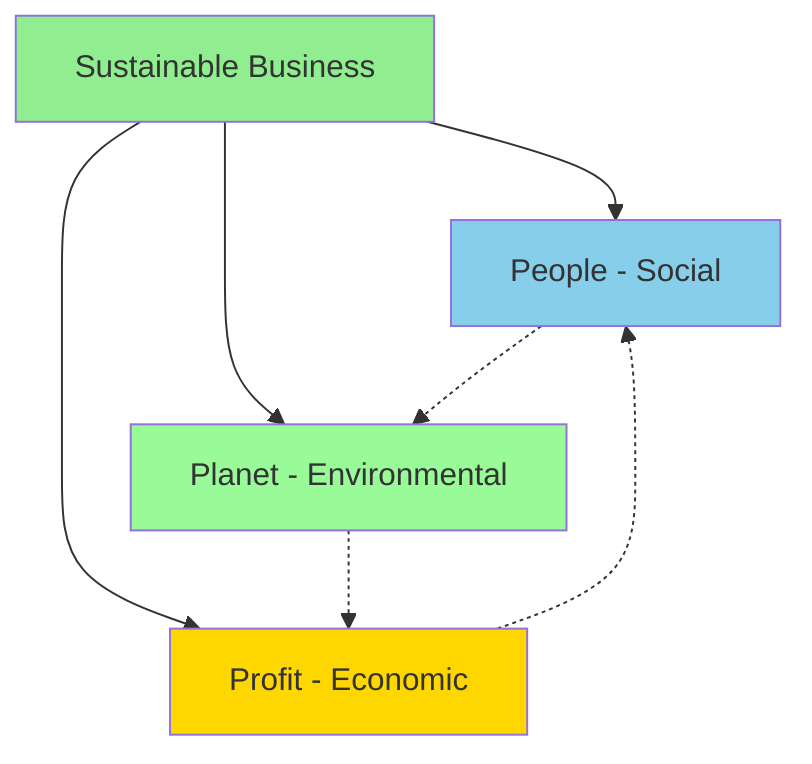

# 01 - Social Entrepreneurship & Sustainability

**Back to**: [[00-INDEX-Entrepreneurship|Index]]
**Related**: [[08-Social-Business-Models|Social Business Models]], [[19-IOOI-Framework|IOOI Framework]]

---

## 🎯 Core Definition

**Social Entrepreneurship** combines social mission with business practices to create sustainable social change.

```
Traditional Business          Social Enterprise
      ↓                              ↓
   PROFIT FIRST              IMPACT FIRST
   Social = CSR              Social = Mission
   Maximize Returns          Sustainable Change
```

---

## 📊 Triple Bottom Line (TBL)

> **Coined by**: John Elkington (1994)
> **Concept**: Three dimensions of sustainable business



### The Three P's

| Dimension | Focus | Examples |
|-----------|-------|----------|
| **👥 People (Social)** | Human capital, community impact | Fair wages, education, health, diversity, labor practices |
| **🌍 Planet (Ecological)** | Environmental stewardship | Carbon footprint, waste reduction, renewable energy, biodiversity |
| **💰 Profit (Economic)** | Financial sustainability | Revenue, efficiency, economic value, job creation |

---

## 🔑 Key Characteristics

### What Social Entrepreneurs DO:
✅ Balance social, environmental, AND economic goals
✅ Reinvest profits into mission
✅ Measure impact alongside financial metrics
✅ Innovate to solve social problems
✅ Create systemic change

### What Social Entrepreneurs DON'T DO:
❌ Prioritize profit over impact
❌ Avoid all venture capital (they CAN work with impact investors)
❌ Ignore economic sustainability

---

## 📈 Social Enterprise Spectrum

```
Pure Charity ←----------------→ Pure Business
     │              │              │
  Non-profit    Social        For-profit
  Donation     Enterprise      Maximizing
  Funded        Hybrid          Returns
```

**Social Enterprises** sit in the middle:
- Generate revenue (not purely donations)
- Pursue social mission (not purely profit)
- Sustainable business model

---

## 💡 Real-World Examples

### 🌟 TOMS Shoes
- **Model**: One-for-One (buy one, give one)
- **Social**: Provides shoes to children in need
- **Economic**: Profitable business
- **Environmental**: Sustainable materials

### 🌟 Grameen Bank (Muhammad Yunus)
- **Model**: Microfinance
- **Social**: Poverty alleviation through small loans
- **Economic**: Self-sustaining through interest
- **Impact**: 9+ million borrowers (97% women)

### 🌟 Patagonia
- **Model**: Environmental activism + outdoor gear
- **Social**: Fair labor practices
- **Environmental**: 1% for the Planet, regenerative practices
- **Economic**: $3+ billion revenue

### 🌟 Fairphone
- **Model**: Ethical smartphone
- **Social**: Fair wages for workers
- **Environmental**: Sustainable materials, repairable design
- **Economic**: Premium pricing model

---

## 🎓 Exam Questions & Answers

### Question 1
**What is true about social entrepreneurship?**

a) Being profitable is the main objective of social entrepreneurs.
b) Social entrepreneurs never work with venture capitalists because the VCs only care about economic aspects.
c) Social entrepreneurs put their focus on social as well as economic aspects.
d) Social entrepreneurs care for ecological as well as social aspects besides economic aspects.

**✅ Answer: (d)**

**Explanation**:
- **(a) WRONG**: Profit is a MEANS, not the main objective
- **(b) WRONG**: Social entrepreneurs CAN work with impact investors and some VCs
- **(c) PARTIALLY CORRECT**: But missing ecological dimension
- **(d) CORRECT**: All three dimensions - ecological, social, AND economic

---

### Question 2
**Which of the following is NOT a part of the triple bottom line of sustainability according to the concept coined by John Elkington?**

a) Social
b) Ecological
c) Innovative
d) Economic

**✅ Answer: (c)**

**Explanation**:
The Triple Bottom Line consists of:
1. **Social** (People)
2. **Ecological** (Planet)
3. **Economic** (Profit)

**Innovation** is important for entrepreneurship but NOT one of the three TBL dimensions.

---

## 🔍 Common Misconceptions

| Misconception | Reality |
|---------------|---------|
| "Social enterprises are charities" | They generate revenue, not just donations |
| "Social entrepreneurs don't make money" | They can be profitable, but reinvest in mission |
| "TBL = CSR" | TBL is core to business model, CSR is add-on |
| "Only non-profits can be social" | For-profits can have social missions too |

---

## 📚 Key Terminology

**B Corporation**: Certified companies meeting high standards of social/environmental performance
**Social Innovation**: Novel solutions to social problems that are more effective than existing approaches
**Impact Investing**: Investments made with intention to generate social/environmental impact alongside financial return
**Shared Value**: Business strategies that create economic value while addressing social needs

---

## 🎯 Memory Aids

### Triple Bottom Line Mnemonic: **"3P"**
- **P**eople (Social)
- **P**lanet (Environmental)  
- **P**rofit (Economic)

### Social Enterprise Formula:
```
Social Enterprise = Social Mission + Business Model + Sustainable Revenue
```

---

## 🔗 Connections to Other Topics

- [[08-Social-Business-Models|Social Business Models]] - How to operationalize social mission
- [[19-IOOI-Framework|IOOI Framework]] - Measuring social impact
- [[06-Business-Models|Business Models]] - Revenue generation strategies
- [[16-Franchising|Franchising]] - Scaling social enterprises

---

## ✅ Self-Check Questions

1. What are the three dimensions of the Triple Bottom Line?
2. Can a for-profit company be a social enterprise?
3. Why is "innovative" NOT part of the TBL?
4. Give an example of balancing all three TBL dimensions.
5. What's the difference between CSR and social entrepreneurship?

---

**Tags**: #social-entrepreneurship #triple-bottom-line #sustainability #TBL #exam-question

**Last Updated**: 2026-01-18
