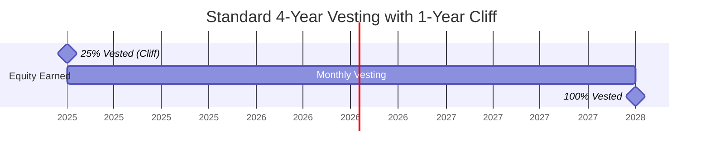

# 02 - Vesting & Equity Distribution

**Back to**: [[00-INDEX-Entrepreneurship|Index]]
**Related**: [[10-Team-Composition|Team Composition]], [[12-Power-Distribution|Power Distribution]]

---

## 🎯 Core Definition

**Vesting** is a dynamic mechanism for distributing equity ownership over time, ensuring team members earn their shares through continued commitment to the venture.

> **Problem Solved**: Co-founder leaves after 6 months but keeps 50% equity
> **Solution**: Equity "vests" (unlocks) gradually over time

---

## 📊 How Vesting Works



### Standard Vesting Schedule

| Time Period | Equity Vested | Cumulative | Status |
|-------------|---------------|------------|--------|
| **Month 0-11** | 0% | 0% | 🔒 Nothing vested (Cliff) |
| **Month 12** | 25% | 25% | 🔓 Cliff unlocks |
| **Month 13-47** | ~2.08%/month | 26%-98% | 📈 Monthly vesting |
| **Month 48** | 2% | 100% | ✅ Fully vested |

---

## 🔑 Key Components

### 1️⃣ Cliff Period
- **Duration**: Typically 1 year
- **Purpose**: Probationary period
- **Effect**: ZERO equity before cliff
- **Rationale**: If someone leaves in first year, they get nothing

```
Day 1 -------- 364 days -------- Day 365
  0%              0%                25% unlocks!
  ↑                                  ↑
Start                             Cliff
```

### 2️⃣ Vesting Period
- **Duration**: Typically 4 years total
- **Frequency**: Monthly after cliff
- **Calculation**: (Total Equity / 48 months) per month

### 3️⃣ Acceleration Clauses
- **Single Trigger**: Vesting speeds up on specific event (e.g., acquisition)
- **Double Trigger**: Requires two events (e.g., acquisition + termination)

---

## 💡 Why Vesting Exists

### Problems Without Vesting

```
Scenario: Equal 50/50 split, no vesting

Co-founder A          Co-founder B
     ↓                      ↓
Works 4 years         Quits after 6 months
    50%                    50%
     ↓                      ↓
  UNFAIR!            Keeps full equity!
```

### Solution: Vesting

```
Scenario: 50/50 split WITH vesting (1-year cliff)

Co-founder A          Co-founder B
     ↓                      ↓
Works 4 years         Quits after 6 months
   100% vested             0% vested
     ↓                      ↓
   FAIR!              Gets nothing!
```

---

## 📈 Vesting Variations

### Standard Tech Startup
```
4 years, 1-year cliff, monthly vesting
Year 1: 25%
Year 2: 25% (monthly)
Year 3: 25% (monthly)
Year 4: 25% (monthly)
```

### Accelerated Vesting
```
3 years, 6-month cliff, monthly vesting
More aggressive for senior hires
```

### Reverse Vesting
```
Start with 100% → Forfeits unvested shares if leaves
Common in European startups
```

---

## 🎓 Exam Questions & Answers

### Question
**What is true about vesting?**

a) Is a dynamic way of splitting the equity.
b) Is another word for the first round of venture capital financing.
c) Is an equal equity split.
d) Is the contract on how the equity is split.

**✅ Answer: (a)**

**Explanation**:
- **(a) CORRECT**: Vesting is DYNAMIC - equity earned over time, not static
- **(b) WRONG**: Vesting ≠ VC financing. VC = funding rounds
- **(c) WRONG**: Vesting can be equal or unequal. It's about TIMING, not amount
- **(d) WRONG**: While documented in contracts, vesting is the MECHANISM itself, not just paperwork

**Key Word**: **DYNAMIC** - changes over time!

---

## 💼 Real-World Examples

### Example 1: Facebook (Early Days)
- **Mark Zuckerberg**: No vesting (founder control)
- **Eduardo Saverin**: Shares diluted (no vesting protection)
- **Lesson**: Vesting protects active contributors

### Example 2: Standard Silicon Valley Startup
```
4 Co-founders, each gets 25%

Founder A: Stays 4 years → 25% vested ✓
Founder B: Leaves month 6 → 0% vested ✗
Founder C: Leaves month 18 → 6.25% vested
Founder D: Stays 4 years → 25% vested ✓

Remaining equity (43.75%) redistributed or returned to pool
```

### Example 3: Acquisition Scenario
```
Startup acquired after 2.5 years
Without acceleration: Founders have 62.5% vested
With single-trigger: 100% vests immediately
With double-trigger: Vests if also fired post-acquisition
```

---

## 🔍 Vesting vs. Other Equity Concepts

| Concept | What It Is | Purpose |
|---------|------------|---------|
| **Vesting** | Earning equity over time | Retain committed team |
| **Cliff** | Initial probation period | Screen early departures |
| **Option Pool** | Reserved equity for future hires | Recruit talent |
| **Dilution** | Reducing ownership % | Accommodate new investors |
| **Strike Price** | Price to exercise options | Employee stock purchase |

---

## 📊 Vesting Calculation Example

**Scenario**: Founder gets 40% equity with 4-year vesting, 1-year cliff

```
Total Equity: 40%
Vesting Period: 48 months
Monthly Rate: 40% ÷ 48 = 0.833% per month

After 12 months (cliff): 10% (25% of 40%)
After 24 months: 20% (50% of 40%)
After 36 months: 30% (75% of 40%)
After 48 months: 40% (100%)

If leaves at month 30: Keeps 25% (75% vested)
                       Forfeits 10% (25% unvested)
```

---

## ⚖️ Advantages vs. Disadvantages

### ✅ Advantages
- **Protects company** from early departures
- **Aligns incentives** for long-term commitment
- **Fairness** - reward actual contribution
- **Flexibility** for team changes
- **Standard practice** - investors expect it

### ❌ Disadvantages
- **Risk for founders** - can lose equity
- **Complexity** in negotiations
- **Tax implications** (esp. reverse vesting)
- **Demotivating** if too long
- **Legal costs** to set up properly

---

## 🎯 Memory Aids

### Vesting Formula
```
VESTING = TIME × COMMITMENT
```

### The 4-1 Rule (Standard Vesting)
- **4** years total
- **1** year cliff
- **Monthly** after cliff

### Cliff Analogy
```
Cliff = Diving Board
↓
You get nothing until you jump!
```

---

## 📋 Common Vesting Terms

**Fully Vested**: 100% of equity earned
**Unvested**: Equity not yet earned
**Accelerated Vesting**: Faster than normal schedule
**Cliff**: Period before any vesting
**Grant Date**: When equity award begins
**Vesting Commencement Date**: When vesting clock starts
**Exercise**: Converting options to shares

---

## 🔗 Connections to Other Topics

- [[12-Power-Distribution|Power Distribution]] - Vesting affects control
- [[10-Team-Composition|Team Composition]] - Recruiting with equity
- [[20-Financing-Sources|Financing Sources]] - Investors require vesting

---

## ✅ Self-Check Questions

1. Why is vesting called "dynamic"?
2. What happens at the cliff?
3. Calculate: 30% equity, 4-year vest, 1-year cliff - what after 2 years?
4. Why do investors require founders to have vesting?
5. What's the difference between single and double trigger acceleration?

**Answers**:
1. Changes over time based on continued involvement
2. First vesting milestone (usually 25% at 1 year)
3. 15% vested (50% of 30%)
4. Ensures founders stay committed to the venture
5. Single = one event; Double = two events required

---

**Tags**: #vesting #equity #founders #startup-equity #cliff #exam-question

**Last Updated**: 2026-01-18
