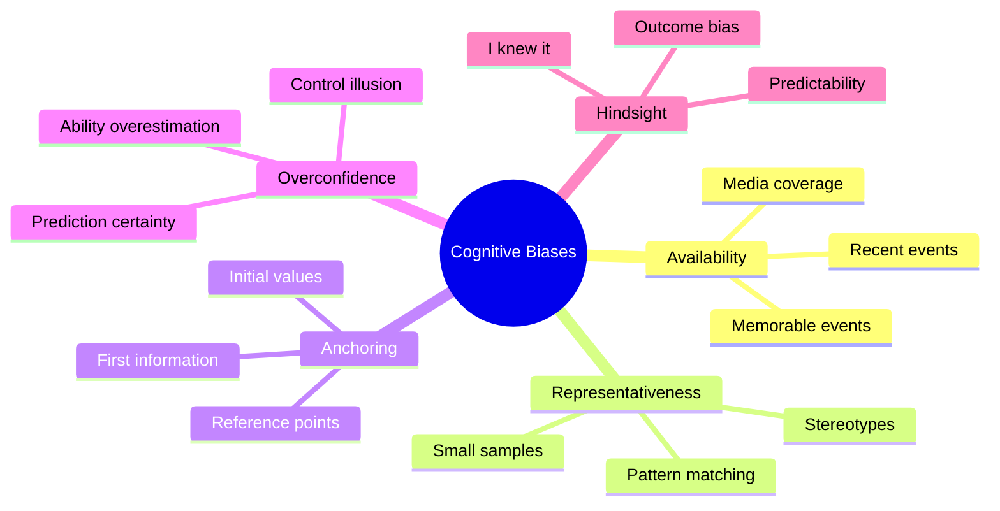

# 03 - Cognitive Biases in Entrepreneurship

**Back to**: [[00-INDEX-Entrepreneurship|Index]]
**Related**: [[04-Effectuation-vs-Causation|Effectuation vs Causation]], [[09-Entrepreneurial-Personality|Entrepreneurial Personality]]

---

## 🎯 Core Definition

**Cognitive Biases** are systematic patterns of deviation from rationality in judgment. Entrepreneurs are particularly susceptible to these mental shortcuts that can lead to both breakthrough innovations and costly mistakes.

> "We don't see things as they are; we see them as we are." - Anaïs Nin

---

## 🧠 The Five Major Entrepreneurial Biases



---

## 1️⃣ Availability Bias

### Definition
Judging likelihood based on how easily examples come to mind (especially **recent** or **vivid** events)

### Mechanism
```
Recent/Memorable Event → Easier to Recall → Seems More Likely
```

### Examples
| Scenario | Biased Thinking | Reality |
|----------|----------------|---------|
| Plane crash yesterday | "Flying is dangerous!" | Statistically safest transport |
| Friend's startup failed | "Startups always fail!" | Survivor bias - successes less visible |
| Recent market crash | "Market will crash again soon" | Market movements are cyclical |
| Viral app success | "Apps are the future!" | Most apps fail quietly |

### Entrepreneurial Impact
✅ **Can Help**: Quick pattern recognition, learning from recent feedback
❌ **Can Hurt**: Over-weighting recent customer complaints, panic decisions after setbacks

### Real Example: COVID-19 Pandemic
- **Bias**: Everyone wanted remote work tools
- **Reality**: Not all remote solutions succeeded post-pandemic
- **Lesson**: Recent trends ≠ permanent shifts

---

## 2️⃣ Representativeness Bias

### Definition
Drawing conclusions based on **small samples** or **few attributes**, ignoring statistical realities

### Mechanism
```
Small Sample → Hasty Generalization → False Pattern
```

### Examples
| Small Sample | Biased Conclusion | Problem |
|--------------|-------------------|---------|
| 2 customers love it | "Everyone will love it!" | Sample size = 2 |
| 3 successful pivots | "Pivoting always works" | Survivorship bias |
| Friend succeeded with X | "X strategy is proven" | N=1, no control |
| Tech founder stereotype | "All founders must be young coders" | Ignores diverse paths |

### Entrepreneurial Impact
✅ **Can Help**: Quick prototyping, early validation signals
❌ **Can Hurt**: Premature scaling, ignoring market research, stereotype-based hiring

### Real Example: Theranos
- **Bias**: "Elizabeth Holmes looks like Steve Jobs (turtleneck, passion) → Will succeed like Jobs"
- **Reality**: Surface similarities ≠ substance
- **Lesson**: Judge by fundamentals, not appearances

---

## 3️⃣ Anchoring Bias

### Definition
Over-relying on the **first piece of information** received (the "anchor") when making decisions

### Mechanism
```
First Number/Info (Anchor) → All Subsequent Judgments Adjust from Anchor
```

### Examples
| Context | Anchor | Impact |
|---------|--------|--------|
| Valuation negotiation | First number: $10M | All counteroffers reference $10M |
| Salary negotiation | Employer asks your expectation first | You anchor low, they save money |
| Pricing strategy | First price: $99 | Discounts to $49 seem huge |
| Market research | First expert says "5% market" | Team fixates on 5% |

### Entrepreneurial Impact
✅ **Can Help**: Strategic pricing (set high anchor), negotiation leverage
❌ **Can Hurt**: Bad first valuation haunts future rounds, initial market estimate limits vision

### Real Example: Real Estate
```
House Listed at $500K (Anchor)
    ↓
Buyers think: "Is it worth $500K?"
Not: "What would I actually pay?"
    ↓
Even if overpriced, offers cluster around $450K-$480K
```

---

## 4️⃣ Overconfidence Bias

### Definition
**Overestimating** one's abilities, knowledge, or predictions. Most common in entrepreneurs!

### Three Types
1. **Overestimation**: "I'm better than I am"
2. **Overplacement**: "I'm better than others"
3. **Overprecision**: "I'm more certain than justified"

### Examples
| Scenario | Overconfident Thought | Reality Check |
|----------|----------------------|---------------|
| Product launch | "90% sure this will succeed" | <10% startups succeed |
| Timeline | "Will take 3 months" | Actually takes 9 months |
| Competition | "We have no real competitors" | 20 competitors in stealth |
| Fundraising | "Easy to raise $1M" | Takes 6 months, many rejections |

### Entrepreneurial Impact
✅ **Can Help**: Resilience, attracting investors/talent, bold vision
❌ **Can Hurt**: Underfunding, missed deadlines, ignoring risks, poor planning

### Research Finding
> 81% of entrepreneurs believe their venture has ≥70% chance of success
> Actual success rate: ~10%

### Real Example: WeWork
- **Adam Neumann's claim**: "We're worth $47 billion"
- **Reality**: Overvalued by 10x+, nearly collapsed
- **Lesson**: Confidence ≠ Value

---

## 5️⃣ Hindsight Bias

### Definition
After an outcome is known, believing "I knew it all along" or that it was predictable

### Mechanism
```
Outcome Happens → Memory Reconstructs → "I Knew That Would Happen"
```

### Examples
| Event | Hindsight Thinking | Truth |
|-------|-------------------|-------|
| Competitor fails | "Obviously their model was flawed" | Wasn't obvious before |
| Market shift | "I predicted this trend" | No documented prediction |
| Product success | "That feature was clearly killer" | Debated internally pre-launch |
| Investment loss | "I knew that stock was risky" | You were bullish last month |

### Entrepreneurial Impact
✅ **Can Help**: Learning confidence, narrative building
❌ **Can Hurt**: False lessons, not documenting decisions, poor post-mortems

### Real Example: iPhone Launch
- **Pre-launch (2007)**: "Who needs internet on a phone?" "Physical keyboard is essential"
- **Post-launch**: "Obviously the iPhone would dominate"
- **Lesson**: Success seems obvious in retrospect

---

## 🎓 Exam Questions & Answers

### Question 1
**Relying on more recent information than on what happened in the more distant past is an indication of which of the following biases?**

a) Availability
b) Representativeness
c) Anchoring
d) Hindsight

**✅ Answer: (a) Availability**

**Explanation**:
- **Recent** information is more **available** in memory
- Key word: "RECENT" → Availability
- Representativeness = small samples, not recency
- Anchoring = first information, not recent
- Hindsight = after outcome known

---

### Question 2
**Drawing conclusions based on a small amount of information / based on a few attributes is the description of which of the following biases?**

a) Overconfidence
b) Availability
c) Representativeness
d) Anchoring

**✅ Answer: (c) Representativeness**

**Explanation**:
- **Small sample** → Representativeness
- Key words: "SMALL AMOUNT" or "FEW ATTRIBUTES"
- Overconfidence = ability overestimation
- Availability = recency/memorability
- Anchoring = first information fixation

---

## 🔄 Bias Interaction Matrix

| Bias 1 | + Bias 2 | = Combined Effect |
|--------|----------|-------------------|
| Overconfidence | Availability | "Recent success → I'm a genius!" |
| Representativeness | Overconfidence | "3 customers love it → Everyone will!" |
| Anchoring | Availability | "Recent high valuation → We're worth that" |
| Hindsight | Overconfidence | "I predicted it → I can predict future" |

---

## 🛡️ Debiasing Strategies

### For Availability Bias
```
✓ Seek base rates, not anecdotes
✓ Document decisions before outcomes
✓ Use checklists, not memory
✓ Wait 24 hours before reacting to news
```

### For Representativeness Bias
```
✓ Require minimum sample sizes (N>30)
✓ Run A/B tests
✓ Seek disconfirming evidence
✓ Use statistical thinking
```

### For Anchoring Bias
```
✓ Make first offer in negotiations
✓ Ignore initial estimates, start fresh
✓ Consider multiple anchors
✓ Use pre-mortems (assume failure first)
```

### For Overconfidence Bias
```
✓ Track prediction accuracy
✓ Seek critical feedback
✓ Use outside view (industry benchmarks)
✓ Challenge assumptions
```

### For Hindsight Bias
```
✓ Document predictions before outcomes
✓ Keep decision logs
✓ Focus on process, not outcome
✓ Study surprises, not confirmations
```

---

## 📊 Bias Quick Reference Chart

```
┌─────────────────────────────────────────────────────┐
│  TRIGGER WORD      →    BIAS                        │
├─────────────────────────────────────────────────────┤
│  RECENT            →    Availability                │
│  MEMORABLE         →    Availability                │
│  SMALL SAMPLE      →    Representativeness          │
│  FEW ATTRIBUTES    →    Representativeness          │
│  FIRST INFO        →    Anchoring                   │
│  INITIAL NUMBER    →    Anchoring                   │
│  OVERESTIMATE      →    Overconfidence              │
│  TOO CERTAIN       →    Overconfidence              │
│  KNEW IT           →    Hindsight                   │
│  OBVIOUS NOW       →    Hindsight                   │
└─────────────────────────────────────────────────────┘
```

---

## 🎯 Memory Aids

### AARO-H Mnemonic
- **A**vailability - Recent
- **A**nchoring - First
- **R**epresentativeness - Small sample
- **O**verconfidence - Too sure
- **H**indsight - Knew it

### The Question Method
```
Availability: "When did I last hear about this?"
Representativeness: "How big is my sample?"
Anchoring: "What was the first number I heard?"
Overconfidence: "What's my actual track record?"
Hindsight: "Did I document my prediction?"
```

---

## 🔗 Connections to Other Topics

- [[04-Effectuation-vs-Causation|Effectuation]] - Uses biases productively
- [[09-Entrepreneurial-Personality|Personality]] - Overconfidence trait
- [[05-Risk-vs-Uncertainty|Risk/Uncertainty]] - Biases affect risk perception
- [[11-Team-Conflicts|Team Conflicts]] - Biases cause disagreements

---

## ✅ Self-Check Questions

1. A founder reads about 3 startup failures and concludes "startups are too risky." Which bias?
2. First investor offers $5M valuation. All negotiations reference $5M. Which bias?
3. "I knew that product would succeed!" after launch. Which bias?
4. 5 beta users love the product, founder says "Market validated!" Which bias?
5. Founder believes "I'm 95% certain we'll hit targets" but historically hits 40%. Which bias?

**Answers**: 1) Availability, 2) Anchoring, 3) Hindsight, 4) Representativeness, 5) Overconfidence

---

**Tags**: #cognitive-biases #availability #representativeness #anchoring #overconfidence #hindsight #exam-question

**Last Updated**: 2026-01-18
