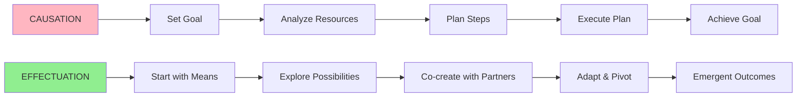

# 04 - Effectuation vs. Causation

**Back to**: [[00-INDEX-Entrepreneurship|Index]]
**Related**: [[05-Risk-vs-Uncertainty|Risk vs Uncertainty]], [[03-Cognitive-Biases|Cognitive Biases]]

---

## 🎯 Core Definition

**Effectuation** and **Causation** are two fundamentally different approaches to decision-making and venture creation.

> **Causation**: "To achieve X, what do I need?"
> **Effectuation**: "With what I have, what can I create?"

---

## 📊 The Fundamental Difference



---

## 🔑 Causation (Predictive Logic)

### Core Philosophy
"If I can predict the future, I can control it"

### Process Flow
```
Desired Outcome → Required Means → Careful Planning → Execution
```

### Characteristics
| Aspect | Approach |
|--------|----------|
| **Starting Point** | Predetermined goal |
| **Decision Basis** | Expected returns |
| **Risk Approach** | Calculate & minimize risk |
| **Analysis** | Competitive analysis |
| **Relationships** | Transactional (contracts) |
| **Surprises** | Avoid/prevent |
| **Market** | Existing markets |
| **Best For** | Known environments |

### Example: Corporate Strategy
```
Goal: Increase market share by 10%
  ↓
Resources Needed: $5M marketing budget
  ↓
Plan: 6-month campaign, 3 channels
  ↓
Execute: Follow plan precisely
  ↓
Result: Hit or miss target
```

---

## 🔑 Effectuation (Creative Logic)

### Core Philosophy
"If I can control the future, I don't need to predict it"

### Process Flow
```
Available Means → Possible Actions → Co-creation → Emergent Goals
```

### Characteristics
| Aspect | Approach |
|--------|----------|
| **Starting Point** | Given resources (means) |
| **Decision Basis** | Affordable loss |
| **Risk Approach** | Risk what you can afford to lose |
| **Analysis** | Focus on means at hand |
| **Relationships** | Partnerships (co-creation) |
| **Surprises** | Leverage as opportunities |
| **Market** | Create new markets |
| **Best For** | Uncertain environments |

### Example: Startup Journey
```
Means: Skills, network, $10K
  ↓
Talk to potential partners
  ↓
Discover unexpected opportunity
  ↓
Pivot based on learnings
  ↓
Result: Something better than imagined
```

---

## 🎯 The Five Effectuation Principles

### 1️⃣ Bird-in-Hand Principle
**"Start with your means"**

```
WHO you are  →  Personal traits, abilities
WHAT you know  →  Education, expertise, experience  
WHOM you know  →  Social network, connections

Instead of: "What should I do?"
Ask: "What CAN I do with what I have?"
```

**Example**: A chef (who), knows Italian cuisine (what), has restaurant connections (whom) → Starts catering business, not tech startup

---

### 2️⃣ Affordable Loss Principle
**"Focus on downside, not upside"**

```
Causation Thinking:
"This could make $1M! What do I need to invest?"

Effectuation Thinking:
"I can afford to lose $10K. Let me experiment."
```

**Key Question**: "How much am I willing to lose?" NOT "How much can I make?"

**Example**: 
- ❌ Causation: "This startup could be worth $100M, I'll invest my house"
- ✅ Effectuation: "I'll invest $20K. If it fails, I can recover"

---

### 3️⃣ Crazy Quilt Principle
**"Build partnerships, not transactions"**

```
Transactional (Causation):
Company ← CONTRACT → Supplier
  "You give X, I pay Y"

Partnership (Effectuation):
Venture ← CO-CREATION → Stakeholder
  "Let's build this together"
```

**Key Insight**: Stakeholders commit BEFORE the venture is fully defined

**Example**: 
- ❌ Causation: Negotiate lowest price with suppliers
- ✅ Effectuation: Partner with suppliers who co-invest in success

---

### 4️⃣ Lemonade Principle
**"Leverage contingencies"**

```
Causation: Surprise = Problem → Avoid
Effectuation: Surprise = Opportunity → Leverage
```

**Origin**: "When life gives you lemons, make lemonade"

**Example**:
- **Surprise**: Key feature fails in testing
- ❌ Causation: Panic, try to fix, stick to plan
- ✅ Effectuation: Users love different feature → Pivot to that

**Real Example**: Flickr
- Started as gaming company
- Photo-sharing feature became popular
- **Leveraged contingency** → Pivoted to photo sharing

---

### 5️⃣ Pilot-in-the-Plane Principle
**"Control > Prediction"**

```
Causation: Predict future → React to it
Effectuation: Shape future → Create it
```

**Key Mindset**: "I control what happens" vs. "I predict what happens"

**Example**:
- ❌ Causation: Analyze market trends, forecast demand
- ✅ Effectuation: Create product, shape customer preferences

---

## 🎓 Exam Questions & Answers

### Question 1
**Which of the following is NOT typical of effectual decision making?**

a) To start with resources and select among possible outcomes.
b) To calculate the downside potential and to risk no more than one can afford to lose.
c) To set up transactional relationships with customers and suppliers.
d) To see surprises and even failures as new opportunities.

**✅ Answer: (c)**

**Explanation**:
- **(a) EFFECTUAL** ✓ - Bird-in-Hand (start with means)
- **(b) EFFECTUAL** ✓ - Affordable Loss principle
- **(c) NOT EFFECTUAL** ✗ - Effectuation uses PARTNERSHIPS (Crazy Quilt), not transactions
- **(d) EFFECTUAL** ✓ - Lemonade principle

**Key Insight**: Effectuation = **Partnerships**; Causation = **Transactions**

---

### Question 2
**Which of these principles is associated to a causation-approach?**

a) Avoiding Surprises
b) Being Means Oriented
c) Affordable Loss
d) Leveraging on Contingencies

**✅ Answer: (a)**

**Explanation**:
- **(a) CAUSATION** ✓ - Predict and avoid surprises
- **(b) EFFECTUATION** ✗ - Start with means (Bird-in-Hand)
- **(c) EFFECTUATION** ✗ - Affordable Loss principle
- **(d) EFFECTUATION** ✗ - Lemonade principle

**Key Insight**: Causation seeks **predictability and control**, avoids surprises

---

## 📊 Comparison Table

| Dimension | Causation | Effectuation |
|-----------|-----------|--------------|
| **Orientation** | Goal-driven | Means-driven |
| **Starting Point** | "What should I do?" | "What can I do?" |
| **Risk Logic** | Expected returns | Affordable loss |
| **Attitude to Outsiders** | Competitive analysis | Strategic partnerships |
| **Attitude to Contingencies** | Avoid surprises | Exploit surprises |
| **Nature of Market** | Existing, defined | Created, emergent |
| **Underlying Logic** | Prediction | Control |
| **Best Environment** | Stable, known | Uncertain, novel |
| **Relationships** | Transactional | Commitments |

---

## 💡 When to Use Each Approach

### Use CAUSATION When:
✅ Market is well-defined
✅ Customer needs are clear
✅ Resources are abundant
✅ Competition is predictable
✅ Risk is calculable
✅ Time allows for planning

**Example Contexts**: 
- Large corporation entering adjacent market
- Franchise expansion
- Second product in known category

---

### Use EFFECTUATION When:
✅ High uncertainty
✅ Novel products/markets
✅ Limited resources
✅ Unclear customer needs
✅ Unknown competition
✅ Need for speed

**Example Contexts**:
- Early-stage startup
- New technology
- Creating new market category

---

## 🔄 Real-World Examples

### Example 1: Airbnb (Effectuation)
```
Means (Bird-in-Hand):
- Couldn't afford rent
- Had air mattresses
- Design conference in town

Affordable Loss:
- Risk: Hosting strangers
- Affordable: One weekend

Lemonade:
- Surprise: People loved photos
- Leveraged: Made photography core feature

Crazy Quilt:
- Partnered with hosts before platform was built
- Co-created with early users

Result: $100B+ company
```

### Example 2: McDonald's (Causation)
```
Goal: Dominate fast food globally

Analysis:
- Study market size
- Calculate ROI
- Identify locations

Plan:
- Standardize operations
- Franchise model
- Marketing budget

Execute:
- Follow playbook
- Minimize deviation
- Predictable outcomes

Result: Largest fast food chain
```

---

## 🎯 Memory Aids

### Effectuation Principles Mnemonic: **"BACLE"**
- **B**ird-in-Hand (Start with means)
- **A**ffordable Loss (Downside focus)
- **C**razy Quilt (Partnerships)
- **L**emonade (Leverage surprises)
- **E**xecutive (Pilot-in-plane / Control)

### Quick Decision Tool
```
Ask yourself:
1. Can I predict this? → YES = Causation, NO = Effectuation
2. Do I have clear goal? → YES = Causation, NO = Effectuation
3. Can I afford to lose? → Thinking this = Effectuation
4. Should I avoid surprise? → YES = Causation, NO = Effectuation
```

---

## 🧩 Effectuation in Practice

### Startup Application
```
Month 1: Bird-in-Hand
- Who am I? Software engineer
- What do I know? E-commerce
- Whom do I know? 50 online store owners

Month 2: Crazy Quilt
- Talk to store owners
- 5 commit to co-creating solution
- Build together

Month 3: Lemonade
- Users want feature X (not planned)
- Pivot to focus on X
- Better product emerges

Month 6: Affordable Loss
- Spent $15K (affordable)
- Learned invaluable lessons
- Ready to scale or pivot

Result: Product-market fit found through effectuation
```

---

## 🔗 Connections to Other Topics

- [[05-Risk-vs-Uncertainty|Risk vs Uncertainty]] - Effectuation for uncertainty
- [[03-Cognitive-Biases|Cognitive Biases]] - Effectuation embraces them
- [[06-Business-Models|Business Models]] - Effectual model iteration
- [[20-Financing-Sources|Financing]] - Affordable loss guides funding

---

## ✅ Self-Check Questions

1. What's the key difference between causation and effectuation?
2. Which principle says "focus on downside, not upside"?
3. Are partnerships causation or effectuation?
4. When should startups use causation?
5. What does "pilot-in-the-plane" mean?

**Answers**:
1. Causation = predict future; Effectuation = control future
2. Affordable Loss
3. Effectuation (Crazy Quilt principle)
4. When market/customer/risk are known and predictable
5. Control what you can, don't just predict

---

**Tags**: #effectuation #causation #decision-making #startup-methodology #saras-sarasvathy #exam-question

**Last Updated**: 2026-01-18
