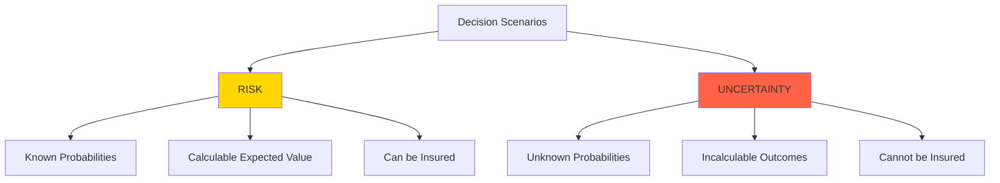

# 05 - Risk vs. Uncertainty

**Back to**: [[00-INDEX-Entrepreneurship|Index]]
**Related**: [[04-Effectuation-vs-Causation|Effectuation vs Causation]], [[03-Cognitive-Biases|Cognitive Biases]]

---

## 🎯 Core Definition

**Risk** and **Uncertainty** are fundamentally different concepts in decision-making, particularly crucial for entrepreneurs.

> **Risk**: Known probabilities (calculable)
> **Uncertainty**: Unknown probabilities (incalculable)

---

## 📊 The Knight Distinction (1921)

Economist **Frank Knight** distinguished these concepts in his seminal work "Risk, Uncertainty, and Profit"



---

## 🎲 RISK - Known Probabilities

### Definition
Situations where all possible outcomes AND their probabilities are known

### Characteristics
✅ Can calculate expected value
✅ Historical data available
✅ Probability distributions known
✅ Can be modeled mathematically
✅ Insurable
✅ Can diversify

### Formula
```
Expected Value = Σ (Probability × Outcome)
EV = P(A) × Value(A) + P(B) × Value(B) + ...
```

### Examples

| Scenario | Probabilities | Can Calculate? |
|----------|--------------|----------------|
| **Rolling dice** | 1/6 for each number | ✅ YES - RISK |
| **Coin flip** | 50/50 heads/tails | ✅ YES - RISK |
| **Life insurance** | Actuarial tables | ✅ YES - RISK |
| **Casino games** | House edge known | ✅ YES - RISK |
| **Quality defects** | Historical % known | ✅ YES - RISK |

### Real Example: Insurance Industry
```
Life Insurance (RISK):
- Age: 40 years old
- Known: 99.5% survive year, 0.5% don't
- Premium: Calculated from known probabilities
- Outcome: Predictable for insurance company
```

---

## ❓ UNCERTAINTY - Unknown Probabilities

### Definition
Situations where outcomes AND/OR their probabilities are unknown

### Characteristics
❌ Cannot calculate expected value
❌ No historical data
❌ Probability distributions unknown
❌ Cannot be modeled precisely
❌ Not insurable
❌ Cannot diversify systematically

### Types of Uncertainty

1. **Outcome Uncertainty**: Don't know what could happen
2. **Probability Uncertainty**: Know outcomes, not probabilities
3. **Complete Uncertainty**: Neither outcomes nor probabilities known

### Examples

| Scenario | Why Uncertain? | Can Calculate? |
|----------|----------------|----------------|
| **New product launch** | No historical data | ❌ NO - UNCERTAINTY |
| **Market disruption** | Unprecedented event | ❌ NO - UNCERTAINTY |
| **Technology adoption** | Novel technology | ❌ NO - UNCERTAINTY |
| **Regulatory changes** | Political unknowns | ❌ NO - UNCERTAINTY |
| **Pandemic impact** | Black swan event | ❌ NO - UNCERTAINTY |

### Real Example: iPhone Launch (2007)
```
iPhone Launch (UNCERTAINTY):
- Question: Will customers buy touchscreen-only phone?
- No historical data on: Pure touchscreen smartphones
- No way to calculate: Adoption rate probabilities
- Outcome: Completely uncertain
- Apple's approach: Build and see
```

---

## 🎓 Exam Question & Answer

### Question
**What is the main difference between risky and uncertain decisions?**

a) Source of finance
b) Entrepreneurs' mood
c) External factors
d) Known outcome probabilities

**✅ Answer: (d)**

**Explanation**:
- **(a) WRONG**: Finance source is unrelated to risk/uncertainty distinction
- **(b) WRONG**: Mood is subjective, not defining characteristic
- **(c) WRONG**: Both have external factors
- **(d) CORRECT**: **Known probabilities** = Risk; **Unknown probabilities** = Uncertainty

**Key Concept**: The MAIN difference is whether you can calculate probabilities!

---

## 📊 Comparison Matrix

| Dimension | RISK | UNCERTAINTY |
|-----------|------|-------------|
| **Probabilities** | Known, quantifiable | Unknown, unquantifiable |
| **Outcomes** | Defined set | May be undefined |
| **Historical Data** | Available | Not available |
| **Expected Value** | Can calculate | Cannot calculate |
| **Insurance** | Possible | Not possible |
| **Mathematical Models** | Applicable | Limited use |
| **Decision Tools** | Decision trees, EV | Heuristics, experiments |
| **Management** | Diversification, hedging | Flexibility, learning |
| **Typical Context** | Established markets | New ventures, innovation |
| **Frank Knight Quote** | "Measurable" | "Unmeasurable" |

---

## 🎯 Decision-Making Approaches

### For RISK (Known Probabilities)
```
1. Calculate Expected Value
   ↓
2. Compare alternatives
   ↓
3. Choose highest EV
   ↓
4. Diversify to reduce variance
   ↓
5. Insurance where possible
```

**Tools**:
- Decision trees
- Monte Carlo simulation
- Portfolio theory
- Statistical analysis

**Example**: 
```
Investment Decision (RISK)
Option A: 60% chance of $100K, 40% chance of $0
EV = 0.6 × $100K + 0.4 × $0 = $60K

Option B: 50% chance of $110K, 50% chance of $10K
EV = 0.5 × $110K + 0.5 × $10K = $60K

Both have same EV, choose based on risk tolerance
```

---

### For UNCERTAINTY (Unknown Probabilities)
```
1. Use heuristics (rules of thumb)
   ↓
2. Conduct experiments
   ↓
3. Build minimum viable product
   ↓
4. Learn from market
   ↓
5. Iterate and adapt
```

**Tools**:
- Effectuation principles
- Lean Startup (Build-Measure-Learn)
- Real options
- Scenario planning
- Affordable loss

**Example**:
```
New Product Launch (UNCERTAINTY)
Cannot calculate: Success probability unknown
Instead:
1. Affordable loss: "I'll invest $50K max"
2. MVP: Build minimum version
3. Test: Launch to 100 users
4. Learn: Gather feedback
5. Pivot: Adjust based on data
```

---

## 🌍 Real-World Examples

### Example 1: COVID-19 Vaccine Development
**Type**: UNCERTAINTY → RISK transition

```
2020 (UNCERTAINTY):
- Will mRNA vaccines work? Unknown
- What's success probability? Unknown
- Efficacy level? Unknown
→ Managed through: Multiple parallel bets, speed

2021+ (RISK):
- Clinical trial data available
- Known efficacy rates (e.g., 95%)
- Predictable side effects
→ Managed through: Statistical quality control
```

---

### Example 2: Tesla (2010s)
**Type**: UNCERTAINTY

```
Unknown Probabilities:
- Will mass market want electric cars?
- Can manufacturing scale?
- Will charging infrastructure develop?

Elon Musk's Approach:
✗ NOT: Calculate expected value (impossible)
✓ YES: Bet affordable loss, iterate, learn
✓ YES: Create market rather than predict it
```

---

### Example 3: Manufacturing Quality
**Type**: RISK

```
Known Probabilities:
- Historical defect rate: 2%
- Cost per defect: $100
- Units produced: 10,000

Expected Cost = 10,000 × 0.02 × $100 = $20,000

Decision: Invest in quality if cost < $20K
```

---

## 🔄 The Transition from Uncertainty to Risk

Many entrepreneurial ventures start with uncertainty and evolve toward risk:

```
UNCERTAINTY                    RISK
    |                           |
    |  Gather Data               |
    |  ──────────>               |
    |                           |
Launch ──> Learn ──> Scale ──> Mature
 ↑                              ↑
Unknown                      Known
Probabilities              Probabilities
```

### Example: Dropbox
```
2008 (UNCERTAINTY):
"Will people pay for cloud storage?"
→ Solution: Create MVP video, measure interest

2010 (MIXED):
Some user data, but scaling unknown
→ Solution: Freemium model, measure conversion

2015+ (RISK):
Known conversion rates, churn rates
→ Solution: Optimize using data/analytics
```

---

## 🧠 Knightian Uncertainty & Entrepreneurship

### Why Entrepreneurs Thrive in Uncertainty
1. **Opportunity**: Uncertainty = profit potential
2. **Competition**: Others scared by uncertainty
3. **Innovation**: Uncertainty requires creativity
4. **Value Creation**: Reduce uncertainty for others

### Knight's Insight
> "Profit is the reward for bearing uncertainty"

```
High Uncertainty → Few Competitors → Potential for High Returns
Low Risk → Many Competitors → Lower Returns
```

---

## 🎯 Practical Implications

### For Investors
| Situation | Approach |
|-----------|----------|
| **RISK** | Diversify portfolio, calculate returns |
| **UNCERTAINTY** | Small bets, multiple options, learn |

### For Entrepreneurs
| Situation | Approach |
|-----------|----------|
| **RISK** | Optimize, efficiency, scale |
| **UNCERTAINTY** | Experiment, pivot, adapt (Effectuation) |

### For Large Companies
| Situation | Approach |
|-----------|----------|
| **RISK** | Standard operating procedures |
| **UNCERTAINTY** | Innovation labs, acquisitions |

---

## 💡 Common Misconceptions

| Misconception | Reality |
|---------------|---------|
| "All business is risky" | Some is risky (calculable), some uncertain (not calculable) |
| "Uncertainty = high risk" | Different concepts; uncertainty may have low downside |
| "We can model anything" | Some situations inherently uncertain |
| "Risk = bad" | Risk is neutral; can be managed |
| "Avoid uncertainty" | Entrepreneurship requires embracing it |

---

## 🎯 Memory Aids

### Quick Test
```
Ask: "Can I calculate the probability?"
   ↓
YES → RISK (known probabilities)
NO  → UNCERTAINTY (unknown probabilities)
```

### Mnemonic: **"RISK Has NUMBERS"**
- **R**isk
- **I**nvolves
- **S**pecific
- **K**nown
- **N**umerical
- **U**nderstandable
- **M**easurable
- **B**ounds
- **E**xpectations
- **R**ates
- **S**tatistics

### Analogy
```
RISK = Weather Forecast
- Can say "70% chance of rain"
- Based on historical patterns
- Quantifiable

UNCERTAINTY = Climate in 100 years
- Cannot give precise probabilities
- No historical precedent
- Must adapt and learn
```

---

## 🔗 Connections to Other Topics

- [[04-Effectuation-vs-Causation|Effectuation]] - Designed for uncertainty
- [[03-Cognitive-Biases|Cognitive Biases]] - Affect risk/uncertainty perception
- [[20-Financing-Sources|Financing Sources]] - Different for risk vs uncertainty
- [[06-Business-Models|Business Models]] - Iterate under uncertainty

---

## ✅ Self-Check Questions

1. Can you insure against uncertainty? Why or why not?
2. Is launching a new product category risk or uncertainty?
3. What's the formula for expected value under risk?
4. Why can casinos calculate expected returns but startups can't?
5. How does uncertainty become risk over time?

**Answers**:
1. No - uncertainty means unknown probabilities, so cannot price insurance
2. Uncertainty - no historical data on new categories
3. EV = Σ (Probability × Outcome)
4. Casinos have known probabilities (games have fixed rules); startups face unknown customer adoption
5. As data accumulates, unknown becomes known; learn probabilities through experience

---

**Tags**: #risk #uncertainty #knight #decision-making #probabilities #entrepreneurship #exam-question

**Last Updated**: 2026-01-18
