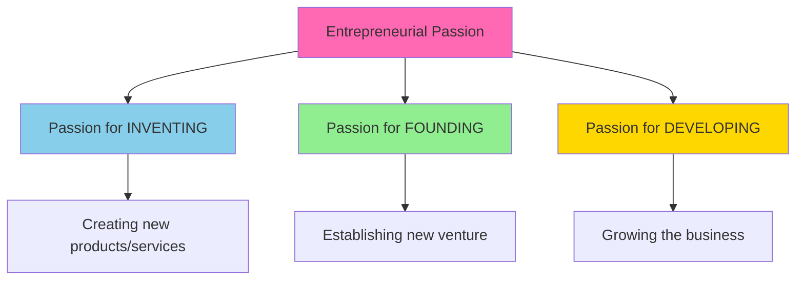

# 09 - Entrepreneurial Personality & Emotions

**Back to**: [[00-INDEX-Entrepreneurship|Index]]
**Related**: [[03-Cognitive-Biases|Cognitive Biases]], [[18-Big-Five-Personality|Big Five]]

---

## 🎯 Core Definition

Entrepreneurial personality encompasses the psychological traits, emotions, and cognitive patterns that characterize entrepreneurs and influence the entrepreneurial process.

> **Key Insight**: Passion DOES influence both entrepreneur behavior and stakeholder behavior!

---

## 🧠 Psychological Perspective

### Why Psychology Matters

```
Psychological Factors
         ↓
┌────────────────────────┐
│ • Personality Traits   │
│ • Cognitive Patterns   │
│ • Emotions & Affect    │
│ • Motivations          │
└────────────────────────┘
         ↓
Entrepreneurial Behavior
         ↓
Venture Outcomes
```

**Three Key Areas:**
1. **Personality Traits** - Stable characteristics
2. **Cognitive Patterns** - How entrepreneurs think
3. **Emotions & Affect** - How entrepreneurs feel

---

## 📊 Key Personality Traits

### Overconfidence
**Most Common Entrepreneurial Trait**

```
Entrepreneurs vs. Corporate Managers:

Overconfidence Level
    ↑
    │     ███████
    │     ███████  Entrepreneurs
    │     ███████
    │  ████████
    │  ████████  Corporate Managers
    │  ████████
    └──────────────────→
```

**Manifestations:**
- **Overestimation**: "I can do this better than I actually can"
- **Overplacement**: "I'm better than other entrepreneurs"
- **Overprecision**: "I'm 90% certain" (when actually 40%)

**Benefits:**
✅ Resilience through failures
✅ Attracts investors and talent
✅ Persistence in face of obstacles
✅ Bold vision and risk-taking

**Costs:**
❌ Underestimating challenges
❌ Insufficient planning
❌ Ignoring market signals
❌ Overextension

---

### Other Key Traits

| Trait | Entrepreneurial Level | Impact |
|-------|---------------------|--------|
| **Need for Achievement** | High | Drive to excel, set challenging goals |
| **Risk Tolerance** | Higher than average | Willingness to face uncertainty |
| **Locus of Control** | Internal | Belief in controlling outcomes |
| **Proactivity** | High | Taking initiative, not waiting |
| **Self-Efficacy** | High | Confidence in abilities |
| **Tolerance for Ambiguity** | High | Comfortable with unclear situations |

---

## ❤️ Entrepreneurial Passion

### The Three Types of Passion



### How Passion Influences Behavior

**Entrepreneur's Own Behavior:**
- 🔥 Increased persistence and effort
- 🔥 Higher creativity and innovation
- 🔥 Greater goal commitment
- 🔥 Resilience through setbacks
- 🔥 Longer working hours

**Stakeholder Behavior:**
- 💼 Attracts investors (passion is contagious)
- 👥 Recruits talented employees
- 🤝 Builds partnerships
- 💰 Convinces customers
- 📢 Creates evangelists

---

## 🎓 Exam Question & Answer

### Question
**Which of the following sentences related to the entrepreneurial personality is NOT true?**

a) The psychological perspective is key to understand entrepreneurial cognition and behavior.
b) The average entrepreneur exhibits a specific set of personality traits and motives, e.g. Entrepreneurs are usually more overconfident than managers of a large corporate.
c) Entrepreneurs' affect and emotions shape many aspects of the entrepreneurial process.
d) Passion is a frequent emotion experienced by entrepreneurs but it does not influence their own behavior and the behavior of stakeholders.

**✅ ANSWER: (d)**

**Why (d) is WRONG (making it the correct answer to "NOT true"):**
- Statement (d) claims passion does NOT influence behavior - **THIS IS FALSE!**
- Passion strongly influences BOTH:
  1. Entrepreneur's own behavior (persistence, creativity, effort)
  2. Stakeholder behavior (investors, employees, customers)

**Why others are TRUE:**
- **(a) TRUE**: Psychology is essential for understanding entrepreneurs
- **(b) TRUE**: Entrepreneurs show specific traits like overconfidence
- **(c) TRUE**: Emotions and affect shape entrepreneurship

---

## 😊 The Role of Emotions

### Positive Emotions

| Emotion | When Experienced | Impact |
|---------|------------------|--------|
| **Passion** | Throughout journey | Drives persistence, attracts others |
| **Joy** | Milestones, victories | Reinforces behavior, builds resilience |
| **Excitement** | New opportunities | Motivates exploration, innovation |
| **Pride** | Achievements | Increases confidence, commitment |
| **Hope** | Facing challenges | Sustains effort, prevents giving up |

### Negative Emotions

| Emotion | When Experienced | Impact |
|---------|------------------|--------|
| **Fear** | Uncertainty, risk | Can paralyze OR motivate caution |
| **Frustration** | Obstacles, setbacks | Can drive problem-solving OR burnout |
| **Anxiety** | High stakes | Heightened attention OR stress |
| **Disappointment** | Failures | Learning opportunity OR demotivation |
| **Anger** | Injustice, barriers | Can fuel determination OR poor decisions |

---

## 🔄 Emotional Rollercoaster

```
Emotion Level
    ↑
    │    Joy!        Excitement!      Success!
    │     /\            /\              /\
    │    /  \          /  \            /  \
────┼───/────\────────/────\──────────/────\─────
    │  /      \      /      \        /      \
    │ /  Fear  \    /Frustration    /Anxiety \
    │/          \  /          \    /          \
    │         Doubt         Setback        Pivot
    └────────────────────────────────────────────→
                        Time
```

**Managing the Rollercoaster:**
- Build support networks
- Practice emotional regulation
- Celebrate small wins
- Learn from setbacks
- Maintain perspective

---

## 💡 Real-World Examples

### Example 1: Steve Jobs - Passion for Inventing
```
Passion Type: INVENTING (creating beautiful products)

Influence on Jobs:
- Obsessed with design perfection
- Worked extreme hours
- Never satisfied with "good enough"

Influence on Stakeholders:
- Inspired designers to do their best work
- Attracted customers who shared aesthetic values
- Built cult-like following
- Investors believed in vision despite setbacks
```

### Example 2: Sara Blakely (Spanx) - Overconfidence
```
Background: No fashion/business experience

Overconfident Behaviors:
- Believed she could disrupt hosiery industry
- Pitched to manufacturers with no connections
- Invested life savings ($5,000)
- Ignored "expert" advice

Result: Billionaire, revolutionary product
```

### Example 3: Elon Musk - Emotional Extremes
```
High Highs:
- Passion for mission (Mars colonization, sustainable energy)
- Excitement drives innovation
- Pride in achievements motivates team

Low Lows:
- Public frustration (Twitter rants)
- Anxiety about production timelines
- Fear during near-bankruptcy moments

Net Impact: Massive achievements despite volatility
```

---

## 🧪 Entrepreneurial Affect

**Affect** = Emotions + Moods that shape entrepreneurial process

### How Affect Shapes Entrepreneurship

```
Positive Affect → Broader Thinking → More Opportunities Recognized
                → Higher Creativity → Better Solutions
                → Risk Tolerance   → Bold Moves

Negative Affect → Narrow Focus → Miss Opportunities
                 → Analytical   → Detailed Analysis
                 → Risk Aversion → Conservative Choices
```

**Optimal State**: Moderate positive affect
- Too positive → Overconfidence, ignore risks
- Too negative → Paralysis, miss opportunities

---

## 📊 The Passion-Performance Relationship

```
Performance
    ↑
    |        ╱‾‾‾‾╲
    |      ╱       ╲
    |     ╱         ╲
    |    ╱           ╲____
    |   ╱
    |  ╱
    | ╱
    └────────────────────────→
     Low    Optimal    High
            PASSION

Optimal = Harmonious Passion
Too High = Obsessive Passion (burnout)
Too Low = Insufficient motivation
```

---

## 🎯 Practical Implications

### For Entrepreneurs

**Leverage Your Strengths:**
- Use passion to attract stakeholders
- Channel emotions productively
- Build on natural traits

**Manage Your Weaknesses:**
- Counter overconfidence with data
- Seek diverse perspectives
- Practice emotional regulation
- Build support systems

### For Investors

**What to Look For:**
- Genuine passion (not just excitement)
- Self-awareness about traits
- Ability to manage emotions
- Resilience through setbacks

**Red Flags:**
- Extreme overconfidence
- Inability to handle criticism
- Emotional volatility
- Lack of passion

---

## 🔬 Research Insights

### Key Findings

1. **Passion is contagious**: Passionate entrepreneurs recruit better teams
2. **Overconfidence helps**: Until it doesn't - context matters
3. **Emotional intelligence matters**: Self-awareness predicts success
4. **Trait combinations**: Multiple traits interact (e.g., passion + resilience)
5. **Context dependency**: Same trait helps/hurts in different situations

### The Paradox
```
Traits that help START ventures
    ≠
Traits that help GROW ventures

Example:
Risk tolerance helps founding
Risk management helps scaling
```

---

## 🎯 Memory Aids

### Key Points to Remember

**Mnemonic: POPE**
- **P**assion influences behavior (entrepreneur AND stakeholders)
- **O**verconfidence is common in entrepreneurs
- **P**sychology explains cognition and behavior
- **E**motions shape entrepreneurial process

### Quick Check
```
Ask: Does passion influence behavior?
Answer: YES! Both entrepreneur's AND stakeholders'

This is the exam question trap - don't fall for it!
```

---

## 🔗 Connections to Other Topics

- [[03-Cognitive-Biases|Cognitive Biases]] - Overconfidence bias
- [[18-Big-Five-Personality|Big Five]] - Formal personality framework
- [[04-Effectuation-vs-Causation|Effectuation]] - Leveraging personal traits
- [[11-Team-Conflicts|Team Conflicts]] - Emotions affect team dynamics

---

## ✅ Self-Check Questions

1. Does passion influence entrepreneur behavior? Stakeholder behavior?
2. Are entrepreneurs more overconfident than corporate managers?
3. What are the three types of entrepreneurial passion?
4. How does positive affect influence opportunity recognition?
5. What's the difference between harmonious and obsessive passion?

**Answers**:
1. Yes to both! Passion influences entrepreneur persistence AND attracts stakeholders
2. Yes, entrepreneurs typically more overconfident
3. Inventing, Founding, Developing
4. Positive affect → broader thinking → more opportunities recognized
5. Harmonious = energizing; Obsessive = consuming/burnout

---

**Tags**: #entrepreneurial-personality #passion #emotions #affect #overconfidence #psychology #exam-question

**Last Updated**: 2026-01-18
