# 11 - Team Conflicts Management

**Back to**: [[00-INDEX-Entrepreneurship|Index]]
**Related**: [[10-Team-Composition|Team Composition]], [[12-Power-Distribution|Power Distribution]], [[13-IMO-Framework|IMO Framework]]

---

## 🎯 Core Definition

Not all conflicts are bad! Understanding the **TYPE** of conflict is crucial for team performance.

> **Key Insight**: Encourage cognitive conflict, discourage affective conflict

---

## 📊 Two Types of Conflict

```mermaid
graph TD
    A[TEAM CONFLICTS] --> B[COGNITIVE/TASK Conflict]
    A --> C[AFFECTIVE/RELATIONSHIP Conflict]
    
    B --> D[About IDEAS]
    B --> E[About STRATEGIES]
    B --> F[About DECISIONS]
    
    C --> G[Personal Attacks]
    C --> H[Emotional Issues]
    C --> I[Interpersonal Tension]
    
    D --> J[BENEFICIAL ✓]
    E --> J
    F --> J
    
    G --> K[HARMFUL ✗]
    H --> K
    I --> K
    
    style J fill:#90EE90
    style K fill:#FF6347
```



---

## 1️⃣ Cognitive (Task) Conflict

### Definition
Disagreements about **ideas, strategies, decisions, and work content**

### Characteristics
✅ Focuses on WHAT to do
✅ Debates about best approach
✅ Challenges ideas, not people
✅ Evidence-based disagreements
✅ Professional, respectful

### What It Looks Like
```
Team Member A: "We should target enterprise customers first"
Team Member B: "I disagree. Consumer market is larger and faster to penetrate"
Team Member C: "What if we test both with small campaigns?"

→ This is COGNITIVE conflict (healthy debate about strategy)
```

### Benefits

| Benefit | How It Helps | Impact |
|---------|-------------|---------|
| **Idea Exchange** | Multiple perspectives shared | Better solutions |
| **Decision Quality** | Flaws identified, options explored | Fewer mistakes |
| **Innovation** | Creative tension sparks new ideas | Breakthrough products |
| **Learning** | Team members educate each other | Skill development |
| **Commitment** | Buy-in through debate | Higher execution |
| **Performance** | Better decisions → Better outcomes | Higher success rates |

### Research Evidence
> Teams with moderate cognitive conflict outperform teams with too little or too much conflict

```
Performance
    ↑
    |     ╱‾‾‾╲
    |    ╱     ╲
    |   ╱       ╲
    |  ╱         ╲___
    | ╱
    |╱________________
      Low  Optimal High
      Cognitive Conflict
```

---

## 2️⃣ Affective (Relationship) Conflict

### Definition
Personal, emotional disagreements about **interpersonal relationships**

### Characteristics
❌ Focuses on WHO, not WHAT
❌ Personal attacks
❌ Emotional reactions
❌ Blame and defensiveness
❌ Disrespectful communication

### What It Looks Like
```
Team Member A: "You NEVER listen to anyone's ideas!"
Team Member B: "Well YOU'RE always trying to control everything!"
Team Member C: "I can't work with people like you!"

→ This is AFFECTIVE conflict (toxic, personal attacks)
```

### Harms

| Harm | How It Hurts | Impact |
|------|-------------|---------|
| **Trust Erosion** | People feel unsafe | Withhold ideas |
| **Reduced Cooperation** | People stop helping | Silos form |
| **Poor Communication** | People avoid each other | Information lost |
| **Stress & Burnout** | Emotional exhaustion | Turnover increases |
| **Decision Delays** | Can't work together | Paralysis |
| **Performance Drop** | Energy wasted on drama | Venture suffers |

### Research Evidence
> Affective conflict is ALWAYS harmful to team performance

```
Performance
    ↑
    |╲
    | ╲
    |  ╲
    |   ╲
    |    ╲
    |     ╲____
    |___________╲__
      Low        High
    Affective Conflict
```

---

## 🎓 Exam Questions & Answers

### Question 1
**What is true about conflicts in teams?**

a) Smaller conflicts should be encouraged, whereas larger conflict should be discouraged.
b) Affective and cognitive conflicts should both be discouraged.
c) Affective conflict should be encouraged, whereas cognitive conflict should be discouraged.
d) Cognitive conflict should be encouraged, whereas affective conflict should be discouraged.

**✅ Answer: (d)**

**Explanation**:
- **(a) WRONG**: Not about size, about TYPE
- **(b) WRONG**: Cognitive conflict should be ENCOURAGED
- **(c) WRONG**: Completely backwards!
- **(d) CORRECT**: Cognitive = good (encourage); Affective = bad (discourage)

---

### Question 2
**What is true about conflicts in teams?**

a) Relationship conflicts reduce trust, cooperation, and venture performance.
b) Task conflicts increase exchange of ideas, decision quality, and venture performance.
c) Constructive communication can help prevent relationship conflicts.
d) All of the above.

**✅ Answer: (d)**

**Explanation**:
- **(a) TRUE**: Affective/relationship conflicts are harmful
- **(b) TRUE**: Cognitive/task conflicts are beneficial
- **(c) TRUE**: Good communication prevents escalation
- **(d) CORRECT**: All statements are accurate

---

## 🔄 The Escalation Problem

### How Cognitive → Affective (Bad!)

```
Stage 1: COGNITIVE (Healthy)
"I think we should pivot the business model"
      ↓
Stage 2: Getting Personal
"You always want to change everything!"
      ↓
Stage 3: AFFECTIVE (Toxic)
"You're impossible to work with!"
      ↓
Stage 4: Relationship Breakdown
Team dysfunction, potential co-founder exit
```

### Warning Signs
🚨 Language shifts from "idea" to "you"
🚨 Voice tone becomes hostile
🚨 Body language shows anger
🚨 Past issues brought up
🚨 Generalizations ("always," "never")

---

## 🛡️ Prevention Strategies

### 1. Establish Ground Rules

**Example Team Charter:**
```
✓ Attack ideas, never people
✓ Say "I disagree with that approach" not "You're wrong"
✓ Use data and evidence
✓ Time-box debates (30-min max per topic)
✓ Take breaks if emotions escalate
✓ Assume positive intent
```

### 2. Constructive Communication Techniques

| Instead of... | Say... |
|---------------|--------|
| "You're wrong!" | "I see it differently. Can you explain your reasoning?" |
| "That's a stupid idea" | "I have concerns about that approach. Here's why..." |
| "You never listen" | "I don't feel heard. Can we revisit my points?" |
| "You always..." | "In this situation, I noticed..." |

### 3. Structured Decision-Making

**Use Frameworks:**
- **Pros/Cons Lists**: Depersonalize debates
- **Devil's Advocate**: Assign role to challenge (not personal)
- **Data Review**: Let evidence guide
- **Silent Brainstorming**: Write first, discuss second
- **Voting**: Clear resolution mechanism

### 4. Psychological Safety

**Create Environment Where:**
✓ It's safe to disagree
✓ Ideas are debated vigorously
✓ People are respected always
✓ Mistakes are learning opportunities
✓ Everyone's voice matters

---

## 📊 Conflict Management Matrix

```
                 HIGH COGNITIVE CONFLICT
                         ↑
    Zone 1:              |           Zone 2:
  OPTIMAL ZONE           |        CHAOS ZONE
                         |
  ► High task debate     |    ► Too much arguing
  ► Low personal         |    ► Decisions delayed
    tension              |    ► Exhausting
  ► Best performance     |    ► Risk of becoming
                         |      affective
────────────────────────┼──────────────────────→
                         |    HIGH AFFECTIVE
    Zone 3:              |       CONFLICT
  GROUPTHINK             |
    ZONE                 |        Zone 4:
                         |      TOXIC ZONE
  ► Everyone agrees      |
  ► No challenging       |    ► Personal attacks
  ► Poor decisions       |    ► Low trust
  ► Missed risks         |    ► Team breakdown
                         ↓
                LOW COGNITIVE CONFLICT
```

**Goal**: Stay in Zone 1 (Optimal)

---

## 💡 Real-World Examples

### Example 1: Apple - Steve Jobs & Team
**Cognitive Conflict (Productive)**
```
Jobs: "The iPhone should have no physical keyboard"
Engineers: "Users need keys for typing"
Jobs: "Touch keyboard will be better. Prove me wrong."
→ Engineers built prototypes
→ Tested both approaches
→ Touch won through evidence
Result: Revolutionary product
```

### Example 2: Startup Co-founder Split (Affective)
```
Scenario: Two co-founders can't agree on direction

Goes Wrong (Affective):
Founder A: "You're a control freak!"
Founder B: "You're lazy and uncommitted!"
→ Personal attacks
→ Trust destroyed
→ Company collapses

Goes Right (Cognitive):
Founder A: "I think we need to pivot to B2B"
Founder B: "I see value in B2C. Let's test both?"
→ Data-driven experiment
→ Evidence decides
→ Company succeeds
```

---

## 🔧 Facilitation Techniques

### 1. The "Parking Lot"
```
When emotions escalate:
1. Acknowledge: "I see this is getting heated"
2. Pause: "Let's take a 10-minute break"
3. Park: "We'll revisit with clear heads"
4. Later: Schedule dedicated time
```

### 2. The "Yes, And" Technique
```
Instead of: "No, that won't work"
Say: "Yes, I see that angle. And we could also consider..."
→ Builds on ideas rather than destroying them
```

### 3. Separating Person from Position
```
"Sarah wants Strategy A" (position)
   vs.
"Sarah thinks Strategy A is best" (separable idea)

→ Critique the strategy, not Sarah
```

### 4. Regular Retrospectives
```
Weekly/Monthly Ask:
1. What conflicts did we have?
2. Were they productive (cognitive) or destructive (affective)?
3. How can we improve our conflict management?
```

---

## 🎯 Memory Aids

### Conflict Type Mnemonic

**COGNITIVE = CONTENT**
- About the **C**ontent of work
- About **C**oncepts and ideas
- **C**onstructive when managed well

**AFFECTIVE = ATTITUDES**
- About **A**ttitudes toward people
- **A**nger and personal attacks
- **A**lways harmful

### Quick Check
```
Ask: "Are we debating the IDEA or attacking the PERSON?"

IDEA → Cognitive (encourage)
PERSON → Affective (stop immediately)
```

---

## 📈 Optimal Conflict Levels

### Too Little Cognitive Conflict
```
Symptoms:
- Groupthink
- Rubber-stamping decisions
- No one challenges
- False consensus

Solution:
- Assign devil's advocate
- Bring in external perspectives
- Reward dissenting views
```

### Too Much Cognitive Conflict
```
Symptoms:
- Analysis paralysis
- Never-ending debates
- Decision fatigue
- Frustration building

Solution:
- Set decision deadlines
- Use decision-making frameworks
- Escalate to leader if stuck
```

### Any Affective Conflict
```
Symptoms:
- Personal attacks
- Emotional outbursts
- Silent treatment
- Gossip/backstabbing

Solution:
- Address immediately
- Mediation if needed
- Clear consequences
- Rebuild trust actively
```

---

## 🔗 Connections to Other Topics

- [[10-Team-Composition|Team Composition]] - Diversity increases cognitive conflict
- [[12-Power-Distribution|Power Distribution]] - Power imbalances cause affective conflict
- [[13-IMO-Framework|IMO Framework]] - Conflicts are mediators affecting outcomes
- [[09-Entrepreneurial-Personality|Personality]] - Affects conflict styles

---

## ✅ Self-Check Questions

1. Is debating about which market to enter cognitive or affective conflict?
2. Why is some conflict good for teams?
3. What's a warning sign that cognitive conflict is becoming affective?
4. How does constructive communication help?
5. Should teams try to eliminate all conflict?

**Answers**:
1. Cognitive (about strategy/ideas)
2. Cognitive conflict improves decision quality and innovation
3. Language shifts from critiquing ideas to attacking people
4. Keeps debates focused on ideas, prevents personal escalation
5. No! Eliminate affective, but encourage cognitive conflict

---

**Tags**: #team-conflicts #cognitive-conflict #affective-conflict #team-dynamics #communication #exam-question

**Last Updated**: 2026-01-18
