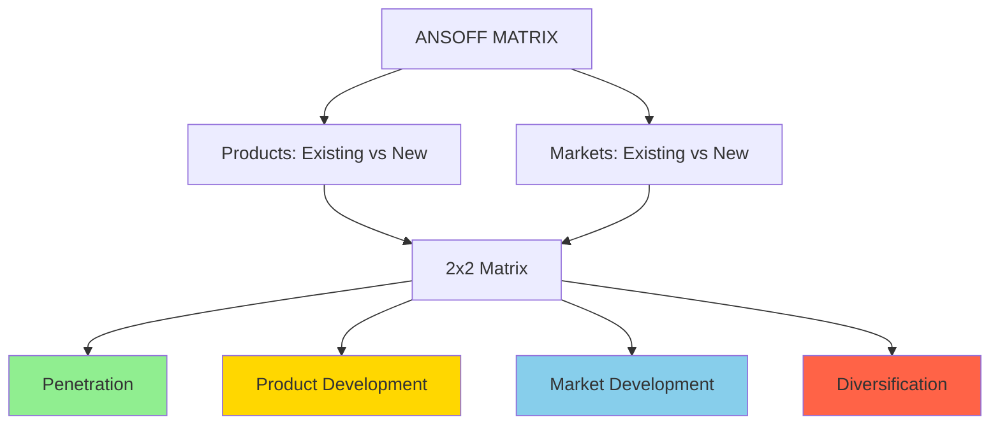

# 14 - Ansoff Growth Matrix

**Back to**: [[00-INDEX-Entrepreneurship|Index]]
**Related**: [[06-Business-Models|Business Models]], [[15-First-vs-Late-Mover|Market Entry Timing]]

---

## 🎯 Core Definition

The **Ansoff Matrix** is a strategic planning tool that helps businesses determine their product and market growth strategy.

> **Developed by**: Igor Ansoff (1957)
> **Purpose**: Identify growth opportunities based on products and markets

---

## 📊 The Ansoff Matrix



---

## 🎯 The Four Strategies

```
                EXISTING PRODUCTS    NEW PRODUCTS
              ┌──────────────────┬──────────────────┐
              │                  │                  │
 EXISTING     │  PENETRATION     │    PRODUCT       │
 MARKETS      │  STRATEGY        │  DEVELOPMENT     │
              │  (Lowest Risk)   │  (Medium Risk)   │
              │  🟢              │  🟡              │
              ├──────────────────┼──────────────────┤
              │                  │                  │
 NEW          │    MARKET        │ DIVERSIFICATION  │
 MARKETS      │  DEVELOPMENT     │   STRATEGY       │
              │  (Medium Risk)   │  (Highest Risk)  │
              │  🟡              │  🔴              │
              └──────────────────┴──────────────────┘
```

**Risk Levels**: 
- 🟢 Low Risk (one variable changes)
- 🟡 Medium Risk (one variable changes)
- 🔴 High Risk (both variables change)

---

## 1️⃣ MARKET PENETRATION STRATEGY

### Definition
**Existing products** sold to **existing markets** - grow market share

```
Product: EXISTING
Market: EXISTING
Risk: LOW (Familiar territory)
```

### Goal
Increase sales of current products in current markets

### Tactics

| Tactic | How It Works | Example |
|--------|-------------|---------|
| **Increase usage** | Encourage more frequent use | Toothpaste "brush 3x daily" campaigns |
| **Win competitors' customers** | Better value proposition | Price wars, superior features |
| **Attract non-users** | Convert people who don't use category | Getting non-coffee drinkers to try |
| **Increase purchase quantity** | Bulk buying, larger sizes | "Buy 2 get 1 free" |
| **Loyalty programs** | Retain existing customers | Starbucks Rewards |

### Real Examples

**Coca-Cola in USA:**
```
Product: Existing (Coca-Cola Classic)
Market: Existing (US consumers)
Strategy: 
- More vending machines
- Better shelf placement in stores
- Larger bottle sizes
- "Share a Coke" personalization campaign
Goal: Increase consumption frequency
```

**Amazon Prime:**
```
Product: Existing (Amazon shopping)
Market: Existing (online shoppers in US)
Strategy:
- Free shipping → more orders
- Prime Video → higher engagement
- Lower prices for Prime members
Goal: Convert occasional buyers to frequent buyers
```

### When to Use
✅ Market is growing
✅ Underutilized capacity
✅ Strong brand position
✅ Economies of scale opportunity

---

## 2️⃣ PRODUCT DEVELOPMENT STRATEGY

### Definition
**New products** sold to **existing markets** - serve current customers better

```
Product: NEW
Market: EXISTING
Risk: MEDIUM (Product uncertainty)
```

### Goal
Create new offerings for existing customer base

### Approaches

| Approach | Description | Example |
|----------|-------------|---------|
| **Innovation** | Completely new products | Apple Watch for iPhone users |
| **Product improvements** | Better versions | iPhone 15 → iPhone 16 |
| **Product line extension** | Variations of existing | Coca-Cola → Diet Coke, Coke Zero |
| **Complementary products** | Related offerings | GoPro → GoPro accessories |

### Real Examples

**Apple:**
```
Product: NEW (Apple Watch, AirPods)
Market: EXISTING (iPhone users)
Strategy:
- Build on existing customer base
- Ecosystem lock-in
- Cross-sell to loyal customers
Result: Huge success - customers already trust Apple
```

**Coca-Cola:**
```
Product: NEW (Coke Zero, Cherry Coke, Diet Coke)
Market: EXISTING (Soda drinkers)
Strategy:
- Different flavors for same customers
- Health-conscious variant (Zero)
- Variety for existing consumers
Result: Maintains customer base with new preferences
```

**Nike:**
```
Product: NEW (Nike+ running app, smart shoes)
Market: EXISTING (Athletes and fitness enthusiasts)
Strategy:
- Digital products for physical product users
- Tech-enhanced footwear
Result: Deeper customer engagement
```

### When to Use
✅ Deep customer understanding
✅ Strong R&D capabilities
✅ Changing customer needs
✅ Product lifecycle nearing end

---

## 3️⃣ MARKET DEVELOPMENT STRATEGY

### Definition
**Existing products** sold to **new markets** - find new customers

```
Product: EXISTING
Market: NEW
Risk: MEDIUM (Market uncertainty)
```

### Goal
Expand into new customer segments or geographies

### Approaches

| Approach | Description | Example |
|----------|-------------|---------|
| **Geographic expansion** | New countries/regions | Starbucks: USA → China |
| **New segments** | Different customer types | B2C product → B2B |
| **New channels** | Different distribution | Retail → E-commerce |
| **New uses** | Same product, different purpose | Baking soda: cooking → cleaning → deodorant |

### Real Examples

**McDonald's:**
```
Product: EXISTING (Burgers, fries)
Market: NEW (International markets)
Strategy:
- Entered India (1996)
- Entered China (1990)
- Local menu adaptations
Result: Global brand with 100+ countries
```

**Coca-Cola:**
```
Product: EXISTING (Coca-Cola)
Market: NEW (India, Africa, emerging markets)
Strategy:
- Adapt pricing for local markets
- Smaller bottle sizes
- Local distribution partnerships
Result: Global presence in 200+ countries
```

**Slack:**
```
Product: EXISTING (Team communication platform)
Market: NEW (Small startups → Enterprise companies)
Strategy:
- Enterprise features
- Security certifications
- Dedicated sales teams
Result: Expanded from SMB to Fortune 500
```

### When to Use
✅ Product has proven success
✅ Similar market opportunities exist elsewhere
✅ Underutilized production capacity
✅ Strong brand transferability

---

## 4️⃣ DIVERSIFICATION STRATEGY

### Definition
**New products** sold to **new markets** - enter completely new territory

```
Product: NEW
Market: NEW
Risk: HIGH (Both uncertain)
```

### Types

**Related Diversification:**
- Some synergy with existing business
- Example: Apple computers → Apple phones (tech expertise transfers)

**Unrelated Diversification:**
- No connection to existing business
- Example: Virgin (airlines, trains, music, telecom, space)

### Real Examples

**Amazon:**
```
Product: NEW (AWS cloud computing)
Market: NEW (B2B tech infrastructure)
Original: E-commerce retailer
Strategy:
- Built internal cloud infrastructure
- Realized others need same
- Created completely new business
Result: AWS now generates most of Amazon's profit
```

**Disney:**
```
Product: NEW (Cruise ships, theme parks)
Market: NEW (Vacation/tourism industry)
Original: Animated films
Strategy:
- Leverage brand in new ways
- Create immersive experiences
Result: Disney Parks $30B+ revenue/year
```

**Virgin Group:**
```
Products: Airlines, Trains, Music, Mobile, Space Tourism
Markets: All different
Strategy:
- Richard Branson's brand of fun/innovation
- Unrelated diversification
- Risk: Some ventures failed (Virgin Cola)
```

### When to Use
✅ Current market saturated
✅ Excess cash to invest
✅ Risk diversification needed
✅ Synergies possible (related diversification)

⚠️ **Highest risk** - both product AND market are new!

---

## 🎓 Exam Questions & Answers

### Question 1
**Which of the strategies of the Ansoff matrix focuses on a new market with an existing product?**

a) Penetration Strategy
b) Market Development Strategy
c) Product Development Strategy
d) Diversification Strategy

**✅ Answer: (b)**

**Explanation**:
```
NEW MARKET + EXISTING PRODUCT
      ↓
MARKET DEVELOPMENT

Memory Aid: "Develop the MARKET" = new markets
```

- **(a) WRONG**: Penetration = existing product + existing market
- **(b) CORRECT**: Market Development = existing product + NEW market
- **(c) WRONG**: Product Development = NEW product + existing market
- **(d) WRONG**: Diversification = NEW product + NEW market

---

### Question 2
**Which growth strategy in the Ansoff Matrix involves selling new products to existing customers?**

a) Market development strategy
b) Product development strategy
c) Diversification strategy
d) Penetration strategy

**✅ Answer: (b)**

**Explanation**:
```
NEW PRODUCT + EXISTING CUSTOMERS
      ↓
PRODUCT DEVELOPMENT

Memory Aid: "Develop the PRODUCT" = new products
```

---

## 📊 Decision Framework

### Which Strategy to Choose?

```
START HERE:
1. Is your current market saturated?
   NO → Market Penetration
   YES → Go to 2
   
2. Do you understand your customers deeply?
   YES → Product Development
   NO → Go to 3
   
3. Can your product work in other markets?
   YES → Market Development
   NO → Go to 4
   
4. Do you need to diversify risk?
   YES → Diversification (careful!)
   NO → Reconsider Market Penetration
```

---

## 🎯 Strategy Examples by Company

### Starbucks Journey

```
1990s: MARKET PENETRATION
- Expand in USA
- More stores in existing cities

2000s: MARKET DEVELOPMENT
- Enter China, Japan, Europe
- Same coffee, new countries

2010s: PRODUCT DEVELOPMENT
- Introduce food items
- Starbucks Reserve (premium)
- Delivery services

2020s: DIVERSIFICATION
- CPG products in grocery stores
- Licensed merchandise
```

### Netflix Evolution

```
1997-2007: MARKET PENETRATION
- DVD rentals in USA
- More subscribers, same service

2007: PRODUCT DEVELOPMENT
- Streaming service
- New product, same customers

2010+: MARKET DEVELOPMENT
- International expansion
- Same content, new countries

2013+: DIVERSIFICATION
- Original content production
- New product (production), new market (entertainment industry)
```

---

## ⚖️ Risk-Return Profile

```
RISK vs RETURN

High Return ↑
            |               
            |                  ● Diversification
            |                     (Risky!)
            |        
            |      ● Market Dev.  ● Product Dev.
            |        (Medium)       (Medium)
            |     
            | ● Penetration
            |   (Safe)
            |________________________→ High Risk
            Low Risk
```

---

## 🎯 Memory Aids

### Quick Reference Table

| Strategy | Product | Market | Risk | Remember |
|----------|---------|--------|------|----------|
| **Penetration** | Existing | Existing | 🟢 Low | "Penetrate DEEPER into what you know" |
| **Market Development** | Existing | NEW | 🟡 Medium | "Develop NEW MARKETS" |
| **Product Development** | NEW | Existing | 🟡 Medium | "Develop NEW PRODUCTS" |
| **Diversification** | NEW | NEW | 🔴 High | "Diverse = BOTH new" |

### Mnemonic: "PMPD"

- **P**enetration (Both existing)
- **M**arket Development (New market)
- **P**roduct Development (New product)
- **D**iversification (Both new)

---

## 🔗 Connections to Other Topics

- [[06-Business-Models|Business Models]] - Different models suit different strategies
- [[15-First-vs-Late-Mover|Market Timing]] - Affects market development
- [[16-Franchising|Franchising]] - Often used for market development
- [[20-Financing-Sources|Financing]] - Higher risk = more capital needed

---

## ✅ Self-Check Questions

1. Starbucks enters Vietnam with its coffee. Which strategy?
2. Apple launches AirPods for iPhone users. Which strategy?
3. Which strategy has the highest risk?
4. Netflix adds more shows to keep US subscribers. Which strategy?
5. Amazon launches AWS for businesses. Which strategy?

**Answers**:
1. Market Development (existing product, new market)
2. Product Development (new product, existing market)
3. Diversification (both new)
4. Market Penetration (existing product, existing market)
5. Diversification (new product, new market)

---

**Tags**: #ansoff-matrix #growth-strategy #market-development #product-development #diversification #penetration #exam-question

**Last Updated**: 2026-01-18
