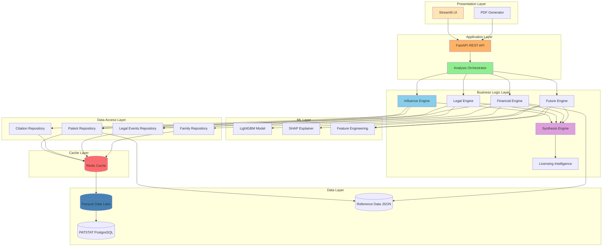
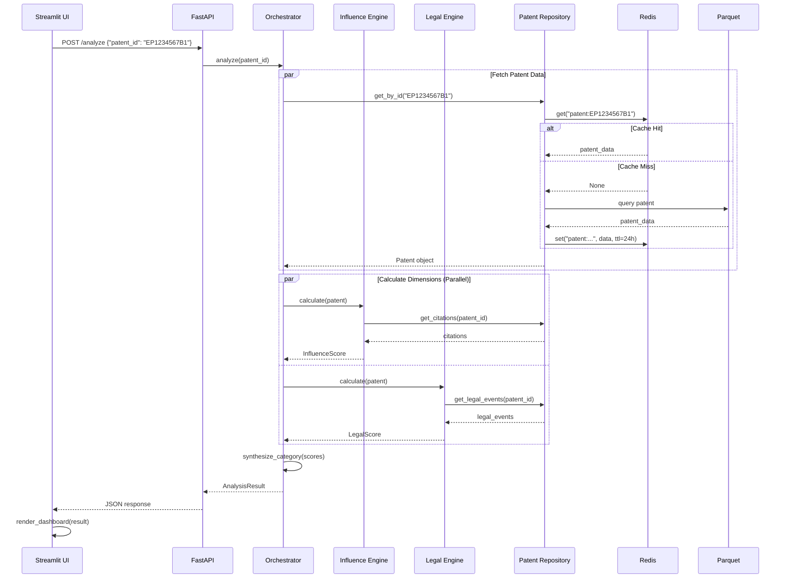
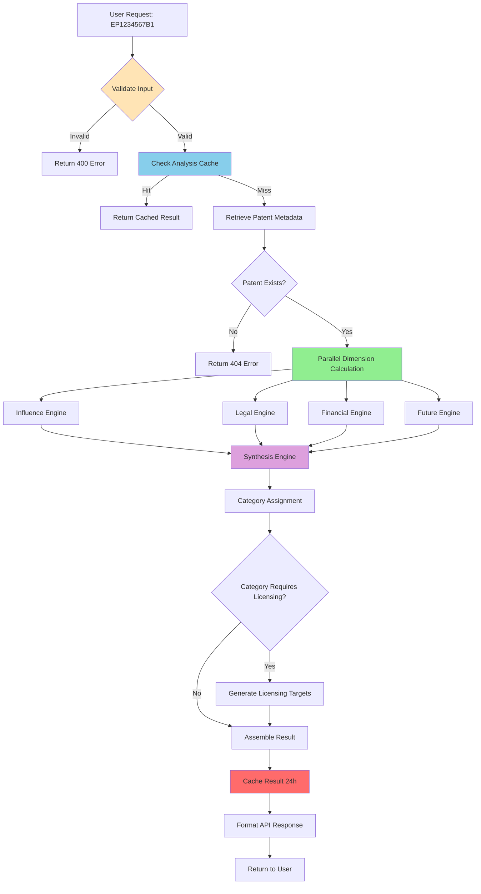
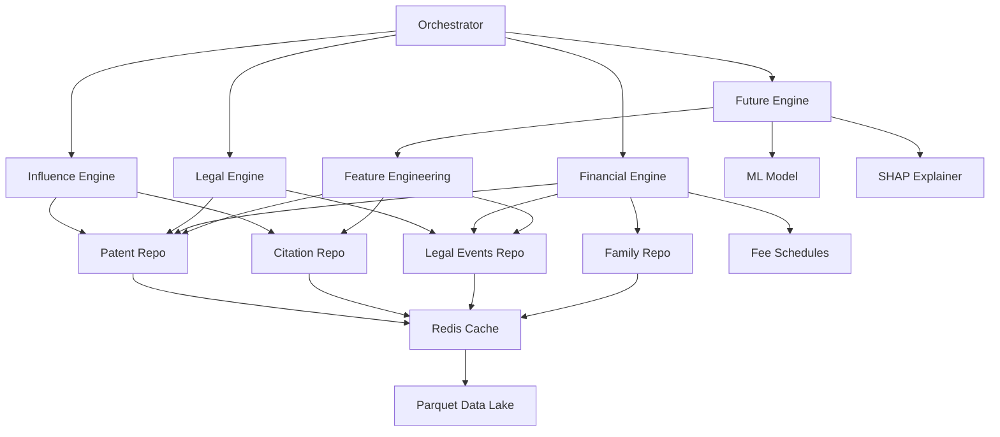
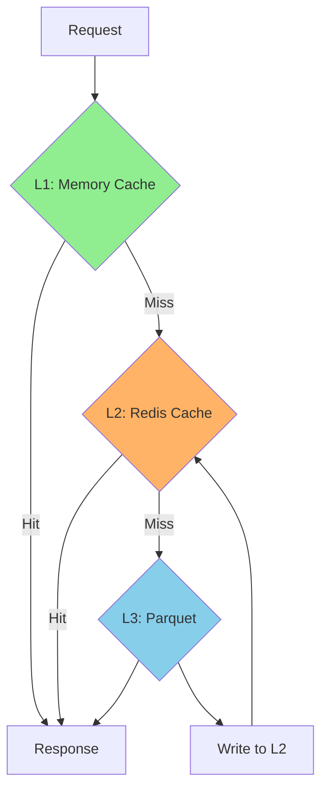

# PRD: Architecture Guidelines

**Document Version:** 1.0  
**Last Updated:** December 2024  
**Status:** Approved for Implementation  
**Related Documents:** [[01-PRD-Main]], [[PRD-Data-Requirements]], [[PRD-Service-Layers]]

---

## Table of Contents

1. [Overview](#1-overview)
2. [Architectural Principles](#2-architectural-principles)
3. [Layered Architecture](#3-layered-architecture)
4. [Component Architecture](#4-component-architecture)
5. [Data Flow Architecture](#5-data-flow-architecture)
6. [Engine Architecture](#6-engine-architecture)
7. [Caching Architecture](#7-caching-architecture)
8. [Deployment Architecture](#8-deployment-architecture)

---

## 1. Overview

### 1.1 Purpose

This document defines the **complete system architecture** for PatentIQ. Think of it as the **blueprint** that shows how all components fit together to transform raw patent data into actionable intelligence.

Just as a building's architecture shows:
- **Foundation** (data layer)
- **Structure** (business logic)
- **Utilities** (caching, logging)
- **Facade** (user interface)

Our system architecture defines:
- **Data Layer** (PATSTAT, Parquet, Redis)
- **Business Logic** (engines, synthesis)
- **Application Layer** (API, orchestration)
- **Presentation Layer** (UI, reports)

### 1.2 Architectural Philosophy

**Philosophy 1: Separation of Concerns**

Each layer has a **single, well-defined responsibility**. Just as electrical wiring doesn't belong in plumbing, data access logic doesn't belong in UI components.

**Philosophy 2: Dependency Inversion**

Higher layers depend on **abstractions**, not concrete implementations. The business logic knows "I need patent data" but doesn't care if it comes from Parquet or PostgreSQL.

**Philosophy 3: Explicit is Better Than Implicit**

Data transformations are **visible** and **traceable**. No "magic" happens behind the scenes. Every calculation can be inspected and understood.

**Philosophy 4: Optimize for Change**

The architecture makes it **easy to modify** individual components without cascading changes. Swap data sources, change scoring algorithms, or add new features with minimal impact.

### 1.3 Architecture Diagram (System Overview)



---

## 2. Architectural Principles

### 2.1 The SOLID Principles (Applied)

**S - Single Responsibility Principle**

Each component has **one reason to change**.

Example:
- ✅ **InfluenceEngine**: Calculate influence scores (period)
- ❌ **SuperEngine**: Calculate everything + save to database + send emails

**O - Open/Closed Principle**

Components are **open for extension, closed for modification**.

Example:
- Adding a new scoring dimension shouldn't require modifying existing engines
- Use **base classes** and **interfaces** to allow extension

```python
# Conceptual example
class BaseDimensionEngine(ABC):
    """All engines inherit from this"""
    
    @abstractmethod
    def calculate(self, patent: Patent) -> DimensionScore:
        """Each engine implements its own logic"""
        pass

# Adding new dimension
class SocialImpactEngine(BaseDimensionEngine):
    """New dimension - no need to modify existing engines"""
    
    def calculate(self, patent: Patent) -> DimensionScore:
        # Custom logic
        return score
```

**L - Liskov Substitution Principle**

Derived classes can **replace** base classes without breaking functionality.

Example:
- `ParquetPatentRepository` can replace `PostgresPatentRepository`
- Both implement `IPatentRepository` interface
- Application logic doesn't know (or care) which is used

**I - Interface Segregation Principle**

Clients shouldn't depend on interfaces they don't use.

Example:
- ❌ **IRepository** with read(), write(), delete(), admin_backup()
- ✅ **IReadRepository** with read() only
- ✅ **IWriteRepository** with write(), delete()
- ✅ **IAdminRepository** with admin_backup()

**D - Dependency Inversion Principle**

Depend on **abstractions**, not concrete implementations.

Example:
```python
# ❌ Bad: Depends on concrete class
class InfluenceEngine:
    def __init__(self):
        self.repo = ParquetPatentRepository()  # Tight coupling
        
# ✅ Good: Depends on interface
class InfluenceEngine:
    def __init__(self, repo: IPatentRepository):  # Abstraction
        self.repo = repo  # Can inject any implementation
```

### 2.2 Layered Architecture Rules

**Rule 1: Dependencies Flow Downward**

```
Presentation ──→ Application ──→ Business Logic ──→ Data Access ──→ Data
```

Upper layers can call lower layers, **never the reverse**.

**Rule 2: No Layer Skipping**

Presentation layer cannot directly access Data layer.  
Must go through Application → Business Logic → Data Access.

**Why:** Changes to data structure don't cascade to UI.

**Rule 3: Each Layer Has Clear Responsibility**

| Layer | Responsibility | Does NOT Handle |
|-------|----------------|-----------------|
| Presentation | UI rendering, user input | Business logic, data access |
| Application | Request routing, orchestration | Calculations, data storage |
| Business Logic | Domain calculations, rules | HTTP, SQL, file I/O |
| Data Access | Query execution, caching | Business rules, UI formatting |
| Data | Storage, retrieval | Any logic beyond CRUD |

### 2.3 Design Patterns Used

**Pattern 1: Repository Pattern**

*Purpose:* Abstract data access behind interfaces

*Why:* Swap data sources without changing business logic

*Example:* See [[PRD-Data-Requirements#6-2-repository-pattern]]

**Pattern 2: Strategy Pattern (Engines)**

*Purpose:* Interchangeable algorithms for each dimension

*Why:* Easy to modify scoring without affecting other dimensions

```python
# Each engine is a strategy
influence_strategy = InfluenceEngine()
legal_strategy = LegalEngine()

# Orchestrator uses strategies
orchestrator.add_strategy('influence', influence_strategy)
orchestrator.add_strategy('legal', legal_strategy)

# Can swap strategies at runtime
orchestrator.add_strategy('influence', NewInfluenceEngine())
```

**Pattern 3: Facade Pattern (Orchestrator)**

*Purpose:* Simplified interface to complex subsystem

*Why:* API doesn't need to know about individual engines

```python
# Complex subsystem
engines = {
    'influence': InfluenceEngine(),
    'legal': LegalEngine(),
    'financial': FinancialEngine(),
    'future': FutureEngine()
}

# Simple facade
orchestrator = AnalysisOrchestrator(engines)

# Simple API
result = orchestrator.analyze(patent_id)  # Handles all complexity
```

**Pattern 4: Singleton Pattern (Caches, Connections)**

*Purpose:* Single shared instance of expensive resources

*Why:* Don't create 100 database connections or 100 model instances

```python
# Redis connection pool (singleton)
redis_pool = RedisConnectionPool.get_instance()

# ML model (singleton - expensive to load)
model = CitationModel.get_instance()
```

**Pattern 5: Factory Pattern (Response Builders)**

*Purpose:* Create complex objects with consistent structure

*Why:* Ensures API responses always have correct format

```python
# Factory creates responses
response = ResponseFactory.create_analysis_response(
    patent=patent,
    scores=scores,
    synthesis=synthesis
)
# Always includes required fields, formatted correctly
```

---

## 3. Layered Architecture

### 3.1 Layer 1: Data Layer

**Responsibility:** Store and retrieve raw data

**Components:**
- PATSTAT PostgreSQL database
- Parquet data lake
- Reference data files (JSON/CSV)

**Not Responsible For:**
- Business logic
- Data transformation (beyond format conversion)
- Caching (that's Data Access layer)

**Data Flow:**
```
PATSTAT → ETL Pipeline → Parquet → (Ready for access)
```

**Why Separate:**
- Data sources can change without affecting business logic
- Can migrate from PostgreSQL to BigQuery without code changes
- Test with mock data easily

### 3.2 Layer 2: Data Access Layer

**Responsibility:** Provide clean interface to data, handle caching

**Components:**
- Repository classes (PatentRepository, CitationRepository, etc.)
- Cache manager (Redis integration)
- Query builders

**Key Abstraction:**
```python
# Interface that all layers above depend on
class IPatentRepository(ABC):
    @abstractmethod
    def get_by_id(self, patent_id: str) -> Optional[Patent]:
        """Get patent - caller doesn't know if from cache or Parquet"""
        pass
```

**Responsibilities:**
1. **Query Data Sources**
   ```python
   # Check cache first
   if cached := redis.get(key):
       return cached
   
   # Cache miss - query Parquet
   result = parquet_df.filter(...)
   
   # Store in cache
   redis.set(key, result, ttl=86400)
   
   return result
   ```

2. **Handle Data Quality**
   ```python
   patent = query_parquet(patent_id)
   
   if not patent:
       raise PatentNotFoundError()
   
   if patent.data_quality_score < 0.5:
       logger.warning(f"Low quality data for {patent_id}")
   
   return patent
   ```

3. **Optimize Queries**
   ```python
   # Batch query instead of N individual queries
   def get_many(patent_ids: List[str]) -> List[Patent]:
       return parquet_df.filter(
           pl.col('patent_id').is_in(patent_ids)
       ).to_dicts()
   ```

**Why Separate:**
- Business logic doesn't know about Parquet, Redis, or PostgreSQL
- Caching logic centralized
- Easy to mock for testing

### 3.3 Layer 3: Business Logic Layer (Engines)

**Responsibility:** Domain-specific calculations and rules

**Components:**
- Dimension engines (Influence, Legal, Financial, Future)
- Synthesis engine
- Licensing intelligence
- Feature engineering

**Key Principle:** **Pure functions where possible**

```python
# ✅ Pure function - same input always gives same output
def calculate_influence_score(
    forward_citations: int,
    patent_age: float,
    field_avg: float
) -> float:
    velocity = forward_citations / patent_age
    normalized = (forward_citations / field_avg) * 50
    return min(velocity * 0.5 + normalized * 0.5, 100)

# ❌ Impure function - has side effects
def calculate_influence_score(patent_id: str) -> float:
    patent = database.query(patent_id)  # Side effect: DB query
    logger.info(f"Calculating for {patent_id}")  # Side effect: logging
    return score
```

**Why Pure Functions:**
- Testable (no mocks needed)
- Predictable (no hidden state)
- Cacheable (same inputs → same outputs)
- Parallelizable (no shared state)

**Engine Structure:**

```python
class InfluenceEngine:
    """Calculates Technical Influence dimension"""
    
    def __init__(self, 
                 citation_repo: ICitationRepository,
                 patent_repo: IPatentRepository):
        # Dependencies injected
        self.citation_repo = citation_repo
        self.patent_repo = patent_repo
    
    def calculate(self, patent: Patent) -> InfluenceScore:
        """Main entry point - orchestrates calculation"""
        
        # Step 1: Gather data (uses repositories)
        citations = self.citation_repo.get_forward_citations(patent.id)
        field_avg = self._get_field_average(patent.cpc_section)
        
        # Step 2: Pure calculations
        velocity = self._calculate_velocity(citations, patent.age)
        h_index = self._calculate_h_index(citations)
        diversity = self._calculate_diversity(citations)
        
        # Step 3: Combine into score
        score = self._synthesize_score(velocity, h_index, diversity)
        
        return InfluenceScore(
            value=score,
            metrics={'velocity': velocity, 'h_index': h_index},
            confidence=self._assess_confidence(citations)
        )
    
    def _calculate_velocity(self, citations: List[Citation], age: float) -> float:
        """Pure function - no dependencies"""
        return len(citations) / age if age > 0 else 0
    
    # More pure helper functions...
```

**Why This Structure:**
- **Main method** (`calculate`) handles orchestration
- **Helper methods** are pure functions (testable)
- **Dependencies** injected (mockable)
- **Single responsibility** (only influence calculation)

### 3.4 Layer 4: Application Layer

**Responsibility:** Orchestrate business logic, handle requests

**Components:**
- Analysis Orchestrator
- Request handlers
- Response formatters
- Error handlers

**Analysis Orchestrator:**

```python
class AnalysisOrchestrator:
    """
    Coordinates multiple engines to produce complete analysis
    
    Analogy: Orchestra conductor coordinates musicians
    """
    
    def __init__(self, 
                 engines: Dict[str, BaseDimensionEngine],
                 synthesis_engine: SynthesisEngine,
                 licensing_intel: LicensingIntelligence):
        self.engines = engines
        self.synthesis = synthesis_engine
        self.licensing = licensing_intel
    
    async def analyze(self, patent: Patent) -> AnalysisResult:
        """Orchestrate complete analysis"""
        
        # Step 1: Calculate dimensions in parallel
        dimension_scores = await self._calculate_dimensions(patent)
        
        # Step 2: Synthesize category
        category = self.synthesis.categorize(dimension_scores)
        
        # Step 3: Generate licensing targets (if applicable)
        licensing_targets = None
        if category in ['HIDDEN_GEM', 'CROWN_JEWEL']:
            licensing_targets = await self.licensing.find_targets(patent)
        
        # Step 4: Assemble result
        return AnalysisResult(
            patent=patent,
            dimensions=dimension_scores,
            category=category,
            licensing=licensing_targets,
            timestamp=datetime.now()
        )
    
    async def _calculate_dimensions(self, patent: Patent) -> Dict[str, Score]:
        """Run all engines in parallel"""
        
        tasks = [
            engine.calculate(patent)
            for engine in self.engines.values()
        ]
        
        results = await asyncio.gather(*tasks)
        
        return {
            name: result
            for name, result in zip(self.engines.keys(), results)
        }
```

**Why Orchestrator Pattern:**
- **Centralized coordination** (engines don't know about each other)
- **Parallel execution** (faster)
- **Easy to modify flow** (add/remove steps)
- **Testable** (mock engines)

### 3.5 Layer 5: Presentation Layer

**Responsibility:** Format data for display, handle user interaction

**Components:**
- Streamlit UI pages
- PDF report generator
- API response formatters

**Key Principle:** **No business logic in presentation**

```python
# ❌ Bad: Business logic in UI
def display_patent():
    patent = get_patent(id)
    
    # BAD: Calculating score in UI
    score = (patent.citations / patent.age) * 100
    
    st.write(f"Score: {score}")

# ✅ Good: UI only formats pre-calculated data
def display_patent():
    analysis = api.get_analysis(id)  # Already calculated
    
    # Just formatting
    st.metric("Influence Score", analysis.influence_score)
    st.progress(analysis.influence_score / 100)
```

**Presentation Layer Responsibilities:**
1. Format numbers (e.g., `28774` → `"€28,774"`)
2. Choose visualizations (bar chart vs. line chart)
3. Layout components (grid, columns, sections)
4. Handle user input (buttons, forms)
5. Route to API (send requests, display responses)

**NOT Responsible For:**
- Calculations
- Database queries
- Business rules
- Data validation (beyond format)

---

## 4. Component Architecture

### 4.1 Component Interaction Diagram



### 4.2 Component Responsibilities

**Component: Influence Engine**

```python
class InfluenceEngine:
    """
    Purpose: Calculate technical influence score
    
    Inputs:
    - Patent object
    - Citation data (from repository)
    
    Outputs:
    - InfluenceScore (0-100)
    - Component breakdown
    - Confidence level
    
    Does NOT:
    - Access database directly
    - Handle HTTP requests
    - Format for UI
    - Know about other dimensions
    """
    
    # Methods:
    # - calculate(patent) → InfluenceScore
    # - _calculate_velocity(citations, age) → float
    # - _calculate_h_index(citations) → int
    # - _assess_confidence(data_quality) → str
```

**Why This Design:**
- **Single responsibility**: Only influence calculation
- **Testable**: Pure functions for core logic
- **Reusable**: Can use in batch or single mode
- **Maintainable**: Changes don't affect other engines

**Component: Synthesis Engine**

```python
class SynthesisEngine:
    """
    Purpose: Combine 4D scores into category
    
    Inputs:
    - 4 dimension scores (Influence, Legal, Financial, Future)
    
    Outputs:
    - Category (CROWN_JEWEL, HIDDEN_GEM, etc.)
    - Rationale (why this category)
    - Recommended actions
    
    Does NOT:
    - Calculate dimension scores
    - Access repositories
    - Know about specific engine implementations
    """
    
    # Methods:
    # - categorize(scores) → Category
    # - _apply_rules(scores) → Category
    # - _generate_rationale(category, scores) → str
```

**Why Separate Component:**
- **Independent logic**: Can change categorization rules without touching engines
- **Testable**: Mock dimension scores
- **Reusable**: Same logic for single patent or portfolio

### 4.3 Dependency Injection

**What is Dependency Injection (DI)?**

Instead of components creating their dependencies:
```python
# ❌ Without DI - hard to test, tightly coupled
class InfluenceEngine:
    def __init__(self):
        self.repo = ParquetPatentRepository()  # Creates own dependency
```

Components receive dependencies from outside:
```python
# ✅ With DI - easy to test, loosely coupled
class InfluenceEngine:
    def __init__(self, repo: IPatentRepository):  # Receives dependency
        self.repo = repo
```

**Benefits:**
1. **Testability**: Inject mock repository
2. **Flexibility**: Swap implementations
3. **Clarity**: Dependencies explicit

**PatentIQ DI Container:**

```python
# Conceptual DI setup
class DIContainer:
    """Manages component creation and dependencies"""
    
    def __init__(self):
        self._singletons = {}
        self._factories = {}
    
    def register_singleton(self, interface, implementation):
        """Register singleton (created once, reused)"""
        self._singletons[interface] = implementation
    
    def register_factory(self, interface, factory):
        """Register factory (created per request)"""
        self._factories[interface] = factory
    
    def resolve(self, interface):
        """Get instance of interface"""
        if interface in self._singletons:
            return self._singletons[interface]
        
        if interface in self._factories:
            return self._factories[interface]()
        
        raise ValueError(f"No registration for {interface}")

# Setup
container = DIContainer()

# Register singletons (expensive resources)
container.register_singleton(
    IPatentRepository, 
    ParquetPatentRepository(data_path="/data/patents.parquet")
)

container.register_singleton(
    ICitationModel,
    LightGBMModel.load("models/v1.0/model.txt")
)

# Register factories (created per request)
container.register_factory(
    InfluenceEngine,
    lambda: InfluenceEngine(
        citation_repo=container.resolve(ICitationRepository),
        patent_repo=container.resolve(IPatentRepository)
    )
)

# Use
influence_engine = container.resolve(InfluenceEngine)
```

---

## 5. Data Flow Architecture

### 5.1 Request-Response Flow

**Example: Single Patent Analysis**



### 5.2 Data Transformation Pipeline

**Raw Data → Analysis Result**

```
┌─────────────────┐
│ PATSTAT Tables  │
│ - TLS201_APPLN  │
│ - TLS211_PUBLN  │
│ - TLS212_CITN   │
└────────┬────────┘
         │ ETL Pipeline (daily)
         ▼
┌─────────────────┐
│ Parquet Files   │
│ - patents.pq    │
│ - citations.pq  │
│ - events.pq     │
└────────┬────────┘
         │ Repository Layer (on-demand)
         ▼
┌─────────────────┐
│ Domain Objects  │
│ - Patent        │
│ - Citation      │
│ - LegalEvent    │
└────────┬────────┘
         │ Engine Layer (calculation)
         ▼
┌─────────────────┐
│ Dimension Scores│
│ - Influence: 48 │
│ - Legal: 98     │
│ - Financial: 91 │
│ - Future: 76    │
└────────┬────────┘
         │ Synthesis Engine
         ▼
┌─────────────────┐
│ Category        │
│ HIDDEN_GEM      │
│ + Rationale     │
│ + Actions       │
└────────┬────────┘
         │ Response Formatter
         ▼
┌─────────────────┐
│ API Response    │
│ JSON with       │
│ - Scores        │
│ - Category      │
│ - Licensing     │
└─────────────────┘
```

**Key Transformations:**

**Transformation 1: Database Tables → Domain Objects**
```python
# Raw SQL result
{
    'pat_publn_id': 987654321,
    'publn_nr': '1234567',
    'publn_date': '2017-06-20',
    'appln_filing_date': '2015-03-15'
}

# ↓ Repository transforms to ↓

# Domain object
Patent(
    id='EP1234567B1',
    filing_date=datetime(2015, 3, 15),
    grant_date=datetime(2017, 6, 20),
    age_years=9.75,  # Calculated
    assignee='Siemens AG'
)
```

**Transformation 2: Domain Objects → Metrics**
```python
# Patent object
patent = Patent(id='...', forward_citations=25, age_years=9.75)

# ↓ Engine transforms to ↓

# Metrics
{
    'citation_velocity': 2.56,  # 25 / 9.75
    'field_normalized': 166,     # (25 / 15) * 100
    'h_index': 8
}
```

**Transformation 3: Metrics → Scores**
```python
# Metrics
metrics = {'velocity': 2.56, 'field_normalized': 166, 'h_index': 8}

# ↓ Engine transforms to ↓

# Score
InfluenceScore(
    value=48,  # 0-100 scale
    confidence='HIGH',
    components={'velocity': 20, 'field': 41, 'h_index': 4}
)
```

**Transformation 4: Scores → Category**
```python
# 4 dimension scores
scores = {
    'influence': 48,
    'legal': 98,
    'financial': 91,
    'future': 76
}

# ↓ Synthesis transforms to ↓

# Category
{
    'category': 'HIDDEN_GEM',
    'priority': 'HIGH',
    'rationale': 'Low citations but excellent legal/financial...'
}
```

### 5.3 Async Processing Flow

**Why Async?**

Waiting for I/O (database, cache, ML inference) wastes CPU time.

**Synchronous (Serial):**
```
[Query DB: 200ms] → [Calculate: 50ms] → [Query Cache: 100ms] → [Total: 350ms]
```

**Asynchronous (Parallel):**
```
[Query DB: 200ms]
[Query Cache: 100ms]  ← Running simultaneously
[Calculate: 50ms]

Total: 200ms (fastest operation) + 50ms = 250ms
```

**PatentIQ Async Pattern:**

```python
async def calculate_all_dimensions(patent: Patent) -> Dict[str, Score]:
    """Calculate dimensions in parallel"""
    
    # Launch all engines simultaneously
    influence_task = influence_engine.calculate(patent)
    legal_task = legal_engine.calculate(patent)
    financial_task = financial_engine.calculate(patent)
    future_task = future_engine.calculate(patent)
    
    # Wait for all to complete
    influence, legal, financial, future = await asyncio.gather(
        influence_task,
        legal_task,
        financial_task,
        future_task
    )
    
    return {
        'influence': influence,
        'legal': legal,
        'financial': financial,
        'future': future
    }
```

**Performance Impact:**
- Serial: 4 engines × 500ms avg = 2000ms
- Parallel: max(500ms, 450ms, 600ms, 550ms) = 600ms
- **Speedup: 3.3x faster**

---

## 6. Engine Architecture

### 6.1 Base Engine Interface

All engines implement a common interface for consistency:

```python
class BaseDimensionEngine(ABC):
    """Abstract base for all dimension engines"""
    
    @abstractmethod
    def calculate(self, patent: Patent) -> DimensionScore:
        """
        Calculate dimension score
        
        Args:
            patent: Patent domain object
            
        Returns:
            DimensionScore with value (0-100), metrics, confidence
        """
        pass
    
    @abstractmethod
    def get_required_data(self) -> List[str]:
        """
        Declare what data this engine needs
        
        Returns:
            List of data requirements (e.g., ['citations', 'legal_events'])
        """
        pass
    
    def validate_inputs(self, patent: Patent) -> ValidationResult:
        """
        Check if patent has sufficient data for calculation
        
        Default implementation - can be overridden
        """
        required = self.get_required_data()
        missing = [r for r in required if not hasattr(patent, r)]
        
        if missing:
            return ValidationResult(
                valid=False,
                errors=f"Missing data: {missing}"
            )
        
        return ValidationResult(valid=True)
```

### 6.2 Engine Calculation Flow

**Standard Engine Pattern:**

```python
class InfluenceEngine(BaseDimensionEngine):
    """Example engine following standard pattern"""
    
    def calculate(self, patent: Patent) -> DimensionScore:
        """Main entry point"""
        
        # Step 1: Validate inputs
        validation = self.validate_inputs(patent)
        if not validation.valid:
            return self._fallback_score(patent, validation.errors)
        
        # Step 2: Gather additional data (if needed)
        data = self._gather_data(patent)
        
        # Step 3: Calculate components (pure functions)
        components = self._calculate_components(patent, data)
        
        # Step 4: Synthesize final score
        score = self._synthesize_score(components)
        
        # Step 5: Assess confidence
        confidence = self._assess_confidence(data)
        
        # Step 6: Package result
        return DimensionScore(
            dimension='influence',
            value=score,
            confidence=confidence,
            metrics=components,
            timestamp=datetime.now()
        )
    
    def _gather_data(self, patent: Patent) -> dict:
        """Fetch any additional data needed (beyond patent object)"""
        return {
            'citations': self.citation_repo.get_forward_citations(patent.id),
            'field_avg': self._get_field_average(patent.cpc_section),
            'citing_patents': self.patent_repo.get_citing_patents(patent.id)
        }
    
    def _calculate_components(self, patent: Patent, data: dict) -> dict:
        """Pure calculation functions"""
        return {
            'velocity': self._calc_velocity(data['citations'], patent.age),
            'h_index': self._calc_h_index(data['citing_patents']),
            'field_normalized': self._calc_field_norm(
                len(data['citations']), 
                data['field_avg']
            )
        }
    
    def _synthesize_score(self, components: dict) -> float:
        """Combine components into final score (pure function)"""
        return min(
            components['velocity'] * 0.5 +
            components['field_normalized'] * 0.3 +
            components['h_index'] * 0.2,
            100
        )
    
    def _assess_confidence(self, data: dict) -> str:
        """Determine confidence level based on data quality"""
        if len(data['citations']) < 5:
            return 'LOW'
        elif len(data['citations']) < 20:
            return 'MEDIUM'
        else:
            return 'HIGH'
    
    def _fallback_score(self, patent: Patent, error: str) -> DimensionScore:
        """Graceful degradation when data insufficient"""
        logger.warning(f"Fallback for {patent.id}: {error}")
        
        return DimensionScore(
            dimension='influence',
            value=50,  # Neutral score
            confidence='LOW',
            metrics={},
            error=error
        )
```

**Why This Pattern:**

1. **Consistent Structure**: All engines follow same flow
2. **Testable**: Each step is isolated and testable
3. **Debuggable**: Easy to trace which step failed
4. **Maintainable**: Clear separation of concerns
5. **Extensible**: Easy to add new components

### 6.3 Engine Dependencies & Injection

**Dependency Graph:**



**Initialization (with DI):**

```python
# Setup repositories (singletons)
patent_repo = ParquetPatentRepository(parquet_path)
citation_repo = ParquetCitationRepository(parquet_path)
legal_repo = ParquetLegalEventsRepository(parquet_path)
family_repo = ParquetFamilyRepository(parquet_path)

# Setup engines (inject dependencies)
influence_engine = InfluenceEngine(
    patent_repo=patent_repo,
    citation_repo=citation_repo
)

legal_engine = LegalEngine(
    patent_repo=patent_repo,
    legal_repo=legal_repo
)

financial_engine = FinancialEngine(
    patent_repo=patent_repo,
    legal_repo=legal_repo,
    family_repo=family_repo,
    fee_schedules=load_fee_schedules('data/reference/fees.json')
)

# ML components (singletons - expensive to create)
ml_model = LightGBMModel.load('models/v1.0/model.txt')
shap_explainer = SHAPExplainer.load('models/v1.0/explainer.pkl')

future_engine = FutureEngine(
    patent_repo=patent_repo,
    feature_engineer=FeatureEngineer(patent_repo, citation_repo, legal_repo),
    model=ml_model,
    explainer=shap_explainer
)

# Setup orchestrator
orchestrator = AnalysisOrchestrator(
    engines={
        'influence': influence_engine,
        'legal': legal_engine,
        'financial': financial_engine,
        'future': future_engine
    },
    synthesis_engine=SynthesisEngine(),
    licensing_intel=LicensingIntelligence(patent_repo)
)
```

---

## 7. Caching Architecture

### 7.1 Three-Tier Caching Strategy



**Tier 1: Request-Level Memory Cache**

*Purpose:* Avoid duplicate queries within single request

*TTL:* Request lifetime (~1-5 seconds)

*Size:* Small (~100 objects)

```python
class RequestCache:
    """Thread-local cache for current request"""
    
    def __init__(self):
        self._cache = {}
    
    def get(self, key: str) -> Optional[Any]:
        return self._cache.get(key)
    
    def set(self, key: str, value: Any):
        self._cache[key] = value
    
    def clear(self):
        """Called at end of request"""
        self._cache.clear()

# Usage in repository
class PatentRepository:
    def get_by_id(self, patent_id: str) -> Patent:
        # Check request cache first
        if cached := request_cache.get(f"patent:{patent_id}"):
            return cached
        
        # Query from lower tier...
        patent = self._query_redis(patent_id)
        
        # Store in request cache
        request_cache.set(f"patent:{patent_id}", patent)
        
        return patent
```

**Tier 2: Redis Cache**

*Purpose:* Share results across requests and instances

*TTL:* 24 hours (configurable)

*Size:* ~2GB (10K cached analyses)

```python
class RedisCache:
    """Distributed cache using Redis"""
    
    def __init__(self, redis_client):
        self.redis = redis_client
    
    def get(self, key: str) -> Optional[dict]:
        """Get from Redis, deserialize JSON"""
        data = self.redis.get(key)
        return json.loads(data) if data else None
    
    def set(self, key: str, value: dict, ttl: int = 86400):
        """Serialize to JSON, store with TTL"""
        self.redis.setex(key, ttl, json.dumps(value))
    
    def delete(self, pattern: str):
        """Delete keys matching pattern"""
        for key in self.redis.scan_iter(match=pattern):
            self.redis.delete(key)

# Usage
cache = RedisCache(redis_client)

# Cache analysis result
cache.set(
    key=f"analysis:{patent_id}",
    value=analysis_result.to_dict(),
    ttl=86400  # 24 hours
)

# Retrieve
if cached := cache.get(f"analysis:{patent_id}"):
    return AnalysisResult.from_dict(cached)
```

**Tier 3: Parquet Data Lake**

*Purpose:* Persistent storage, source of truth

*TTL:* Until next data pipeline run (daily)

*Size:* ~500MB (all patents)

```python
class ParquetCache:
    """Columnar storage for fast analytical queries"""
    
    def __init__(self, data_path: str):
        self.data_path = data_path
        self._df = None  # Lazy load
    
    def _load(self):
        """Lazy load Parquet into memory"""
        if self._df is None:
            self._df = pl.read_parquet(self.data_path)
    
    def query(self, filter_expr) -> pl.DataFrame:
        """Query with predicate pushdown"""
        self._load()
        return self._df.filter(filter_expr)
    
    def get_by_id(self, patent_id: str) -> Optional[dict]:
        """Point query"""
        result = self.query(pl.col('patent_id') == patent_id)
        
        if result.height == 0:
            return None
        
        return result.row(0, named=True)
```

### 7.2 Cache Invalidation Strategy

**When to Invalidate:**

```python
class CacheInvalidation:
    """Handles cache invalidation events"""
    
    @staticmethod
    def on_data_pipeline_complete():
        """Called after daily pipeline updates Parquet"""
        
        # Invalidate ALL Redis cache (data refreshed)
        redis_cache.delete('*')
        
        logger.info("Cache cleared: data pipeline completed")
    
    @staticmethod
    def on_fee_schedule_update():
        """Called when fee schedules updated"""
        
        # Invalidate only financial analyses
        redis_cache.delete('analysis:*')  # Contains financial scores
        
        logger.info("Cache cleared: fee schedule updated")
    
    @staticmethod
    def on_ml_model_deploy(new_model_version: str):
        """Called when new ML model deployed"""
        
        # Invalidate analyses with predictions
        redis_cache.delete('analysis:*')
        
        # Update model version in cache keys going forward
        config.set('ml_model_version', new_model_version)
        
        logger.info(f"Cache cleared: ML model updated to {new_model_version}")
```

**Cache Key Versioning:**

```python
def get_cache_key(patent_id: str, analysis_type: str) -> str:
    """
    Generate versioned cache key
    
    Includes version hashes so key changes when logic changes
    """
    
    # Version components
    data_version = config.get('data_pipeline_run_date')  # "2024-12-15"
    model_version = config.get('ml_model_version')        # "v1.0"
    code_version = config.get('app_version')              # "0.5.2"
    
    # Construct key with versions
    key = f"{analysis_type}:{patent_id}:data_{data_version}:model_{model_version}:app_{code_version}"
    
    return key

# Example keys:
# "analysis:EP1234567B1:data_2024-12-15:model_v1.0:app_0.5.2"

# When model updates to v1.1:
# "analysis:EP1234567B1:data_2024-12-15:model_v1.1:app_0.5.2"
# ↑ Different key, cache miss, recalculates with new model
```

### 7.3 Cache Performance Monitoring

```python
class CacheMetrics:
    """Track cache performance"""
    
    def __init__(self):
        self.hits = 0
        self.misses = 0
        self.errors = 0
    
    def record_hit(self, tier: str):
        self.hits += 1
        metrics.increment(f'cache.{tier}.hit')
    
    def record_miss(self, tier: str):
        self.misses += 1
        metrics.increment(f'cache.{tier}.miss')
    
    def hit_rate(self) -> float:
        total = self.hits + self.misses
        return (self.hits / total * 100) if total > 0 else 0
    
    def report(self) -> dict:
        return {
            'hit_rate_percent': self.hit_rate(),
            'total_hits': self.hits,
            'total_misses': self.misses,
            'total_requests': self.hits + self.misses
        }

# Monitor
cache_metrics = CacheMetrics()

# In repository
if cached := redis.get(key):
    cache_metrics.record_hit('redis')
    return cached
else:
    cache_metrics.record_miss('redis')
    # Query Parquet...
```

**Target Metrics:**
- L1 (Memory) hit rate: >80% (within request)
- L2 (Redis) hit rate: >60% (across requests)
- Combined hit rate: >85%
- Average query time with cache: <50ms
- Average query time without cache: <500ms

---

## 8. Deployment Architecture

### 8.1 Development vs. Production

**Development Environment:**
```
┌─────────────────┐
│ Developer       │
│ Laptop          │
├─────────────────┤
│ Docker Compose  │
│ - App           │
│ - Redis         │
│ - Local Parquet │
└─────────────────┘
```

**Production Environment:**
```
┌──────────────────────────────────┐
│ Docker Container (App)           │
│ - FastAPI                        │
│ - Streamlit                      │
│ - Analysis Engines               │
│ - ML Models (loaded in memory)   │
└──────────────┬───────────────────┘
               │
┌──────────────▼───────────────────┐
│ Redis Container                  │
│ - Cache layer                    │
│ - 2GB max memory                 │
└──────────────┬───────────────────┘
               │
┌──────────────▼───────────────────┐
│ Mounted Volume                   │
│ - /data/parquet/                 │
│ - /data/reference/               │
│ - /models/                       │
└──────────────────────────────────┘
```

### 8.2 Docker Compose Configuration

```yaml
# Conceptual docker-compose.yml
version: '3.8'

services:
  app:
    image: patentiq:latest
    container_name: patentiq_app
    ports:
      - "8000:8000"  # FastAPI
      - "8501:8501"  # Streamlit
    volumes:
      - ./data:/data:ro  # Read-only data mount
      - ./models:/models:ro
    environment:
      - REDIS_HOST=redis
      - REDIS_PORT=6379
      - DATA_PATH=/data
      - MODEL_PATH=/models
      - LOG_LEVEL=INFO
    depends_on:
      - redis
    restart: unless-stopped
  
  redis:
    image: redis:7-alpine
    container_name: patentiq_redis
    ports:
      - "6379:6379"
    volumes:
      - redis_data:/data
    command: redis-server --maxmemory 2gb --maxmemory-policy allkeys-lru
    restart: unless-stopped

volumes:
  redis_data:
```

### 8.3 Scalability Considerations

**Horizontal Scaling:**

```
        ┌─────────┐
        │ Load    │
        │ Balancer│
        └────┬────┘
             │
      ┌──────┴──────┐
      │             │
┌─────▼────┐  ┌────▼─────┐
│ App      │  │ App      │
│ Instance │  │ Instance │
│ 1        │  │ 2        │
└─────┬────┘  └────┬─────┘
      │             │
      └──────┬──────┘
             │
      ┌──────▼──────┐
      │ Shared      │
      │ Redis       │
      └──────┬──────┘
             │
      ┌──────▼──────┐
      │ Shared      │
      │ Parquet     │
      └─────────────┘
```

**Why This Works:**
- App instances are **stateless** (no local state)
- Redis is **shared** (cache consistency)
- Parquet is **read-only** (no write conflicts)
- ML models **loaded per instance** (no shared model state)

**Scaling Limitations:**
- Redis single instance (can use Redis Cluster if needed)
- Parquet file I/O (can use distributed storage)
- ML model memory (3GB per instance)

**Estimated Capacity:**
- Single instance: ~50 requests/minute
- 4 instances: ~200 requests/minute
- Sufficient for 10,000 daily users

---

## Summary

This Architecture PRD defines:

✅ **Layered architecture** (5 layers with clear responsibilities)  
✅ **SOLID principles** application (DI, single responsibility, interfaces)  
✅ **Component interaction** (orchestrators, engines, repositories)  
✅ **Data flow** (request → response with transformations)  
✅ **Engine architecture** (base class, calculation flow, dependencies)  
✅ **Caching strategy** (3-tier: memory, Redis, Parquet)  
✅ **Deployment** (Docker Compose, scaling considerations)

**Key Architectural Decisions:**

1. **Layered** over monolithic (maintainability, testability)
2. **Dependency Injection** (flexibility, testing)
3. **Repository Pattern** (data access abstraction)
4. **Strategy Pattern** (interchangeable engines)
5. **Three-tier caching** (performance optimization)
6. **Async processing** (parallel execution)
7. **Stateless services** (horizontal scalability)

**Design Trade-offs:**

| Decision | Benefit | Cost |
|----------|---------|------|
| Layered architecture | Clear separation, maintainable | More boilerplate |
| Dependency injection | Testable, flexible | Setup complexity |
| Async processing | Fast (3x speedup) | Harder to debug |
| Three-tier caching | Very fast queries | Cache invalidation complexity |
| Stateless services | Scalable | Must use shared cache |

**Related Documents:**
- [[PRD-Service-Layers]] - Detailed service implementation
- [[PRD-Data-Requirements]] - Data layer specifics
- [[Use-Cases-Summary]] - How architecture serves use cases

**Next Steps:**
1. Review architecture with team
2. Set up development environment
3. Implement base classes and interfaces
4. Create repository implementations
5. Build first engine (Influence) following pattern
6. Add dependency injection container
7. Implement caching layer

---

**Document Owner:** System Architect (Developer Lead)  
**Last Reviewed:** December 2024  
**Next Review:** Week 3 (after first engine implemented)
