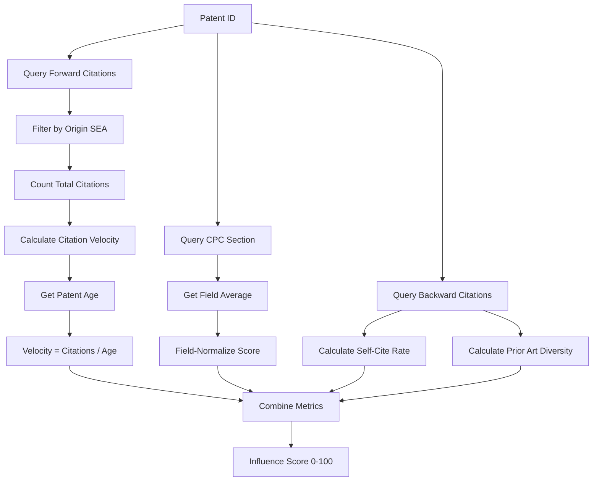
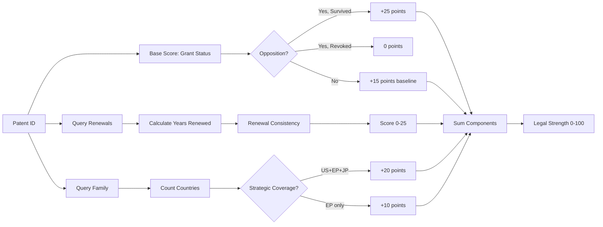
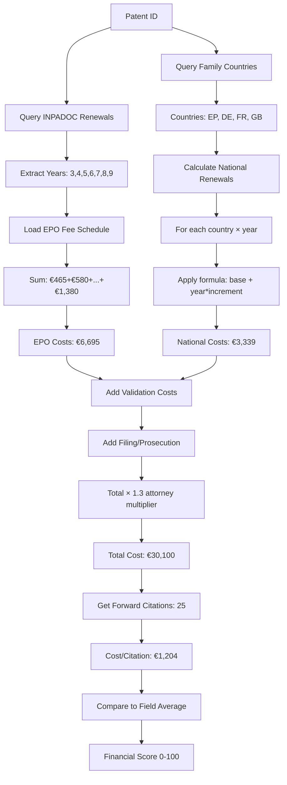
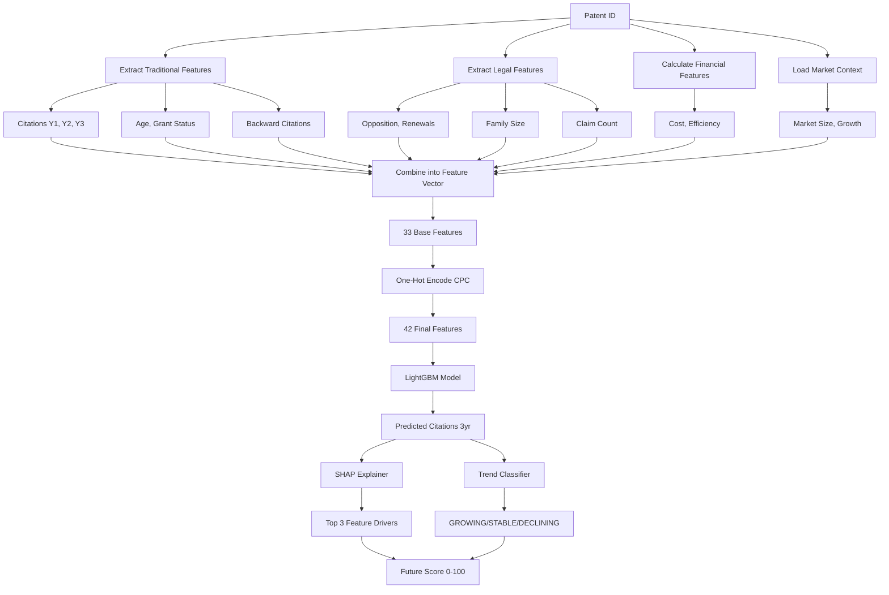
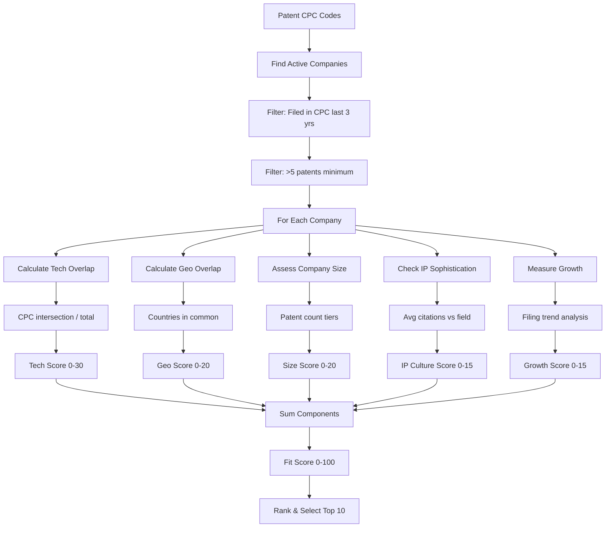
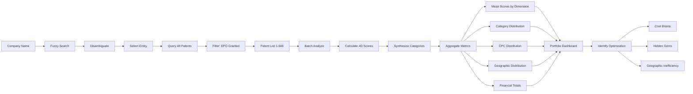
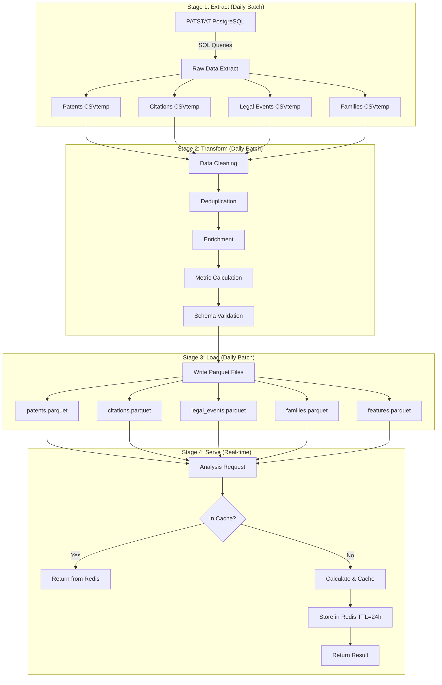
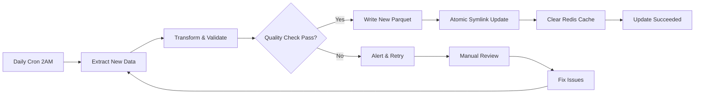
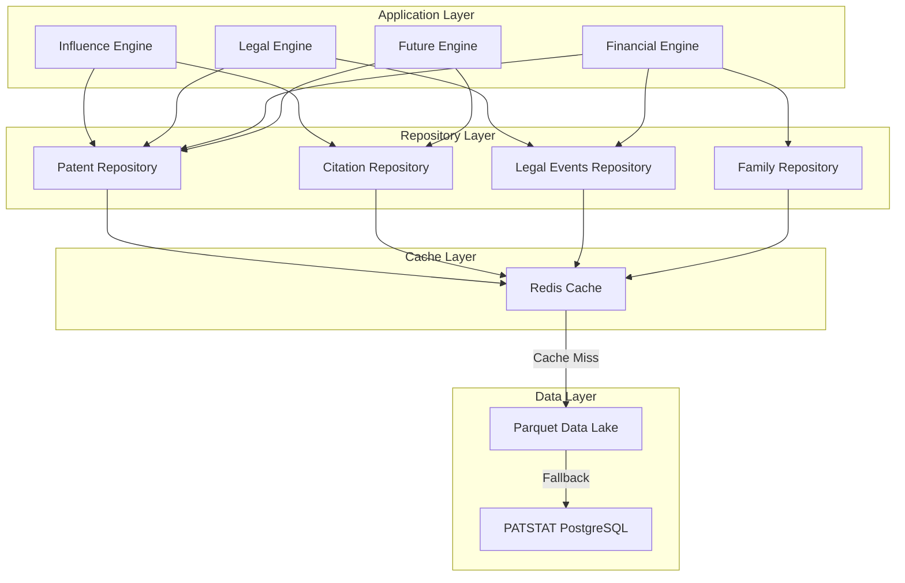
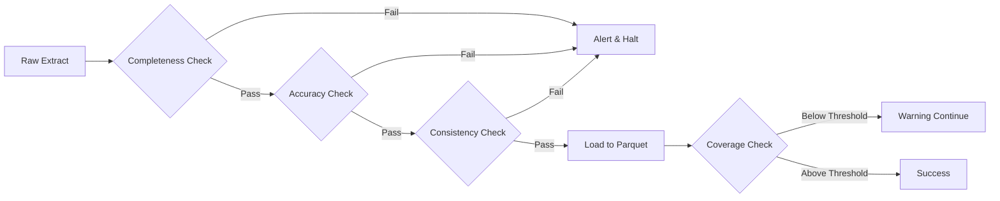

# PRD: Data Requirements & Pipeline Architecture

**Document Version:** 1.0  
**Last Updated:** December 2024  
**Status:** Approved for Implementation  
**Related Documents:** [[01-PRD-Main]], [[02-Education]], [[03-Database-Tutorial]]

---

## Table of Contents

1. [Overview](#1-overview)
2. [Data Source Inventory](#2-data-source-inventory)
3. [Data Requirements by Feature](#3-data-requirements-by-feature)
4. [Data Pipeline Architecture](#4-data-pipeline-architecture)
5. [Parquet Data Lake Design](#5-parquet-data-lake-design)
6. [Data Access Patterns](#6-data-access-patterns)
7. [Data Quality Requirements](#7-data-quality-requirements)
8. [Reference Data Management](#8-reference-data-management)

---

## 1. Overview

### 1.1 Purpose

This document specifies **every piece of data** PatentIQ needs, where it comes from, how it's stored, and how it's accessed. Think of this as the complete **data blueprint** for the system.

### 1.2 Data Philosophy

PatentIQ follows a **three-tier data architecture** analogous to a library system:

**Tier 1 - Archive (PATSTAT):** The original source, slow but complete  
**Tier 2 - Reading Room (Parquet):** Pre-organized for quick access  
**Tier 3 - Desk (Redis Cache):** Recent work, fastest access

Just as you wouldn't retrieve every book from the archive each time you need information, we don't query PATSTAT directly for analysis. Instead, we:
1. **Extract** what we need from the archive (PATSTAT)
2. **Transform** and organize it optimally (Parquet)
3. **Cache** frequently accessed results (Redis)

### 1.3 Scope

**In Scope:**
- EPO granted patents (publn_auth = 'EP', publn_kind IN ['B1', 'B2'])
- Filing years: 2015-2024
- All citation relationships (forward/backward)
- Legal events (oppositions, renewals, licensing)
- Patent families (DOCDB simple families)
- CPC classifications
- Assignee information

**Out of Scope:**
- Non-EPO patents (US, JP, CN) - except as family members
- Pending applications (not yet granted)
- Full patent text (only abstracts, titles)
- Non-patent literature (NPL) citations
- Real-time data (6-month lag acceptable)

### 1.4 Data Volume Estimates

| Data Type | Source | Expected Volume | Storage Format |
|-----------|--------|----------------|----------------|
| Core patents | PATSTAT | ~500,000 patents | Parquet (50MB) |
| Citations | PATSTAT | ~5M citation records | Parquet (200MB) |
| Legal events | INPADOC | ~2M event records | Parquet (100MB) |
| Families | PATSTAT | ~500K family relationships | Parquet (30MB) |
| CPC codes | PATSTAT | ~3M classification entries | Parquet (80MB) |
| ML features | Computed | ~50K feature vectors | Parquet (10MB) |
| Analysis cache | Redis | ~10K results | In-memory (2GB) |
| **Total** | | **~11M records** | **~470MB + 2GB cache** |

---

## 2. Data Source Inventory

### 2.1 Primary Data Sources

#### 2.1.1 PATSTAT PostgreSQL Database

**Access Method:**
```python
from epo.tipdata.patstat import PatstatClient
patstat = PatstatClient(env="PROD")
db = patstat.orm()  # Returns SQLAlchemy session
```

**Connection Details:**
- **Host:** Production PATSTAT instance
- **Database:** PostgreSQL 14+
- **Edition:** PATSTAT Global (includes INPADOC)
- **Update Frequency:** Biannual (Spring/Autumn)
- **Lag:** 6-12 months from real-time

**Tables Used:** See [[03-Database-Tutorial]] for complete reference

| Table | Purpose | Critical Fields | Row Count (Est.) |
|-------|---------|-----------------|------------------|
| TLS201_APPLN | Application metadata | appln_id, filing_date, granted | ~100M |
| TLS211_PAT_PUBLN | Publication data | pat_publn_id, publn_nr, publn_kind | ~150M |
| TLS212_CITATION | Citation relationships | pat_publn_id, cited_pat_publn_id, citn_origin | ~800M |
| TLS215_CITN_CATEG | Citation categories | citn_categ (X, Y, A, etc.) | ~200M |
| TLS206_PERSON | Assignees/inventors | person_id, person_name, han_id | ~30M |
| TLS207_PERS_APPLN | Person-application link | person_id, appln_id, applt_seq_nr | ~150M |
| TLS224_APPLN_CPC | CPC classifications | appln_id, cpc_class_symbol | ~300M |
| TLS218_DOCDB_FAM | Patent families | docdb_family_id, appln_id | ~100M |
| Legal Events | INPADOC legal events | event_type, event_date, event_status | ~500M |

**Why These Tables:** Each table serves a specific analytical purpose:
- **TLS201/TLS211:** Patent identity and age (for scoring normalization)
- **TLS212:** Citation impact (Influence dimension)
- **TLS215:** Blocking evidence (optional enhancement)
- **TLS206/TLS207:** Ownership (portfolio analysis, licensing intelligence)
- **TLS224:** Technology categorization (field normalization, market mapping)
- **TLS218:** Geographic scope (Legal strength, Financial costs)
- **Legal Events:** Opposition/renewal data (Legal strength, Financial tracking)

#### 2.1.2 INPADOC Legal Events

**Access Method:** Integrated within PATSTAT Global tables

**Event Types Required:**

| Event Type | Usage | Example Event Code |
|------------|-------|-------------------|
| OPPOSITION | Legal strength scoring | OPP_FILED, OPP_OUTCOME |
| FEE_PAYMENT | Renewal tracking | ANNUITY_PAID |
| LAPSE | Abandonment detection | LAPSE_NON_PAYMENT |
| LICENSING | Validation data | LICENSE_RECORDED |
| TRANSFER | Ownership tracking | ASSIGNMENT |

**Query Pattern:**
```sql
SELECT event_type, event_date, event_status
FROM legal_events_table
WHERE appln_id = :patent_appln_id
  AND event_type IN ('OPPOSITION', 'FEE_PAYMENT', 'LAPSE')
ORDER BY event_date;
```

**Why INPADOC:** Legal events are the **only source** for:
- Actual renewal history (which years fees were paid)
- Opposition proceedings and outcomes
- Patent abandonment dates
- Licensing transactions (for validation)

Without INPADOC, we cannot:
- Calculate accurate financial costs
- Assess legal strength properly
- Predict abandonment risk
- Validate licensing predictions

#### 2.1.3 EPO Register API (Optional Fallback)

**Purpose:** Fill gaps in PATSTAT data for recent patents

**Endpoint:** `https://ops.epo.org/rest-services/published-data`

**Use Cases:**
- Claim count extraction (if TLS214 unavailable)
- Real-time legal status (within 6-month lag window)
- Grant date verification

**Rate Limits:** 100 requests/minute (adequate for on-demand queries)

**Implementation Priority:** LOW (only if claim count critical)

### 2.2 External Reference Data

#### 2.2.1 EPO Fee Schedules

**File Location:** `data/reference/fee_schedules.json`

**Source:** EPO Official Journal (https://www.epo.org/en/applying/fees)

**Update Frequency:** Annually (January 1st)

**Structure:**
```json
{
  "version": "2024",
  "effective_date": "2024-01-01",
  "epo_fees": {
    "filing": 130,
    "search": 1400,
    "examination": 1880,
    "grant": 1020,
    "renewal": {
      "3": 465,
      "4": 580,
      "5": 810,
      "6": 1040,
      "7": 1155,
      "8": 1265,
      "9": 1380,
      "10": 1560
    }
  },
  "national_validation": {
    "DE": 800,
    "FR": 700,
    "GB": 600,
    "IT": 550,
    "ES": 500
  },
  "national_renewal_formulas": {
    "DE": {"base": 70, "increment": 50},
    "FR": {"base": 42, "increment": 25},
    "GB": {"base": 50, "increment": 30}
  }
}
```

**Why External:** Fee schedules change annually and are official public information. Maintaining as JSON allows easy updates without code changes.

#### 2.2.2 CPC-to-Industry Mapping

**File Location:** `data/reference/cpc_industry_concordance.csv`

**Source:** WIPO IPC/CPC Concordance Table

**Download:** https://www.wipo.int/classifications/en/download.html

**Structure:**
```csv
cpc_code,industry_code,industry_name,market_size_usd_b,cagr_5yr
A61B,MED_DEVICES,Medical Devices & Diagnostics,45.2,8.2
G06N,AI_COMPUTING,Artificial Intelligence,15.8,22.3
H04L,TELECOM,Telecommunications Equipment,28.4,5.7
```

**Why External:** Industry classifications are standardized (WIPO/OECD) and updated periodically. CSV format allows easy editing and version control.

**Usage:**
- Map patents to markets (Market Intelligence feature)
- Estimate market size/growth (Future Potential scoring)
- Identify industry-specific competitors (Licensing Intelligence)

#### 2.2.3 Market Size Data

**File Location:** `data/reference/market_data.json`

**Source:** Public industry reports (Statista, IBISWorld, industry associations)

**Update Frequency:** Quarterly (optional) or annually (minimum)

**Structure:**
```json
{
  "industries": [
    {
      "code": "MED_DEVICES",
      "name": "Medical Devices & Diagnostics",
      "market_size_2024_usd_b": 45.2,
      "cagr_5yr": 8.2,
      "geography": "Global",
      "key_players": ["Medtronic", "J&J", "Siemens Healthineers"],
      "patent_intensity": "High",
      "cpc_codes": ["A61B", "A61C", "A61F"]
    }
  ],
  "metadata": {
    "last_updated": "2024-06-01",
    "sources": ["Statista Global Medical Devices Report 2024"]
  }
}
```

**Why External:** Market data comes from third-party research. JSON format allows flexible schema and easy updates.

---

## 3. Data Requirements by Feature

### 3.1 Influence Dimension (Technical Impact)

**Purpose:** Measure how much a patent has influenced subsequent technology

#### Data Requirements

| Data Element | Source | Query/Access | Why Needed |
|--------------|--------|--------------|------------|
| **Forward citations** | TLS212_CITATION | `cited_pat_publn_id = patent_id` | Primary impact metric |
| Citation origin | TLS212_CITATION.citn_origin | Filter `citn_origin = 'SEA'` | Distinguish examiner (reliable) from applicant citations |
| Citation dates | TLS212_CITATION.cited_pat_publn_dt | Calculate time distribution | Citation velocity, trend analysis |
| **Backward citations** | TLS212_CITATION | `pat_publn_id = patent_id` | Prior art quality assessment |
| Citing assignees | TLS206_PERSON via join | Check if self-citation | Self-citation rate calculation |
| Patent age | TLS201_APPLN.appln_filing_date | `current_date - filing_date` | Age normalization for fair comparison |
| Grant date | TLS211_PAT_PUBLN.publn_date | For B1/B2 publications | Calculate time since grant |
| CPC section | TLS224_APPLN_CPC | First letter of cpc_class_symbol | Field normalization (physics vs textiles cite differently) |

#### Calculation Flow



**Why This Data:** 
- **Forward citations** are universally accepted impact measure
- **Citation origin** filters out strategic self-promotion
- **Age normalization** prevents bias toward old patents
- **Field normalization** prevents bias toward high-citing fields
- **Backward analysis** indicates research thoroughness

### 3.2 Legal Strength Dimension

#### Data Requirements

| Data Element | Source | Query/Access | Why Needed |
|--------------|--------|--------------|------------|
| **Grant status** | TLS201_APPLN.granted | Boolean 'Y'/'N' | Only granted patents are enforceable |
| Grant date | TLS211_PAT_PUBLN.publn_date | For B1/B2 | Calculate prosecution quality |
| Filing date | TLS201_APPLN.appln_filing_date | Datetime | Time to grant calculation |
| **Opposition events** | Legal_events.event_type | `= 'OPPOSITION'` | Challenge history |
| Opposition outcome | Legal_events.event_status | MAINTAINED/REVOKED/AMENDED | Survival indicates strength |
| **Renewal history** | Legal_events.event_type | `= 'FEE_PAYMENT'` | Revealed preference signal |
| Renewal years | Calculated from event_date | Extract year from dates | Consistency tracking |
| **Claim count** | TLS211_PAT_PUBLN.publn_claims | Integer | Scope indicator |
| **Family size** | TLS218_DOCDB_FAM | Count distinct countries | Investment/strategic value signal |
| Family countries | Via docdb_family_id join | List of publn_auth values | Geographic coverage assessment |

#### Calculation Flow



**Why This Data:**
- **Grant status** is binary legal fact
- **Opposition survival** proves patent withstands challenge
- **Renewals** show owner believes patent has value
- **Family size** indicates strategic importance (more investment)
- **Claim count** proxies for breadth of protection

### 3.3 Financial Value Dimension

See [[Financial-Data-Reference]] for complete details.

#### Data Requirements

| Data Element | Source | Query/Access | Why Needed |
|--------------|--------|--------------|------------|
| **Renewal payment dates** | Legal_events.event_date | `event_type = 'FEE_PAYMENT'` | Calculate actual EPO renewal costs |
| Renewal years | Derived from dates | `YEAR(event_date) - YEAR(filing_date)` | Map to fee schedule |
| **Family countries** | TLS218_DOCDB_FAM | Via docdb_family_id | Determine national costs |
| Grant date | TLS211_PAT_PUBLN.publn_date | For validation timing | One-time validation costs |
| **EPO fee schedule** | fee_schedules.json | Lookup by year | Official fees (€465 Y3 → €1,560 Y10) |
| **National fees** | fee_schedules.json | Formulas by country | Per-country renewal costs |
| Forward citations | TLS212_CITATION | Count | Cost-benefit ratio denominator |
| Patent age | TLS201_APPLN.appln_filing_date | Calculate | Project remaining costs |

#### Calculation Flow



**Why This Data:**
- **Renewal history** = actual costs incurred (not estimates)
- **Family geography** = determines which national fees apply
- **Fee schedules** = official government rates (verifiable)
- **Citations** = benefit measure for ROI calculation
- **Age** = determines future cost trajectory

### 3.4 Future Potential Dimension (ML Predictions)

See [[PRD-ML-Guidelines]] for complete ML specifications.

#### Data Requirements

| Data Element | Source | Query/Access | Why Needed |
|--------------|--------|--------------|------------|
| **Historical citations** | TLS212_CITATION | Count by year (Y1, Y2, Y3) | ML feature: past predicts future |
| Citation velocity | Calculated | Linear regression slope | ML feature: growth trend |
| **Backward citations** | TLS212_CITATION | Count, diversity | ML feature: research quality |
| **Grant status** | TLS201_APPLN.granted | Boolean | ML feature: enforceable patents cite more |
| **Opposition** | Legal_events | Boolean has_opposition | ML feature: challenged patents impact field |
| **Renewal years** | Legal_events | Integer count | ML feature: owner confidence |
| **Family size** | TLS218_DOCDB_FAM | Integer count | ML feature: investment signal |
| **CPC section** | TLS224_APPLN_CPC | Categorical (9 sections) | ML feature: field differences (one-hot encoded) |
| **Claim count** | TLS211_PAT_PUBLN | Integer | ML feature: scope breadth |
| **Filing year** | TLS201_APPLN.appln_filing_year | Integer | ML feature: time-based patterns |
| **Financial metrics** | Calculated | Cost, efficiency | ML feature: value signals |
| **Market data** | market_data.json | Size, growth rate | ML feature: market trends |

#### ML Feature Engineering Flow



**Why This Data:**
- **Past citations** strongly correlate with future citations (established in research)
- **Legal signals** indicate patent quality → quality drives citations
- **Financial efficiency** suggests valuable patents → value attracts citations
- **Market growth** means more R&D → more future citations
- **CPC section** accounts for field-specific citation patterns

### 3.5 Licensing Intelligence

See [[01-PRD-Main#UC-04]] for use case details.

#### Data Requirements

| Data Element | Source | Query/Access | Why Needed |
|--------------|--------|--------------|------------|
| **Patent CPC codes** | TLS224_APPLN_CPC | All codes for patent | Technology characterization |
| **Active companies in CPC** | TLS206_PERSON + TLS224 | Recent filers in same CPC | Potential licensee pool |
| Company patent count | Aggregated TLS207 | Count applications | Company size/sophistication |
| Company filing trend | TLS201.appln_filing_year | Time series analysis | Growth trajectory |
| Company avg citations | TLS212_CITATION | Aggregated per company | IP valuation culture |
| **Company geography** | TLS211_PAT_PUBLN | Distinct publn_auth per company | Geographic overlap with patent family |
| **Patent family countries** | TLS218_DOCDB_FAM | Via family ID | Licensing makes sense where enforceable |
| Known licensing deals | Legal_events (INPADOC) | `event_type = 'LICENSE'` | Validation data |

#### Licensing Fit Calculation Flow



**Why This Data:**
- **CPC overlap** = need for technology (they work in this space)
- **Patent count** = sophistication (understand patent value)
- **Geographic presence** = ability to use (patent enforceable there)
- **Citation behavior** = values IP (likely to license)
- **Growth** = has budget (can afford licensing)

### 3.6 Portfolio Analysis

See [[01-PRD-Main#UC-02]] for use case details.

#### Data Requirements

| Data Element | Source | Query/Access | Why Needed |
|--------------|--------|--------------|------------|
| **Company name** | TLS206_PERSON.person_name | Fuzzy search | Portfolio owner identification |
| Harmonized name ID | TLS206_PERSON.han_id | Group name variants | Consolidate "Siemens AG" variants |
| **All company patents** | TLS207_PERS_APPLN | `applt_seq_nr > 0` | Portfolio membership |
| Individual scores | All 4 dimensions | Per-patent analysis | Aggregate into portfolio view |
| Technology distribution | TLS224_APPLN_CPC | Group by CPC section | Portfolio composition |
| Filing year distribution | TLS201_APPLN | Group by year | Portfolio age profile |
| Geographic distribution | TLS218_DOCDB_FAM | Count per country | Portfolio coverage map |

#### Portfolio Aggregation Flow



**Why This Data:**
- **Company disambiguation** prevents missing patents
- **Batch processing** enables fast portfolio analysis
- **Distributions** show portfolio composition/balance
- **Aggregates** summarize overall portfolio health

---

## 4. Data Pipeline Architecture

### 4.1 Pipeline Philosophy

The data pipeline follows an **ETL (Extract, Transform, Load)** pattern with three key principles:

**Principle 1: Extract Once, Use Many Times**
- Don't repeatedly query PATSTAT for the same data
- Extract comprehensive datasets in batch
- Store in optimized format (Parquet)

**Principle 2: Transform Offline, Serve Online**
- Heavy computations happen during batch processing
- Analysis runtime focuses on combining pre-computed metrics
- Real-time only for user-specific queries

**Principle 3: Cache Aggressively, Invalidate Intelligently**
- Frequently accessed results stay in Redis
- Cache invalidation based on data freshness needs
- Balance between staleness and performance

### 4.2 Pipeline Stages



### 4.3 Extract Stage

**Purpose:** Retrieve raw data from PATSTAT with minimal transformation

**Frequency:** Daily (incremental) + Weekly (full refresh)

**Process:**

1. **Connection Pooling**
   - Maintain persistent connections to PATSTAT
   - Pool size: 10 connections
   - Timeout: 300 seconds per query

2. **Incremental Extraction**
   - Only fetch patents updated since last extract
   - Track `last_extract_timestamp` in metadata
   - Query: `WHERE publn_date > :last_timestamp`

3. **Batch Size**
   - 10,000 patents per batch
   - Prevents memory overflow
   - Allows progress tracking

**Example Extract Query:**
```sql
-- Extract core patent data
SELECT 
    p.pat_publn_id,
    p.publn_nr,
    p.publn_kind,
    p.publn_date,
    a.appln_id,
    a.appln_filing_date,
    a.appln_filing_year,
    a.granted,
    pers.person_name as assignee
FROM tls211_pat_publn p
JOIN tls201_appln a ON p.appln_id = a.appln_id
LEFT JOIN tls207_pers_appln link ON a.appln_id = link.appln_id
    AND link.applt_seq_nr > 0
LEFT JOIN tls206_person pers ON link.person_id = pers.person_id
WHERE p.publn_auth = 'EP'
  AND p.publn_kind IN ('B1', 'B2')
  AND p.publn_date > :last_extract_timestamp
ORDER BY p.publn_date
LIMIT 10000 OFFSET :offset;
```

**Why This Approach:**
- **Incremental** reduces database load
- **Batching** prevents timeouts
- **Left joins** preserve patents even if assignee missing
- **Ordering** ensures consistent pagination

### 4.4 Transform Stage

**Purpose:** Clean, deduplicate, enrich, and structure data for analysis

**Sub-Stages:**

#### 4.4.1 Data Cleaning

**Actions:**
- Remove NULL critical fields (patent_id, filing_date)
- Standardize date formats (ISO 8601)
- Trim whitespace from text fields
- Normalize country codes (uppercase)
- Handle special characters in assignee names

**Pattern:** Fail-fast for critical fields, impute for optional fields

```python
# Conceptual cleaning logic
def clean_patent_record(record: dict) -> dict:
    # Critical fields - must exist
    if not record.get('pat_publn_id'):
        raise ValueError("Missing patent ID")
    
    # Date normalization
    record['filing_date'] = parse_date(record['filing_date'])
    
    # Text cleaning
    record['assignee'] = (record.get('assignee') or 'Unknown').strip()
    
    # Country code normalization
    record['country'] = (record.get('country') or 'XX').upper()
    
    return record
```

**Why These Steps:**
- Missing IDs break joins → fail immediately
- Date consistency critical for age calculations
- Text cleaning prevents matching failures
- Default values enable graceful degradation

#### 4.4.2 Deduplication

**Challenge:** TLS215_CITN_CATEG has claim-level rows creating duplicates

**Solution:** Deduplicate at citation level, not claim level

```python
# Conceptual deduplication
def deduplicate_xy_citations(citations: DataFrame) -> DataFrame:
    """
    TLS215 has one row per (citation × claim × category)
    We need one row per citation with aggregated categories
    """
    
    deduplicated = citations.groupby(['pat_publn_id', 'citn_id']).agg({
        'cited_pat_publn_id': 'first',
        'citn_categ': lambda x: list(set(x)),  # Unique categories
        'relevant_claim': lambda x: list(set(x))  # Unique claims
    }).reset_index()
    
    # Binary flags for X and Y
    deduplicated['has_X'] = deduplicated['citn_categ'].apply(lambda c: 'X' in c)
    deduplicated['has_Y'] = deduplicated['citn_categ'].apply(lambda c: 'Y' in c)
    
    return deduplicated
```

**Why This Pattern:**
- Preserves citation uniqueness (pat_publn_id + citn_id)
- Aggregates categories per citation (one citation can be X for claim 1, Y for claim 3)
- Binary flags simplify downstream queries

#### 4.4.3 Enrichment

**Purpose:** Add calculated fields that will be frequently used

**Enrichments:**

1. **Patent Age**
   ```python
   current_date = datetime.now()
   patent['age_years'] = (current_date - patent['filing_date']).days / 365.25
   ```

2. **CPC Section Extraction**
   ```python
   patent['cpc_section'] = patent['cpc_class_symbol'][0]  # First letter
   ```

3. **Self-Citation Detection**
   ```python
   citation['is_self_cite'] = (
       citation['citing_assignee'] == citation['cited_assignee']
   )
   ```

4. **Technology Field Mapping**
   ```python
   industry_map = load_cpc_industry_concordance()
   patent['primary_industry'] = industry_map.get(patent['cpc_main'])
   ```

**Why Pre-Compute:**
- Age calculation repeated for every analysis → compute once
- CPC section used for field normalization → extract upfront
- Self-citations affect scoring → flag immediately
- Industry mapping rarely changes → join once, store result

#### 4.4.4 Schema Validation

**Purpose:** Ensure data integrity before writing to Parquet

**Validation Rules:**

```python
# Conceptual schema validation
PATENT_SCHEMA = {
    'pat_publn_id': {'type': int, 'required': True},
    'publn_nr': {'type': str, 'required': True, 'pattern': r'^\d{7}$'},
    'filing_date': {'type': datetime, 'required': True},
    'age_years': {'type': float, 'min': 0, 'max': 50},
    'cpc_section': {'type': str, 'allowed': ['A','B','C','D','E','F','G','H','Y']},
    'forward_citations': {'type': int, 'min': 0}
}

def validate_schema(record: dict, schema: dict) -> bool:
    for field, rules in schema.items():
        value = record.get(field)
        
        if rules.get('required') and value is None:
            raise ValueError(f"Missing required field: {field}")
        
        if value is not None:
            if not isinstance(value, rules['type']):
                raise TypeError(f"Field {field} wrong type")
            
            if 'min' in rules and value < rules['min']:
                raise ValueError(f"Field {field} below minimum")
    
    return True
```

**Why Validate:**
- Catch data quality issues before they propagate
- Prevent downstream analysis errors
- Document expected schema clearly

### 4.5 Load Stage (Parquet Writing)

**Purpose:** Write transformed data to columnar storage optimized for analytics

**Parquet Benefits:**
- **Columnar:** Read only needed columns (vs row-based CSV)
- **Compressed:** 10x smaller than CSV
- **Typed:** Schema enforced, no parsing errors
- **Predicate Pushdown:** Filter during read (very fast)

**Writing Pattern:**

```python
# Conceptual Parquet writing
import polars as pl

def write_patents_to_parquet(patents: list[dict]):
    # Convert to Polars DataFrame
    df = pl.DataFrame(patents)
    
    # Define explicit schema
    schema = {
        'pat_publn_id': pl.Int64,
        'publn_nr': pl.Utf8,
        'filing_date': pl.Date,
        'age_years': pl.Float32,
        'forward_citations': pl.Int16,
        'cpc_section': pl.Categorical,  # Efficient for repeated values
        # ... more fields
    }
    
    # Write with compression
    df.write_parquet(
        'data/processed/patents.parquet',
        compression='snappy',  # Fast compression
        statistics=True,  # Enable predicate pushdown
        use_pyarrow=False  # Use Polars native (faster)
    )
```

**Why These Choices:**
- **Polars:** 10-100x faster than Pandas for large data
- **Snappy compression:** Fast decompression (vs gzip which is slower)
- **Statistics:** Enable filtering without reading data
- **Categorical types:** CPC section has only 9 values → huge savings

**Partitioning Strategy:**

For very large datasets, partition by year:
```
data/processed/patents/
├── year=2015/
│   └── patents.parquet
├── year=2016/
│   └── patents.parquet
...
```

**Why Partition:**
- Queries for recent patents only read recent partitions
- Older data compressed more aggressively
- Enables parallel processing per partition

**PatentIQ Decision:** NOT partitioning initially (500K patents fits in memory)

---

## 5. Parquet Data Lake Design

### 5.1 File Structure

```
data/
├── raw/                          # Original extracts (backup)
│   ├── extract_2024-12-01.sql
│   └── manifest.json
│
├── processed/                    # Parquet data lake
│   ├── patents.parquet           # Core patent metadata
│   ├── citations.parquet         # Forward/backward citations
│   ├── legal_events.parquet      # Oppositions, renewals
│   ├── families.parquet          # Patent family relationships
│   ├── cpc_codes.parquet         # Technology classifications
│   ├── assignees.parquet         # Company/person data
│   └── features.parquet          # ML feature vectors
│
├── reference/                    # External reference data
│   ├── fee_schedules.json
│   ├── cpc_industry_concordance.csv
│   └── market_data.json
│
├── cache/                        # Temporary computed results
│   └── company_portfolios/
│       ├── siemens_20241201.parquet
│       └── philips_20241201.parquet
│
└── models/                       # ML model artifacts
    └── citation_predictor/
        ├── v1.0/
        │   ├── model.txt
        │   ├── explainer.pkl
        │   └── metrics.json
        └── features/
            └── feature_definitions.json
```

### 5.2 Schema Specifications

#### 5.2.1 patents.parquet

**Purpose:** Primary patent metadata table

**Schema:**
```python
{
    # Identifiers
    'pat_publn_id': Int64,              # Primary key
    'appln_id': Int64,                  # Foreign key to applications
    'publn_nr': Utf8,                   # "1234567"
    'publn_auth': Utf8,                 # "EP"
    'publn_kind': Utf8,                 # "B1" or "B2"
    
    # Dates
    'filing_date': Date,
    'publn_date': Date,
    'grant_date': Date,                 # Same as publn_date for B1/B2
    
    # Calculated temporal fields
    'patent_age_years': Float32,
    'years_since_grant': Float32,
    
    # Text fields
    'title': Utf8,
    'abstract': Utf8,                   # Optional, may be null
    
    # Technology
    'cpc_main': Utf8,                   # Primary CPC code
    'cpc_section': Categorical,         # 'A' through 'Y'
    'cpc_count': Int16,                 # Number of CPC codes
    
    # Ownership
    'assignee_name': Utf8,
    'assignee_country': Utf8,
    'assignee_id': Int64,
    
    # Booleans
    'is_granted': Boolean,
    'has_opposition': Boolean,
    'is_renewed': Boolean,
    
    # Counts
    'claim_count': Int16,               # May be null
    'forward_citations': Int16,         # Pre-computed for speed
    'backward_citations': Int16,
    
    # Family
    'family_id': Int64,
    'family_size': Int16,
    'family_countries': List[Utf8],
    
    # Derived fields
    'primary_industry': Categorical,    # From CPC mapping
    'market_size_usd_b': Float32       # From market data
}
```

**Row Count:** ~500,000  
**File Size:** ~50MB compressed  
**Update Frequency:** Daily (incremental)

**Why These Fields:**
- **Identifiers:** Enable joins and uniqueness
- **Dates:** Calculate age/time metrics
- **Calculated fields:** Avoid repeated computation
- **Pre-computed citations:** 90% of queries need this
- **Categorical types:** Massive space savings for repeated values
- **Lists:** Avoid separate table for family countries

#### 5.2.2 citations.parquet

**Purpose:** Citation relationship table (forward & backward)

**Schema:**
```python
{
    'citing_patent_id': Int64,          # Patent making the citation
    'cited_patent_id': Int64,           # Patent being cited
    'citn_id': Int64,                   # Citation ID
    'citn_origin': Categorical,         # 'SEA', 'APP', 'OPP', etc.
    'citation_date': Date,
    
    # Derived flags
    'is_examiner_cite': Boolean,        # citn_origin = 'SEA'
    'is_self_citation': Boolean,
    
    # Assignee info (denormalized for performance)
    'citing_assignee': Utf8,
    'cited_assignee': Utf8,
    
    # Categories (from TLS215, deduplicated)
    'has_X': Boolean,
    'has_Y': Boolean,
    'all_categories': List[Utf8],       # ['X', 'A'] if both present
    
    # Geographic distance
    'citing_country': Utf8,
    'cited_country': Utf8,
    'is_domestic': Boolean
}
```

**Row Count:** ~5,000,000  
**File Size:** ~200MB compressed  
**Update Frequency:** Daily (incremental)

**Query Patterns:**
```python
# Get forward citations
df.filter(pl.col('cited_patent_id') == patent_id)

# Get backward citations
df.filter(pl.col('citing_patent_id') == patent_id)

# Get examiner citations only
df.filter((pl.col('cited_patent_id') == patent_id) & 
          (pl.col('is_examiner_cite') == True))
```

**Why Denormalize Assignees:**
- Self-citation detection is common query
- Avoids join to separate assignee table (10x faster)
- Slight data duplication acceptable for speed

#### 5.2.3 legal_events.parquet

**Purpose:** INPADOC legal event history

**Schema:**
```python
{
    'appln_id': Int64,
    'patent_id': Int64,                 # Denormalized for quick access
    'event_type': Categorical,          # 'OPPOSITION', 'FEE_PAYMENT', etc.
    'event_date': Date,
    'event_status': Utf8,               # 'MAINTAINED', 'PAID', etc.
    'event_code': Utf8,                 # Detailed event code
    
    # Derived fields
    'is_opposition': Boolean,
    'is_renewal': Boolean,
    'is_lapse': Boolean,
    
    # For renewals
    'renewal_year': Int8,               # 3-20
    
    # For oppositions
    'opposition_outcome': Utf8          # If event_type = OPP_OUTCOME
}
```

**Row Count:** ~2,000,000  
**File Size:** ~100MB compressed  
**Update Frequency:** Weekly (less frequent changes)

**Query Pattern:**
```python
# Get all renewals for a patent
df.filter((pl.col('patent_id') == patent_id) & 
          (pl.col('is_renewal') == True))
    .sort('event_date')

# Check if patent has opposition
has_opp = df.filter((pl.col('patent_id') == patent_id) & 
                    (pl.col('is_opposition') == True)).height > 0
```

#### 5.2.4 features.parquet

**Purpose:** Pre-computed ML feature vectors

**Schema:**
```python
{
    'patent_id': Int64,
    'computed_at': Datetime,
    
    # Traditional features (8)
    'age_years': Float32,
    'years_since_grant': Float32,
    'citations_year1': Int16,
    'citations_year2': Int16,
    'citations_year3': Int16,
    'citation_velocity': Float32,
    'backward_citations': Int16,
    'backward_self_cite_rate': Float32,
    
    # Technology features (3)
    'cpc_main': Utf8,
    'cpc_count': Int16,
    'cpc_density': Float32,
    
    # Legal features (6)
    'is_granted': Boolean,
    'has_opposition': Boolean,
    'opposition_survived': Boolean,
    'is_renewed': Boolean,
    'renewal_years': Int16,
    'claim_count': Int16,
    
    # Family features (2)
    'family_size': Int16,
    'has_us_family': Boolean,
    
    # Financial features (5)
    'total_cost': Float32,
    'cost_per_citation': Float32,
    'geographic_efficiency': Float32,
    'renewal_consistency': Float32,
    'cost_trajectory': Float32,
    
    # Market features (3)
    'market_size': Float32,
    'market_growth_rate': Float32,
    'competitive_intensity': Float32,
    
    # Target (for training)
    'citations_next_3yrs': Int16,      # Null for prediction
    
    # Quality
    'feature_completeness': Float32,   # % of features non-null
    'data_quality_score': Float32      # Overall quality 0-1
}
```

**Row Count:** ~50,000 (training set subset)  
**File Size:** ~10MB compressed  
**Update Frequency:** On-demand (for new training sets)

**Why Separate Table:**
- Feature engineering is expensive
- Store once, use for both training and prediction
- Easy versioning (add computed_at timestamp)
- Can recreate from patents/citations if needed

### 5.3 Data Lake Management

#### 5.3.1 Versioning Strategy

**Approach:** Date-stamped backups + latest symlink

```
data/processed/
├── patents_latest.parquet -> patents_20241215.parquet
├── patents_20241215.parquet  (current)
├── patents_20241208.parquet  (last week)
└── patents_20241201.parquet  (last month)
```

**Retention Policy:**
- Keep daily for 7 days
- Keep weekly for 1 month
- Keep monthly for 1 year
- Delete after 1 year

**Why This Pattern:**
- Always use `patents_latest.parquet` in code (symlink)
- Rollback possible if bad extract detected
- Historical analysis possible (trend detection)

#### 5.3.2 Update Workflow



**Atomic Update:**
```bash
# Write to temporary file
parquet_writer.write('data/processed/patents_20241215.tmp.parquet')

# Validate file integrity
if validate_parquet('patents_20241215.tmp.parquet'):
    # Atomic rename
    mv patents_20241215.tmp.parquet patents_20241215.parquet
    
    # Update symlink atomically
    ln -sf patents_20241215.parquet patents_latest.parquet
    
    # Clear cache
    redis-cli FLUSHDB
else:
    rm patents_20241215.tmp.parquet
    send_alert("Parquet validation failed")
```

**Why Atomic:**
- No partial reads during update
- Symlink update is atomic operation
- Cache cleared only after successful update

#### 5.3.3 Compaction Strategy

**Problem:** Daily incremental updates create many small files

**Solution:** Weekly compaction

```python
# Weekly compaction job (Sunday 3AM)
def compact_parquet_files():
    # Read all daily files from past week
    daily_files = glob('data/processed/patents_2024121*.parquet')
    
    # Merge into single dataframe
    df = pl.concat([pl.read_parquet(f) for f in daily_files])
    
    # Deduplicate (keep latest version of each patent)
    df = df.sort('updated_at').groupby('pat_publn_id').tail(1)
    
    # Write compacted file
    df.write_parquet('data/processed/patents_weekly_20241215.parquet')
    
    # Delete daily files (keep weekly)
    for f in daily_files:
        os.remove(f)
```

**Why Compact:**
- Fewer files = faster reads
- Deduplication removes update redundancy
- Better compression on larger files

---

## 6. Data Access Patterns

### 6.1 Access Layer Architecture



### 6.2 Repository Pattern

**Purpose:** Abstract data access behind interfaces

**Example: PatentRepository**

```python
# This is conceptual - actual implementation in codebase
class IPatentRepository(ABC):
    """Abstract interface for patent data access"""
    
    @abstractmethod
    def get_by_id(self, patent_id: str) -> Optional[Patent]:
        """Retrieve single patent by ID"""
        pass
    
    @abstractmethod
    def get_many(self, patent_ids: List[str]) -> List[Patent]:
        """Batch retrieve patents"""
        pass
    
    @abstractmethod
    def search_by_assignee(self, assignee_name: str) -> List[Patent]:
        """Find patents by company name"""
        pass


class ParquetPatentRepository(IPatentRepository):
    """Implementation using Parquet data lake"""
    
    def __init__(self, parquet_path: str, cache: RedisClient):
        self.parquet_path = parquet_path
        self.cache = cache
        self.df = None  # Lazy load
    
    def _load_parquet(self):
        """Lazy load parquet file into memory"""
        if self.df is None:
            self.df = pl.read_parquet(self.parquet_path)
    
    def get_by_id(self, patent_id: str) -> Optional[Patent]:
        # Try cache first
        cache_key = f"patent:{patent_id}"
        cached = self.cache.get(cache_key)
        if cached:
            return Patent.from_dict(json.loads(cached))
        
        # Cache miss - query Parquet
        self._load_parquet()
        result = self.df.filter(pl.col('publn_nr') == patent_id)
        
        if result.height == 0:
            return None
        
        patent = Patent.from_polars_row(result.row(0, named=True))
        
        # Cache result (24h TTL)
        self.cache.setex(cache_key, 86400, patent.to_json())
        
        return patent
    
    def get_many(self, patent_ids: List[str]) -> List[Patent]:
        # Batch query is much faster than N individual queries
        self._load_parquet()
        
        result = self.df.filter(pl.col('publn_nr').is_in(patent_ids))
        
        return [Patent.from_polars_row(row) 
                for row in result.iter_rows(named=True)]
```

**Why Repository Pattern:**
- **Abstraction:** Business logic doesn't know about Parquet/Redis
- **Testability:** Mock repository for unit tests
- **Flexibility:** Can swap Parquet for PostgreSQL later
- **Caching:** Transparent to consumers

### 6.3 Caching Strategy

**Three-Level Caching:**

**Level 1: Application Memory (Request Lifetime)**
```python
# Within a single request
patent_cache = {}  # Dictionary

def get_patent_cached(patent_id):
    if patent_id not in patent_cache:
        patent_cache[patent_id] = repository.get_by_id(patent_id)
    return patent_cache[patent_id]
```
**TTL:** Request duration (~1-5 seconds)  
**Use:** Avoid duplicate queries within one analysis

**Level 2: Redis (24 hour)**
```python
# Cross-request cache
redis.setex(
    key=f"patent:analysis:{patent_id}",
    time=86400,  # 24 hours
    value=json.dumps(analysis_result)
)
```
**TTL:** 24 hours  
**Use:** Cache complete analysis results

**Level 3: Parquet (Permanent)**
```python
# Pre-computed, always available
df = pl.read_parquet('data/processed/patents_latest.parquet')
```
**TTL:** Until next daily update  
**Use:** Base data that rarely changes

### 6.4 Query Optimization Patterns

#### Pattern 1: Batch Queries

**Bad:**
```python
# N queries (slow)
for patent_id in patent_ids:
    patent = repository.get_by_id(patent_id)
    process(patent)
```

**Good:**
```python
# 1 query (fast)
patents = repository.get_many(patent_ids)
for patent in patents:
    process(patent)
```

**Why:** Single Parquet read with filter on list vs. N individual reads

#### Pattern 2: Predicate Pushdown

**Bad:**
```python
# Read all, filter in Python
df = pl.read_parquet('patents.parquet')
filtered = df.filter(pl.col('filing_year') >= 2020)
```

**Good:**
```python
# Filter during read (much faster)
df = pl.read_parquet(
    'patents.parquet',
    filters=[('filing_year', '>=', 2020)]
)
```

**Why:** Parquet statistics allow skipping chunks, reads only relevant data

#### Pattern 3: Column Selection

**Bad:**
```python
# Read all columns
df = pl.read_parquet('patents.parquet')
citations = df['forward_citations']
```

**Good:**
```python
# Read only needed columns
df = pl.read_parquet(
    'patents.parquet',
    columns=['pat_publn_id', 'forward_citations']
)
```

**Why:** Columnar format means reading 2 columns vs. 30 columns = 15x faster

#### Pattern 4: Lazy Evaluation

```python
# Build query plan without executing
lazy_df = (
    pl.scan_parquet('patents.parquet')
    .filter(pl.col('filing_year') >= 2020)
    .filter(pl.col('cpc_section') == 'G')
    .select(['pat_publn_id', 'forward_citations'])
    .groupby('cpc_section')
    .agg(pl.col('forward_citations').mean())
)

# Execute optimized plan
result = lazy_df.collect()
```

**Why:** Polars optimizes entire query plan (combine filters, minimize reads)

---

## 7. Data Quality Requirements

See [[PRD-Data-Validation]] for complete validation specifications.

### 7.1 Quality Dimensions

**Completeness:** Are all required fields populated?  
**Accuracy:** Do values match expected ranges/formats?  
**Consistency:** Are relationships between tables intact?  
**Timeliness:** Is data fresh enough for analysis?

### 7.2 Quality Gates



### 7.3 Acceptance Criteria

| Data Type | Metric | Target | Minimum | Action if Below |
|-----------|--------|--------|---------|-----------------|
| Patents | Completeness | 100% | 99% | Halt pipeline |
| Patents | Filing date validity | 100% | 100% | Halt pipeline |
| Citations | Examiner cite ratio | >60% | >50% | Warning |
| Legal Events | Renewal coverage | >85% | >75% | Warning |
| CPC Codes | At least 1 per patent | 100% | 98% | Use IPC fallback |
| Families | Family size >0 | 100% | 95% | Flag orphans |
| Features | Feature completeness | >90% | >80% | Lower confidence |

**Halt vs. Warning:**
- **Halt:** Data unusable, would break analysis
- **Warning:** Degraded quality but analysis still possible

---

## 8. Reference Data Management

### 8.1 Fee Schedule Updates

**Process:**
1. EPO publishes new fee schedule (annually, January)
2. Developer downloads Official Journal PDF
3. Extract fees into JSON (manual or script-assisted)
4. Validate against previous year (check for major changes)
5. Commit to Git with version tag
6. Deploy updated file to production

**Validation:**
```python
def validate_fee_schedule(new_fees: dict, old_fees: dict):
    """Sanity check new fee schedule"""
    
    # Check all required keys present
    required_keys = ['epo_fees', 'national_validation', 'national_renewal_formulas']
    assert all(k in new_fees for k in required_keys)
    
    # Check fees only increased (never decrease in practice)
    for year in old_fees['epo_fees']['renewal']:
        old_fee = old_fees['epo_fees']['renewal'][year]
        new_fee = new_fees['epo_fees']['renewal'].get(year)
        
        if new_fee and new_fee < old_fee:
            raise ValueError(f"Fee for year {year} decreased? Check data")
    
    # Check percentage increase reasonable (<20% per year)
    for year in old_fees['epo_fees']['renewal']:
        old_fee = old_fees['epo_fees']['renewal'][year]
        new_fee = new_fees['epo_fees']['renewal'].get(year, old_fee)
        
        increase_pct = (new_fee - old_fee) / old_fee * 100
        if increase_pct > 20:
            print(f"Warning: Year {year} fee increased {increase_pct:.1f}%")
```

### 8.2 Market Data Updates

**Process:**
1. Quarterly review of market size data sources
2. Update market_data.json with new figures
3. Git commit with source attribution
4. Incremental deployment (no cache flush needed)

**Version Control:**
```json
{
  "metadata": {
    "version": "2024-Q4",
    "last_updated": "2024-12-01",
    "sources": [
      {
        "industry": "MED_DEVICES",
        "source": "Statista Global Medical Devices Report 2024",
        "url": "https://statista.com/...",
        "accessed": "2024-11-15"
      }
    ]
  },
  "industries": [...]
}
```

**Why Document Sources:**
- Audit trail for data provenance
- Reproducibility
- Validation by third parties

---

## Summary

This Data Requirements PRD specifies:

✅ **Every data source** PatentIQ needs (PATSTAT, INPADOC, external)  
✅ **Complete data-to-feature mapping** (which data enables which features)  
✅ **ETL pipeline architecture** (Extract → Transform → Load)  
✅ **Parquet data lake design** (schemas, file structure, management)  
✅ **Data access patterns** (repository pattern, caching strategy)  
✅ **Quality requirements** (acceptance criteria, validation gates)  
✅ **Reference data management** (fees, market data)

**Related Documents:**
- [[PRD-Data-Validation]] - Quality checks and validation procedures
- [[03-Database-Tutorial]] - PATSTAT table details and query examples
- [[Financial-Data-Reference]] - Financial data specifics
- [[PRD-ML-Guidelines]] - Feature engineering for ML

**Next Steps:**
1. Review and approve data requirements
2. Set up data extraction scripts
3. Implement Parquet pipeline
4. Configure Redis cache
5. Begin data validation implementation

---

**Document Owner:** Data Lead (Developer 1)  
**Last Reviewed:** December 2024  
**Next Review:** Week 2 (after initial extraction)
