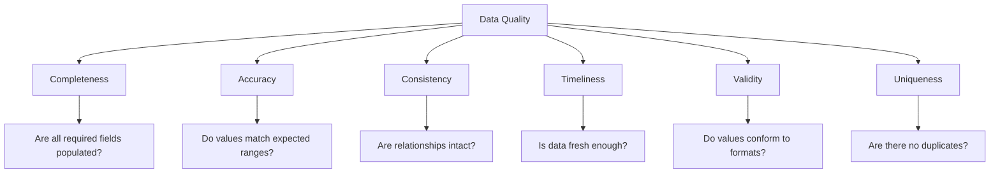
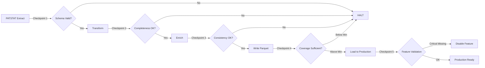
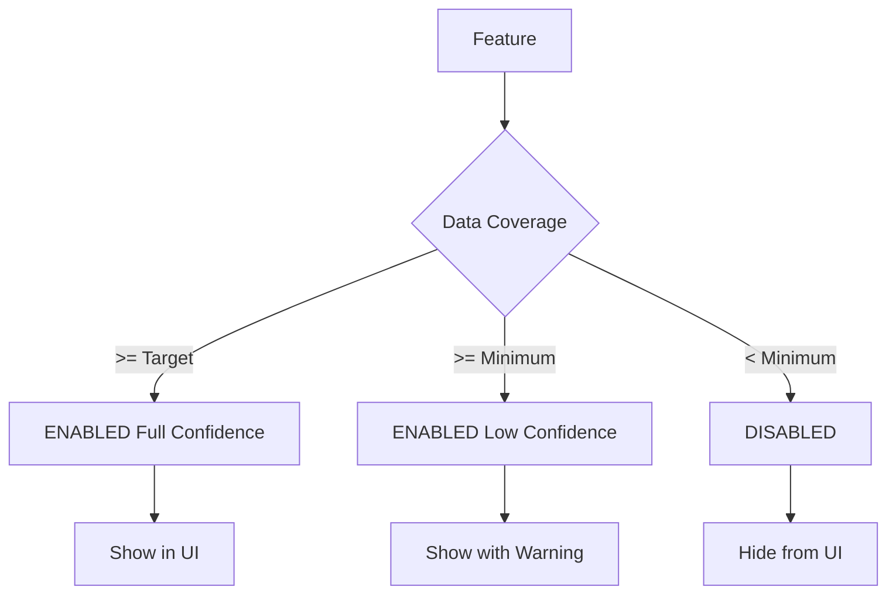
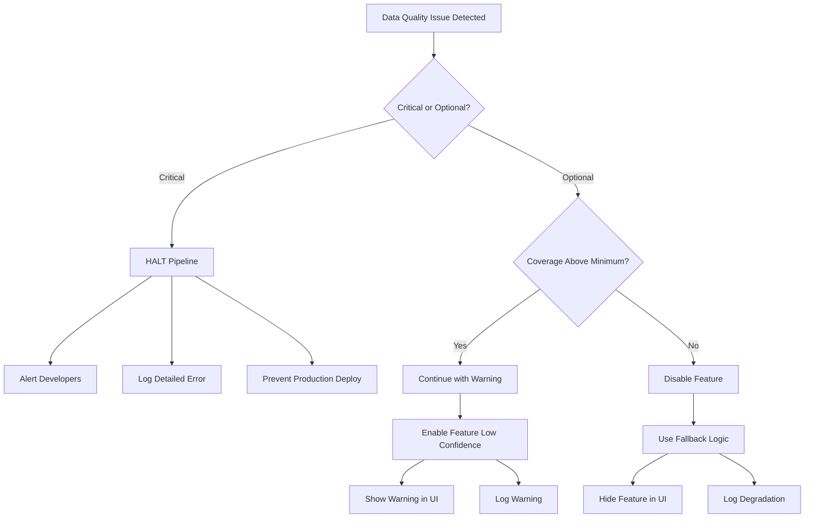

# PRD: Data Validation & Quality Assurance

**Document Version:** 1.0  
**Last Updated:** December 2024  
**Status:** Approved for Implementation  
**Related Documents:** [[PRD-Data-Requirements]], [[01-PRD-Main]], [[03-Database-Tutorial]]

---

## Table of Contents

1. [Overview](#1-overview)
2. [Validation Philosophy](#2-validation-philosophy)
3. [Data Quality Framework](#3-data-quality-framework)
4. [Validation Checkpoints](#4-validation-checkpoints)
5. [Automated Validation Tests](#5-automated-validation-tests)
6. [Feature Coverage Validation](#6-feature-coverage-validation)
7. [Fallback Strategies](#7-fallback-strategies)
8. [Monitoring & Alerting](#8-monitoring--alerting)

---

## 1. Overview

### 1.1 Purpose

This document defines **how we ensure data quality** throughout the PatentIQ system. Think of it as the **quality control manual** for our data factory.

Just as a car manufacturer has quality checkpoints at each stage (parts inspection → assembly verification → final testing), we validate data at multiple stages:
- **At extraction:** Is the raw data from PATSTAT complete?
- **During transformation:** Did we process it correctly?
- **Before analysis:** Can we deliver on all promised features?
- **In production:** Are results accurate and reliable?

### 1.2 Validation Goals

**Goal 1: Prevent Bad Data from Entering System**
- Detect issues during extraction
- Halt pipeline before corrupting data lake
- Alert developers immediately

**Goal 2: Ensure Feature Viability**
- Validate we have sufficient data for each feature
- Quantify limitations (coverage %, confidence levels)
- Enable/disable features based on data availability

**Goal 3: Maintain Production Quality**
- Continuous monitoring of data freshness
- Automated alerts for anomalies
- Graceful degradation when data quality drops

**Goal 4: Build Trust Through Transparency**
- Document data quality metrics publicly
- Show confidence levels in UI
- Explain limitations honestly

### 1.3 Scope

**In Scope:**
- Validation of all data sources (PATSTAT, INPADOC, external)
- Quality checks at every pipeline stage
- Feature-specific coverage validation
- Fallback logic for degraded data
- Production monitoring

**Out of Scope:**
- PATSTAT database internal validation (EPO's responsibility)
- User input validation (covered in API spec)
- ML model validation (covered in [[PRD-ML-Guidelines]])

---

## 2. Validation Philosophy

### 2.1 Core Principles

**Principle 1: Fail Fast, Fail Loudly**

When critical data is missing or corrupted:
- **Don't continue** processing silently
- **Halt immediately** and raise error
- **Alert developers** with detailed context

Example: Missing patent IDs → Cannot proceed → STOP

**Principle 2: Degrade Gracefully**

When optional data is incomplete:
- **Continue** processing core functionality
- **Flag** affected features as low confidence
- **Inform users** of limitations

Example: Missing claim counts → Still analyze patent → Show "Claim count unavailable"

**Principle 3: Quantify Everything**

- Don't say "some data missing"
- Say "437 of 500,000 patents (0.09%) missing CPC codes"
- Metrics enable informed decisions

**Principle 4: Automate Validation**

- Manual checks don't scale
- Automated tests run on every pipeline execution
- Regressions caught immediately

### 2.2 Quality Dimensions

We measure data quality across **six dimensions** (inspired by DAMA framework):



**Completeness:** Presence of expected data
- Example: 100% of patents have filing_date

**Accuracy:** Correctness of values
- Example: patent_age matches (current_date - filing_date)

**Consistency:** Logical relationships hold
- Example: Every cited_patent_id exists in patents table

**Timeliness:** Data freshness
- Example: Most recent patent publication within 30 days of PATSTAT update

**Validity:** Conformance to format/range
- Example: Filing year between 2015-2024

**Uniqueness:** No unintended duplicates
- Example: Each patent_id appears exactly once

---

## 3. Data Quality Framework

### 3.1 Quality Levels

We categorize data quality into **four levels** with different responses:

```
Level 1: CRITICAL ❌
- Missing required fields (patent_id, filing_date)
- Invalid data types (text in numeric field)
- Broken foreign key relationships
→ Action: HALT pipeline, ALERT immediately

Level 2: HIGH ⚠️
- Missing optional but important fields (CPC codes)
- Unexpected values (citation count negative)
- Coverage below 95%
→ Action: CONTINUE with WARNING, flag affected features

Level 3: MEDIUM ⚠️
- Missing nice-to-have fields (abstract text)
- Coverage 80-95%
- Slight delays in data freshness
→ Action: CONTINUE, log warning, monitor trend

Level 4: LOW ℹ️
- Minor formatting inconsistencies
- Coverage 75-80%
- Expected variations
→ Action: CONTINUE, log info, document limitation
```

### 3.2 Validation Checkpoints



**Checkpoint 1 - Extraction Validation:**
- Schema matches expected structure
- No NULL primary keys
- Row counts within expected range

**Checkpoint 2 - Transformation Validation:**
- All required fields populated
- Data types correct
- Value ranges valid

**Checkpoint 3 - Consistency Validation:**
- Foreign keys resolve
- Calculated fields match formulas
- No logical contradictions

**Checkpoint 4 - Coverage Validation:**
- Sufficient data for core features
- Coverage percentages documented
- Minimum thresholds met

**Checkpoint 5 - Feature Validation:**
- Each feature has required data
- Confidence levels calculated
- Features enabled/disabled based on coverage

---

## 4. Validation Checkpoints

### 4.1 Checkpoint 1: Extraction Validation

**Purpose:** Ensure raw data from PATSTAT is complete and structurally sound

#### 4.1.1 Schema Validation

**Test:** Verify all expected tables and columns exist

```python
# Conceptual validation logic
EXPECTED_SCHEMA = {
    'TLS201_APPLN': [
        ('appln_id', 'INTEGER'),
        ('appln_filing_date', 'DATE'),
        ('appln_filing_year', 'INTEGER'),
        ('granted', 'CHAR(1)')
    ],
    'TLS211_PAT_PUBLN': [
        ('pat_publn_id', 'INTEGER'),
        ('publn_nr', 'VARCHAR'),
        ('publn_kind', 'VARCHAR'),
        ('publn_date', 'DATE')
    ],
    # ... more tables
}

def validate_patstat_schema(db_session) -> ValidationResult:
    """Validate PATSTAT database schema"""
    
    missing_tables = []
    missing_columns = []
    type_mismatches = []
    
    for table_name, columns in EXPECTED_SCHEMA.items():
        # Check table exists
        if not table_exists(db_session, table_name):
            missing_tables.append(table_name)
            continue
        
        # Check each column
        for col_name, expected_type in columns:
            actual_type = get_column_type(db_session, table_name, col_name)
            
            if actual_type is None:
                missing_columns.append(f"{table_name}.{col_name}")
            elif actual_type != expected_type:
                type_mismatches.append(
                    f"{table_name}.{col_name}: expected {expected_type}, got {actual_type}"
                )
    
    # Assess result
    if missing_tables or type_mismatches:
        return ValidationResult(
            level='CRITICAL',
            passed=False,
            message=f"Schema validation failed: {missing_tables + type_mismatches}"
        )
    elif missing_columns:
        return ValidationResult(
            level='HIGH',
            passed=True,
            message=f"Optional columns missing: {missing_columns}"
        )
    else:
        return ValidationResult(
            level='INFO',
            passed=True,
            message="Schema validation passed"
        )
```

**Acceptance Criteria:**
- ✅ All expected tables present: CRITICAL
- ✅ All required columns present: CRITICAL
- ⚠️ Optional columns may be missing: WARNING

#### 4.1.2 Row Count Validation

**Test:** Verify extracted row counts are within expected ranges

```python
def validate_row_counts(extraction_results: dict) -> ValidationResult:
    """Validate extracted row counts against baselines"""
    
    EXPECTED_RANGES = {
        'patents': (480000, 520000),      # ~500K ± 4%
        'citations': (4500000, 5500000),  # ~5M ± 10%
        'legal_events': (1800000, 2200000),
        'families': (480000, 520000),
        'cpc_codes': (2700000, 3300000)
    }
    
    issues = []
    
    for data_type, (min_count, max_count) in EXPECTED_RANGES.items():
        actual_count = extraction_results.get(data_type, 0)
        
        if actual_count < min_count:
            issues.append(f"{data_type}: {actual_count} < {min_count} (too few)")
        elif actual_count > max_count:
            issues.append(f"{data_type}: {actual_count} > {max_count} (too many)")
        elif actual_count == 0:
            issues.append(f"{data_type}: ZERO rows extracted!")
    
    if any("ZERO rows" in issue for issue in issues):
        return ValidationResult(
            level='CRITICAL',
            passed=False,
            message=f"No data extracted: {issues}"
        )
    elif issues:
        return ValidationResult(
            level='HIGH',
            passed=True,
            message=f"Row counts outside expected range: {issues}"
        )
    else:
        return ValidationResult(
            level='INFO',
            passed=True,
            message=f"Row counts within expected ranges"
        )
```

**Acceptance Criteria:**
- ✅ Patents: 480K-520K rows: CRITICAL if outside
- ⚠️ Citations: 4.5M-5.5M rows: WARNING if outside
- ✅ Zero rows for any entity: CRITICAL

#### 4.1.3 NULL Check on Critical Fields

**Test:** No NULLs in required fields

```python
CRITICAL_FIELDS = {
    'patents': ['pat_publn_id', 'appln_id', 'publn_nr', 'filing_date'],
    'citations': ['citing_patent_id', 'cited_patent_id', 'citn_id'],
    'legal_events': ['appln_id', 'event_type', 'event_date']
}

def validate_no_nulls(df: DataFrame, entity: str) -> ValidationResult:
    """Check for NULLs in critical fields"""
    
    critical_fields = CRITICAL_FIELDS.get(entity, [])
    null_counts = {}
    
    for field in critical_fields:
        null_count = df[field].is_null().sum()
        if null_count > 0:
            null_counts[field] = null_count
    
    if null_counts:
        total_nulls = sum(null_counts.values())
        return ValidationResult(
            level='CRITICAL',
            passed=False,
            message=f"NULLs found in critical fields: {null_counts} ({total_nulls} total)"
        )
    else:
        return ValidationResult(
            level='INFO',
            passed=True,
            message="No NULLs in critical fields"
        )
```

**Acceptance Criteria:**
- ✅ Zero NULLs in critical fields: CRITICAL
- Tolerance: 0% (absolute requirement)

### 4.2 Checkpoint 2: Transformation Validation

**Purpose:** Ensure transformations are correct and data integrity maintained

#### 4.2.1 Calculated Field Validation

**Test:** Verify calculated fields match their formulas

```python
def validate_calculated_fields(df: DataFrame) -> ValidationResult:
    """Validate calculated fields against source fields"""
    
    errors = []
    
    # Test: patent_age_years = (current_date - filing_date) / 365.25
    current_date = datetime.now()
    df_with_check = df.with_columns([
        ((current_date - pl.col('filing_date')).dt.days() / 365.25).alias('age_check')
    ])
    
    age_mismatches = df_with_check.filter(
        (pl.col('patent_age_years') - pl.col('age_check')).abs() > 0.1
    ).height
    
    if age_mismatches > 0:
        errors.append(f"{age_mismatches} patents have incorrect age calculation")
    
    # Test: citation_velocity = forward_citations / age_years
    df_with_check = df.with_columns([
        (pl.col('forward_citations') / pl.col('patent_age_years')).alias('velocity_check')
    ])
    
    velocity_mismatches = df_with_check.filter(
        (pl.col('citation_velocity') - pl.col('velocity_check')).abs() > 0.01
    ).height
    
    if velocity_mismatches > 0:
        errors.append(f"{velocity_mismatches} patents have incorrect velocity calculation")
    
    if errors:
        return ValidationResult(
            level='CRITICAL',
            passed=False,
            message=f"Calculated field errors: {errors}"
        )
    else:
        return ValidationResult(
            level='INFO',
            passed=True,
            message="All calculated fields correct"
        )
```

**Acceptance Criteria:**
- ✅ Age calculation accurate to ±0.1 years: CRITICAL
- ✅ Citation velocity accurate to ±0.01: CRITICAL
- ✅ CPC section matches first letter of CPC code: CRITICAL

#### 4.2.2 Value Range Validation

**Test:** All values within expected ranges

```python
VALUE_RANGES = {
    'patent_age_years': (0, 50),              # Patents don't live >50 years
    'forward_citations': (0, 10000),          # Max realistic citation count
    'backward_citations': (0, 500),           # Max realistic prior art
    'citation_velocity': (0, 1000),           # Max citations/year
    'claim_count': (1, 500),                  # Realistic claim range
    'family_size': (1, 150),                  # Max realistic family
    'cost_per_citation': (0, 100000)          # Max €100K per citation
}

def validate_value_ranges(df: DataFrame) -> ValidationResult:
    """Check all values within expected ranges"""
    
    out_of_range = {}
    
    for field, (min_val, max_val) in VALUE_RANGES.items():
        if field not in df.columns:
            continue
        
        below_min = df.filter(pl.col(field) < min_val).height
        above_max = df.filter(pl.col(field) > max_val).height
        
        if below_min > 0:
            out_of_range[f"{field}_below_min"] = below_min
        if above_max > 0:
            out_of_range[f"{field}_above_max"] = above_max
    
    if out_of_range:
        total_issues = sum(out_of_range.values())
        percentage = (total_issues / len(df)) * 100
        
        if percentage > 1:  # >1% out of range
            return ValidationResult(
                level='HIGH',
                passed=False,
                message=f"{percentage:.2f}% of records out of range: {out_of_range}"
            )
        else:
            return ValidationResult(
                level='MEDIUM',
                passed=True,
                message=f"{percentage:.2f}% of records out of range (acceptable)"
            )
    else:
        return ValidationResult(
            level='INFO',
            passed=True,
            message="All values within expected ranges"
        )
```

**Acceptance Criteria:**
- ✅ <1% of records out of range: WARNING
- ✅ <0.1% out of range: PASS
- ❌ >1% out of range: HIGH priority issue

#### 4.2.3 Deduplication Validation

**Test:** Verify deduplication logic removes correct duplicates

```python
def validate_deduplication(before_df: DataFrame, after_df: DataFrame) -> ValidationResult:
    """Validate deduplication removed correct records"""
    
    # Check: No duplicate patent IDs in final dataset
    duplicate_ids = after_df.groupby('pat_publn_id').count().filter(
        pl.col('count') > 1
    ).height
    
    if duplicate_ids > 0:
        return ValidationResult(
            level='CRITICAL',
            passed=False,
            message=f"{duplicate_ids} duplicate patent IDs in deduplicated data!"
        )
    
    # Check: Number of unique IDs matches row count
    unique_count = after_df['pat_publn_id'].n_unique()
    row_count = after_df.height
    
    if unique_count != row_count:
        return ValidationResult(
            level='CRITICAL',
            passed=False,
            message=f"Unique IDs ({unique_count}) != row count ({row_count})"
        )
    
    # Check: Deduplication rate reasonable (not too high)
    removed = before_df.height - after_df.height
    removal_rate = (removed / before_df.height) * 100
    
    if removal_rate > 10:  # >10% removed seems suspicious
        return ValidationResult(
            level='HIGH',
            passed=True,
            message=f"High deduplication rate: {removal_rate:.1f}% removed"
        )
    
    return ValidationResult(
        level='INFO',
        passed=True,
        message=f"Deduplication successful: {removed} duplicates removed ({removal_rate:.2f}%)"
    )
```

**Acceptance Criteria:**
- ✅ Zero duplicate patent IDs after dedup: CRITICAL
- ⚠️ <10% records removed: WARNING if exceeded
- ✅ Unique count == row count: CRITICAL

### 4.3 Checkpoint 3: Consistency Validation

**Purpose:** Ensure relationships between entities are intact

#### 4.3.1 Foreign Key Integrity

**Test:** All foreign keys resolve to valid records

```python
def validate_foreign_keys(
    citations_df: DataFrame,
    patents_df: DataFrame
) -> ValidationResult:
    """Validate citation foreign keys resolve"""
    
    patent_ids = set(patents_df['pat_publn_id'].to_list())
    
    # Check: cited_patent_id exists in patents
    orphan_cited = citations_df.filter(
        ~pl.col('cited_patent_id').is_in(patent_ids)
    ).height
    
    # Check: citing_patent_id exists in patents
    orphan_citing = citations_df.filter(
        ~pl.col('citing_patent_id').is_in(patent_ids)
    ).height
    
    total_citations = citations_df.height
    orphan_rate = ((orphan_cited + orphan_citing) / total_citations) * 100
    
    if orphan_rate > 5:  # >5% orphaned
        return ValidationResult(
            level='HIGH',
            passed=False,
            message=f"{orphan_rate:.1f}% of citations have invalid foreign keys"
        )
    elif orphan_rate > 0:
        return ValidationResult(
            level='MEDIUM',
            passed=True,
            message=f"{orphan_rate:.2f}% of citations orphaned (within tolerance)"
        )
    else:
        return ValidationResult(
            level='INFO',
            passed=True,
            message="All foreign keys valid"
        )
```

**Acceptance Criteria:**
- ✅ <5% orphaned citations: PASS
- ⚠️ 5-10% orphaned: WARNING
- ❌ >10% orphaned: FAIL

**Why Allow Some Orphans:** Citations may reference non-EPO patents (US, JP) not in our scope

#### 4.3.2 Logical Consistency

**Test:** Logical relationships hold

```python
def validate_logical_consistency(df: DataFrame) -> ValidationResult:
    """Validate logical rules"""
    
    issues = []
    
    # Rule: grant_date >= filing_date
    invalid_dates = df.filter(
        pl.col('grant_date') < pl.col('filing_date')
    ).height
    
    if invalid_dates > 0:
        issues.append(f"{invalid_dates} patents granted before filing")
    
    # Rule: forward_citations = count in citations table
    # (Conceptual - would require join to citations)
    
    # Rule: family_size >= 1 (at least the patent itself)
    invalid_families = df.filter(
        pl.col('family_size') < 1
    ).height
    
    if invalid_families > 0:
        issues.append(f"{invalid_families} patents with family_size < 1")
    
    # Rule: If has_opposition=True, opposition_outcome must be set
    missing_outcomes = df.filter(
        (pl.col('has_opposition') == True) & 
        (pl.col('opposition_outcome').is_null())
    ).height
    
    if missing_outcomes > 0:
        issues.append(f"{missing_outcomes} oppositions missing outcomes")
    
    if issues:
        return ValidationResult(
            level='HIGH',
            passed=False,
            message=f"Logical inconsistencies: {issues}"
        )
    else:
        return ValidationResult(
            level='INFO',
            passed=True,
            message="All logical consistency checks passed"
        )
```

**Acceptance Criteria:**
- ✅ Grant date >= filing date: 100% (CRITICAL)
- ✅ Family size >= 1: 100% (CRITICAL)
- ⚠️ Opposition outcomes: >95% complete

### 4.4 Checkpoint 4: Coverage Validation

**Purpose:** Ensure sufficient data exists for each feature

See [[#6-feature-coverage-validation]] for detailed feature-specific tests.

### 4.5 Checkpoint 5: Feature Validation

**Purpose:** Determine which features can be enabled in production

See [[#6-feature-coverage-validation]] for acceptance criteria by feature.

---

## 5. Automated Validation Tests

### 5.1 Test Suite Structure

```
tests/
├── validation/
│   ├── test_extraction_validation.py
│   ├── test_transformation_validation.py
│   ├── test_consistency_validation.py
│   ├── test_coverage_validation.py
│   └── test_feature_enablement.py
├── fixtures/
│   ├── sample_patents.parquet
│   ├── sample_citations.parquet
│   └── validation_baselines.json
└── conftest.py
```

### 5.2 Validation Test Examples

```python
# Conceptual test structure
import pytest
from validation.validators import *

class TestExtractionValidation:
    """Test extraction checkpoint"""
    
    def test_schema_validation_passes_with_valid_schema(self):
        # Given: Valid PATSTAT schema
        schema = load_valid_schema()
        
        # When: Validating schema
        result = validate_patstat_schema(schema)
        
        # Then: Validation passes
        assert result.passed == True
        assert result.level == 'INFO'
    
    def test_schema_validation_fails_with_missing_table(self):
        # Given: Schema missing TLS212_CITATION
        schema = load_schema_missing_table('TLS212_CITATION')
        
        # When: Validating schema
        result = validate_patstat_schema(schema)
        
        # Then: Validation fails critically
        assert result.passed == False
        assert result.level == 'CRITICAL'
        assert 'TLS212_CITATION' in result.message
    
    def test_row_count_validation_passes_within_range(self):
        # Given: Extraction with 500K patents
        extraction = {'patents': 500000, 'citations': 5000000}
        
        # When: Validating row counts
        result = validate_row_counts(extraction)
        
        # Then: Validation passes
        assert result.passed == True
    
    def test_row_count_validation_fails_with_zero_rows(self):
        # Given: Extraction with zero patents
        extraction = {'patents': 0, 'citations': 5000000}
        
        # When: Validating row counts
        result = validate_row_counts(extraction)
        
        # Then: Validation fails critically
        assert result.passed == False
        assert result.level == 'CRITICAL'
        assert 'ZERO rows' in result.message


class TestTransformationValidation:
    """Test transformation checkpoint"""
    
    def test_calculated_age_matches_formula(self):
        # Given: Sample patents with filing dates
        df = pl.DataFrame({
            'pat_publn_id': [1, 2, 3],
            'filing_date': [
                datetime(2020, 1, 1),
                datetime(2015, 6, 15),
                datetime(2018, 3, 20)
            ],
            'patent_age_years': [4.95, 9.5, 6.7]  # Calculated values
        })
        
        # When: Validating calculated fields
        result = validate_calculated_fields(df)
        
        # Then: Validation passes (within tolerance)
        assert result.passed == True
    
    def test_value_range_rejects_negative_citations(self):
        # Given: Patents with negative citations
        df = pl.DataFrame({
            'pat_publn_id': [1, 2],
            'forward_citations': [10, -5]  # Invalid!
        })
        
        # When: Validating ranges
        result = validate_value_ranges(df)
        
        # Then: Validation fails
        assert result.passed == False
        assert 'forward_citations_below_min' in result.message


class TestConsistencyValidation:
    """Test consistency checkpoint"""
    
    def test_foreign_keys_resolve_successfully(self):
        # Given: Citations that reference existing patents
        patents = pl.DataFrame({'pat_publn_id': [1, 2, 3]})
        citations = pl.DataFrame({
            'citing_patent_id': [2, 3],
            'cited_patent_id': [1, 1]
        })
        
        # When: Validating foreign keys
        result = validate_foreign_keys(citations, patents)
        
        # Then: Validation passes
        assert result.passed == True
        assert result.level == 'INFO'
    
    def test_foreign_keys_detect_orphans(self):
        # Given: Citations referencing non-existent patents
        patents = pl.DataFrame({'pat_publn_id': [1, 2]})
        citations = pl.DataFrame({
            'citing_patent_id': [2, 3],
            'cited_patent_id': [1, 999]  # 999 doesn't exist!
        })
        
        # When: Validating foreign keys
        result = validate_foreign_keys(citations, patents)
        
        # Then: Validation warns about orphans
        assert '50.00%' in result.message  # 1 of 2 citations orphaned
```

### 5.3 Continuous Integration

**Run validation on every pipeline execution:**

```yaml
# .github/workflows/data-validation.yml (conceptual)
name: Data Validation

on:
  schedule:
    - cron: '0 3 * * *'  # Daily at 3 AM after pipeline runs
  workflow_dispatch:

jobs:
  validate:
    runs-on: ubuntu-latest
    steps:
      - name: Checkout code
        uses: actions/checkout@v3
      
      - name: Set up Python
        uses: actions/setup-python@v4
        with:
          python-version: '3.11'
      
      - name: Install dependencies
        run: pip install -r requirements-validation.txt
      
      - name: Run extraction validation
        run: pytest tests/validation/test_extraction_validation.py -v
      
      - name: Run transformation validation
        run: pytest tests/validation/test_transformation_validation.py -v
      
      - name: Run consistency validation
        run: pytest tests/validation/test_consistency_validation.py -v
      
      - name: Run coverage validation
        run: pytest tests/validation/test_coverage_validation.py -v
      
      - name: Generate validation report
        run: python scripts/generate_validation_report.py
      
      - name: Upload report
        uses: actions/upload-artifact@v3
        with:
          name: validation-report
          path: reports/validation_report.html
      
      - name: Notify on failure
        if: failure()
        uses: actions/slack-notifier@v1
        with:
          webhook: ${{ secrets.SLACK_WEBHOOK }}
          message: 'Data validation FAILED - check workflow logs'
```

---

## 6. Feature Coverage Validation

### 6.1 Coverage Requirements by Feature

Each feature has **minimum coverage requirements** to be enabled:



### 6.2 Influence Dimension Coverage

**Required Data:**
- Forward citations (TLS212_CITATION)
- Backward citations (TLS212_CITATION)
- Patent age (calculated from TLS201)
- CPC section (TLS224)

**Validation:**

```python
def validate_influence_coverage(patents_df, citations_df) -> FeatureCoverageResult:
    """Validate data coverage for Influence dimension"""
    
    total_patents = patents_df.height
    
    # Check: Patents with forward citations
    patents_with_fwd_cites = patents_df.filter(
        pl.col('forward_citations') >= 0  # Include zero (valid state)
    ).height
    fwd_coverage = (patents_with_fwd_cites / total_patents) * 100
    
    # Check: Patents with CPC section
    patents_with_cpc = patents_df.filter(
        pl.col('cpc_section').is_not_null()
    ).height
    cpc_coverage = (patents_with_cpc / total_patents) * 100
    
    # Check: Patents with age data
    patents_with_age = patents_df.filter(
        pl.col('patent_age_years') > 0
    ).height
    age_coverage = (patents_with_age / total_patents) * 100
    
    # Determine enablement
    if fwd_coverage >= 99 and cpc_coverage >= 95 and age_coverage >= 100:
        status = 'ENABLED'
        confidence = 'HIGH'
    elif fwd_coverage >= 95 and cpc_coverage >= 80 and age_coverage >= 98:
        status = 'ENABLED'
        confidence = 'LOW'
    else:
        status = 'DISABLED'
        confidence = 'N/A'
    
    return FeatureCoverageResult(
        feature='Influence Dimension',
        status=status,
        confidence=confidence,
        coverage_metrics={
            'forward_citations': fwd_coverage,
            'cpc_section': cpc_coverage,
            'patent_age': age_coverage
        },
        recommendation=generate_recommendation(status, confidence)
    )
```

**Acceptance Criteria:**

| Metric | Target | Minimum | Action if Below Minimum |
|--------|--------|---------|------------------------|
| Forward citation data | >99% | >95% | DISABLE feature |
| CPC section data | >95% | >80% | Show low confidence |
| Age calculation | 100% | >98% | DISABLE feature |

**Fallback Strategy:**
- If CPC missing → Use IPC as fallback
- If no field normalization data → Use raw citation counts only

### 6.3 Legal Strength Coverage

**Required Data:**
- Grant status (TLS201)
- Opposition events (INPADOC)
- Renewal history (INPADOC)
- Family data (TLS218)
- Claim count (TLS211 or EPO API)

**Validation:**

```python
def validate_legal_coverage(
    patents_df,
    legal_events_df,
    families_df
) -> FeatureCoverageResult:
    """Validate data coverage for Legal Strength dimension"""
    
    total_patents = patents_df.height
    
    # Check: Grant status (should be 100% - we filter for granted)
    patents_granted = patents_df.filter(
        pl.col('is_granted') == True
    ).height
    grant_coverage = (patents_granted / total_patents) * 100
    
    # Check: Opposition data availability
    patents_with_opp_check = patents_df.join(
        legal_events_df.filter(pl.col('is_opposition') == True),
        on='appln_id',
        how='left'
    )
    # Note: Most patents won't have oppositions - check we CAN detect them
    opp_data_available = legal_events_df.filter(
        pl.col('is_opposition') == True
    ).height > 0
    
    # Check: Renewal data
    patents_with_renewals = patents_df.join(
        legal_events_df.filter(pl.col('is_renewal') == True),
        on='appln_id',
        how='left'
    ).filter(
        pl.col('event_date').is_not_null()
    ).height
    renewal_coverage = (patents_with_renewals / total_patents) * 100
    
    # Check: Family data
    patents_with_family = patents_df.filter(
        pl.col('family_id').is_not_null()
    ).height
    family_coverage = (patents_with_family / total_patents) * 100
    
    # Check: Claim count
    patents_with_claims = patents_df.filter(
        pl.col('claim_count').is_not_null()
    ).height
    claim_coverage = (patents_with_claims / total_patents) * 100
    
    # Determine enablement
    if (grant_coverage == 100 and
        opp_data_available and
        renewal_coverage >= 85 and
        family_coverage >= 98 and
        claim_coverage >= 80):
        status = 'ENABLED'
        confidence = 'HIGH'
    elif (grant_coverage >= 99 and
          renewal_coverage >= 75 and
          family_coverage >= 90):
        status = 'ENABLED'
        confidence = 'LOW'
    else:
        status = 'DISABLED'
        confidence = 'N/A'
    
    return FeatureCoverageResult(
        feature='Legal Strength Dimension',
        status=status,
        confidence=confidence,
        coverage_metrics={
            'grant_status': grant_coverage,
            'opposition_data': opp_data_available,
            'renewal_history': renewal_coverage,
            'family_data': family_coverage,
            'claim_count': claim_coverage
        }
    )
```

**Acceptance Criteria:**

| Metric | Target | Minimum | Action if Below Minimum |
|--------|--------|---------|------------------------|
| Grant status | 100% | 99% | DISABLE (critical) |
| Opposition data exists | TRUE | TRUE | Lower opposition score weight |
| Renewal coverage | >85% | >75% | Show low confidence |
| Family data | >98% | >90% | Estimate family size = 1 |
| Claim count | >80% | >70% | Omit claim component from score |

**Fallback Strategy:**
- If opposition data missing → Assume no opposition, baseline score
- If renewal data sparse → Use age as proxy for renewal years
- If claim count missing → Estimate from patent class averages
- If family data missing → Assume family size = 1

### 6.4 Financial Value Coverage

**Required Data:**
- Renewal history (INPADOC)
- Family geography (TLS218)
- Fee schedules (external JSON)
- Forward citations (for ROI calculation)

**Validation:**

```python
def validate_financial_coverage(
    patents_df,
    legal_events_df,
    families_df,
    fee_schedule: dict
) -> FeatureCoverageResult:
    """Validate data coverage for Financial dimension"""
    
    total_patents = patents_df.height
    
    # Check: Renewal history
    patents_with_renewals = patents_df.join(
        legal_events_df.filter(pl.col('is_renewal') == True).groupby('appln_id').count(),
        on='appln_id',
        how='left'
    ).filter(
        pl.col('count').is_not_null()
    ).height
    renewal_coverage = (patents_with_renewals / total_patents) * 100
    
    # Check: Family geography
    patents_with_geography = patents_df.filter(
        pl.col('family_countries').list.lengths() > 0
    ).height
    geography_coverage = (patents_with_geography / total_patents) * 100
    
    # Check: Fee schedule completeness
    fee_schedule_complete = (
        'epo_fees' in fee_schedule and
        'national_validation' in fee_schedule and
        'national_renewal_formulas' in fee_schedule
    )
    
    # Check: Citations for ROI calculation
    patents_with_citations = patents_df.filter(
        pl.col('forward_citations') >= 0
    ).height
    citation_coverage = (patents_with_citations / total_patents) * 100
    
    # Determine enablement
    if (renewal_coverage >= 80 and
        geography_coverage >= 95 and
        fee_schedule_complete and
        citation_coverage >= 99):
        status = 'ENABLED'
        confidence = 'HIGH'
    elif (renewal_coverage >= 60 and
          geography_coverage >= 85 and
          fee_schedule_complete):
        status = 'ENABLED'
        confidence = 'LOW'
    else:
        status = 'DISABLED'
        confidence = 'N/A'
    
    return FeatureCoverageResult(
        feature='Financial Value Dimension',
        status=status,
        confidence=confidence,
        coverage_metrics={
            'renewal_history': renewal_coverage,
            'family_geography': geography_coverage,
            'fee_schedule': fee_schedule_complete,
            'citations': citation_coverage
        }
    )
```

**Acceptance Criteria:**

| Metric | Target | Minimum | Action if Below Minimum |
|--------|--------|---------|------------------------|
| Renewal history | >80% | >60% | Use age-based estimates |
| Family geography | >95% | >85% | Assume EP-only |
| Fee schedule complete | TRUE | TRUE | DISABLE (cannot calculate costs) |
| Citations available | >99% | >95% | Omit ROI component |

**Fallback Strategy:**
- If renewal history missing → Estimate based on typical renewal patterns for age/CPC
- If geography missing → Assume EP-only coverage (no national fees)
- If citations unavailable → Cannot calculate cost/citation, show total cost only

### 6.5 Future Potential Coverage

**Required Data:**
- Historical citations (Year 1, 2, 3)
- All ML features (33 features)
- Market data
- Trained ML model

**Validation:**

```python
def validate_future_coverage(
    features_df,
    ml_model_path: str,
    market_data: dict
) -> FeatureCoverageResult:
    """Validate data coverage for Future Potential dimension"""
    
    total_patents = features_df.height
    
    # Check: Feature completeness per patent
    feature_completeness = features_df['feature_completeness']
    high_quality = (feature_completeness >= 0.9).sum()
    medium_quality = ((feature_completeness >= 0.7) & (feature_completeness < 0.9)).sum()
    
    high_coverage = (high_quality / total_patents) * 100
    medium_coverage = (medium_quality / total_patents) * 100
    
    # Check: ML model exists and is valid
    ml_model_exists = os.path.exists(ml_model_path)
    if ml_model_exists:
        model_metrics = load_model_metrics(ml_model_path)
        ml_model_quality = model_metrics.get('r2', 0) > 0.60
    else:
        ml_model_quality = False
    
    # Check: Market data available
    market_data_complete = len(market_data.get('industries', [])) > 0
    
    # Determine enablement
    if (high_coverage >= 70 and
        ml_model_exists and
        ml_model_quality and
        market_data_complete):
        status = 'ENABLED'
        confidence = 'HIGH'
    elif (high_coverage + medium_coverage >= 80 and
          ml_model_exists):
        status = 'ENABLED'
        confidence = 'LOW'
    else:
        status = 'DISABLED'
        confidence = 'N/A'
    
    return FeatureCoverageResult(
        feature='Future Potential Dimension',
        status=status,
        confidence=confidence,
        coverage_metrics={
            'high_quality_features': high_coverage,
            'medium_quality_features': medium_coverage,
            'ml_model_r2': model_metrics.get('r2') if ml_model_exists else 0,
            'market_data_available': market_data_complete
        }
    )
```

**Acceptance Criteria:**

| Metric | Target | Minimum | Action if Below Minimum |
|--------|--------|---------|------------------------|
| High-quality features | >70% | >60% | Show low confidence predictions |
| ML model R² | >0.65 | >0.60 | Retrain or disable predictions |
| Market data available | TRUE | FALSE | Omit market context |

**Fallback Strategy:**
- If ML model fails validation → Use historical citation trend (simple linear)
- If features incomplete → Predict based on available features only
- If market data missing → Omit market growth factor from prediction

### 6.6 Licensing Intelligence Coverage

**Required Data:**
- Patent CPC codes
- Companies in same CPC
- Company filing data (past 3 years)
- Family geography

**Validation:**

```python
def validate_licensing_coverage(
    patents_df,
    companies_df,
    cpc_mapping: dict
) -> FeatureCoverageResult:
    """Validate data coverage for Licensing Intelligence"""
    
    total_patents = patents_df.height
    
    # Check: CPC codes available
    patents_with_cpc = patents_df.filter(
        pl.col('cpc_main').is_not_null()
    ).height
    cpc_coverage = (patents_with_cpc / total_patents) * 100
    
    # Check: Active companies in database
    active_companies = companies_df.filter(
        pl.col('patents_last_3yrs') > 5
    ).height
    
    # Check: Geographic data for fit calculation
    patents_with_geography = patents_df.filter(
        pl.col('family_countries').list.lengths() > 0
    ).height
    geo_coverage = (patents_with_geography / total_patents) * 100
    
    # Determine enablement
    if (cpc_coverage >= 95 and
        active_companies >= 100 and  # At least 100 potential licensees in DB
        geo_coverage >= 95):
        status = 'ENABLED'
        confidence = 'HIGH'
    elif (cpc_coverage >= 85 and
          active_companies >= 50 and
          geo_coverage >= 85):
        status = 'ENABLED'
        confidence = 'LOW'
    else:
        status = 'DISABLED'
        confidence = 'N/A'
    
    return FeatureCoverageResult(
        feature='Licensing Intelligence',
        status=status,
        confidence=confidence,
        coverage_metrics={
            'cpc_data': cpc_coverage,
            'active_companies': active_companies,
            'geography_data': geo_coverage
        }
    )
```

**Acceptance Criteria:**

| Metric | Target | Minimum | Action if Below Minimum |
|--------|--------|---------|------------------------|
| CPC availability | >95% | >85% | Use broader classifications |
| Active companies in DB | >100 | >50 | Reduce to top 5 licensees |
| Geography data | >95% | >85% | Omit geographic fit component |

**Fallback Strategy:**
- If CPC granular codes missing → Use IPC or CPC section level
- If few companies in space → Show market players instead of licensees
- If geography missing → Rank by technology fit only

---

## 7. Fallback Strategies

### 7.1 Fallback Decision Tree



### 7.2 Fallback Implementations

#### 7.2.1 Missing CPC Codes

**Issue:** Patent missing CPC classification  
**Impact:** Cannot normalize citations by field

**Fallback:**
```python
def get_cpc_section_with_fallback(patent: Patent) -> str:
    """Get CPC section, fall back to IPC if needed"""
    
    if patent.cpc_main:
        return patent.cpc_main[0]  # First letter
    
    elif patent.ipc_main:
        # IPC structure similar to CPC
        return patent.ipc_main[0]
    
    else:
        # Last resort: assign to generic "Unknown" section
        logger.warning(f"Patent {patent.id} has no CPC or IPC, using 'Z' fallback")
        return 'Z'  # Will be filtered from field normalization
```

**UI Treatment:**
- Show influence score
- Add footnote: "Field normalization unavailable for this patent"
- Confidence: MEDIUM

#### 7.2.2 Missing Claim Count

**Issue:** Claim count not in PATSTAT  
**Impact:** Legal strength score missing claim component

**Fallback:**
```python
def estimate_claim_count(patent: Patent, cpc_section: str) -> Optional[int]:
    """Estimate claim count from CPC averages"""
    
    # Average claim counts by CPC section (from historical data)
    AVG_CLAIMS = {
        'A': 14,  # Human necessities
        'B': 16,  # Operations
        'C': 12,  # Chemistry
        'G': 18,  # Physics
        'H': 17   # Electricity
    }
    
    estimated = AVG_CLAIMS.get(cpc_section, 15)  # Default 15
    
    logger.info(f"Patent {patent.id} claim count estimated as {estimated}")
    
    return estimated
```

**Scoring Impact:**
- Omit claim count component (10 points) from Legal Strength score
- Normalize remaining components to 0-100 scale
- Confidence: LOW

#### 7.2.3 Missing Renewal History

**Issue:** INPADOC renewal data unavailable  
**Impact:** Financial calculation incomplete

**Fallback:**
```python
def estimate_renewal_years(patent_age: float, cpc_section: str) -> List[int]:
    """Estimate typical renewal pattern"""
    
    # Typical renewal rates by CPC (from research)
    RENEWAL_RATES = {
        'A': 0.75,  # 75% of patents renewed at any given year
        'B': 0.70,
        'C': 0.65,
        'G': 0.80,  # High-value tech, renewed more
        'H': 0.82
    }
    
    renewal_rate = RENEWAL_RATES.get(cpc_section, 0.70)
    
    # Assume patent renewed probabilistically based on age
    estimated_years = []
    for year in range(3, int(patent_age) + 1):
        # Probability decreases with age
        prob = renewal_rate * (1 - (year - 3) / 17)  # Decays to 0 by year 20
        
        if random.random() < prob:
            estimated_years.append(year)
    
    logger.warning(f"Patent {patent.id} renewals estimated (no INPADOC data)")
    
    return estimated_years
```

**UI Treatment:**
- Show cost estimate
- Add disclaimer: "Costs estimated based on typical renewal patterns"
- Confidence: LOW

#### 7.2.4 ML Model Unavailable

**Issue:** LightGBM model file missing or corrupt  
**Impact:** Cannot predict future citations

**Fallback:**
```python
def fallback_citation_prediction(patent: Patent) -> dict:
    """Simple linear trend if ML unavailable"""
    
    # Get historical citations
    citations_y1 = patent.citations_year1
    citations_y2 = patent.citations_year2
    citations_y3 = patent.citations_year3
    
    if citations_y3 > 0:
        # Simple linear extrapolation
        slope = (citations_y3 - citations_y1) / 2  # Change per year
        predicted_3yr = max(0, citations_y3 + slope * 3)
        
        if slope > 0:
            trend = 'GROWING'
        elif slope < -0.5:
            trend = 'DECLINING'
        else:
            trend = 'STABLE'
    else:
        # No historical data, use field average
        predicted_3yr = get_field_average_citations(patent.cpc_section) * 0.5
        trend = 'UNKNOWN'
    
    logger.warning(f"Patent {patent.id} using fallback prediction (ML unavailable)")
    
    return {
        'predicted_citations': int(predicted_3yr),
        'confidence_interval': None,  # Cannot calculate without ML
        'trend': trend,
        'method': 'LINEAR_FALLBACK'
    }
```

**UI Treatment:**
- Show prediction
- Add notice: "Prediction based on linear trend (ML model unavailable)"
- Confidence: LOW
- Omit SHAP explanations

#### 7.2.5 Fee Schedule Outdated

**Issue:** Fee schedule JSON not updated for current year  
**Impact:** Cost calculations may be inaccurate

**Fallback:**
```python
def get_renewal_fee_with_fallback(year: int, fee_schedule: dict) -> float:
    """Get renewal fee, estimate if year missing"""
    
    current_year_fees = fee_schedule.get('epo_fees', {}).get('renewal', {})
    
    if str(year) in current_year_fees:
        return current_year_fees[str(year)]
    
    # Year missing - estimate based on trend
    available_years = sorted([int(y) for y in current_year_fees.keys()])
    
    if year > max(available_years):
        # Future year - use highest available (fees plateau at Y10)
        estimated_fee = current_year_fees[str(max(available_years))]
        logger.warning(f"Year {year} fee estimated as {estimated_fee} (using Y{max(available_years)} fee)")
        return estimated_fee
    
    elif year < min(available_years):
        # Early year - use lowest available
        estimated_fee = current_year_fees[str(min(available_years))]
        logger.warning(f"Year {year} fee estimated as {estimated_fee}")
        return estimated_fee
    
    else:
        # Interpolate
        lower_year = max([y for y in available_years if y < year])
        upper_year = min([y for y in available_years if y > year])
        
        lower_fee = current_year_fees[str(lower_year)]
        upper_fee = current_year_fees[str(upper_year)]
        
        # Linear interpolation
        ratio = (year - lower_year) / (upper_year - lower_year)
        estimated_fee = lower_fee + ratio * (upper_fee - lower_fee)
        
        return estimated_fee
```

**UI Treatment:**
- Show cost with asterisk
- Footnote: "Costs calculated using [YEAR] fee schedule"
- Confidence: MEDIUM

---

## 8. Monitoring & Alerting

### 8.1 Quality Metrics Dashboard

**Metrics to Monitor:**

```python
# Conceptual monitoring metrics
QUALITY_METRICS = {
    'extraction': {
        'row_count_variance': '± % from baseline',
        'null_rate_critical_fields': '% NULL in required fields',
        'extraction_duration': 'minutes to complete',
        'last_successful_extract': 'timestamp'
    },
    'transformation': {
        'validation_pass_rate': '% of validation checks passed',
        'deduplication_rate': '% of duplicates removed',
        'enrichment_success_rate': '% of records enriched',
        'transform_duration': 'minutes to complete'
    },
    'coverage': {
        'influence_coverage': '% patents with complete influence data',
        'legal_coverage': '% patents with complete legal data',
        'financial_coverage': '% patents with complete financial data',
        'ml_feature_completeness': '% features populated'
    },
    'production': {
        'cache_hit_rate': '% queries served from cache',
        'query_latency_p95': '95th percentile query time (ms)',
        'error_rate': '% of requests resulting in errors',
        'data_freshness': 'hours since last update'
    }
}
```

### 8.2 Alert Conditions

**Critical Alerts (Page on-call):**
- Extraction fails completely (0 rows)
- Critical validation check fails
- Production error rate >5%
- Data freshness >48 hours

**High Priority Alerts (Notify team chat):**
- Row count variance >10% from baseline
- Coverage drops below minimum threshold
- ML model R² drops below 0.55
- Query latency p95 >5 seconds

**Medium Priority Alerts (Daily digest):**
- Optional field coverage drops >5%
- Deduplication rate changes >20%
- Cache hit rate drops >10%

**Alert Configuration:**

```yaml
# alerts.yml (conceptual)
alerts:
  - name: extraction_failure
    condition: extraction.row_count == 0
    severity: CRITICAL
    channels: [pagerduty, slack]
    message: "Data extraction failed - 0 rows extracted"
  
  - name: coverage_below_minimum
    condition: coverage.influence_coverage < 95
    severity: HIGH
    channels: [slack]
    message: "Influence coverage dropped to {coverage.influence_coverage}%"
  
  - name: query_latency_high
    condition: production.query_latency_p95 > 5000
    severity: MEDIUM
    channels: [slack]
    message: "Query latency p95 exceeded 5 seconds"
```

### 8.3 Quality Reporting

**Daily Quality Report:**

```
PatentIQ Data Quality Report - 2024-12-15
==========================================

EXTRACTION STATUS: ✅ SUCCESS
- Patents extracted: 501,247 (+247 from yesterday)
- Citations extracted: 5,012,348
- Duration: 47 minutes

TRANSFORMATION STATUS: ✅ SUCCESS
- Validation pass rate: 100%
- Deduplication removed: 1,247 records (0.25%)
- Duration: 12 minutes

COVERAGE STATUS: ⚠️ WARNING
- Influence dimension: 99.2% ✅
- Legal dimension: 97.8% ✅
- Financial dimension: 84.3% ⚠️ (target: 85%)
- Future dimension: 89.1% ✅

PRODUCTION STATUS: ✅ HEALTHY
- Cache hit rate: 87%
- Query latency p95: 2.1 seconds
- Error rate: 0.03%
- Data freshness: 3 hours

ISSUES DETECTED:
1. Financial coverage below target (84.3% vs 85%)
   - Renewal data missing for 15.7% of patents
   - Recommendation: Investigate INPADOC extract
   - Impact: Low confidence financial scores for affected patents

ACTIONS TAKEN:
- None required - monitoring trend

NEXT QUALITY CHECK: 2024-12-16 03:00 UTC
```

---

## Summary

This Data Validation PRD defines:

✅ **Validation philosophy** (fail fast, degrade gracefully, quantify, automate)  
✅ **Quality dimensions** (completeness, accuracy, consistency, timeliness, validity, uniqueness)  
✅ **5 validation checkpoints** (extraction → transformation → consistency → coverage → feature enablement)  
✅ **Automated test suites** (pytest-based validation at each checkpoint)  
✅ **Feature-specific coverage requirements** (acceptance criteria for each dimension)  
✅ **Fallback strategies** (graceful degradation when data incomplete)  
✅ **Monitoring & alerting** (quality metrics, alert conditions, reporting)

**Key Principle:** **Be honest about limitations**. Better to show "Low Confidence" than silently produce garbage results.

**Related Documents:**
- [[PRD-Data-Requirements]] - What data we need
- [[PRD-Testing-Strategy]] - How we test the system
- [[PRD-ML-Guidelines]] - ML model validation

**Next Steps:**
1. Implement validation test suite
2. Configure alert thresholds
3. Create quality dashboard
4. Document feature enablement decisions
5. Train team on fallback procedures

---

**Document Owner:** Data Lead (Developer 1)  
**Last Reviewed:** December 2024  
**Next Review:** Week 4 (after initial pipeline runs)
