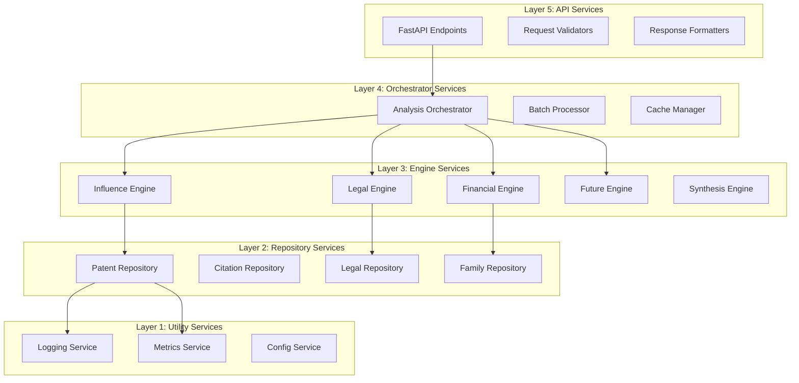

# PRD: Service Layers - Implementation Guidelines

**Document Version:** 1.0  
**Last Updated:** December 2024  
**Status:** Approved for Implementation  
**Related Documents:** [[PRD-Architecture]], [[PRD-Data-Requirements]], [[Use-Cases-Summary]]

---

## Table of Contents

1. [Overview](#1-overview)
2. [Service Layer Principles](#2-service-layer-principles)
3. [Repository Services](#3-repository-services)
4. [Engine Services](#4-engine-services)
5. [Orchestrator Services](#5-orchestrator-services)
6. [API Services](#6-api-services)
7. [Utility Services](#7-utility-services)
8. [Performance Patterns](#8-performance-patterns)

---

## 1. Overview

### 1.1 Purpose

This document provides **detailed implementation patterns** for every service layer in PatentIQ. Think of it as the **implementation cookbook** that shows exactly how to structure each service for consistency, performance, and maintainability.

Just as a restaurant has standardized recipes (mise en place, cooking order, plating), our services follow consistent patterns:
- **Setup** (initialization, dependency injection)
- **Execution** (core logic, error handling)
- **Cleanup** (resource management, logging)

### 1.2 Service Layer Philosophy

**Principle 1: Convention Over Configuration**

Services follow **standard patterns** so developers can navigate code intuitively.

```python
# Every repository follows same pattern
class AnyRepository:
    def __init__(self, data_source, cache):  # Standard dependencies
        pass
    
    def get_by_id(self, id: str):  # Standard method name
        pass
    
    def get_many(self, ids: List[str]):  # Standard batch method
        pass
```

**Principle 2: Explicit Dependencies**

Services **declare** what they need, don't hide dependencies.

```python
# ✅ Explicit
class InfluenceEngine:
    def __init__(self, 
                 citation_repo: ICitationRepository,
                 patent_repo: IPatentRepository):
        # Dependencies visible in constructor

# ❌ Implicit
class InfluenceEngine:
    def __init__(self):
        self.repo = get_global_repo()  # Hidden dependency
```

**Principle 3: Single Responsibility Per Method**

Each method does **one thing** and does it well.

```python
# ✅ Single responsibility
class PatentRepository:
    def get_by_id(self, id: str) -> Patent:
        """Only retrieves patent"""
        pass
    
    def enrich_with_citations(self, patent: Patent) -> Patent:
        """Only adds citation data"""
        pass

# ❌ Multiple responsibilities
class PatentRepository:
    def get_patent_with_everything(self, id: str) -> Patent:
        # Retrieves patent + citations + legal events + calculates scores
        pass
```

### 1.3 Service Hierarchy



---

## 2. Service Layer Principles

### 2.1 Clean Code Patterns

**Pattern 1: Early Return**

Exit early on error conditions, avoid deep nesting.

```python
# ✅ Early return
def calculate_score(patent: Patent) -> float:
    if not patent:
        return 0.0
    
    if not patent.citations:
        return 0.0
    
    # Main logic here
    return score

# ❌ Deep nesting
def calculate_score(patent: Patent) -> float:
    if patent:
        if patent.citations:
            # Main logic buried deep
            return score
        else:
            return 0.0
    else:
        return 0.0
```

**Pattern 2: Guard Clauses**

Validate inputs at method entry.

```python
def calculate_influence(patent: Patent) -> InfluenceScore:
    # Guard clauses
    if not patent:
        raise ValueError("Patent cannot be None")
    
    if patent.age_years <= 0:
        raise ValueError("Patent age must be positive")
    
    # Main logic (guaranteed valid inputs)
    score = self._calculate(patent)
    return score
```

**Pattern 3: Tell, Don't Ask**

Objects should do things, not expose data for others to do things.

```python
# ✅ Tell
class Patent:
    def calculate_age(self) -> float:
        """Patent calculates its own age"""
        return (datetime.now() - self.filing_date).days / 365.25

# ❌ Ask
class Patent:
    filing_date: datetime  # Exposed data

# Elsewhere
age = (datetime.now() - patent.filing_date).days / 365.25  # Client does work
```

**Pattern 4: Command-Query Separation**

Methods either **change state** (command) or **return value** (query), not both.

```python
# ✅ Separated
def get_patent(self, id: str) -> Patent:
    """Query - returns data, no side effects"""
    return self._cache.get(id)

def cache_patent(self, patent: Patent) -> None:
    """Command - changes state, no return"""
    self._cache.set(patent.id, patent)

# ❌ Mixed
def get_and_cache_patent(self, id: str) -> Patent:
    """BAD: Both queries and modifies state"""
    patent = self._db.query(id)
    self._cache.set(id, patent)  # Side effect
    return patent
```

### 2.2 Error Handling Patterns

**Pattern 1: Fail Fast**

Detect and raise errors immediately.

```python
class PatentRepository:
    def get_by_id(self, patent_id: str) -> Patent:
        # Validate immediately
        if not patent_id:
            raise ValueError("Patent ID required")
        
        if not self._validate_format(patent_id):
            raise ValueError(f"Invalid patent ID format: {patent_id}")
        
        # Continue with valid input
        return self._query(patent_id)
```

**Pattern 2: Specific Exceptions**

Use domain-specific exceptions for clarity.

```python
# Define domain exceptions
class PatentNotFoundError(Exception):
    """Raised when patent doesn't exist"""
    pass

class InsufficientDataError(Exception):
    """Raised when patent lacks required data"""
    pass

# Use specific exceptions
def get_patent(self, patent_id: str) -> Patent:
    patent = self._query(patent_id)
    
    if not patent:
        raise PatentNotFoundError(f"Patent {patent_id} not found")
    
    if not patent.citations:
        raise InsufficientDataError(f"Patent {patent_id} has no citation data")
    
    return patent
```

**Pattern 3: Exception Chaining**

Preserve original error context.

```python
def get_patent(self, patent_id: str) -> Patent:
    try:
        return self._parquet_query(patent_id)
    except ParquetError as e:
        # Chain exceptions to preserve context
        raise PatentNotFoundError(
            f"Failed to retrieve patent {patent_id}"
        ) from e
```

**Pattern 4: Try-Finally for Resources**

Always clean up resources.

```python
def batch_analyze(self, patent_ids: List[str]) -> List[AnalysisResult]:
    # Allocate resources
    cache = RequestCache()
    
    try:
        results = []
        for patent_id in patent_ids:
            result = self._analyze_with_cache(patent_id, cache)
            results.append(result)
        return results
    finally:
        # Always cleanup, even if error
        cache.clear()
```

### 2.3 Logging Patterns

**Pattern 1: Structured Logging**

Log with consistent structure for parsing.

```python
import structlog

logger = structlog.get_logger()

def calculate_influence(self, patent: Patent) -> InfluenceScore:
    # Structured log entry
    logger.info(
        "influence_calculation_started",
        patent_id=patent.id,
        patent_age=patent.age_years,
        citation_count=len(patent.citations)
    )
    
    score = self._calculate(patent)
    
    # Structured log with result
    logger.info(
        "influence_calculation_completed",
        patent_id=patent.id,
        score=score.value,
        confidence=score.confidence,
        duration_ms=elapsed_ms
    )
    
    return score
```

**Pattern 2: Log Levels**

Use appropriate log levels.

```python
# DEBUG: Detailed information for debugging
logger.debug("cache_lookup", key=cache_key, ttl=ttl)

# INFO: Normal operation events
logger.info("patent_analyzed", patent_id=id, score=score)

# WARNING: Unexpected but handled
logger.warning("low_data_quality", patent_id=id, completeness=0.6)

# ERROR: Error condition that was handled
logger.error("cache_unavailable", error=str(e), fallback="parquet")

# CRITICAL: System failure
logger.critical("data_pipeline_failed", error=str(e))
```

**Pattern 3: Context Managers for Logging**

Auto-log method entry/exit with timing.

```python
from contextlib import contextmanager

@contextmanager
def log_operation(operation_name: str, **context):
    """Context manager for operation logging"""
    start_time = time.time()
    
    logger.info(f"{operation_name}_started", **context)
    
    try:
        yield
        duration_ms = (time.time() - start_time) * 1000
        logger.info(
            f"{operation_name}_completed",
            duration_ms=duration_ms,
            **context
        )
    except Exception as e:
        duration_ms = (time.time() - start_time) * 1000
        logger.error(
            f"{operation_name}_failed",
            duration_ms=duration_ms,
            error=str(e),
            **context
        )
        raise

# Usage
def calculate_influence(self, patent: Patent) -> InfluenceScore:
    with log_operation("influence_calculation", patent_id=patent.id):
        return self._calculate(patent)
```

---

## 3. Repository Services

### 3.1 Repository Base Pattern

**Standard Repository Structure:**

```python
from abc import ABC, abstractmethod
from typing import Optional, List, Generic, TypeVar

T = TypeVar('T')  # Domain object type

class BaseRepository(ABC, Generic[T]):
    """
    Base class for all repositories
    
    Provides standard CRUD operations and caching
    """
    
    def __init__(self, 
                 data_source,
                 cache_service: CacheService,
                 logger: LoggerService):
        self.data_source = data_source
        self.cache = cache_service
        self.logger = logger
    
    @abstractmethod
    def _get_cache_key(self, id: str) -> str:
        """Generate cache key for entity"""
        pass
    
    @abstractmethod
    def _query_data_source(self, id: str) -> Optional[T]:
        """Query underlying data source"""
        pass
    
    @abstractmethod
    def _deserialize(self, data: dict) -> T:
        """Convert raw data to domain object"""
        pass
    
    def get_by_id(self, id: str) -> Optional[T]:
        """
        Retrieve single entity by ID
        
        Flow: Cache → Data Source → Cache (if found)
        """
        # Step 1: Check cache
        cache_key = self._get_cache_key(id)
        
        if cached := self.cache.get(cache_key):
            self.logger.debug("cache_hit", entity_type=self.__class__.__name__, id=id)
            return self._deserialize(cached)
        
        # Step 2: Query data source
        self.logger.debug("cache_miss", entity_type=self.__class__.__name__, id=id)
        
        raw_data = self._query_data_source(id)
        
        if not raw_data:
            return None
        
        # Step 3: Cache result
        self.cache.set(cache_key, raw_data, ttl=86400)
        
        # Step 4: Return domain object
        return self._deserialize(raw_data)
    
    def get_many(self, ids: List[str]) -> List[T]:
        """
        Batch retrieve entities
        
        Optimized: Single query instead of N queries
        """
        # Check cache for all IDs
        cached_results = {}
        missing_ids = []
        
        for id in ids:
            cache_key = self._get_cache_key(id)
            if cached := self.cache.get(cache_key):
                cached_results[id] = self._deserialize(cached)
            else:
                missing_ids.append(id)
        
        # Batch query for missing IDs
        if missing_ids:
            raw_results = self._batch_query_data_source(missing_ids)
            
            # Cache and add to results
            for id, raw_data in raw_results.items():
                cache_key = self._get_cache_key(id)
                self.cache.set(cache_key, raw_data, ttl=86400)
                cached_results[id] = self._deserialize(raw_data)
        
        # Return in original order
        return [cached_results[id] for id in ids if id in cached_results]
    
    @abstractmethod
    def _batch_query_data_source(self, ids: List[str]) -> dict:
        """Batch query implementation (must be efficient)"""
        pass
```

### 3.2 Patent Repository Implementation

```python
class PatentRepository(BaseRepository[Patent]):
    """
    Repository for patent data
    
    Data Source: Parquet data lake
    Cache: Redis (24h TTL)
    """
    
    def __init__(self, 
                 parquet_path: str,
                 cache_service: CacheService,
                 logger: LoggerService):
        self.df = None  # Lazy-loaded Parquet DataFrame
        self.parquet_path = parquet_path
        super().__init__(None, cache_service, logger)
    
    def _ensure_loaded(self):
        """Lazy load Parquet file"""
        if self.df is None:
            import polars as pl
            self.df = pl.read_parquet(self.parquet_path)
            self.logger.info("parquet_loaded", path=self.parquet_path, rows=self.df.height)
    
    def _get_cache_key(self, patent_id: str) -> str:
        """Cache key: patent:{id}"""
        return f"patent:{patent_id}"
    
    def _query_data_source(self, patent_id: str) -> Optional[dict]:
        """Query Parquet for single patent"""
        self._ensure_loaded()
        
        result = self.df.filter(
            pl.col('publn_nr') == patent_id.replace('EP', '').replace('B1', '').replace('B2', '')
        )
        
        if result.height == 0:
            return None
        
        return result.row(0, named=True)
    
    def _batch_query_data_source(self, patent_ids: List[str]) -> dict:
        """Batch query Parquet"""
        self._ensure_loaded()
        
        # Normalize IDs
        normalized_ids = [
            id.replace('EP', '').replace('B1', '').replace('B2', '')
            for id in patent_ids
        ]
        
        # Single filter query
        results = self.df.filter(
            pl.col('publn_nr').is_in(normalized_ids)
        )
        
        # Map back to original IDs
        return {
            f"EP{row['publn_nr']}B1": row
            for row in results.iter_rows(named=True)
        }
    
    def _deserialize(self, data: dict) -> Patent:
        """Convert raw data to Patent domain object"""
        return Patent(
            id=f"EP{data['publn_nr']}B1",
            filing_date=data['filing_date'],
            grant_date=data['grant_date'],
            age_years=data['patent_age_years'],
            assignee=data['assignee_name'],
            cpc_main=data['cpc_main'],
            cpc_section=data['cpc_section'],
            forward_citations=data['forward_citations'],
            backward_citations=data['backward_citations'],
            claim_count=data.get('claim_count'),
            family_size=data['family_size'],
            family_countries=data.get('family_countries', [])
        )
    
    def search_by_assignee(self, assignee_name: str, limit: int = 500) -> List[Patent]:
        """
        Search patents by assignee name
        
        Uses fuzzy matching on harmonized names
        """
        self._ensure_loaded()
        
        # Fuzzy search (simplified - production would use better matching)
        results = self.df.filter(
            pl.col('assignee_name').str.contains(assignee_name, case_insensitive=True)
        ).limit(limit)
        
        return [
            self._deserialize(row)
            for row in results.iter_rows(named=True)
        ]
```

### 3.3 Citation Repository Implementation

```python
class CitationRepository(BaseRepository[Citation]):
    """
    Repository for citation data
    
    Optimized for forward/backward citation queries
    """
    
    def __init__(self, parquet_path: str, cache_service: CacheService, logger: LoggerService):
        self.df = None
        self.parquet_path = parquet_path
        super().__init__(None, cache_service, logger)
    
    def get_forward_citations(self, patent_id: str) -> List[Citation]:
        """
        Get all patents citing this patent
        
        Cached as list under key: citations:forward:{patent_id}
        """
        cache_key = f"citations:forward:{patent_id}"
        
        if cached := self.cache.get(cache_key):
            return [Citation(**c) for c in cached]
        
        # Query Parquet
        self._ensure_loaded()
        
        results = self.df.filter(
            pl.col('cited_patent_id') == patent_id
        )
        
        citations = [
            Citation(
                citing_patent_id=row['citing_patent_id'],
                cited_patent_id=row['cited_patent_id'],
                citation_origin=row['citn_origin'],
                is_examiner=row['is_examiner_cite'],
                is_self_citation=row['is_self_citation'],
                citation_date=row['citation_date']
            )
            for row in results.iter_rows(named=True)
        ]
        
        # Cache as list of dicts
        self.cache.set(cache_key, [c.__dict__ for c in citations], ttl=86400)
        
        return citations
    
    def get_backward_citations(self, patent_id: str) -> List[Citation]:
        """Get all patents cited BY this patent"""
        cache_key = f"citations:backward:{patent_id}"
        
        if cached := self.cache.get(cache_key):
            return [Citation(**c) for c in cached]
        
        self._ensure_loaded()
        
        results = self.df.filter(
            pl.col('citing_patent_id') == patent_id
        )
        
        citations = [
            Citation(
                citing_patent_id=row['citing_patent_id'],
                cited_patent_id=row['cited_patent_id'],
                citation_origin=row['citn_origin'],
                is_examiner=row['is_examiner_cite'],
                is_self_citation=row['is_self_citation'],
                citation_date=row['citation_date']
            )
            for row in results.iter_rows(named=True)
        ]
        
        self.cache.set(cache_key, [c.__dict__ for c in citations], ttl=86400)
        
        return citations
    
    def count_forward_citations(self, patent_id: str, examiner_only: bool = True) -> int:
        """
        Fast count without creating objects
        
        Optimized: Uses Parquet aggregation, no deserialization
        """
        cache_key = f"citations:count:forward:{patent_id}:examiner_{examiner_only}"
        
        if cached := self.cache.get(cache_key):
            return cached
        
        self._ensure_loaded()
        
        query = pl.col('cited_patent_id') == patent_id
        
        if examiner_only:
            query = query & (pl.col('is_examiner_cite') == True)
        
        count = self.df.filter(query).height
        
        self.cache.set(cache_key, count, ttl=86400)
        
        return count
```

### 3.4 Repository Performance Patterns

**Pattern 1: Lazy Loading**

Load data only when needed, not at initialization.

```python
class PatentRepository:
    def __init__(self, parquet_path: str):
        self.parquet_path = parquet_path
        self._df = None  # Not loaded yet
    
    def _ensure_loaded(self):
        """Load on first use"""
        if self._df is None:
            self._df = pl.read_parquet(self.parquet_path)
    
    def query(self, ...):
        self._ensure_loaded()  # Loads if needed
        return self._df.filter(...)
```

**Pattern 2: Query Batching**

Combine multiple queries into one.

```python
# ❌ N queries (slow)
def get_citations_for_patents(patent_ids: List[str]) -> dict:
    results = {}
    for patent_id in patent_ids:
        results[patent_id] = citation_repo.get_forward_citations(patent_id)
    return results

# ✅ Single query (fast)
def get_citations_for_patents(patent_ids: List[str]) -> dict:
    # Query once with filter on list
    all_citations = df.filter(pl.col('cited_patent_id').is_in(patent_ids))
    
    # Group by patent
    return all_citations.groupby('cited_patent_id').agg(...)
```

**Pattern 3: Projection (Column Selection)**

Read only needed columns from Parquet.

```python
# ❌ Reads all 30 columns
df = pl.read_parquet('patents.parquet')
ids = df['patent_id']

# ✅ Reads only 1 column
df = pl.read_parquet('patents.parquet', columns=['patent_id'])
ids = df['patent_id']
# 30x faster!
```

**Pattern 4: Predicate Pushdown**

Filter during read, not after.

```python
# ❌ Reads entire file then filters
df = pl.read_parquet('patents.parquet')
filtered = df.filter(pl.col('filing_year') >= 2020)

# ✅ Filters during read (Parquet statistics used)
df = pl.scan_parquet('patents.parquet').filter(
    pl.col('filing_year') >= 2020
).collect()
# Only reads relevant row groups!
```

---

## 4. Engine Services

### 4.1 Engine Base Pattern

```python
from abc import ABC, abstractmethod

class BaseDimensionEngine(ABC):
    """
    Base class for all dimension calculation engines
    
    Enforces consistent structure across engines
    """
    
    def __init__(self, logger: LoggerService, metrics: MetricsService):
        self.logger = logger
        self.metrics = metrics
    
    @abstractmethod
    def get_required_data(self) -> List[str]:
        """
        Declare data dependencies
        
        Returns:
            List of required data fields (e.g., ['citations', 'legal_events'])
        """
        pass
    
    @abstractmethod
    def calculate(self, patent: Patent) -> DimensionScore:
        """
        Calculate dimension score
        
        Args:
            patent: Patent domain object with required data
            
        Returns:
            DimensionScore with value (0-100), metrics, confidence
        """
        pass
    
    def validate_inputs(self, patent: Patent) -> ValidationResult:
        """
        Validate patent has required data
        
        Default implementation - can be overridden
        """
        required = self.get_required_data()
        missing = []
        
        for field in required:
            if not hasattr(patent, field) or getattr(patent, field) is None:
                missing.append(field)
        
        if missing:
            return ValidationResult(
                valid=False,
                errors=f"Missing required data: {missing}",
                confidence_reduction='HIGH'
            )
        
        return ValidationResult(valid=True)
    
    def _assess_confidence(self, data_completeness: float, data_quality: float) -> str:
        """
        Standard confidence assessment
        
        Args:
            data_completeness: 0-1 (% of required fields present)
            data_quality: 0-1 (quality score of data)
            
        Returns:
            'HIGH', 'MEDIUM', or 'LOW'
        """
        combined = (data_completeness + data_quality) / 2
        
        if combined >= 0.9:
            return 'HIGH'
        elif combined >= 0.7:
            return 'MEDIUM'
        else:
            return 'LOW'
    
    def _record_metrics(self, operation: str, duration_ms: float, **context):
        """Record operation metrics"""
        self.metrics.record_timing(
            f"{self.__class__.__name__}.{operation}",
            duration_ms,
            **context
        )
```

### 4.2 Influence Engine Implementation

```python
class InfluenceEngine(BaseDimensionEngine):
    """
    Calculates Technical Influence dimension
    
    Components:
    - Citation velocity
    - Field-normalized impact
    - H-index
    - Backward citation quality
    """
    
    def __init__(self,
                 citation_repo: ICitationRepository,
                 patent_repo: IPatentRepository,
                 logger: LoggerService,
                 metrics: MetricsService):
        super().__init__(logger, metrics)
        self.citation_repo = citation_repo
        self.patent_repo = patent_repo
    
    def get_required_data(self) -> List[str]:
        """Influence requires citations and age"""
        return ['forward_citations', 'backward_citations', 'age_years', 'cpc_section']
    
    def calculate(self, patent: Patent) -> DimensionScore:
        """
        Calculate influence score
        
        Algorithm:
        1. Validate inputs
        2. Gather additional data
        3. Calculate components (pure functions)
        4. Synthesize final score
        5. Assess confidence
        """
        start_time = time.time()
        
        # Step 1: Validate
        validation = self.validate_inputs(patent)
        if not validation.valid:
            return self._fallback_score(patent, validation.errors)
        
        # Step 2: Gather data
        data = self._gather_data(patent)
        
        # Step 3: Calculate components
        components = {
            'velocity': self._calculate_velocity(patent.forward_citations, patent.age_years),
            'field_normalized': self._calculate_field_normalized(
                patent.forward_citations,
                data['field_average'],
                patent.age_years
            ),
            'h_index': self._calculate_h_index(data['citing_patents_citations']),
            'diversity': self._calculate_backward_diversity(
                patent.backward_citations,
                data['self_citations']
            )
        }
        
        # Step 4: Synthesize score
        final_score = self._synthesize_score(components)
        
        # Step 5: Assess confidence
        confidence = self._assess_confidence(
            data_completeness=1.0,  # All required data present
            data_quality=data['data_quality']
        )
        
        # Record metrics
        duration_ms = (time.time() - start_time) * 1000
        self._record_metrics("calculate", duration_ms, patent_id=patent.id, score=final_score)
        
        return DimensionScore(
            dimension='influence',
            value=final_score,
            confidence=confidence,
            metrics=components,
            timestamp=datetime.now()
        )
    
    def _gather_data(self, patent: Patent) -> dict:
        """
        Fetch additional data needed for calculation
        
        Pure data gathering - no calculations here
        """
        # Get field average for normalization
        field_avg = self._get_field_average(patent.cpc_section, patent.age_years)
        
        # Get citation details for H-index
        forward_citations = self.citation_repo.get_forward_citations(patent.id)
        
        citing_patent_ids = [c.citing_patent_id for c in forward_citations]
        citing_patents = self.patent_repo.get_many(citing_patent_ids)
        
        citing_patents_citations = [p.forward_citations for p in citing_patents]
        
        # Get self-citation info
        backward_citations = self.citation_repo.get_backward_citations(patent.id)
        self_citations = sum(1 for c in backward_citations if c.is_self_citation)
        
        # Data quality assessment
        data_quality = 1.0 if len(forward_citations) >= 5 else 0.7
        
        return {
            'field_average': field_avg,
            'citing_patents_citations': citing_patents_citations,
            'self_citations': self_citations,
            'data_quality': data_quality
        }
    
    def _calculate_velocity(self, citation_count: int, age_years: float) -> float:
        """
        Pure function: Citations per year
        
        Args:
            citation_count: Total forward citations
            age_years: Patent age in years
            
        Returns:
            Citations per year (0-100 scale)
        """
        if age_years <= 0:
            return 0.0
        
        velocity = citation_count / age_years
        
        # Scale to 0-100 (assume max 10 cites/year)
        scaled = min((velocity / 10) * 100, 100)
        
        return round(scaled, 2)
    
    def _calculate_field_normalized(self, 
                                    citation_count: int,
                                    field_average: float,
                                    age_years: float) -> float:
        """
        Pure function: Impact relative to field average
        
        Args:
            citation_count: Total forward citations
            field_average: Average citations for patents of same age in same field
            age_years: Patent age
            
        Returns:
            Relative impact score (0-100+, can exceed 100)
        """
        if field_average <= 0:
            return 50.0  # Neutral if no field data
        
        ratio = citation_count / field_average
        
        # Scale: 1.0 ratio = 50 points, 2.0 ratio = 100 points
        score = ratio * 50
        
        return round(score, 2)
    
    def _calculate_h_index(self, citing_patents_citations: List[int]) -> float:
        """
        Pure function: H-index calculation
        
        H-index: Maximum h where patent has h citations from papers with ≥h citations
        
        Args:
            citing_patents_citations: List of citation counts for citing patents
            
        Returns:
            H-index scaled to 0-100 (assume max h=15)
        """
        if not citing_patents_citations:
            return 0.0
        
        # Sort descending
        sorted_cites = sorted(citing_patents_citations, reverse=True)
        
        # Find h-index
        h_index = 0
        for i, cites in enumerate(sorted_cites, 1):
            if cites >= i:
                h_index = i
            else:
                break
        
        # Scale to 0-100 (max realistic h-index = 15)
        scaled = min((h_index / 15) * 100, 100)
        
        return round(scaled, 2)
    
    def _calculate_backward_diversity(self, 
                                      backward_count: int,
                                      self_citations: int) -> float:
        """
        Pure function: Prior art diversity
        
        Lower self-citation rate = more diverse = better
        
        Args:
            backward_count: Total backward citations
            self_citations: Number of self-citations
            
        Returns:
            Diversity score (0-100)
        """
        if backward_count == 0:
            return 50.0  # Neutral if no backward citations
        
        self_cite_rate = self_citations / backward_count
        diversity_rate = 1 - self_cite_rate
        
        # Scale to 0-100
        score = diversity_rate * 100
        
        return round(score, 2)
    
    def _synthesize_score(self, components: dict) -> float:
        """
        Pure function: Combine components into final score
        
        Weights:
        - Velocity: 20%
        - Field normalized: 50%
        - H-index: 20%
        - Diversity: 10%
        
        Args:
            components: Dict with velocity, field_normalized, h_index, diversity
            
        Returns:
            Final score (0-100)
        """
        score = (
            components['velocity'] * 0.20 +
            components['field_normalized'] * 0.50 +
            components['h_index'] * 0.20 +
            components['diversity'] * 0.10
        )
        
        # Cap at 100
        return min(round(score, 2), 100.0)
    
    def _fallback_score(self, patent: Patent, error: str) -> DimensionScore:
        """
        Graceful degradation when data insufficient
        
        Returns neutral score with LOW confidence
        """
        self.logger.warning(
            "influence_fallback",
            patent_id=patent.id,
            error=error
        )
        
        return DimensionScore(
            dimension='influence',
            value=50.0,  # Neutral
            confidence='LOW',
            metrics={},
            error=error
        )
    
    def _get_field_average(self, cpc_section: str, age_years: float) -> float:
        """
        Get average citations for CPC section at given age
        
        In production: Query from pre-computed statistics
        Simplified here with hardcoded values
        """
        # Hardcoded field averages (would be database query)
        FIELD_AVERAGES = {
            'A': 12.5,  # Human Necessities
            'B': 14.0,  # Operations
            'C': 10.5,  # Chemistry
            'D': 8.0,   # Textiles
            'E': 11.0,  # Constructions
            'F': 13.0,  # Mechanical
            'G': 15.0,  # Physics
            'H': 16.5,  # Electricity
            'Y': 12.0   # General
        }
        
        base_avg = FIELD_AVERAGES.get(cpc_section, 12.0)
        
        # Adjust for age (older patents have more citations)
        age_factor = min(age_years / 10, 1.5)
        
        return base_avg * age_factor
```

### 4.3 Engine Testing Pattern

```python
import pytest
from unittest.mock import Mock

class TestInfluenceEngine:
    """Test suite for Influence Engine"""
    
    @pytest.fixture
    def mock_repos(self):
        """Create mock repositories"""
        citation_repo = Mock(spec=ICitationRepository)
        patent_repo = Mock(spec=IPatentRepository)
        return citation_repo, patent_repo
    
    @pytest.fixture
    def engine(self, mock_repos):
        """Create engine with mocked dependencies"""
        citation_repo, patent_repo = mock_repos
        logger = Mock(spec=LoggerService)
        metrics = Mock(spec=MetricsService)
        
        return InfluenceEngine(citation_repo, patent_repo, logger, metrics)
    
    def test_calculate_velocity_basic(self, engine):
        """Test velocity calculation with basic inputs"""
        # Pure function - no mocks needed
        velocity = engine._calculate_velocity(citation_count=25, age_years=10)
        
        # 25 citations / 10 years = 2.5 per year
        # 2.5 / 10 * 100 = 25.0
        assert velocity == 25.0
    
    def test_calculate_velocity_high(self, engine):
        """Test velocity caps at 100"""
        velocity = engine._calculate_velocity(citation_count=200, age_years=10)
        
        # 200 / 10 = 20 per year
        # Would be 200, but caps at 100
        assert velocity == 100.0
    
    def test_calculate_h_index(self, engine):
        """Test H-index calculation"""
        # Patent has citations from papers with: [30, 25, 20, 15, 10, 5, 3, 2, 1] citations
        citing_cites = [30, 25, 20, 15, 10, 5, 3, 2, 1]
        
        h_index = engine._calculate_h_index(citing_cites)
        
        # H-index = 6 (6 papers with >= 6 citations)
        # 6 / 15 * 100 = 40.0
        assert h_index == 40.0
    
    def test_synthesize_score(self, engine):
        """Test score synthesis with known components"""
        components = {
            'velocity': 25.0,
            'field_normalized': 83.3,
            'h_index': 40.0,
            'diversity': 83.3
        }
        
        score = engine._synthesize_score(components)
        
        # 25*0.2 + 83.3*0.5 + 40*0.2 + 83.3*0.1
        # = 5 + 41.65 + 8 + 8.33
        # = 62.98
        assert score == pytest.approx(62.98, rel=0.01)
    
    def test_calculate_with_full_data(self, engine, mock_repos):
        """Integration test with mocked repositories"""
        citation_repo, patent_repo = mock_repos
        
        # Setup mock data
        patent = Patent(
            id='EP1234567B1',
            forward_citations=25,
            backward_citations=12,
            age_years=9.75,
            cpc_section='G'
        )
        
        # Mock forward citations
        forward_cites = [
            Citation(citing_patent_id=f'EP{i}B1', cited_patent_id=patent.id)
            for i in range(25)
        ]
        citation_repo.get_forward_citations.return_value = forward_cites
        
        # Mock citing patents
        citing_patents = [
            Patent(id=f'EP{i}B1', forward_citations=30-i)
            for i in range(25)
        ]
        patent_repo.get_many.return_value = citing_patents
        
        # Mock backward citations
        backward_cites = [
            Citation(
                citing_patent_id=patent.id,
                cited_patent_id=f'EP{i}B1',
                is_self_citation=(i < 2)  # 2 self-citations
            )
            for i in range(12)
        ]
        citation_repo.get_backward_citations.return_value = backward_cites
        
        # Calculate
        result = engine.calculate(patent)
        
        # Assertions
        assert result.dimension == 'influence'
        assert 0 <= result.value <= 100
        assert result.confidence in ['HIGH', 'MEDIUM', 'LOW']
        assert 'velocity' in result.metrics
        assert 'field_normalized' in result.metrics
```

---

## 5. Orchestrator Services

### 5.1 Analysis Orchestrator

```python
class AnalysisOrchestrator:
    """
    Coordinates analysis workflow
    
    Responsibilities:
    - Manage engine execution (parallel where possible)
    - Handle errors gracefully
    - Coordinate synthesis and post-processing
    - Manage caching
    """
    
    def __init__(self,
                 engines: Dict[str, BaseDimensionEngine],
                 synthesis_engine: SynthesisEngine,
                 licensing_intel: LicensingIntelligence,
                 cache_service: CacheService,
                 logger: LoggerService):
        self.engines = engines
        self.synthesis = synthesis_engine
        self.licensing = licensing_intel
        self.cache = cache_service
        self.logger = logger
    
    async def analyze(self, patent: Patent) -> AnalysisResult:
        """
        Perform complete patent analysis
        
        Flow:
        1. Check cache
        2. Calculate dimensions (parallel)
        3. Synthesize category
        4. Generate licensing targets (if applicable)
        5. Cache result
        6. Return
        """
        start_time = time.time()
        
        # Step 1: Check cache
        cache_key = f"analysis:complete:{patent.id}"
        
        if cached := self.cache.get(cache_key):
            self.logger.info("analysis_cache_hit", patent_id=patent.id)
            return AnalysisResult.from_dict(cached)
        
        self.logger.info("analysis_started", patent_id=patent.id)
        
        try:
            # Step 2: Calculate dimensions in parallel
            dimension_scores = await self._calculate_dimensions(patent)
            
            # Step 3: Synthesize category
            category = self.synthesis.categorize(dimension_scores)
            
            # Step 4: Licensing (if applicable)
            licensing_targets = None
            if category.name in ['HIDDEN_GEM', 'CROWN_JEWEL', 'RISING_STAR']:
                licensing_targets = await self.licensing.find_targets(patent)
            
            # Step 5: Assemble result
            result = AnalysisResult(
                patent_id=patent.id,
                dimensions=dimension_scores,
                category=category,
                licensing_targets=licensing_targets,
                timestamp=datetime.now()
            )
            
            # Step 6: Cache
            self.cache.set(cache_key, result.to_dict(), ttl=86400)
            
            duration_ms = (time.time() - start_time) * 1000
            self.logger.info(
                "analysis_completed",
                patent_id=patent.id,
                category=category.name,
                duration_ms=duration_ms
            )
            
            return result
            
        except Exception as e:
            self.logger.error(
                "analysis_failed",
                patent_id=patent.id,
                error=str(e),
                traceback=traceback.format_exc()
            )
            raise
    
    async def _calculate_dimensions(self, patent: Patent) -> Dict[str, DimensionScore]:
        """
        Calculate all dimensions in parallel
        
        Returns:
            Dict mapping dimension name to score
        """
        tasks = {}
        
        for dimension_name, engine in self.engines.items():
            # Create async task for each engine
            task = asyncio.create_task(
                self._calculate_dimension_safe(dimension_name, engine, patent)
            )
            tasks[dimension_name] = task
        
        # Wait for all to complete
        results = {}
        for dimension_name, task in tasks.items():
            try:
                score = await task
                results[dimension_name] = score
            except Exception as e:
                self.logger.error(
                    "dimension_calculation_failed",
                    dimension=dimension_name,
                    patent_id=patent.id,
                    error=str(e)
                )
                # Use fallback score
                results[dimension_name] = self._get_fallback_score(dimension_name)
        
        return results
    
    async def _calculate_dimension_safe(self,
                                       dimension_name: str,
                                       engine: BaseDimensionEngine,
                                       patent: Patent) -> DimensionScore:
        """
        Wrapper to calculate dimension with error handling
        
        Catches exceptions and logs, doesn't propagate
        """
        try:
            # Wrap sync engine.calculate in async
            return await asyncio.to_thread(engine.calculate, patent)
        except Exception as e:
            self.logger.error(
                "dimension_engine_error",
                dimension=dimension_name,
                patent_id=patent.id,
                error=str(e)
            )
            raise
    
    def _get_fallback_score(self, dimension_name: str) -> DimensionScore:
        """Return neutral score when dimension calculation fails"""
        return DimensionScore(
            dimension=dimension_name,
            value=50.0,
            confidence='LOW',
            metrics={},
            error='Calculation failed, using fallback'
        )
```

### 5.2 Batch Processing Orchestrator

```python
class BatchOrchestrator:
    """
    Handles batch analysis of multiple patents
    
    Optimizations:
    - Batch data loading
    - Parallel processing
    - Progress tracking
    - Error handling per patent
    """
    
    def __init__(self,
                 analysis_orchestrator: AnalysisOrchestrator,
                 patent_repo: IPatentRepository,
                 logger: LoggerService):
        self.analyzer = analysis_orchestrator
        self.patent_repo = patent_repo
        self.logger = logger
    
    async def batch_analyze(self,
                           patent_ids: List[str],
                           batch_size: int = 50,
                           max_workers: int = 4) -> BatchAnalysisResult:
        """
        Analyze multiple patents in batches
        
        Args:
            patent_ids: List of patent IDs to analyze
            batch_size: Number of patents per batch
            max_workers: Number of parallel workers
            
        Returns:
            BatchAnalysisResult with successes and failures
        """
        start_time = time.time()
        total_patents = len(patent_ids)
        
        self.logger.info(
            "batch_analysis_started",
            total_patents=total_patents,
            batch_size=batch_size
        )
        
        # Step 1: Pre-load all patents (single batch query)
        patents = self._preload_patents(patent_ids)
        
        # Step 2: Split into batches
        batches = [
            list(patents.values())[i:i+batch_size]
            for i in range(0, len(patents), batch_size)
        ]
        
        # Step 3: Process batches in parallel
        all_results = []
        all_errors = []
        
        for batch_num, batch in enumerate(batches, 1):
            self.logger.info(
                "batch_processing",
                batch_num=batch_num,
                total_batches=len(batches),
                patents_in_batch=len(batch)
            )
            
            # Process batch
            batch_results, batch_errors = await self._process_batch(batch, max_workers)
            
            all_results.extend(batch_results)
            all_errors.extend(batch_errors)
        
        duration_sec = time.time() - start_time
        
        self.logger.info(
            "batch_analysis_completed",
            total_patents=total_patents,
            successful=len(all_results),
            failed=len(all_errors),
            duration_sec=duration_sec,
            patents_per_sec=total_patents / duration_sec
        )
        
        return BatchAnalysisResult(
            total=total_patents,
            successful=all_results,
            failed=all_errors,
            duration_sec=duration_sec
        )
    
    def _preload_patents(self, patent_ids: List[str]) -> Dict[str, Patent]:
        """
        Batch load all patents at once
        
        Much faster than loading individually
        """
        patents = self.patent_repo.get_many(patent_ids)
        return {p.id: p for p in patents}
    
    async def _process_batch(self,
                            patents: List[Patent],
                            max_workers: int) -> Tuple[List[AnalysisResult], List[dict]]:
        """
        Process single batch with parallel workers
        
        Returns:
            (successful_results, failed_analyses)
        """
        # Create tasks for all patents in batch
        tasks = [
            self._analyze_with_error_handling(patent)
            for patent in patents
        ]
        
        # Execute with limited concurrency
        results = await asyncio.gather(*tasks, return_exceptions=True)
        
        # Separate successes from failures
        successful = []
        failed = []
        
        for patent, result in zip(patents, results):
            if isinstance(result, Exception):
                failed.append({
                    'patent_id': patent.id,
                    'error': str(result)
                })
            else:
                successful.append(result)
        
        return successful, failed
    
    async def _analyze_with_error_handling(self, patent: Patent) -> AnalysisResult:
        """
        Analyze single patent with error handling
        
        Ensures one patent's failure doesn't stop batch
        """
        try:
            return await self.analyzer.analyze(patent)
        except Exception as e:
            self.logger.error(
                "patent_analysis_failed",
                patent_id=patent.id,
                error=str(e)
            )
            raise  # Re-raise to be caught by gather()
```

---

Due to length, I'll continue with API Services, Utility Services, and then create the ML Guidelines PRD. Let me continue in the next message.


## 6. API Services

### 6.1 FastAPI Endpoint Pattern

```python
from fastapi import FastAPI, HTTPException, Depends
from pydantic import BaseModel, validator

app = FastAPI(title="PatentIQ API")

# Request/Response Models
class AnalyzePatentRequest(BaseModel):
    """Request model with validation"""
    patent_number: str
    include_licensing: bool = True
    
    @validator('patent_number')
    def validate_patent_number(cls, v):
        """Validate EP patent format"""
        import re
        if not re.match(r'^EP\d{7}[AB]\d$', v):
            raise ValueError('Invalid EPO patent number format')
        return v

class DimensionScoreResponse(BaseModel):
    """Response model for dimension score"""
    dimension: str
    score: float
    confidence: str
    metrics: dict

class AnalyzePatentResponse(BaseModel):
    """Complete analysis response"""
    patent_id: str
    dimensions: Dict[str, DimensionScoreResponse]
    category: str
    recommendation: str
    licensing_targets: Optional[List[dict]]
    processing_time_ms: float

# Dependency injection
def get_orchestrator() -> AnalysisOrchestrator:
    """Dependency: Get orchestrator instance"""
    return app.state.orchestrator

def get_patent_repo() -> IPatentRepository:
    """Dependency: Get patent repository"""
    return app.state.patent_repo

# Endpoint implementation
@app.post("/api/v1/analyze", response_model=AnalyzePatentResponse)
async def analyze_patent(
    request: AnalyzePatentRequest,
    orchestrator: AnalysisOrchestrator = Depends(get_orchestrator),
    patent_repo: IPatentRepository = Depends(get_patent_repo)
):
    """
    Analyze single patent
    
    Flow:
    1. Validate request (Pydantic does this)
    2. Retrieve patent
    3. Run analysis
    4. Format response
    5. Return
    """
    start_time = time.time()
    
    try:
        # Retrieve patent
        patent = patent_repo.get_by_id(request.patent_number)
        
        if not patent:
            raise HTTPException(
                status_code=404,
                detail=f"Patent {request.patent_number} not found"
            )
        
        # Analyze
        result = await orchestrator.analyze(patent)
        
        # Format response
        response = AnalyzePatentResponse(
            patent_id=result.patent_id,
            dimensions={
                name: DimensionScoreResponse(**score.__dict__)
                for name, score in result.dimensions.items()
            },
            category=result.category.name,
            recommendation=result.category.recommendation,
            licensing_targets=result.licensing_targets if request.include_licensing else None,
            processing_time_ms=(time.time() - start_time) * 1000
        )
        
        return response
        
    except HTTPException:
        raise  # Re-raise HTTP exceptions
    except Exception as e:
        logger.error("api_error", endpoint="analyze", error=str(e))
        raise HTTPException(
            status_code=500,
            detail="Internal server error"
        )
```

### 6.2 Error Response Pattern

```python
class ErrorResponse(BaseModel):
    """Standard error response"""
    error_code: str
    message: str
    details: Optional[dict] = None
    suggestions: Optional[List[str]] = None

@app.exception_handler(PatentNotFoundError)
async def patent_not_found_handler(request: Request, exc: PatentNotFoundError):
    """Custom handler for patent not found"""
    return JSONResponse(
        status_code=404,
        content=ErrorResponse(
            error_code="PATENT_NOT_FOUND",
            message=str(exc),
            suggestions=[
                "Verify patent number format (EPXXXXXXXB1)",
                "Check if patent is granted (we only index B1/B2)",
                "Patent may be outside our scope (2015-2024)"
            ]
        ).dict()
    )

@app.exception_handler(InsufficientDataError)
async def insufficient_data_handler(request: Request, exc: InsufficientDataError):
    """Custom handler for insufficient data"""
    return JSONResponse(
        status_code=200,  # Still return analysis, but with warnings
        content=ErrorResponse(
            error_code="INCOMPLETE_ANALYSIS",
            message="Analysis completed with limitations",
            details={
                "missing_data": exc.missing_fields,
                "confidence_reduced": True
            }
        ).dict()
    )
```

### 6.3 Request Validation Pattern

```python
class PortfolioAnalysisRequest(BaseModel):
    """Request for portfolio analysis"""
    company_name: str
    filters: Optional[dict] = {}
    max_patents: int = 500
    
    @validator('company_name')
    def validate_company_name(cls, v):
        if len(v) < 3:
            raise ValueError('Company name must be at least 3 characters')
        return v.strip()
    
    @validator('max_patents')
    def validate_max_patents(cls, v):
        if v > 1000:
            raise ValueError('Maximum 1000 patents per analysis')
        if v < 1:
            raise ValueError('Must analyze at least 1 patent')
        return v
    
    @validator('filters')
    def validate_filters(cls, v):
        allowed_keys = {'filing_year_min', 'filing_year_max', 'cpc_section'}
        invalid_keys = set(v.keys()) - allowed_keys
        
        if invalid_keys:
            raise ValueError(f'Invalid filter keys: {invalid_keys}')
        
        return v
```

---

## 7. Utility Services

### 7.1 Logging Service

```python
import structlog

class LoggerService:
    """
    Structured logging service
    
    Provides consistent logging across application
    """
    
    def __init__(self, service_name: str):
        self.logger = structlog.get_logger(service_name)
    
    def debug(self, event: str, **context):
        """Log debug information"""
        self.logger.debug(event, **context)
    
    def info(self, event: str, **context):
        """Log informational message"""
        self.logger.info(event, **context)
    
    def warning(self, event: str, **context):
        """Log warning"""
        self.logger.warning(event, **context)
    
    def error(self, event: str, **context):
        """Log error with context"""
        self.logger.error(event, **context)
    
    def critical(self, event: str, **context):
        """Log critical error"""
        self.logger.critical(event, **context)

# Configure structured logging
structlog.configure(
    processors=[
        structlog.stdlib.add_log_level,
        structlog.stdlib.add_logger_name,
        structlog.processors.TimeStamper(fmt="iso"),
        structlog.processors.StackInfoRenderer(),
        structlog.processors.format_exc_info,
        structlog.processors.JSONRenderer()
    ],
    wrapper_class=structlog.stdlib.BoundLogger,
    context_class=dict,
    logger_factory=structlog.stdlib.LoggerFactory()
)
```

### 7.2 Metrics Service

```python
from prometheus_client import Counter, Histogram, Gauge

class MetricsService:
    """
    Metrics collection service
    
    Tracks performance and usage metrics
    """
    
    def __init__(self):
        # Counters
        self.requests_total = Counter(
            'patentiq_requests_total',
            'Total requests',
            ['endpoint', 'status']
        )
        
        self.cache_hits = Counter(
            'patentiq_cache_hits_total',
            'Cache hits',
            ['cache_tier']
        )
        
        # Histograms (for percentiles)
        self.request_duration = Histogram(
            'patentiq_request_duration_seconds',
            'Request duration',
            ['endpoint']
        )
        
        self.engine_duration = Histogram(
            'patentiq_engine_duration_seconds',
            'Engine calculation duration',
            ['engine']
        )
        
        # Gauges (current values)
        self.active_requests = Gauge(
            'patentiq_active_requests',
            'Active requests'
        )
    
    def record_request(self, endpoint: str, status: str):
        """Record API request"""
        self.requests_total.labels(endpoint=endpoint, status=status).inc()
    
    def record_cache_hit(self, tier: str):
        """Record cache hit"""
        self.cache_hits.labels(cache_tier=tier).inc()
    
    def record_timing(self, operation: str, duration_ms: float, **labels):
        """Record operation timing"""
        if 'engine' in operation.lower():
            self.engine_duration.labels(engine=operation).observe(duration_ms / 1000)
        else:
            self.request_duration.labels(endpoint=operation).observe(duration_ms / 1000)
```

### 7.3 Configuration Service

```python
from pydantic import BaseSettings

class Settings(BaseSettings):
    """
    Application configuration
    
    Loads from environment variables
    """
    # Application
    app_name: str = "PatentIQ"
    app_version: str = "1.0.0"
    debug: bool = False
    
    # Data paths
    data_path: str = "/data"
    parquet_path: str = "/data/processed"
    reference_path: str = "/data/reference"
    model_path: str = "/models"
    
    # Redis
    redis_host: str = "localhost"
    redis_port: int = 6379
    redis_db: int = 0
    redis_password: Optional[str] = None
    
    # Performance
    cache_ttl_seconds: int = 86400
    batch_size: int = 50
    max_workers: int = 4
    
    # ML
    ml_model_version: str = "v1.0"
    ml_confidence_threshold: float = 0.65
    
    class Config:
        env_file = ".env"
        env_file_encoding = "utf-8"

# Singleton instance
config = Settings()
```

---

## 8. Performance Patterns

### 8.1 Caching Pattern

```python
from functools import wraps
from typing import Callable

def cached(ttl: int = 3600, key_prefix: str = ""):
    """
    Decorator for method-level caching
    
    Args:
        ttl: Time to live in seconds
        key_prefix: Prefix for cache key
    """
    def decorator(func: Callable):
        @wraps(func)
        async def wrapper(self, *args, **kwargs):
            # Generate cache key
            cache_key = f"{key_prefix}:{func.__name__}:{hash((args, frozenset(kwargs.items())))}"
            
            # Check cache
            if hasattr(self, 'cache'):
                if cached_value := self.cache.get(cache_key):
                    return cached_value
            
            # Execute function
            result = await func(self, *args, **kwargs)
            
            # Cache result
            if hasattr(self, 'cache'):
                self.cache.set(cache_key, result, ttl=ttl)
            
            return result
        
        return wrapper
    return decorator

# Usage
class PatentService:
    def __init__(self, cache_service: CacheService):
        self.cache = cache_service
    
    @cached(ttl=86400, key_prefix="patent_analysis")
    async def analyze_patent(self, patent_id: str) -> AnalysisResult:
        # Expensive calculation
        return result
```

### 8.2 Batch Processing Pattern

```python
def batch_process(batch_size: int = 100):
    """
    Decorator for automatic batch processing
    
    Splits large inputs into batches
    """
    def decorator(func: Callable):
        @wraps(func)
        async def wrapper(self, items: List, *args, **kwargs):
            if len(items) <= batch_size:
                # Small enough, process directly
                return await func(self, items, *args, **kwargs)
            
            # Split into batches
            batches = [
                items[i:i+batch_size]
                for i in range(0, len(items), batch_size)
            ]
            
            # Process batches
            all_results = []
            for batch in batches:
                batch_results = await func(self, batch, *args, **kwargs)
                all_results.extend(batch_results)
            
            return all_results
        
        return wrapper
    return decorator

# Usage
class BatchService:
    @batch_process(batch_size=50)
    async def process_patents(self, patent_ids: List[str]) -> List[AnalysisResult]:
        # Process batch
        return results
```

### 8.3 Retry Pattern

```python
import asyncio
from functools import wraps

def retry(max_attempts: int = 3, delay: float = 1.0, backoff: float = 2.0):
    """
    Decorator for automatic retry with exponential backoff
    
    Args:
        max_attempts: Maximum retry attempts
        delay: Initial delay between retries (seconds)
        backoff: Backoff multiplier
    """
    def decorator(func: Callable):
        @wraps(func)
        async def wrapper(*args, **kwargs):
            current_delay = delay
            
            for attempt in range(max_attempts):
                try:
                    return await func(*args, **kwargs)
                except Exception as e:
                    if attempt == max_attempts - 1:
                        # Last attempt, re-raise
                        raise
                    
                    # Log retry
                    logger.warning(
                        "retry_attempt",
                        function=func.__name__,
                        attempt=attempt + 1,
                        max_attempts=max_attempts,
                        error=str(e)
                    )
                    
                    # Wait before retry
                    await asyncio.sleep(current_delay)
                    current_delay *= backoff
        
        return wrapper
    return decorator

# Usage
class ExternalService:
    @retry(max_attempts=3, delay=1.0, backoff=2.0)
    async def fetch_data(self, url: str):
        # May fail, will retry up to 3 times
        return await http_client.get(url)
```

### 8.4 Circuit Breaker Pattern

```python
from enum import Enum
from datetime import datetime, timedelta

class CircuitState(Enum):
    CLOSED = "closed"      # Normal operation
    OPEN = "open"          # Failures detected, block requests
    HALF_OPEN = "half_open"  # Testing if service recovered

class CircuitBreaker:
    """
    Circuit breaker pattern for external services
    
    Prevents cascade failures
    """
    
    def __init__(self,
                 failure_threshold: int = 5,
                 timeout_seconds: int = 60,
                 half_open_attempts: int = 3):
        self.failure_threshold = failure_threshold
        self.timeout = timedelta(seconds=timeout_seconds)
        self.half_open_attempts = half_open_attempts
        
        self.state = CircuitState.CLOSED
        self.failures = 0
        self.last_failure_time = None
        self.success_count = 0
    
    async def call(self, func: Callable, *args, **kwargs):
        """
        Execute function with circuit breaker protection
        """
        # Check if circuit open
        if self.state == CircuitState.OPEN:
            # Check if timeout expired
            if datetime.now() - self.last_failure_time > self.timeout:
                self.state = CircuitState.HALF_OPEN
                self.success_count = 0
            else:
                raise Exception("Circuit breaker OPEN - service unavailable")
        
        try:
            result = await func(*args, **kwargs)
            
            # Success
            self._on_success()
            return result
            
        except Exception as e:
            # Failure
            self._on_failure()
            raise
    
    def _on_success(self):
        """Handle successful call"""
        if self.state == CircuitState.HALF_OPEN:
            self.success_count += 1
            
            if self.success_count >= self.half_open_attempts:
                # Service recovered
                self.state = CircuitState.CLOSED
                self.failures = 0
        else:
            self.failures = 0
    
    def _on_failure(self):
        """Handle failed call"""
        self.failures += 1
        self.last_failure_time = datetime.now()
        
        if self.failures >= self.failure_threshold:
            self.state = CircuitState.OPEN

# Usage
class MLService:
    def __init__(self):
        self.circuit_breaker = CircuitBreaker(failure_threshold=5)
    
    async def predict(self, features):
        return await self.circuit_breaker.call(
            self._ml_predict,
            features
        )
```

---

## Summary

This Service Layers PRD defines:

✅ **Service layer principles** (SOLID, clean code, error handling)  
✅ **Repository pattern** (base class, caching, batch operations)  
✅ **Engine pattern** (standard structure, pure functions, testing)  
✅ **Orchestrator pattern** (parallel execution, error handling)  
✅ **API pattern** (FastAPI endpoints, validation, error responses)  
✅ **Utility services** (logging, metrics, configuration)  
✅ **Performance patterns** (caching, batching, retry, circuit breaker)

**Key Principles:**
- Convention over configuration
- Explicit dependencies
- Single responsibility
- Early return / guard clauses
- Structured logging
- Graceful degradation

**Design Patterns:**
- Repository (data access abstraction)
- Engine (calculation strategy)
- Orchestrator (workflow coordination)
- Decorator (cross-cutting concerns)
- Circuit Breaker (resilience)

**Related Documents:**
- [[PRD-Architecture]] - Overall system design
- [[PRD-Data-Requirements]] - Data layer specifics
- [[Use-Cases-Summary]] - What we're building

**Next Steps:**
1. Implement base repository class
2. Create first engine (Influence)
3. Add orchestrator
4. Build API endpoints
5. Add utility services
6. Implement performance patterns

---

**Document Owner:** Backend Lead (Developer 2)  
**Last Reviewed:** December 2024  
**Next Review:** Week 4 (after first services implemented)
